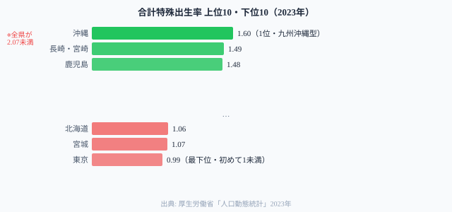
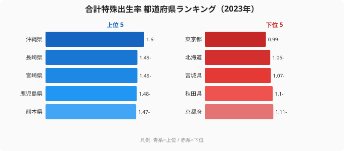

「財政が豊かな自治体ほど子育て支援が充実する→出生率が上がる」──この直感はデータで否定される。

[東京都](/areas/13000)の財政力指数は1.06で47都道府県中唯一の「不交付団体」だ。しかし合計特殊出生率は**全国最低の0.99**。対して[沖縄県](/areas/47000)の財政力指数は0.36と全国35位だが、出生率は**全国1位の1.60**だ。

この記事では厚生労働省「人口動態統計」と総務省の財政力指数データをもとに、**「財政力と出生率の逆相関」という構造的逆説**を読み解く。2023年に47都道府県で出生率が人口置換水準2.07を初めて全県で下回った今、この逆説はどこから来るのかを検証する。

> [!NOTE]
> **合計特殊出生率**は、1人の女性が生涯に産む子どもの数の推定値。2.07を下回ると長期的に人口が減少する。**財政力指数**は2022年度データ、出生率は2023年データで年度が異なる。

## 合計特殊出生率ランキング──全47県が置換水準以下

2023年、**東京都の合計特殊出生率が初めて0.99と1.0を割り込んだ**。47都道府県で「1未満」に突入した初の事例だ。

**最も高い沖縄県でも1.60**で、人口維持に必要な2.07には届かない。九州・沖縄が上位を占め、大都市圏と東北・北海道が下位に集中する構図が鮮明だ。

注目すべきは**秋田県（1.10）**の低さだ。九州・沖縄と同様に「地方」ではあるが出生率は低い。「都市化＝低出生率」だけでは説明できない要因が存在する。

<source-link href="/ranking/total-fertility-rate">47都道府県の合計特殊出生率ランキングをもっと見る</source-link>
<source-link href="/ranking/births">都道府県別・出生数ランキングをもっと見る</source-link>

<ad-slot></ad-slot>

## 財政力指数×出生率の逆相関──「豊かだから産む」は成立しない

47都道府県の財政力指数と出生率を対照すると、明確な正の相関は見られない。むしろ**財政力が高い都市部ほど出生率が低い**という逆相関のパターンが浮かぶ。

下のランキングは出生率の上位・下位の分布を示す。財政力指数1.06の東京が最下位（0.99）、財政力0.36の沖縄が最上位（1.60）という構造が一目でわかる。

4象限で分類すると構造が鮮明になる。

**財政力高・出生率低（東京・愛知・神奈川）**: 経済的には豊かだが、住居費の高さ・長時間通勤・保育所不足が子育てのハードルを上げる。「稼いでも産めない」都市の構造。

**財政力低・出生率高（沖縄・宮崎・鹿児島・熊本）**: 財政的には厳しいが、三世代近居・地域の子育てネットワーク・住居費の低さが出生率を下支え。「財政が弱くても産める」地域の構造。

**財政力低・出生率低（秋田・北海道）**: 経済基盤が弱い上に若年女性の流出が深刻。財政も出生率も低い「二重苦」の地域。

**財政力高・出生率高**: **該当する県はほぼゼロ**。「財政力が高くて出生率も高い」理想の姿を実現している都道府県は存在しない。

> [!NOTE]
> 財政力指数は2022年度、合計特殊出生率は2023年のデータ。年度が異なるため厳密な因果関係の推定ではなく、構造的傾向の把握として解釈されたい。

## 逆説の解剖──なぜ「豊かだから産まない」のか

### 東京の構造的矛盾

東京都は**全国から若者を吸引しながら、その若者が子どもを産みにくい環境にある**という矛盾を抱えている。

- **住居費**: 3.3m2あたり家賃9,736円（全国最高）で、子ども部屋を確保できる広さの住宅コストは地方の3〜4倍
- **長時間通勤**: 平均通勤時間が長く、育児時間の確保が難しい
- **待機児童・保育費**: 保育所の争奪と高い保育費が、共働きの阻害要因になる
- **キャリア圧力**: 高競争環境での女性のキャリア継続と出産のトレードオフが大きい

財政力指数1.06で「財政的に最も豊か」な東京が、出生率0.99で「最も少子化が深刻」になるのはこれらの複合的な障壁のためだ。

### 沖縄の構造的強み

沖縄県の財政力指数は0.36と低い。しかし出生率1.60を支える構造的要因がある。

- **三世代近居・多子文化**: 祖父母が育児に関わる習慣が根付いており、核家族でも地域のサポートが得やすい
- **住居費の低さ**: 家賃は全国中位程度（4,614円）で、大家族が住める広さの確保が都市圏よりコストが低い
- **若い婚姻年齢**: 初婚年齢が全国で比較的若く（夫30.2歳）、出産可能期間が長い

> [!TIP]
> 少子化対策を「財政支出の増加」だけで設計するアプローチには構造的限界がある。データが示唆するのは、「住居費・通勤時間・育児ネットワーク」という「暮らしの構造」が出生率を左右するという発見だ。

## 秋田の「例外」──地方でも低い出生率

「地方は出生率が高い」という仮説を崩す存在が[**秋田県**（1.10）](/areas/05000)だ。九州と同様に「地方」だが、出生率は全国41位と低い。

秋田の特徴は**若年女性の転出超過が全国でも顕著なこと**だ。大学進学・就職で女性が首都圏に流出するため、そもそも「産む可能性がある人口」が絶対数として少ない。経済基盤が弱く働き口が限られることで、若者が地元に残らない構造が低出生率を生んでいる。

九州の農村部が「若者が残る地方」であるのに対し、東北の一部は「若者が出ていく地方」という質的な違いがある。同じ「地方・低財政力」でも、人口移動パターンによって出生率は大きく異なる。

<source-link href="/ranking/moving-in-excess-rate-japanese">都道府県別・転入超過率ランキングをもっと見る</source-link>

<ad-slot></ad-slot>

## まとめ

少子化と財政力のデータから浮かぶ構造:

1. **財政力と出生率は逆相関**: 「豊かな自治体ほど少子化が深刻」という逆説は、住居費・通勤時間・保育コストという都市の構造的障壁が主因
2. **全47県が人口置換水準以下**: 沖縄1.60でも2.07には届かない。「少子化」は南日本も含めた全国問題
3. **地方の中でも差がある**: 「三世代文化・若者定着型」の九州と「若者流出型」の東北では同じ「地方・低財政力」でも出生率が大きく異なる
4. **財政支出だけでは解決しない**: 財政力指数が最も高い東京が最も深刻な少子化──出生率向上には「暮らしの構造」（住居費・育児ネットワーク・地方分散）の改革が必要

東京一極集中が続く限り、全国から吸い上げた若者が東京で出産を控えるという構造は変わらない。少子化対策と地方創生は表裏一体の課題だ。

## データ出典

- 厚生労働省「人口動態統計」2023年（合計特殊出生率）
- 総務省「市町村財政の概況」2022年度（財政力指数）
- [e-Stat 社会・人口統計体系](https://www.e-stat.go.jp/dbview?sid=0000010101)
