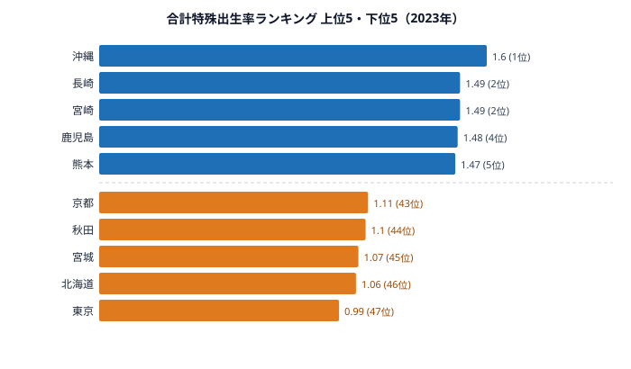

「財政が豊かな自治体ほど子育て支援が充実する、だから出生率が上がる」──この直感はデータで否定されます。

[東京都](/areas/13000)の財政力指数は1.06で、47都道府県中で唯一の「不交付団体」です。しかし合計特殊出生率は**全国最下位の0.99**でした。対して[沖縄県](/areas/47000)の財政力指数は0.36と低いものの、出生率は**全国トップの1.60**です。

この記事では厚生労働省「人口動態統計」と総務省の財政力指数データをもとに、**「財政力と出生率の逆相関」という構造的逆説**を読み解きます。2023年に全47都道府県で出生率が人口置換水準2.07を下回った今、この逆説がどこから来るのかを検証していきます。

> [!NOTE]
> **合計特殊出生率**は、1人の女性が生涯に産む子どもの数の推定値です。2.07を下回ると長期的に人口が減少します。本記事の出生率は2023年「人口動態統計」、財政力指数は2022年度「市町村財政の概況」で**調査年度が異なる**ため、厳密な因果ではなく構造的傾向の把握として読んでください。

## 合計特殊出生率ランキング──全47県が置換水準以下

2023年、**東京都の合計特殊出生率が0.99と1.0を割り込みました**。上位は沖縄1.60を筆頭に、長崎・宮崎の1.49、鹿児島1.48、熊本1.47と九州・沖縄が独占しています。一方の下位は東京0.99、北海道1.06、宮城1.07、秋田1.10、京都1.11と、大都市圏・北海道・東北に集中する構図が鮮明です。

なぜ九州・沖縄が高く、大都市と北日本が低いのでしょうか。上位5県はいずれも住居費が比較的安く、三世代近居や地域の子育てネットワークが残る地域です。広い住宅を確保しやすく、祖父母世代の育児サポートが得やすいことが、複数の子どもを育てる土壌になっています。逆に下位は、住居費が高く通勤に時間を取られる大都市(東京・京都・宮城仙台圏)と、若年女性の流出が続く北海道・秋田という、性格の異なる2タイプが混在しています。同じ「低出生率」でも背景の構造が違う点が、この指標を読むうえでの肝です。

特筆すべきは、上位5県でも最高の沖縄1.60が人口維持に必要な2.07に**まったく届いていない**ことです。少子化は「都市の問題」ではなく、出生率が比較的高い南日本も含めた全国共通の課題になっています。

> [!WARNING]
> 出生率の「上位」「下位」は2.07を超えるかどうかとは別物です。2023年は全47県が置換水準を下回ったため、本記事のランキングは「人口が増える県の順」ではなく「人口減少の緩急の順」を示しています。沖縄が1位でも自然増ではない点に注意してください。

<source-link href="/ranking/total-fertility-rate">47都道府県の合計特殊出生率ランキングをもっと見る</source-link>

<ad-slot></ad-slot>

## 財政力指数×出生率の逆相関──「豊かだから産む」は成立しない

47都道府県の財政力指数と出生率を対照すると、明確な正の相関は見られません。むしろ**財政力が高い都市部ほど出生率が低い**という逆相関のパターンが浮かびます。財政力指数1.06の東京が出生率では最下位(0.99)、財政力0.36の沖縄が出生率では最上位(1.60)という、真逆の位置取りがその象徴です。

ただし「財政力が低ければ出生率が高い」と単純化はできません。出生率を4象限で分類すると、逆相関の内側にさらに構造が見えてきます。

**財政力高・出生率低(東京・神奈川)**: 経済的には豊かですが、住居費の高さ・長時間通勤・保育所不足が子育てのハードルを上げます。東京0.99、神奈川1.13と出生率は全国でも下位に沈みます。「稼いでも産めない」都市の構造です。なお同じく財政力の高い愛知は出生率1.29で全国25位の中位にとどまり、都市でも条件次第で下げ止まる余地があることを示しています。

**財政力低・出生率高(沖縄・宮崎・鹿児島・熊本)**: 財政的には厳しいものの、三世代近居・地域の子育てネットワーク・住居費の低さが出生率を下支えします。沖縄1.60、宮崎1.49、鹿児島1.48、熊本1.47と上位を固めており、「財政が弱くても産める」地域の構造が読み取れます。

**財政力低・出生率低(秋田・北海道)**: 経済基盤が弱いうえに若年女性の流出が深刻です。秋田1.10、北海道1.06と、財政も出生率も低い「二重苦」の地域にあたります。

**財政力高・出生率高**: **該当する県はほぼゼロ**です。「財政力が高くて出生率も高い」という理想形を実現している都道府県は、2023年時点では見当たりません。

この「財政力高×出生率高がほぼ空白」という事実こそ、財政支出だけでは少子化を反転できないことを示す最大の根拠になります。

> [!NOTE]
> 財政力指数1.0超の不交付団体は東京のみで、残る46道府県はすべて地方交付税の交付を受けています。つまり「財政力が高い」と言える県はそもそも極端に少なく、逆相関は東京という1点に強く引っ張られている面があります。県数の偏りを踏まえて傾向を読んでください。

## 逆説の解剖──なぜ「豊かだから産まない」のか

### 東京の構造的矛盾

東京都は**全国から若者を吸引しながら、その若者が子どもを産みにくい環境にある**という矛盾を抱えています。財政力指数1.06で全国唯一の不交付団体でありながら、出生率は0.99で全国最下位という落差は、お金の有無では説明できません。

- **住居費**: 3.3平方メートルあたり家賃が全国最高水準で、子ども部屋を確保できる広さの住宅コストは地方の3〜4倍に達します
- **長時間通勤**: 平均通勤時間が長く、育児に充てる時間の確保が難しくなります
- **待機児童・保育費**: 保育所の争奪と高い保育費が、共働き世帯の出産・育児の阻害要因になります
- **キャリア圧力**: 高競争環境のなか、女性のキャリア継続と出産のトレードオフが大きくなります

財政力が最も豊かな東京が、出生率では最も少子化が深刻になるのは、これら複合的な障壁が重なるためです。お金が「足りない」のではなく、暮らしの構造が「産みにくい」のです。

### 沖縄の構造的強み

沖縄県の財政力指数は0.36と低い水準です。それでも出生率1.60で全国トップを維持できるのは、財政とは別の構造的要因があるからです。

- **三世代近居・多子文化**: 祖父母が育児に関わる習慣が根付いており、核家族でも地域のサポートが得やすい環境です
- **住居費の低さ**: 都市圏に比べて住居費が抑えられ、大家族が住める広さを確保しやすくなります
- **若い婚姻年齢**: 初婚年齢が全国でも比較的若く、出産可能期間が長くなります

財政が弱くても出生率が下げ止まる沖縄と、財政が強くても出生率が落ち込む東京。この対比こそが、本記事の中核にある逆説を最も端的に表しています。

> [!TIP]
> 少子化対策を「財政支出の増加」だけで設計するアプローチには構造的限界があります。データが示唆するのは、**住居費・通勤時間・育児ネットワークという「暮らしの構造」が出生率を左右する**ということです。各県の出生率を見るときは、財政力ではなく住居費や人口移動と重ねて読むと因果の見当がつきやすくなります。

## 秋田の「例外」──地方でも低い出生率

「地方は出生率が高い」という仮説を崩す存在が[**秋田県**](/areas/05000)です。秋田の出生率は1.10で全国44位と、九州・沖縄と同じ「地方」でありながら下位グループに沈んでいます。

秋田の特徴は**若年女性の転出超過が全国でも顕著なこと**です。大学進学や就職を機に女性が首都圏へ流出するため、そもそも「産む可能性がある人口」が絶対数として少なくなっています。経済基盤が弱く働き口が限られることで、若者が地元に残らない構造が低出生率を生んでいます。

九州の農村部が「若者が残る地方」であるのに対し、東北の一部は「若者が出ていく地方」という質的な違いがあります。同じ「地方・低財政力」でも、人口移動のパターンによって出生率は大きく分かれるのです。財政力という1軸だけでは、この差を説明できません。

<source-link href="/ranking/moving-in-excess-rate-japanese">都道府県別・転入超過率ランキングをもっと見る</source-link>

<ad-slot></ad-slot>

## まとめ

少子化と財政力のデータから浮かぶ構造を整理します。

1. **財政力と出生率は逆相関**: 「豊かな自治体ほど少子化が深刻」という逆説の主因は、住居費・通勤時間・保育コストといった都市の構造的障壁です
2. **全47県が人口置換水準以下**: 上位の沖縄1.60でも2.07には届きません。少子化は南日本も含めた全国共通の課題です
3. **地方の中でも差がある**: 「三世代文化・若者定着型」の九州と「若者流出型」の東北では、同じ「地方・低財政力」でも出生率が大きく異なります
4. **財政支出だけでは解決しない**: 財政力が最も高い東京が最も深刻な少子化にあります。出生率の改善には、住居費・育児ネットワーク・地方分散という「暮らしの構造」の改革が欠かせません

東京一極集中が続く限り、全国から吸い上げた若者が東京で出産を控えるという構造は変わりません。少子化対策と地方創生は表裏一体の課題だと言えます。

## データ出典

- 厚生労働省「人口動態統計」2023年(合計特殊出生率)
- 総務省「市町村財政の概況」2022年度(財政力指数)
- [e-Stat 社会・人口統計体系](https://www.e-stat.go.jp/dbview?sid=0000010101)
