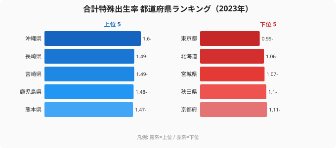
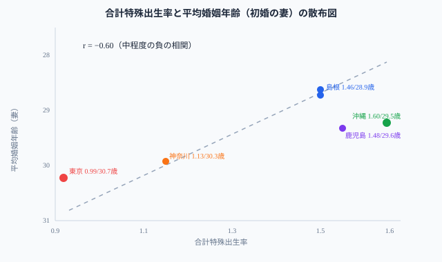

「少子化対策にはお金がかかる」──という議論のまえに、都道府県別のデータを見ると気づくことがある。日本で最も出生率が高い沖縄県（1.60）と最も低い東京都（0.99）。この差を生む要因として見過ごせないのが、**結婚する年齢**だ。沖縄の初婚年齢（妻）は29.5歳、東京は30.7歳。早婚の県ほど出生率が高い傾向が、47都道府県のデータにはっきり表れている（婚姻年齢と出生率の相関係数は r = −0.60）。

## 合計特殊出生率ランキング（2023年）──沖縄1.60、東京0.99

厚生労働省「人口動態統計」の2023年データで、47都道府県の出生率を比較する。

<data-source url="https://www.e-stat.go.jp/dbview?sid=0000010101" label="e-Stat 社会・人口統計体系（厚生労働省 人口動態統計 2023年）"></data-source>

**合計特殊出生率が最も高いのは[沖縄県](/areas/47000)**（1.60）。17年連続でトップを維持しているが、2015年の1.96から大幅に低下している。2位は長崎県・宮崎県（1.49）、4位は鹿児島県（1.48）と九州勢が上位を占める。

一方、**最も低いのは[東京都](/areas/13000)**（0.99）。2023年に全国で唯一「1.0」を割り込んだ。

> [!NOTE]
> 合計特殊出生率は「1人の女性が一生の間に産む子どもの数の推計値」。人口維持に必要な水準（人口置換水準）は約2.07とされており、全都道府県がこれを大きく下回っている。

<source-link href="/ranking/total-fertility-rate">合計特殊出生率ランキング</source-link>

<ad-slot></ad-slot>

## 婚姻年齢との相関──早婚の県ほど出生率が高い

横軸に合計特殊出生率、縦軸に平均婚姻年齢（初婚の妻）をとった散布図を見ると、**相関係数は r = −0.60** と中程度の負の相関を示す。婚姻年齢が低い県ほど出生率が高い、という傾向がはっきり読み取れる。

<data-source url="https://www.e-stat.go.jp/dbview?sid=0000010101" label="e-Stat 社会・人口統計体系（厚生労働省 人口動態統計）"></data-source>

たとえば[東京都](/areas/13000)（婚姻年齢30.7歳・出生率0.99）と島根県（28.9歳・1.46）では、1.8歳の差に対して出生率は0.47ポイント開く。ただし r = −0.60 はあくまで「中程度」であり、婚姻年齢だけで出生率がすべて決まるわけではない。同じ婚姻年齢でも出生率が0.2〜0.3ポイント上下する県があり、後述する三世代同居や住居コストといった要因が重なって初めて差が生まれる。

それでも「なぜ九州・沖縄が高く、首都圏が低いのか」を説明する大きな要因の一つが、この婚姻年齢の差であることは確かだ。

> [!IMPORTANT]
> 婚姻年齢と出生率の相関は「早婚すれば出生率が上がる」という因果を示すものではない。住居コスト・雇用形態・地域コミュニティ・子育て支援が婚姻年齢に影響し、婚姻年齢が出生率に影響するという間接的な経路が存在する。

## 出生率が高い県の共通点──3つの構造的条件

出生率の上位県（九州・沖縄・北陸）と下位県（首都圏・北海道）を、3つの構造的条件で比べると次の違いが見える。

- 婚姻年齢: 上位県は28.9〜29.5歳と早く、下位県は29.9〜30.7歳と遅い。
- 三世代同居率: 上位県（福井・島根・鳥取）は高く、下位県（東京・神奈川）は低い。
- 住居コスト: 上位県は低い（持ち家率が高い）、下位県は高い（賃貸中心）。

九州・北陸の県は「**早く結婚し、地域ぐるみで子育てできる環境**」が整っていることが、出生率の高さにつながっている。

> [!TIP]
> 三世代同居率が高い県（福井・山形・富山）は出生率も比較的高い。祖父母によるサポートが子育てコストを下げ、第2子・第3子を持ちやすくする環境を作る。

<source-link href="/ranking/average-age-of-first-marriage-wife">平均婚姻年齢（初婚の妻）ランキング</source-link>

<ad-slot></ad-slot>

## 約40年の推移──2015年から8年で0.33ポイント低下した急落

全国平均の合計特殊出生率は、40年以上にわたって低下トレンドが続いている。

1. **1980年**: 1.83──まだ人口置換水準（2.07）に近い水準だった
2. **1989年**: 1.63──「1.57ショック」の直前。バブル経済下で晩婚化が加速
3. **2005年**: 1.35で当時の過去最低を記録──団塊ジュニア世代の晩産化が影響
4. **2015年**: 1.53まで一時的に回復──景気改善と保育所整備が寄与
5. **2023年**: 1.20で過去最低を更新──8年連続の低下。コロナ禍の影響も

注目すべきは2015年からの落ち込みのスピードだ。わずか8年で**0.33ポイント低下**（1.53→1.20）。これは1980年から35年間の低下幅（0.48ポイント）に迫るスピードである。「ゆっくり下がっている」という認識は既に成立しない。

> [!WARNING]
> 2023年の出生数は約72.7万人で過去最少。国立社会保障・人口問題研究所の「出生中位推計」（2017年）が2040年に想定していた水準を、17年も前倒しで下回っている。

## まとめ──地域環境が出生率を変える

2023年の合計特殊出生率データは、日本の少子化が「もう一段階、深刻なフェーズに入った」ことを示している。東京都の1.0割れは象徴的だが、全国平均1.20という数字こそが本当の危機だ。

出生率の地域差が示すのは、「**環境次第で出生率は変わる**」という事実だ。沖縄・福井・島根のように、早婚・共助・低コストの子育て環境がある地域では、全国平均を大きく上回る出生率を維持している。婚姻年齢の早さが出生率を左右する一因である──この視点が、少子化対策の優先順位を変えるヒントになるかもしれない。

## データ出典

- 厚生労働省「人口動態統計」（2023年）
- e-Stat 統計表 ID: 0000010101（社会・人口統計体系）

関連する統計は[人口カテゴリ](/category/population)で一覧できる。
