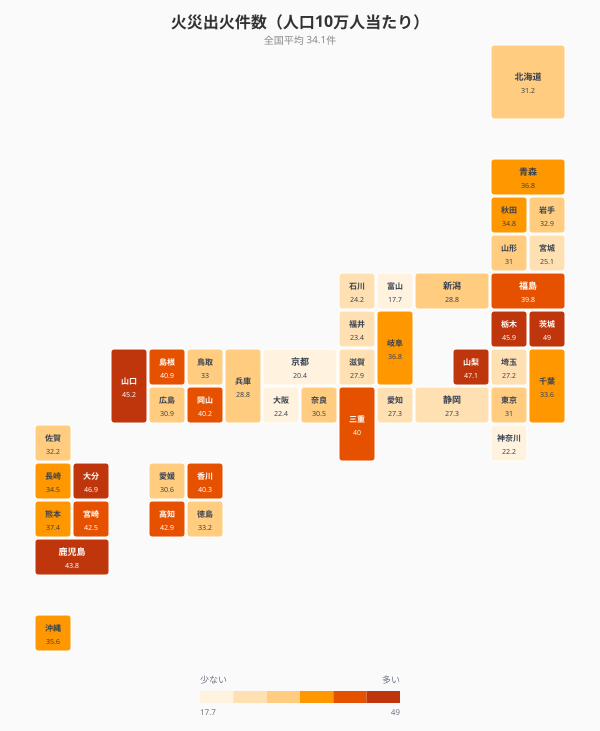
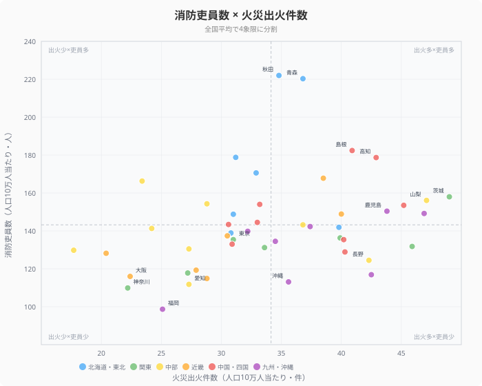
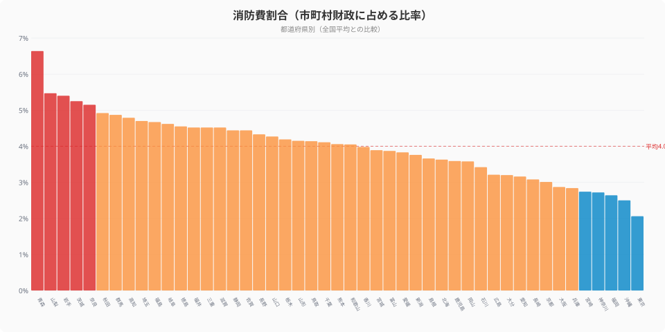
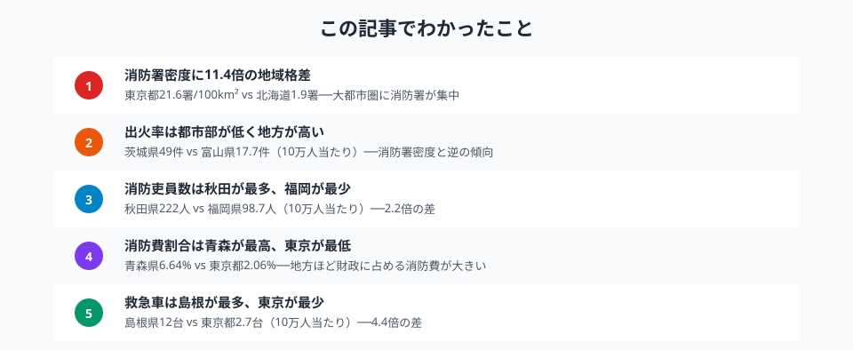

「消防署はどこでも同じように配置されている」──そう思っていないでしょうか。実は、可住地面積あたりの消防署数は**[東京都](/areas/13000)と[北海道](/areas/01000)で11.4倍の差**があります。

この記事では、総務省の統計データを使い、**消防署密度**・**消防吏員数**・**火災出火件数**・**消防費割合**など複数の指標から、都道府県の消防力格差を多角的に可視化します。

## 火災出火件数ランキング（人口10万人当たり）

<data-source url="https://www.e-stat.go.jp/dbview?sid=0000010211" label="e-Stat 社会・人口統計体系"></data-source>

**火災出火件数が最も多いのは茨城県**（49件/10万人）。2位は山梨県（47.1件）、3位は大分県（46.9件）と続きます。全国平均は34.1件です。

一方、**最も少ないのは富山県**（17.7件）。京都府（20.4件）、神奈川県（22.2件）、大阪府（22.4件）と、大都市圏の府県が下位に並びます。1位の茨城県と47位の富山県では**約2.8倍の差**があります。

> [!NOTE]
> 出火件数は人口10万人当たりで比較しています。都市部は人口密度が高く建物が密集していますが、消防署が近く初期消火が早いため、出火率はむしろ低い傾向があります。

## 都道府県マップ──出火率の「地域パターン」

<data-source url="https://www.e-stat.go.jp/dbview?sid=0000010211" label="e-Stat 社会・人口統計体系"></data-source>

マップから2つのパターンが読み取れます。

- **北関東・中部・九州の地方部**が濃い色──茨城・栃木・山梨・長野・大分・鹿児島・宮崎が上位
- **大都市圏**が薄い色──東京・神奈川・大阪・京都・愛知が全国でも低水準

これは「消防署密度」とは逆のパターンです。消防署が近い都市部では通報から到着までの時間が短く、初期消火が成功しやすいことが背景にあります。

<ad-slot></ad-slot>

## 消防署密度ランキング（可住地面積100km²当たり）

<data-source url="https://www.e-stat.go.jp/dbview?sid=0000010211" label="e-Stat 社会・人口統計体系"></data-source>

**消防署密度が最も高いのは東京都**（21.6署/100km²）。大阪府（20.5署）、神奈川県（19.5署）と三大都市圏が上位を独占します。

**最も低いのは北海道**（1.9署）。山形県（2.3署）、宮崎県（2.3署）、岩手県（2.4署）と続きます。東京都と北海道では**11.4倍の差**があります。

都市部は面積が小さく人口が集中するため、可住地面積あたりの消防署数が多くなります。一方、地方は広大な面積をカバーする必要があり、消防署1署あたりの管轄面積が広くならざるを得ません。

## 消防吏員数 × 火災出火件数──散布図で見る都道府県の消防力

<data-source url="https://www.e-stat.go.jp/dbview?sid=0000010211" label="e-Stat 社会・人口統計体系"></data-source>

横軸に火災出火件数（人口10万人当たり）、縦軸に消防吏員数（人口10万人当たり）をとり、全国平均で4象限に分けました。

- **右上（出火多い×吏員多い）**: 秋田・青森・島根・高知──出火率が高いが消防力も手厚い地方県
- **左下（出火少ない×吏員少ない）**: 東京・神奈川・大阪・愛知・福岡──都市部は出火率が低いが、人口当たりの吏員数も少ない
- **右下（出火多い×吏員少ない）**: 茨城・栃木──出火率が高いのに吏員が薄いゾーン。最も警戒が必要
- **左上（出火少ない×吏員多い）**: 北海道──出火率は低く吏員は手厚い

この散布図は、地方と都市部で消防リソースの配分構造が根本的に異なることを示しています。人口当たりの消防吏員数は[秋田県](/areas/05000)222人に対し福岡県98.7人で**2.2倍の差**があります。

<ad-slot></ad-slot>

## 消防費割合──財政に占める消防コスト

<data-source url="https://www.e-stat.go.jp/dbview?sid=0000010204" label="e-Stat 社会・人口統計体系"></data-source>

市町村財政に占める消防費の割合を都道府県別に比較すると、**青森県が6.64%で最も高く、東京都が2.06%で最も低い**結果でした。全国平均は4.00%です。

- **消防費割合が高い県**: 青森県（6.64%）、山梨県（5.47%）、岩手県（5.40%）、茨城県（5.25%）、奈良県（5.15%）
- **消防費割合が低い県**: 東京都（2.06%）、沖縄県（2.50%）、福岡県（2.64%）、神奈川県（2.72%）、宮崎県（2.74%）

地方ほど広い面積をカバーするために消防署・出張所の維持費がかさみ、財政に占める消防費の比率が高くなる傾向があります。一方、東京都は人口密度が高く効率的に消防署を運用できるため、割合が低くなっています。

## まとめ

消防署密度・消防吏員数・火災出火件数・消防費割合の4つの指標から、都道府県の消防力格差を分析しました。

<data-source url="https://www.e-stat.go.jp/dbview?sid=0000010211" label="e-Stat 社会・人口統計体系"></data-source>

消防力の地域格差は、**単純に「都市部が充実、地方が手薄」とは言い切れない**構造を持っています。消防署密度や救急車台数では都市部が圧倒的に有利ですが、人口当たりの消防吏員数では地方が上回ります。出火率も都市部より地方が高いため、地方の消防は「広い面積を少ない拠点でカバーしつつ、多い出火に対応する」という二重の負担を抱えています。

> [!TIP]
> 消防署密度（可住地面積あたり）は都市部が高く見えますが、出火率（人口10万人あたり）は地方が高い。この「逆転」を理解するには、出火率と消防署密度を組み合わせた散布図での確認が有効です。

今後、人口減少が進む地方では消防団員の確保がさらに困難になり、広域化・統合の議論が加速する可能性があります。

<source-link href="/ranking/building-fire-count-per-100-thousand-people">火災出火件数ランキング</source-link>

<source-link href="/ranking/fire-department-count-per-100-km2">消防署数ランキング</source-link>

<source-link href="/ranking/fire-department-member-count-per-100-thousand-people">消防吏員数ランキング</source-link>

<source-link href="/ranking/fire-department-emergency-car-count-per-100k">救急自動車数ランキング</source-link>

<source-link href="/ranking/firefighting-expenditure-ratio-pref-municipal">消防費割合ランキング</source-link>

## データ出典

本記事のデータはe-Stat（政府統計の総合窓口）を基に作成しています。
