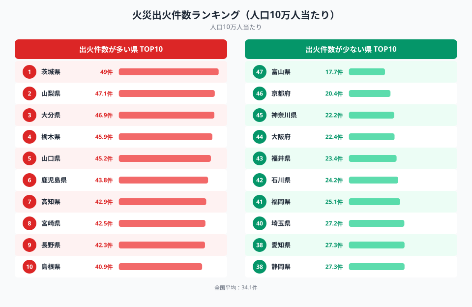
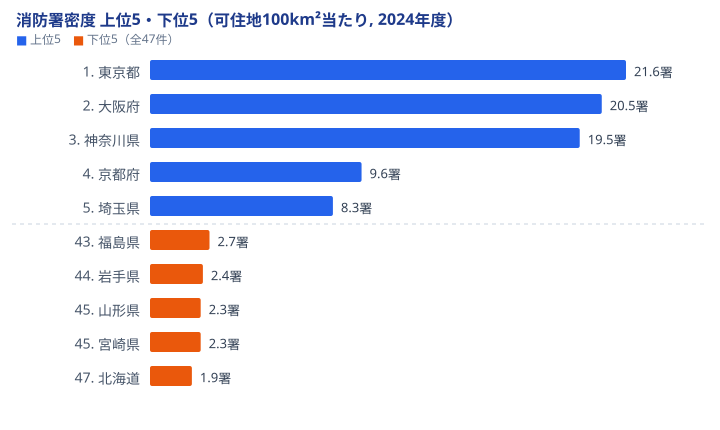
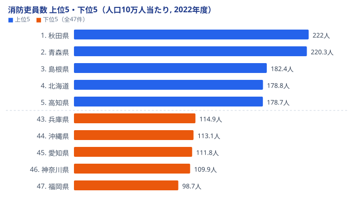
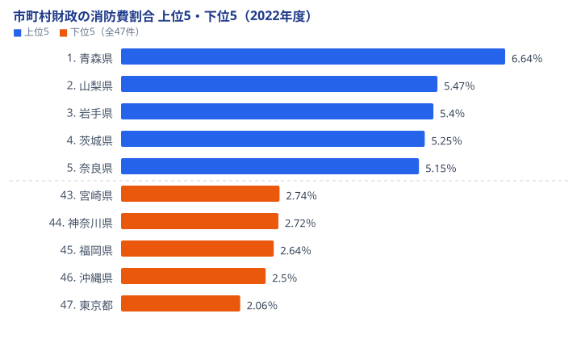

「消防署が多い県ほど火事も多いはずだ」──そう考えていないでしょうか。データを並べると、むしろ逆の関係が浮かび上がります。可住地面積100km²当たりの消防署密度は[東京都](/areas/13000)と[北海道](/areas/01000)で11.4倍も開いているのに、人口10万人当たりの出火件数は都市部のほうが低く、地方のほうが高いのです。

この記事では、総務省の社会・人口統計体系をもとに、**火災出火件数**・**消防署密度**・**消防吏員数**・**消防費割合**という4つの指標を突き合わせ、「署が密な都市部ほど火事が少ない」という逆転の構造を読み解きます。先に結論を言えば、消防力の地域差は「都市部が充実・地方が手薄」という単純な図式では説明できません。

## 火災の出火件数は地方が高く都市部が低い

<source-link href="/ranking/building-fire-count-per-100-thousand-people">火災出火件数ランキングをもっと見る</source-link>

<data-source url="https://www.e-stat.go.jp/dbview?sid=0000010211" label="e-Stat 社会・人口統計体系"></data-source>

人口10万人当たりの出火件数が最も多いのは茨城県（49件）です。山梨県（47.1件）、大分県（46.9件）、栃木県（45.9件）、山口県（45.2件）と続き、上位には北関東・中部・九州の地方県が並びます。一方で最も少ないのは富山県（17.7件）で、京都府（20.4件）、神奈川県（22.2件）、大阪府（22.4件）、福井県（23.4件）と、大都市圏の府県が下位に集まります。最多の茨城県と最少の富山県では約2.8倍の開きがあります。

なぜ地方のほうが出火件数が多いのでしょうか。これは建物の密集度というより、初期消火が成功するかどうかの差が大きく効いています。都市部は消防署が近く通報から到着までの時間が短いため、ぼやの段階で消し止められて「火災」として計上される件数が抑えられます。逆に地方は拠点が遠く、初期対応に時間がかかるぶん延焼して件数に残りやすいと考えられます。「人口が密で建物が多い都市部ほど火事が多い」という直感は、ここで一度裏切られます。

> [!NOTE]
> 出火件数は人口10万人当たりの値で比較しています。総数ではなく人口当たりで見るため、人口が多い大都市が必ずしも上位に来るわけではありません。母数を揃えると、都市部の出火率はむしろ全国でも低い水準に位置します。

## 消防署が密なのは三大都市圏に偏る

<source-link href="/ranking/fire-department-count-per-100-km2">消防署数ランキングをもっと見る</source-link>

<data-source url="https://www.e-stat.go.jp/dbview?sid=0000010211" label="e-Stat 社会・人口統計体系"></data-source>

可住地面積100km²当たりの消防署密度が最も高いのは東京都（21.6署）です。大阪府（20.5署）、神奈川県（19.5署）と三大都市圏が上位を独占し、4位の京都府（9.6署）以下とは段違いの密度になっています。逆に最も低いのは北海道（1.9署）で、宮崎県（2.3署）、山形県（2.3署）、岩手県（2.4署）、福島県（2.7署）と地方が下位に並びます。東京都と北海道では11.4倍の開きがあります。

この偏りは、署をどれだけ「面積で割るか」の違いから生まれます。都市部は可住地が狭いところに人口と建物が集中するため、面積当たりの署数が自然と多くなります。一方の地方は同じ署数でも広大な可住地を割り当てるので密度は薄くなり、1署が受け持つ管轄面積が桁違いに広がります。前節の出火率と並べると関係は明快です。署が密で到着が速い都市部ほど出火件数は少なく、署がまばらで到着に時間がかかる地方ほど出火件数が多いという、見事な逆転が成立しています。

> [!TIP]
> 消防署密度（面積当たり）と出火件数（人口当たり）は分母が異なる指標です。前者は「広さをどうカバーするか」、後者は「人に対してどれだけ火事が起きるか」を測ります。この2つを重ねて読むと、「密度が高いほど出火が少ない」という逆相関の構造が見えてきます。

## 人口当たりの消防吏員数は地方が手厚い

<source-link href="/ranking/fire-department-member-count-per-100-thousand-people">消防吏員数ランキングをもっと見る</source-link>

<data-source url="https://www.e-stat.go.jp/dbview?sid=0000010211" label="e-Stat 社会・人口統計体系"></data-source>

「都市部が手厚く地方が手薄」という思い込みが、もう一度ここで覆ります。人口10万人当たりの消防吏員数が最も多いのは秋田県（222人）で、青森県（220.3人）、島根県（182.4人）、北海道（178.8人）、高知県（178.7人）と地方県が上位を占めます。逆に最も少ないのは福岡県（98.7人）で、神奈川県（109.9人）、愛知県（111.8人）、沖縄県（113.1人）、兵庫県（114.9人）と大都市圏が下位に並びます。秋田県と福岡県では2.2倍の開きがあります。

人口当たりで見ると地方のほうが吏員を厚く配置しているのは、出火件数の高さと広い管轄面積の両方に対応する必要があるからです。最多の[秋田県](/areas/05000)をはじめ地方の消防は「広い面積を少ない拠点でカバーしつつ、人口当たりでは多い出火に備える」という二重の負担を抱えており、そのぶん人手を厚くせざるを得ません。署の数（密度）では都市部が圧倒的でも、人に対する人員という尺度では地方が上回るのです。指標の取り方次第で「充実」と「手薄」の評価が反転する点に注意が必要です。

> [!WARNING]
> 消防署密度（面積当たり）と消防吏員数（人口当たり）は、地方と都市部で順位が真逆になります。「署が少ない＝消防力が弱い」と短絡すると、人口当たりでは手厚い地方の実態を見落とします。どの分母で測った指標かを確かめてから比較してください。

## 財政に占める消防費の重さも地方ほど大きい

<source-link href="/ranking/firefighting-expenditure-ratio-pref-municipal">消防費割合ランキングをもっと見る</source-link>

<data-source url="https://www.e-stat.go.jp/dbview?sid=0000010204" label="e-Stat 社会・人口統計体系"></data-source>

市町村財政に占める消防費の割合を見ると、最も高いのは青森県（6.64%）です。山梨県（5.47%）、岩手県（5.40%）、茨城県（5.25%）、奈良県（5.15%）と続きます。逆に最も低いのは東京都（2.06%）で、沖縄県（2.50%）、福岡県（2.64%）、神奈川県（2.72%）、宮崎県（2.74%）と都市部の比率が低くなっています。

ここでも構造は一貫しています。地方は広い面積をカバーするために消防署や出張所を多く維持する必要があり、その固定費が財政に重くのしかかるため、消防費の割合が高くなります。一方の東京都は人口密度が高く、少ない面積で効率よく署を運用できるので、割合は全国で最も低くなります。出火件数・吏員数で見えた「地方ほど負担が重い」という傾向が、財政の側面からも裏づけられる形です。消防力の地域差は、人手・拠点・お金のいずれの尺度でも地方に厚い負担として現れています。

## まとめ

4つの指標を突き合わせると、消防力の地域差は次のように整理できます。

- 火災の出火件数（人口10万人当たり）は茨城県49件が最多、富山県17.7件が最少で約2.8倍の開き。地方が高く都市部が低い
- 消防署密度（可住地100km²当たり）は東京都21.6署、北海道1.9署で11.4倍の開き。三大都市圏に集中する
- 消防吏員数（人口10万人当たり）は秋田県222人、福岡県98.7人で2.2倍の開き。人に対しては地方が手厚い
- 市町村財政の消防費割合は青森県6.64%、東京都2.06%が最高・最低。地方ほど財政負担が重い
- 「署が密な都市部ほど出火が少ない」逆転が成立し、消防力の評価は分母の取り方で反転する

[防災・安全に関する都道府県データ](/category/safetyenvironment)を横断して見ても、「消防署が多い都市部は安全で、署が少ない地方は手薄だ」という単純な図式は成り立ちません。署の密度では都市部が有利でも、人口当たりの出火件数・吏員数・財政負担はいずれも地方に重くかかっています。地方の消防は広い面積を少ない拠点でカバーしながら、相対的に多い出火と重い財政負担に向き合っているのです。今後、人口減少が進む地方では消防団員の確保がさらに難しくなり、広域化や統合の議論が加速していくでしょう。

## データ出典

本記事のデータはe-Stat（政府統計の総合窓口）を基に作成しています。

- 火災出火件数・消防署密度・消防吏員数: 社会・人口統計体系（e-Stat）
- 消防費割合: 社会・人口統計体系（e-Stat）
