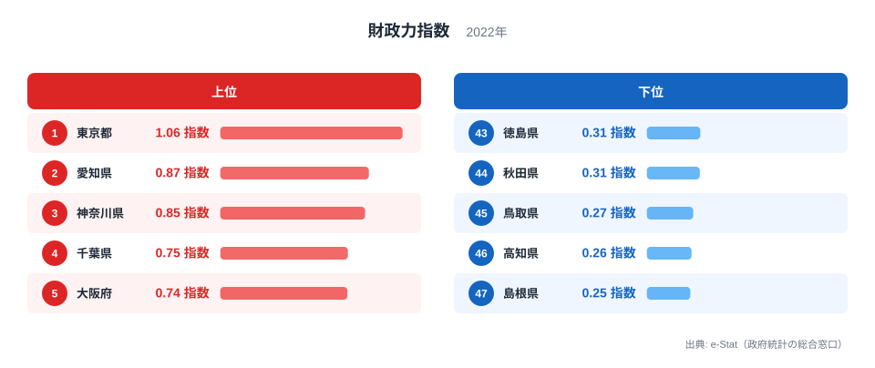
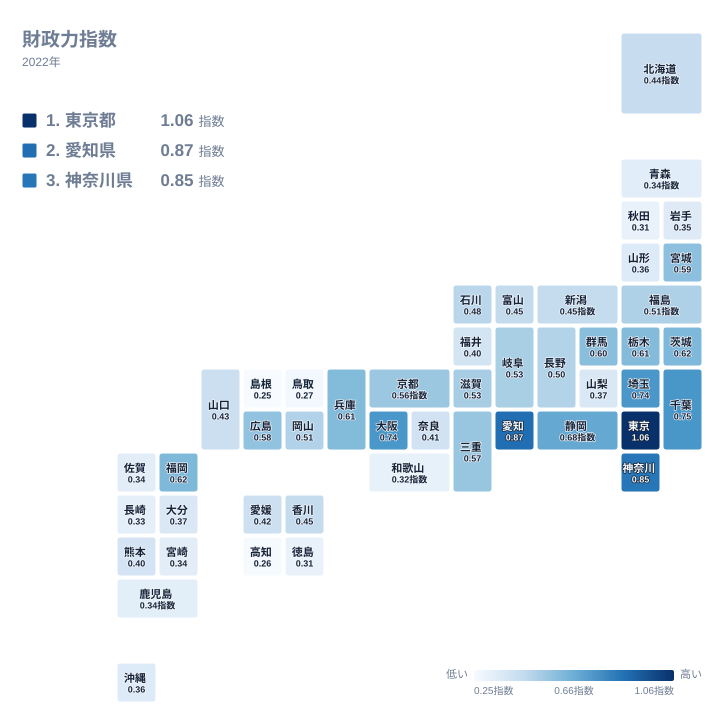
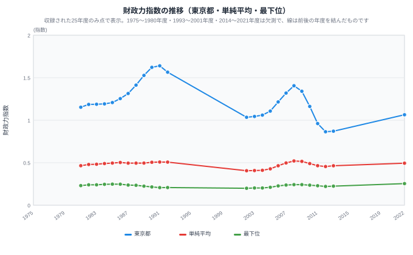
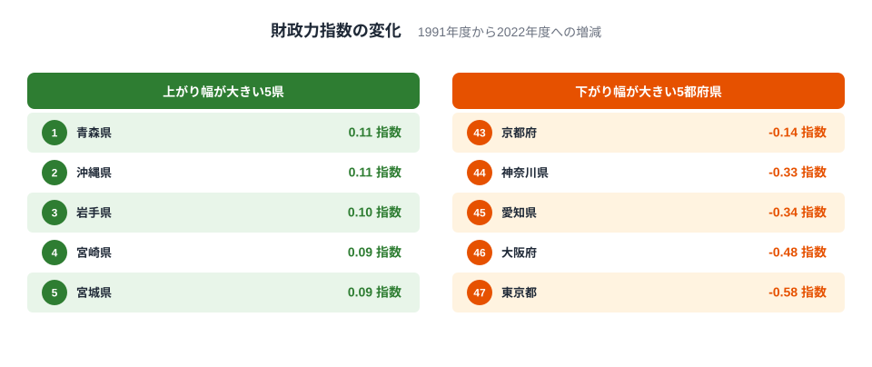
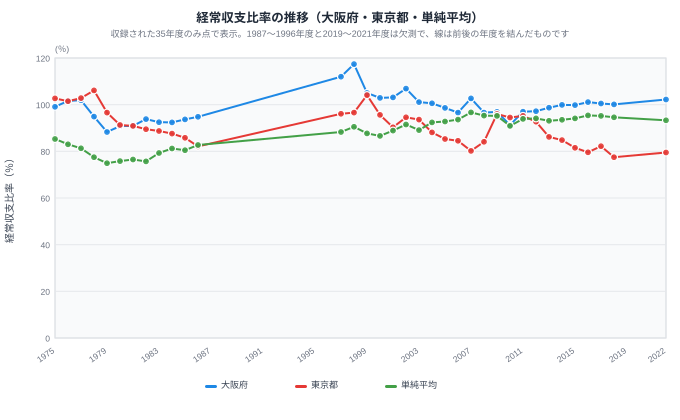
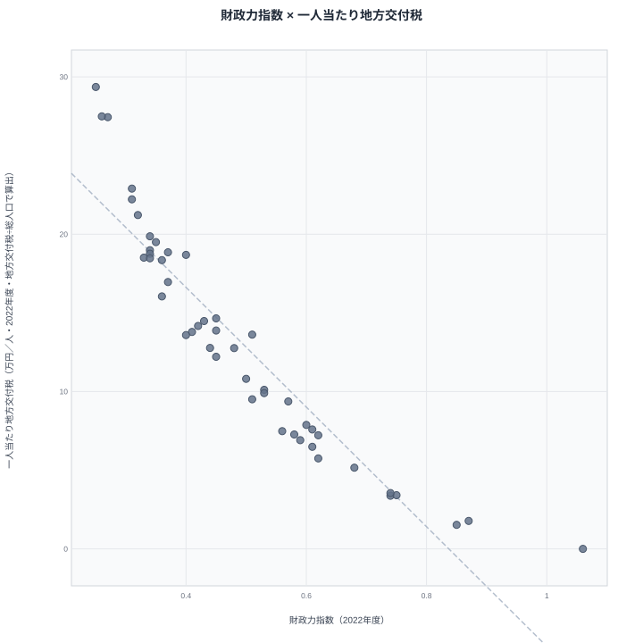

2022年度、都道府県の「稼ぐ力」を示す財政力指数で**1.0を超えたのは[東京都](/areas/13000)だけ**でした。東京都は1.06で、最下位の[島根県](/areas/32000)は**0.25**です。47都道府県のうち26が0.5を下回り、標準的な行政サービスに必要な経費（基準財政需要額）の半分にも、標準的な税収（基準財政収入額）が届いていません。

では、この構造はずっと同じだったのでしょうか。本サイトに収録されている1981〜2022年度のうち25年度を並べると、1.0を超える都府県は、1986〜1992年度の東京都、愛知県、神奈川県、大阪府の4都府県から、2022年度には東京都だけに減っていました。1991年度から2022年度にかけて、この4都府県の財政力指数は0.33〜0.58下がった一方、東北6県と九州・沖縄の8県はすべて上がり、東京都と最下位の開きは約7.9倍から約4.2倍に縮んでいます。上位と下位に近い県が動くなかで、最下位の島根県や高知県は0.2前後にとどまり続けました。

財政の硬直度を示す経常収支比率の平均も、収録期間の最低だった1979年度の74.9%から、2022年度の93.3%へ上がっています。動いた部分と動かなかった部分を、順に見ていきます。

> [!NOTE]
> 財政力指数は、基準財政収入額を基準財政需要額で割った値の過去3年間の平均です。1.0を超える団体は、普通交付税が交付されない不交付団体になるのが原則です。

## 財政力指数ランキング──1.0を超える自治体の条件

<data-source url="https://www.e-stat.go.jp/dbview?sid=0000010104" label="e-Stat 社会・人口統計体系"></data-source>

**1.0を超えたのは東京都だけ**です。東京都は1.06で、愛知県は0.87、神奈川県は0.85と続きますが、いずれも1.0未満なので、原則として普通交付税を受け取る交付団体です。上位5都府県には千葉県の0.75と大阪府の0.74も入りますが、東京都以外に1.0へ届いた団体はありません。

上位に並ぶのは東京圏と愛知県、大阪府という大都市圏です。財政力指数は標準的な税収を標準的な行政需要で割った値なので、企業の本社や工場が多く、人口が集まる地域ほど高くなりやすい性質があります。ただし、各県の税収の内訳は本記事のデータには含まれていません。

**最下位は島根県の0.25**で、高知県は0.26、鳥取県は0.27と続きます。下位5県は島根県、高知県、鳥取県、秋田県、徳島県で、山陰・四国・東北の県が並びます。東京都と島根県を比べると、1.06と0.25で約4.2倍の差があります。

### 全国マップ

<data-source url="https://www.e-stat.go.jp/dbview?sid=0000010104" label="e-Stat 社会・人口統計体系"></data-source>

2022年度の地図で濃い色になるのは、上位6都府県の東京都、愛知県、神奈川県、千葉県、大阪府、埼玉県です。図の左上に示した上位3県は、東京都、愛知県、神奈川県です。

薄い色が目立つのは、下から数えて10県です。山陰の島根県と鳥取県、四国の高知県と徳島県、東北の秋田県、近畿の和歌山県、九州の長崎県、鹿児島県、宮崎県、佐賀県が占めます。同じ地方でも差があり、九州では福岡県が9位、四国では香川県が24位と中位に入っています。東北地方で47都道府県の中位より上に入るのは、宮城県と福島県だけです。

<source-link href="/ranking/fiscal-strength-index-prefecture">47都道府県の財政力指数ランキングをもっと見る</source-link>

## 財政力指数の推移──上位の都府県が下がり、東北と九州の県が上がった

<data-source url="https://www.e-stat.go.jp/dbview?sid=0000010104" label="e-Stat 社会・人口統計体系"></data-source>

図の3本は、東京都、47都道府県の単純平均、各年度の最下位です。単純平均は各年度の47都道府県の値を合計して47で割ったもので、人口の大小で重みを付けていません。点があるのは収録された25年度だけです。

> [!WARNING]
> 図の折れ線は、1993〜2001年度と2014〜2021年度の欠測をまたいで、前後の点を直線で結んでいます。この2つの期間の動きは、図からは読み取れません。たとえば1992年度から2002年度へ続く右下がりの線は、間の年度の値ではありません。1975〜1980年度にも値が無いため、図の点は1981年度から始まります。

収録年度の最小と最大で動きの大きさを比べると、東京都は2012年度の0.864から1991年度の1.640まで、差は0.776です。単純平均は2002年度の0.406から2008年度の0.521まで差が0.115、最下位は2002年度の0.199から2022年度の0.254まで差が0.055でした。最下位の値は狭い範囲にとどまり、収録25年度のうち24年度で、最下位は島根県か高知県でした。ただし、これは最下位という1つの値の話です。下位の県全体が動かなかったという意味ではなく、後で見るように、下位に近い県の多くは上がっています。

動いたのは、まず東京都でした。1981年度の1.153から、1986年度に1.254、1991年度に1.640まで上がりました。1986〜1992年度は大阪府も加わり、1.0以上は東京都、愛知県、神奈川県、大阪府の4都府県でした。1986年度から1991年度までの間に、単純平均は0.503から0.508とほぼ横ばいで、最下位は0.247から0.207へ下がっています。上位の財政力だけが膨らんだ時期です。

欠測を挟んで次に収録されている2002年度には、東京都は1.034まで下がり、1.0以上は東京都だけになりました。2008年度に1.406まで戻し、2007〜2010年度は愛知県も1.0を超えています。ところが2011年度に東京都は0.961、2012年度は0.864となり、東京都の収録年度の最低を記録しました。2011〜2013年度は、1.0以上の都道府県が1つもありません。2022年度は1.064で、再び東京都だけが1.0を超えています。

財政力指数は過去3年間の平均なので、東京都が2008年度の1.406から2012年度の0.864まで4年続けて下がったことは、この平均の性質とも合っています。ただし、この低下が景気の変化によるのか、地方税制の見直しなど制度の影響によるのかは、このデータだけでは切り分けられません。

### 47都道府県の変化──どこが下がり、どこが上がったか

<data-source url="https://www.e-stat.go.jp/dbview?sid=0000010104" label="e-Stat 社会・人口統計体系"></data-source>

東京都、単純平均、最下位の3本だけでは、どの県がどう動いたかが分かりません。そこで47都道府県それぞれについて、2022年度の値から1991年度の値を引いた変化を上の図に並べました。1991年度は東京都の収録年度での最高値で、4都府県が1.0を超えていた年度です。2022年度までに、47都道府県のうち31が上がり、16が下がりました。

下がり幅が最も大きいのは東京都の0.58で、大阪府の0.48、愛知県の0.34、神奈川県の0.33、京都府の0.14が続きます。1991年度に1.0を超えていた4都府県が、下がり幅の上位4つをそのまま占めています。上がり幅が最も大きいのは青森県の0.11で、沖縄県の0.11、岩手県の0.10、宮崎県の0.09、宮城県の0.09が続きます。

変化は地域に偏っています。1991年度を起点にすると、東京都、神奈川県、埼玉県、千葉県の4都県、愛知県、岐阜県、静岡県の3県、滋賀県、京都府、大阪府、兵庫県、奈良県、和歌山県の2府4県は、合わせて13都府県のすべてが下がりました。下がった16都府県の残りは、山梨県、福井県、香川県です。一方、東北6県はすべて上がり、上がり幅は秋田県の0.07から青森県の0.11までです。九州・沖縄の8県もすべて上がり、福岡県の0.04から沖縄県の0.11までの範囲でした。

最下位付近の動きは、この地域ごとの動きとは少し違います。2022年度の下位3県である島根県、高知県、鳥取県は、上がり幅が0.03〜0.05と小さく、これが最下位の値が0.2前後にとどまった背景です。一方、青森県、沖縄県、岩手県、宮崎県の4県は、1991年度には0.23〜0.26で、0.3に届かない14県に入っていましたが、2022年度には0.34〜0.36まで上がりました。0.3に届かない県は、2022年度には鳥取県、高知県、島根県の3まで減っています。

上位の低下と下位に近い県の上昇が重なった結果、東京都と最下位の開きは小さくなりました。1991年度は1.640と0.207で約7.9倍、2013年度は0.871と0.224で約3.9倍、2022年度は1.064と0.254で約4.2倍です。

起点の選び方にも注意が必要です。1991年度は東京都の収録年度での最高値なので、下がり幅が最も大きく出る起点です。起点を1981年度にすると、上がったのは37、下がったのは10で、このうち下がり幅が大きい4都府県は、大阪府の0.195、愛知県の0.122、神奈川県の0.098、東京都の0.089です。起点を2002年度にすると47都道府県のすべてが上がり、上がり幅が最も小さいのは愛知県の0.027、東京都の0.030、大阪府の0.031です。東京都、大阪府、愛知県は、1981年度、1991年度、2002年度のどれを起点にしても、変化が最も小さい4都府県に入ります。一方で、上がり幅が大きい県の顔ぶれは起点で変わり、2002年度からは千葉県、宮城県、埼玉県、栃木県、広島県が上位です。

上がった理由や下がった理由は、このデータだけでは分かりません。財政力指数は標準的な税収を標準的な行政需要で割った値なので、税収が増えても算定上の需要額が増えれば指数は上がりません。税収と需要額のどちらが効いたかは、確かめられていません。

<ad-slot></ad-slot>

## 経常収支比率の推移──平均93%、余力は7%足らず

<data-source url="https://www.e-stat.go.jp/dbview?sid=0000010104" label="e-Stat 社会・人口統計体系"></data-source>

財政力指数の単純平均は、1981年度の0.465から2022年度の0.494まで、途中で0.406から0.521の間を動いたものの、起点と終点の差は0.029でした。同じ1981年度から2022年度のあいだに、経常収支比率の単純平均は76.5%から93.3%へ上がっています。

経常収支比率は、人件費、扶助費、公債費のように毎年度かかる経費に、一般財源がどれだけ使われているかを示します。100%から引いた残りが、臨時的な事業に回せる余地にあたります。図の3本は、大阪府、東京都、47都道府県の単純平均で、点があるのは収録された35年度だけです。1987〜1996年度と2019〜2021年度は欠測のため、線は前後の点を結んでいます。

単純平均は、1975年度の85.3%から1979年度の74.9%まで下がりました。74.9%は収録期間の最低です。その後は上がり、1986年度は82.7%でした。欠測を挟んだ1997年度は88.3%、1998年度は90.5%で、2007年度の96.7%が収録年度の最高です。2010年度に90.9%まで下がる場面はありましたが、2011〜2018年度と2022年度は93.1〜95.4%の範囲にとどまっています。2007年度の平均で残りは3.3%、2022年度でも6.7%にすぎません。

90%以上の都道府県の数にも、同じ変化が表れます。1979年度は1、1986年度は2でしたが、1997年度に16、2004年度に38、2007年度に46へ増え、2022年度も41あります。

> [!NOTE]
> 経常収支比率は、経常的な経費に充てた一般財源を、経常一般財源と臨時財政対策債などの合計で割った割合です。比率が高いほど、財政構造の硬直化が進んでいることを表します。分母に含まれる項目の範囲が年によって違う可能性があり、その確認はできていません。1979年度と2022年度の差を、すべて財政の悪化として読むことはできません。

東京都と大阪府は対照的です。2022年度の大阪府は102.2%で、100%以上は大阪府だけでした。100%を超えるのは、経常的な経費に充てた一般財源が、経常的な財源の額を上回る状態で、不足分を臨時的な財源で穴埋めしていることになります。大阪府は1997年度に112.0%、1998年度に117.4%と100%を大きく超えており、100%以上だった年度は収録35年度のうち15年度に上ります。

一方、東京都は2022年度に79.5%で、80%を下回るのは東京都だけです。東京都の収録年度の最低は2018年度の77.5%です。2022年度は、財政力指数が最も高い東京都が、経常収支比率でも最も余裕を残しています。

<source-link href="/ranking/current-balance-ratio">経常収支比率の都道府県ランキングをもっと見る</source-link>

## 財政力 × 地方交付税──稼げない県ほど国に依存する構造

<data-source url="https://www.e-stat.go.jp/dbview?sid=0000010104" label="e-Stat 社会・人口統計体系"></data-source>

散布図は、横軸に財政力指数、縦軸に人口一人当たりの地方交付税（地方交付税を総人口で割った値）を置き、2022年度の47都道府県を並べたものです。ここでの地方交付税は、社会・人口統計体系の「地方交付税（都道府県財政）」で、都道府県の歳入決算に計上された額です。市町村の分は含みません。普通交付税以外の交付分が含まれるかどうかは、この項目の定義から確認できていません。点は右下がりに並び、相関係数は−0.93です（図の47点から計算）。財政力指数が低い県ほど、一人当たりの交付税が多い関係がはっきり表れています。

- **財政力が高く交付税が少ない**: 東京都は交付税が0で、愛知県は1.78万円、神奈川県は1.53万円です
- **財政力が低く交付税が多い**: 一人当たりが多い順に、島根県は29.36万円、高知県は27.49万円、鳥取県は27.44万円、徳島県は22.90万円、秋田県は22.22万円です
- **中位の北海道**: 財政力指数は0.44で、一人当たりは12.77万円と47都道府県の25番目に当たります

この相関は、ほぼ制度の定義どおりの関係です。普通交付税は、基準財政需要額に対して基準財政収入額が足りない分を補うものなので、財政力指数が低い団体ほど交付額が大きくなるのは、算定の仕組みから自然に出てくる結果です。相関係数の−0.93は、地域の努力や産業構造の因果を示すものではありません。

一人当たりの交付税が多い県ほど、算定ルールの変更の影響を受けやすい立場にあります。財政力が低い県の財政は、国の制度に大きく支えられているのが2022年度の姿です。

<source-link href="/ranking/local-allocation-tax-prefecture">地方交付税の都道府県ランキング（総額）をもっと見る</source-link>

<ad-slot></ad-slot>

## 財政力指数は、ふるさと納税の寄付先選びの参考になるか

ふるさと納税の寄付先を選ぶとき、財政力指数が低い県への寄付は「交付税では補いきれない部分への直接の支援」になるのでしょうか。

これは、本記事のデータだけでは確かめられない見立てです。島根県は0.25、高知県は0.26、鳥取県は0.27で、財政力指数が示す標準的な税収は、標準的な行政需要の4分の1ほどです。交付税が埋める部分が大きい県ほど、寄付による上積みの相対的な重みは大きい可能性があります。ただし、その重みは寄付の受入額と歳入の比で決まるので、交付税の割合だけでは決まりません。本記事が扱うのは都道府県の財政力指数と一人当たり交付税だけで、ふるさと納税の受入額や使い道のデータは含みません。寄付先が都道府県か市町村かによっても、見るべき指標は変わります。検証には、自治体ごとの受入額と、それが歳入に占める割合が必要です。

一方、財政力指数が高い東京都や愛知県への寄付は、標準的な税収がもともと大きい団体への資金移動になります。寄付先を選ぶ基準として財政力指数を使う考え方はありますが、それが政策的に合理的かどうかは、受入額の実績を確かめてから判断する必要があります。

## まとめ：下がった上位、上がった低位、高止まりした経常収支比率

収録されたデータから見えた4つの事実を整理します。

1. **2022年度に1.0を超えたのは東京都だけ**です。東京都は1.06、島根県は0.25で約4.2倍の差があり、47都道府県のうち26が0.5を下回っています
2. **1991年度から2022年度にかけて、上位の4都府県が下がり、東北と九州の県が上がりました**。東京都は1.640から1.064へ、大阪府は1.220から0.742へ、愛知県は1.205から0.867へ、神奈川県は1.178から0.845へ下がり、1.0以上の都府県は4から1へ減りました。東北6県と九州・沖縄8県はすべて上がり、東京都と最下位の倍率は約7.9倍から約4.2倍に縮みましたが、最下位の島根県、高知県、鳥取県の上がり幅は0.03〜0.05にとどまります
3. **経常収支比率は上がって高止まりしています**。単純平均は収録期間の最低だった1979年度の74.9%から2007年度の96.7%へ上がり、2022年度は93.3%です。90%以上の都道府県は1979年度の1から2007年度の46へ増え、2022年度も41あります
4. **財政力と交付税は逆相関の関係にあります**。2022年度の相関係数は−0.93で、財政力が低い県ほど一人当たりの交付税が多く、東京都は0です

## データについて

- **財政力指数**: 基準財政収入額を基準財政需要額で割った値の過去3年間の平均です。表記の「2022年度」などは年度を指します
- **図の年**: ランキング、地図、散布図は、収録されている最新の2022年度です。推移の2枚は収録されている全年度を、変化量の図は1991年度と2022年度の2年度を使います
- **単純平均**: 各年度の47都道府県の値を合計して47で割った値で、人口で重みを付けていません。国が公表する全国の値とは別の指標です
- **変化量**: 2022年度の財政力指数から1991年度の財政力指数を引いた値です。起点を1981年度と2002年度に替えた確認も、図には描かずに同じ集計で行っています
- **欠測年度**: 本サイトの収録データに、財政力指数は1975〜1980年度、1993〜2001年度、2014〜2021年度がありません。経常収支比率は1987〜1996年度と2019〜2021年度がありません。欠測の理由は確認できておらず、e-Statの表に値が無いのか、本サイトの取り込み側の事情なのかは分かっていません。欠測の年度は補間していません
- **一人当たり地方交付税**: 地方交付税（千円）に1,000をかけ、総人口（人）と10,000で割った値（万円/人）で、2022年度を使っています。地方交付税は都道府県財政の歳入決算の額で、市町村の分は含みません
- **相関係数**: 散布図の47点（財政力指数と一人当たり地方交付税）から計算したピアソンの相関係数です

本記事の対象データ: [関連カテゴリ](/category/administrativefinancial)
