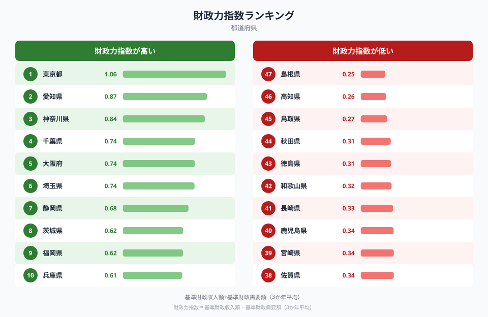
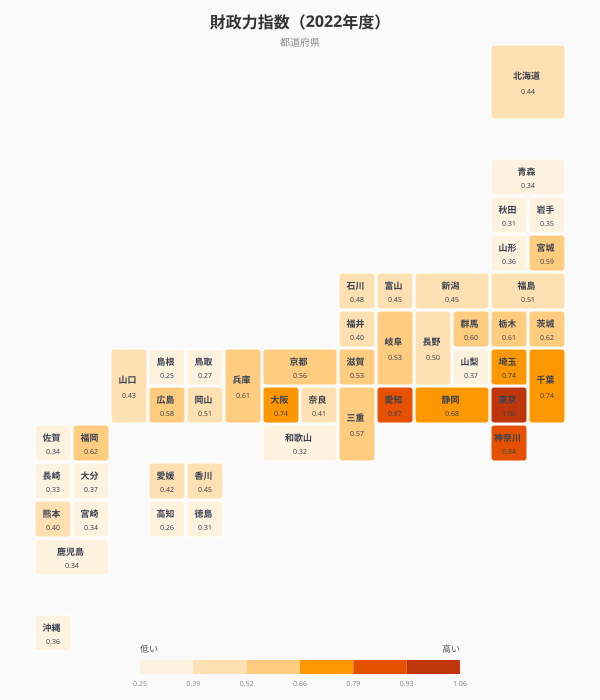
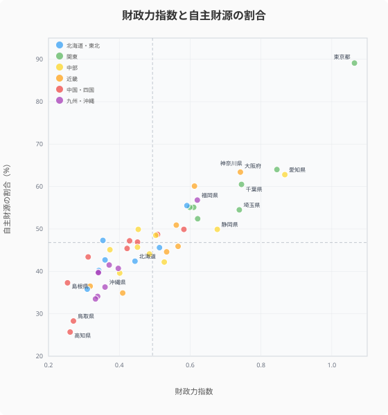
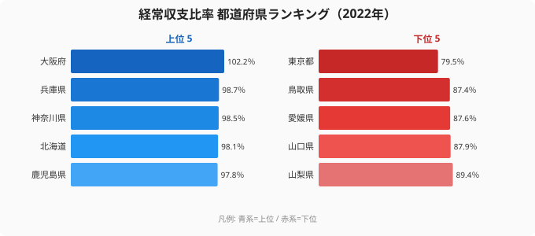
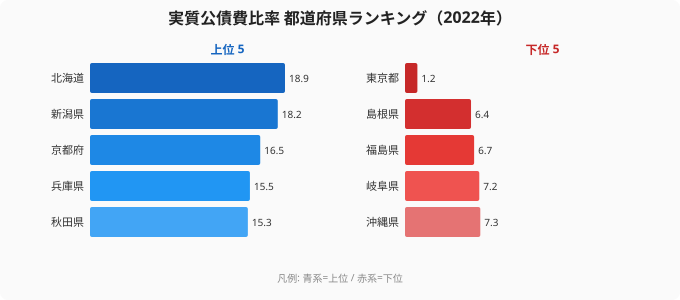
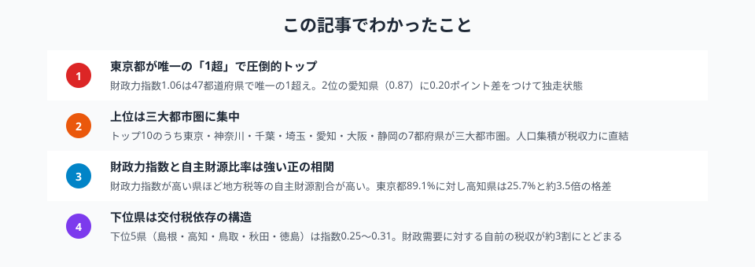

「この県は財政が豊かなのか、それとも厳しいのか」──地方自治体の財政力を一つの数値で示すのが**財政力指数**です。

財政力指数は「基準財政収入額 ÷ 基準財政需要額」の3か年平均で計算され、**1.0以上なら地方交付税の不交付団体**となります。つまり、自前の税収だけで行政需要をまかなえるかどうかの指標です。

この記事では、総務省「地方財政状況調査」のデータをもとに、**財政力指数**を47都道府県で比較します。ランキング・タイルマップ・散布図の3つの視点から、地方財政の実力差とその構造を読み解きます。

## 財政力指数ランキング（2022年度）

<data-source url="https://www.e-stat.go.jp/dbview?sid=0000010104" label="e-Stat 社会・人口統計体系"></data-source>

<source-link href="/ranking/fiscal-strength-index-prefecture">財政力指数ランキングをもっと見る</source-link>

**財政力指数が最も高いのは[東京都](/areas/13000)**（1.06）。47都道府県で**唯一の1.0超え**であり、地方交付税の不交付団体です。2位の愛知県（0.87）、3位の神奈川県（0.85）、4位の千葉県（0.75）、5位の[大阪府](/areas/27000)（0.74）と続きます。

トップ10には埼玉県・静岡県・茨城県・福岡県・兵庫県が入り、**三大都市圏および太平洋ベルト沿いの県が占めています**。人口と産業の集積が地方税収に直結している構造です。

一方、**最も低いのは[島根県](/areas/32000)**（0.25）。高知県（0.26）、鳥取県（0.27）、秋田県（0.31）、徳島県（0.31）と下位5県が続きます。1位の東京都と47位の島根県では**約4.2倍**の差があり、都道府県間の財政力格差は極めて大きいことがわかります。

> [!NOTE]
> 財政力指数が低いことは必ずしも「財政危機」を意味しません。指数が低い自治体は地方交付税で財源が補填されるため、行政サービスの質が直ちに低下するわけではありません。

## 都道府県マップ──財政力の「東高西低」

<data-source url="https://www.e-stat.go.jp/dbview?sid=0000010104" label="e-Stat 社会・人口統計体系"></data-source>

タイルマップで全体像を見ると、**首都圏・中京圏・近畿圏を中心に濃い色が集中**し、それ以外の地域は薄い色が広がるパターンが鮮明です。

- **首都圏が突出** ── 東京（1.06）を筆頭に、神奈川（0.85）・千葉（0.75）・埼玉（0.74）・茨城（0.62）と関東1都4県がトップ10に5つランクイン
- **中京圏も高水準** ── 愛知（0.87）は全国2位。静岡（0.68）・三重（0.57）・岐阜（0.53）も全国平均を上回る
- **日本海側・東北・四国が低位** ── 島根（0.25）・高知（0.26）・鳥取（0.27）・秋田（0.31）・徳島（0.31）は指数0.3前後。財政需要に対して自前の税収が約3割にとどまる

注目すべきは**北海道が0.44と全国26位**である点です。面積が広く行政コストが高いうえ、法人税収が少ないことが財政力指数を押し下げています。

<ad-slot></ad-slot>

## 財政力指数と自主財源の割合

<data-source url="https://www.e-stat.go.jp/dbview?sid=0000010104" label="e-Stat 社会・人口統計体系"></data-source>

<source-link href="/ranking/self-financing-ratio">自主財源の割合ランキングをもっと見る</source-link>

横軸に財政力指数、縦軸に自主財源の割合（地方税・使用料等の自前収入が歳入全体に占める比率）をとると、**強い正の相関**が見えます。財政力指数が高い県ほど、歳入に占める自主財源の比率が高いという関係です。

散布図を4象限に分けると：

- **右上（指数高い×自主財源多い）**: 東京（89.1%）・神奈川（64%）・愛知（62.8%）・大阪（63.4%）── 税収力のある都市部が集中
- **左下（指数低い×自主財源少ない）**: 高知（25.7%）・鳥取（28.3%）・島根（37.3%）── 交付税・国庫支出金への依存度が高い
- **中間ゾーン**: 福岡（指数0.62、自主財源56.8%）・広島（指数0.58、自主財源49.9%）── 地方中核都市を抱える県は両指標とも中位

**東京都は自主財源比率89.1%と突出**しています。これは法人事業税・法人住民税など企業関連の税収が桁違いに大きいためです。一方、高知県の25.7%は、歳入の約4分の3を国からの移転財源に頼っている構造を示しています。

> [!TIP]
> 自主財源比率が高い自治体は、景気変動による税収の増減がダイレクトに財政運営に影響します。自主財源比率が低い自治体は交付税で安定する一方、国の財政政策に左右されやすいという両面があります。

## 財政健全性を測る4つの指標

財政力指数だけでは見えない地方財政の実態を、関連する3つの指標と合わせて整理します。

### 経常収支比率──財政の硬直度

経常収支比率は、人件費・扶助費・公債費など義務的経費が経常的な一般財源に占める割合です。**100%に近いほど自由に使える財源が少なく、財政が硬直化**しています。

最も硬直しているのは大阪府の102.2%、次いで兵庫県98.7%・神奈川県98.5%。逆に最も柔軟なのは東京都79.5%で、下位の鳥取県87.4%よりさらに低い水準です。

<source-link href="/ranking/current-balance-ratio">経常収支比率ランキングをもっと見る</source-link>

大阪府は**100%を超えており**、経常的な収入だけでは経常的な支出をまかなえない状態です。意外にも財政力指数5位の大阪府が経常収支比率では最も硬直的であり、「**税収が多くても支出も多い**」という大都市特有の構造が浮かびます。大阪府が102.2%を超える背景には、高齢化に伴う扶助費の拡大と、過去の大規模公共投資の公債費返済が重なっている構造があります。財政力指数だけを見ると「都市部は豊か」に見えますが、支出圧力も高いため必ずしも財政の余裕があるとは言えません。

### 実質公債費比率──借金の重さ

実質公債費比率は、自治体の借金返済が財政に占める負担の重さを示します。**18%以上で起債に制限**がかかります。

借金返済の負担が最も重いのは北海道18.9%、次いで新潟県18.2%・京都府16.5%。最も軽いのは東京都の1.2%で、下位の島根県6.4%を大きく下回ります。

**北海道は18.9%で「起債制限」ラインの18%を超えています**。広大な面積に伴うインフラ整備費用の累積が大きな負担となっています。東京都は1.2%と極めて低く、豊富な税収で借金に頼る必要が少ないことを示しています。

<source-link href="/ranking/real-public-debt-service-ratio">実質公債費比率ランキングをもっと見る</source-link>

> [!WARNING]
> 実質公債費比率が低い自治体が必ずしも健全とは限りません。島根県（6.4%）のように交付税措置のある起債を多く活用している場合、見かけ上の比率は低くなります。

<ad-slot></ad-slot>

## まとめ

財政力指数と関連指標を多角的に分析した結果をまとめます。

<data-source url="https://www.e-stat.go.jp/dbview?sid=0000010104" label="e-Stat 社会・人口統計体系"></data-source>

地方財政の実力差は、人口・産業構造・地理的条件によって構造的に決まっています。財政力指数が高い都市部は税収に恵まれる一方、経常収支比率が高く財政が硬直化しやすいというジレンマも抱えています。

財政力指数が低い地域は地方交付税で財源が補填されますが、**交付税制度は国の財政状況に左右される**ため、長期的には自主財源の確保が課題です。ふるさと納税や企業誘致、観光振興など、税収基盤の強化に取り組む自治体の動向に今後も注目が必要です。

## データ出典

本記事のデータはe-Stat（政府統計の総合窓口）を基に作成しています。
