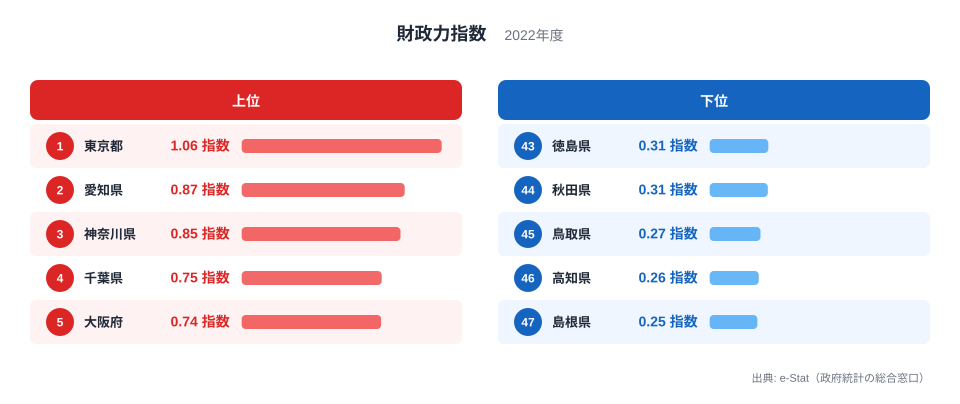
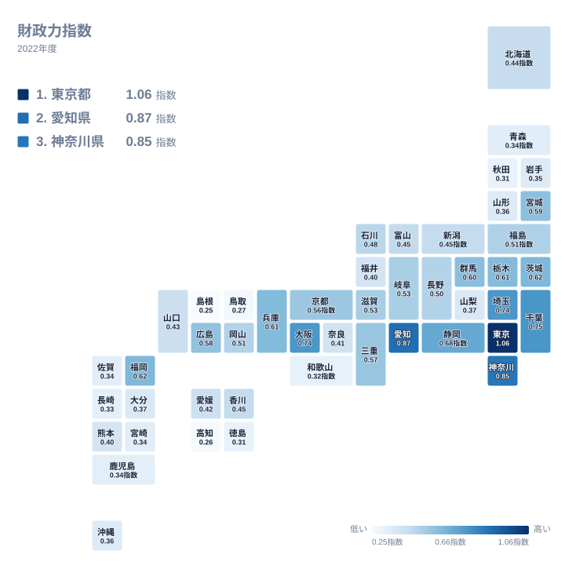
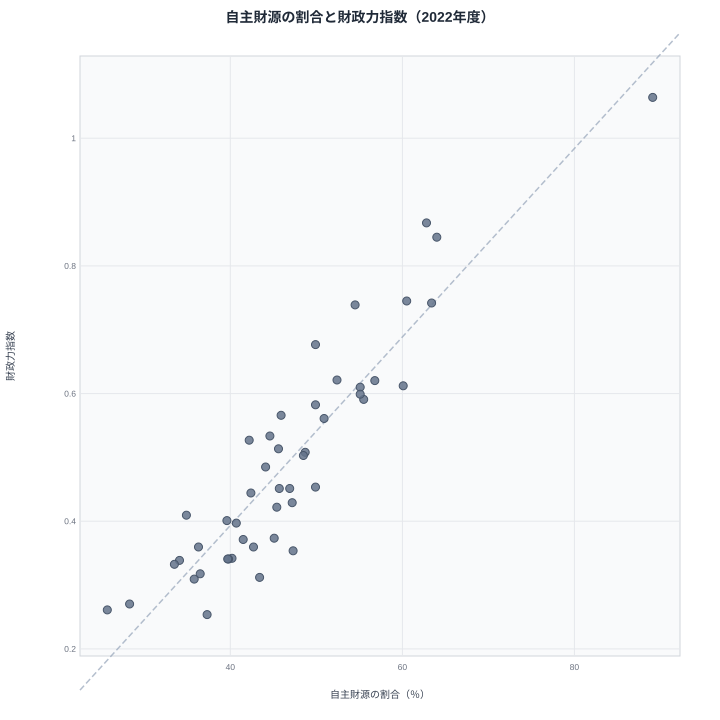
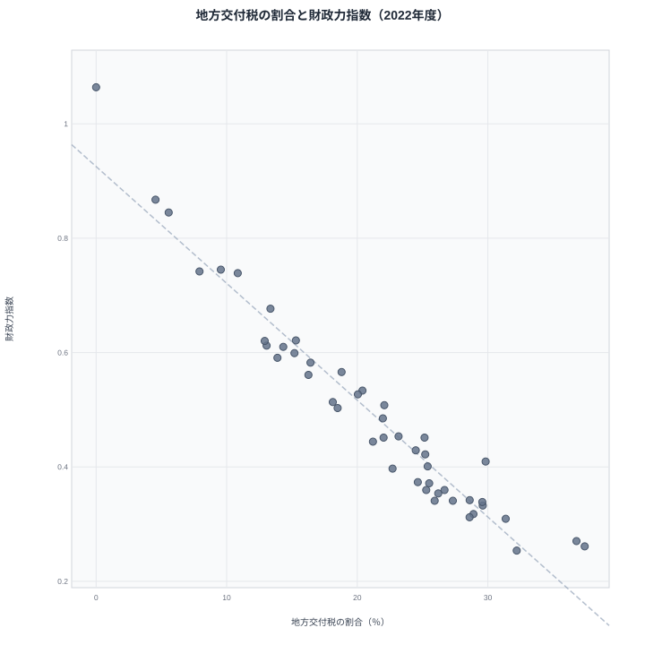
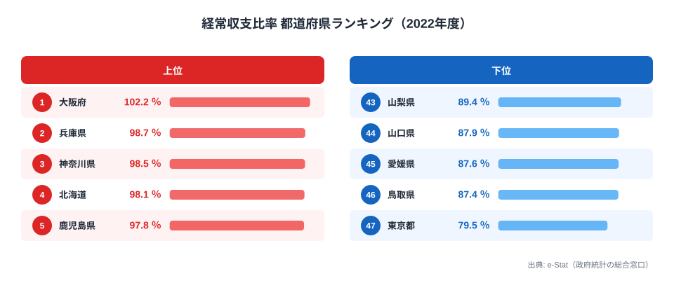
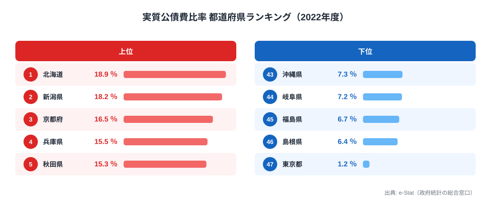
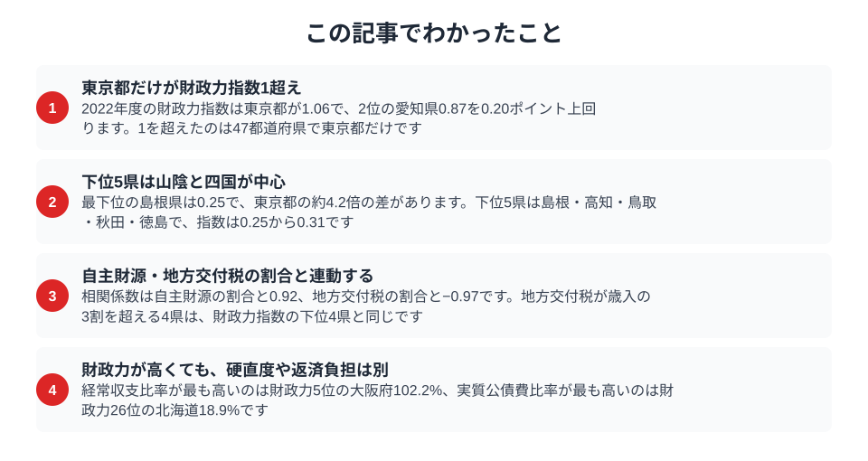

「この県は財政が豊かなのか、それとも厳しいのか」──地方自治体の財政力を一つの数値で示すのが**財政力指数**です。

財政力指数は「基準財政収入額 ÷ 基準財政需要額」を過去3年間で平均した値です。1.0を超えると、算定上の標準的な収入が標準的な行政需要を上回ることになり、このタイトルでいう「自立」はこの状態を指します。2022年度に1.0を超えたのは東京都だけで、ほかの46道府県は1.0に届きませんでした。

この記事では、総務省統計局「社会・人口統計体系」の2022年度のデータを使い、財政力指数を47都道府県で比べます。ランキング・タイルマップ・散布図の3つの視点で差の大きさと背景を見たあと、経常収支比率と実質公債費比率を重ねて、財政力指数だけでは読み取れない財政の姿を確かめます。

## 財政力指数ランキング（2022年度）

<data-source url="https://www.e-stat.go.jp/dbview?sid=0000010104" label="e-Stat 社会・人口統計体系"></data-source>

<source-link href="/ranking/fiscal-strength-index-prefecture">財政力指数ランキングをもっと見る</source-link>

**財政力指数が最も高いのは[東京都](/areas/13000)で1.06**です。47都道府県で唯一の1.0超えで、2位は愛知県の0.87、3位は神奈川県の0.85、4位は千葉県の0.75、5位は[大阪府](/areas/27000)の0.74と続きます。東京都と愛知県の差は0.20ポイントあり、2位以下の都府県が1.0に届かないなかで、東京都だけが抜けています。

トップ10には、埼玉県・静岡県・茨城県・福岡県・兵庫県も入っています。顔ぶれは関東の5都県（東京・神奈川・千葉・埼玉・茨城）、愛知県と静岡県、大阪府と兵庫県、そして福岡県で、三大都市圏とその周辺に福岡県が加わる形です。都市部で高くなる背景には、人口や産業の集まりによる税収の大きさがあるかもしれません。ただし、人口や産業そのものの指標はこの記事では扱いません。このあとの散布図では、歳入の中身である自主財源の割合と地方交付税の割合との関係から、順位の背景を探ります。

**最も低いのは[島根県](/areas/32000)で0.25**です。続いて高知県が0.26、鳥取県が0.27、秋田県が0.31、徳島県が0.31と、下位5県は0.25から0.31に収まります。最高の東京都1.06と最低の島根県0.25では約4.2倍の差で、都道府県間の財政力には大きな開きがあります。47都道府県のうち、0.5以上は21、0.4を下回るのは17で、真ん中にあたる24位の香川県は0.45です。

下位がなぜ低いのかは、指数の定義から読み取れます。島根県の0.25は、算定上の標準的な収入が標準的な行政需要のおよそ4分の1にとどまることを意味し、下位5県はどれも0.33に届かないため、標準的な収入が標準的な需要の3分の1に満たない計算です。総務省の資料によると、普通交付税は、基準財政需要額から基準財政収入額を引いた財源不足額を基に決まります。指数が低いほど需要に対して足りない財源の割合が大きく、その不足を国からの地方交付税が補う仕組みです。実際の歳入にどう表れているかは、このあとの散布図で確かめます。

> [!NOTE]
> 財政力指数は過去3年間の平均値で、単年度の収支や財政黒字率ではありません。値が低いことは、算定上の標準的な収入が標準的な行政需要に対して小さいことを示すだけで、その年の赤字を意味するものではありません。

## 都道府県マップ──濃い色は大都市圏とその周辺に集まる

<data-source url="https://www.e-stat.go.jp/dbview?sid=0000010104" label="e-Stat 社会・人口統計体系"></data-source>

タイルマップで全体像を見ると、濃い色は首都圏・中京圏・近畿圏を中心に集まり、それ以外の地域は薄い色が広がっています。ランキングの本文に出てこなかった県を中心に、地域ごとの位置づけを確かめます。

- **関東は1都6県がすべて12位以内**: 栃木県は0.61で11位、群馬県は0.60で12位と、トップ10に入った東京・神奈川・千葉・埼玉・茨城の5都県のすぐ後に続きます。
- **中京・近畿は県ごとの差が大きい**: 静岡県は0.68で7位、三重県は0.57で15位、岐阜県は0.53で18位と、中京圏では愛知県のほかの3県も上位半分に入ります。近畿は、京都府が0.56で16位、滋賀県が0.53で17位と上位半分に入る一方、奈良県は0.41で29位、和歌山県は0.32で42位と、近畿のなかでも大きな差があります。
- **下位は山陰・四国・九州に多い**: 0.35を下回る11県は、島根・高知・鳥取・秋田・徳島・和歌山・長崎・鹿児島・宮崎・佐賀・青森です。山陰の2県、四国の2県、九州の4県が含まれ、東北では秋田県と青森県、近畿では和歌山県が入ります。

北海道は0.44で26位と、真ん中よりやや下に位置します。財政力指数では中位の北海道が、後で見る実質公債費比率では全国1位になる点は、財政力指数だけでは財政の姿を捉えきれないことを示しています。

## 財政力指数と自主財源の割合

<data-source url="https://www.e-stat.go.jp/dbview?sid=0000010104" label="e-Stat 社会・人口統計体系"></data-source>

<source-link href="/ranking/self-financing-ratio">自主財源の割合ランキングをもっと見る</source-link>

横軸に自主財源の割合（歳入のうち、自治体が自分で集められる収入の割合）、縦軸に財政力指数をとると、右上がりの**強い関係**が見えます。47都道府県から計算した相関係数は0.92で、東京都を除いた46道府県でも0.90です。自主財源の割合が高い県ほど、財政力指数も高い傾向があります。

散布図を3つの領域に分けて読むと次のとおりです。図の右端に離れて位置する1点が東京都で、残る46道府県の自主財源の割合は25.7%から64.0%の範囲に収まります。

- **右上は自主財源の割合が56%以上の7都府県**: 東京都は自主財源の割合が89.1%で指数が1.06、神奈川県は64.0%で0.85、大阪府は63.4%で0.74、愛知県は62.8%で0.87です。千葉県と兵庫県が続き、福岡県は56.8%とこの7都府県のなかでは最も低いものの、指数は0.62で9位です。7都府県はいずれも財政力指数がトップ10に入っています。
- **中間は自主財源の割合が40%以上56%未満の28県**: 指数は徳島県の0.31から埼玉県の0.74まで広く分かれます。静岡県・広島県・富山県はいずれも自主財源の割合が49.9%ですが、指数は静岡県が0.68、広島県が0.58、富山県が0.45と開いており、自主財源の割合だけで指数が決まるわけではないことがわかります。
- **左下は自主財源の割合が40%未満の12県**: 指数はいずれも0.41以下です。高知県は自主財源の割合が25.7%で指数が0.26、鳥取県は28.3%で0.27です。島根県は自主財源の割合が37.3%と、高知県や鳥取県より高めですが、指数は最下位の0.25で、両者が一対一で対応するわけではありません。

**東京都の自主財源の割合は89.1%と突出**しています。次に高い神奈川県の64.0%を25.1ポイント上回ります。一方、高知県の25.7%は、歳入の約4分の3を自主財源以外の収入が占めることを意味します。東京都と高知県では約3.5倍の開きがあります。

> [!WARNING]
> 相関係数0.92は、自主財源の割合が財政力指数の原因である、あるいはその逆であることを意味しません。どちらも税収の大きさに左右される指標のため、同じ要因で同時に動いている可能性があります。

## 財政力指数と地方交付税の割合

<data-source url="https://www.e-stat.go.jp/dbview?sid=0000010104" label="e-Stat 社会・人口統計体系"></data-source>

<source-link href="/ranking/local-allocation-tax-ratio-pref-finance">地方交付税割合ランキングをもっと見る</source-link>

自主財源の割合の反対側にあたる、地方交付税の割合でも見てみます。地方交付税は、自治体間の財源の不均衡を調整し、どの地域でも一定の行政サービスを提供できるように、国が配分する収入です。横軸に地方交付税割合（歳入決算総額に占める地方交付税収入の割合）、縦軸に財政力指数をとると、右下がりの**強い関係**が見えます。47都道府県の相関係数は−0.97で、東京都を除いた46道府県でも−0.97です。財政力指数が低い県ほど、歳入に占める地方交付税の割合が高い傾向があります。

**地方交付税の割合が最も高いのは高知県**で37.42%、鳥取県が36.79%、島根県が32.21%、秋田県が31.37%と続きます。この4県は財政力指数の下位4県と同じ顔ぶれで、地方交付税が歳入の3割を超えるのもこの4県だけです。島根県・高知県・鳥取県が低い理由の一つは、標準的な収入が標準的な行政需要に届かず、その差を地方交付税で補う割合が大きいことにあると読めます。

反対側では、財政力指数の上位5都府県が、地方交付税の割合が低い5都府県と重なります。東京都は0%で、愛知県は4.55%、神奈川県は5.56%、大阪府は7.92%、千葉県は9.55%です。東京都は財政力指数が1を超え、算定上の標準的な収入が標準的な行政需要を上回るため、普通交付税の算定で補うべき財源不足がありません。0%という値は、この定義と整合します。

関係は一対一ではありません。奈良県は地方交付税の割合が29.83%で5番目に高い一方、財政力指数は0.41で29位と、真ん中より下にとどまります。また、自主財源の割合と地方交付税の割合はどちらも歳入の構成比で、一方が高いほど他方が低くなりやすい関係が計算上もあります。2つの散布図は独立した2つの証拠ではなく、同じ歳入の構成を別の側から見た図です。なぜ標準的な収入そのものが小さいのか、つまり人口規模や産業構造の違いまでは、この記事のデータでは分かりません。

## 財政力指数だけでは見えないもの──経常収支比率と実質公債費比率

財政力指数が高い県は、財政にも余裕があるのでしょうか。2022年度の47都道府県の値で相関係数を計算すると、財政力指数と実質公債費比率は−0.17で、ほとんど連動しません。経常収支比率との相関係数は0.09と小さいものの、東京都を除く46道府県では0.50になり、財政力指数が高い県ほど経常収支比率も高い、つまり財政が硬直しやすい向きに変わります。財政力指数の順位だけでは、財政の硬直度や借金返済の重さは読み取れないということです。

### 経常収支比率──財政の硬直度

経常収支比率は、人件費・扶助費・公債費など毎年度経常的に支出する経費に充てた一般財源が、経常的な一般財源などの合計に占める割合です。**100%に近いほど自由に使える財源が少なく、財政構造の硬直化が進んでいる**ことを表します。

<source-link href="/ranking/current-balance-ratio">経常収支比率ランキングをもっと見る</source-link>

経常収支比率が**最も高いのは大阪府**で102.2%、次いで兵庫県が98.7%、神奈川県が98.5%、北海道が98.1%、鹿児島県が97.8%です。**最も低いのは東京都**で79.5%となり、下から2番目の鳥取県87.4%よりさらに7.9ポイント低く、東京都だけが突出して余裕のある水準です。

100%を超えたのは大阪府だけで、経常的な経費に充てた一般財源が、経常的な一般財源などの合計を上回った計算になります。90%以上の都道府県は41に上り、多くの都道府県で、一般財源の大半が毎年の経常的な支出に充てられています。

上位5都道府県の財政力指数の順位は、大阪府が5位、兵庫県が10位、神奈川県が3位といずれも上位で、北海道は26位、鹿児島県は40位です。財政力指数が高い都府県のほうが硬直度も高い傾向がうかがえる一方で、北海道や鹿児島県のように財政力指数が低くても硬直度の高い県もあり、向きは完全にはそろいません。

47都道府県で相関係数が0.09と小さいのは、財政力指数が全国1位の東京都が、経常収支比率では全国最低の79.5%と、ほかの道府県とは逆の位置にあるためです。東京都を除く46道府県では0.50まで上がり、財政力指数が高い道府県ほど経常収支比率も高い、つまり財政が硬直しやすい傾向がみられます。「財政力が高ければ財政にも余裕がある」という関係は、東京都以外の道府県では見えません。

大阪府は財政力指数が5位でありながら、経常収支比率は最も高くなっています。実質公債費比率は11.5%で17位にとどまり、上位5位にも入らないため、借金の返済が硬直化の最大の要因とは言い切れません。経常収支比率は人件費・扶助費・公債費などをまとめて見る指標なので、この記事のデータだけでは、大阪府の硬直化の中身までは分解できません。

### 実質公債費比率──借金返済の重さ

実質公債費比率は、借金の返済に準ずる支出まで含めた実質的な公債費が、標準財政規模を基本とした額に占める割合を、過去3年間で平均した値です。高いほど返済の負担が重いことを示します。

<source-link href="/ranking/real-public-debt-service-ratio">実質公債費比率ランキングをもっと見る</source-link>

**返済の負担が最も重いのは北海道**で18.9%、次いで新潟県が18.2%、京都府が16.5%、兵庫県が15.5%、秋田県が15.3%です。**最も軽いのは東京都**で1.2%、北海道は東京都の約15.8倍です。東京都は、2番目に低い島根県の6.4%とも5.2ポイント離れています。

水準を判断する目安になる基準もあります。総務省の『令和6年版 地方財政白書』によると、実質公債費比率が18%以上の団体は、地方債を発行するときに総務大臣等の許可が必要です。2022年度に18%以上なのは、この記事のデータでは北海道の18.9%と新潟県の18.2%の2道県で、白書が示す令和4年度決算の都道府県2団体と数が一致します。

上位5道府県の財政力指数の順位は、北海道が26位、新潟県が25位、京都府が16位、兵庫県が10位、秋田県が44位とばらばらです。財政力指数が低いから借金の負担が重いとも、高いから軽いとも言えません。実際、財政力指数との相関係数は−0.17と小さく、東京都を除くと0.07でほぼゼロになります。北海道は財政力指数では26位と中位なのに、実質公債費比率は全国1位、経常収支比率も4位の98.1%と、2つの指標が重なる形で厳しい位置にいます。

財政力指数が最も低い島根県は、実質公債費比率では6.4%で46位と、下から2番目に軽い県です。財政力が弱いことと、借金の負担が重いことは別の話であることが、この対比からわかります。

> [!WARNING]
> 実質公債費比率が低いことが、そのまま健全さを意味するわけではありません。この比率は、元利償還金などのうち基準財政需要額に算入される分を差し引いて計算するため、実際の返済額の割合とは一致せず、過去3年間の平均値でもあります。

## まとめ

<data-source url="https://www.e-stat.go.jp/dbview?sid=0000010104" label="e-Stat 社会・人口統計体系"></data-source>

2022年度の財政力指数は、東京都が1.06で唯一1.0を超え、島根県が0.25で最も低く、約4.2倍の差がありました。自主財源の割合とは相関係数0.92で強く連動し、地方交付税の割合とは−0.97で逆向きに連動します。地方交付税の割合が3割を超える高知・鳥取・島根・秋田の4県は、財政力指数の下位4県と一致しており、標準的な収入が標準的な行政需要に届かない分を地方交付税が補う構図が表れています。

一方で、財政力指数が高いことは、経常収支比率や実質公債費比率の低さを保証しません。東京都を除く46道府県では、財政力指数が高い県ほど経常収支比率も高く、財政が硬直しやすい傾向があります。財政力5位の大阪府は経常収支比率が全国で最も高く、財政力26位の北海道は実質公債費比率が全国で最も高くなっています。財政力指数は、自前の収入が標準的な行政需要にどこまで届くかを示す指標です。財政の硬直度や借金返済の重さは、別の指標で確かめる必要があります。

## データについて

- 図と本文の数値は、すべてe-Stat「社会・人口統計体系」の2022年度の値です。指標どうしを比べるため、年度は2022年度に揃えています。
- 財政力指数と実質公債費比率は、過去3年間を平均した値です。
- 順位は値の高い順で、元の値が同じ場合だけ同順位としています。財政力指数は小数点以下5桁の値で比べるため、表示が同じ0.31でも徳島県は43位、秋田県は44位と分かれます。実質公債費比率と経常収支比率は公表されている小数点以下1桁の値が同じなら同順位で、山梨県と大阪府はどちらも11.5%で17位です。
- 相関係数は、2022年度の47都道府県の値から求めたピアソンの相関係数です。「東京都を除く」値は、残る46道府県で同じ方法で計算しました。財政力指数と自主財源の割合の0.92、地方交付税の割合の−0.97は、サイト内の相関分析の値とも一致します。
- 制度の説明は総務省の資料に基づきます。実質公債費比率が18%以上の団体に必要な許可は[『令和6年版 地方財政白書』第1部 9 健全化判断比率等の状況](https://www.soumu.go.jp/menu_seisaku/hakusyo/chihou/r06data/2024data/r06czb01-09.html)、普通交付税の算定式は[『地方交付税制度の概要』](https://www.soumu.go.jp/main_content/001022461.pdf)で確認しました (確認日は2026年10月7日)。
