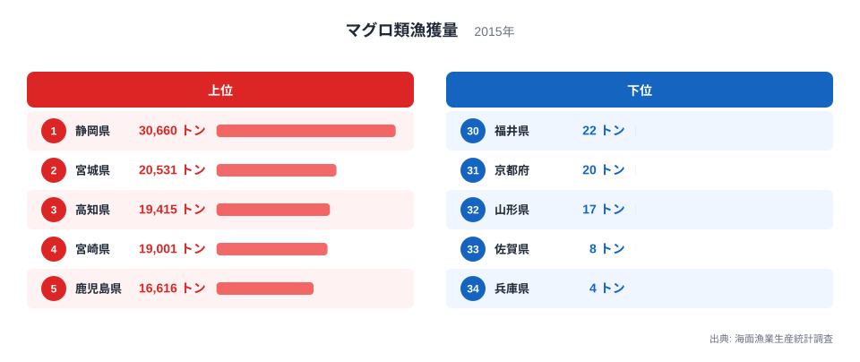
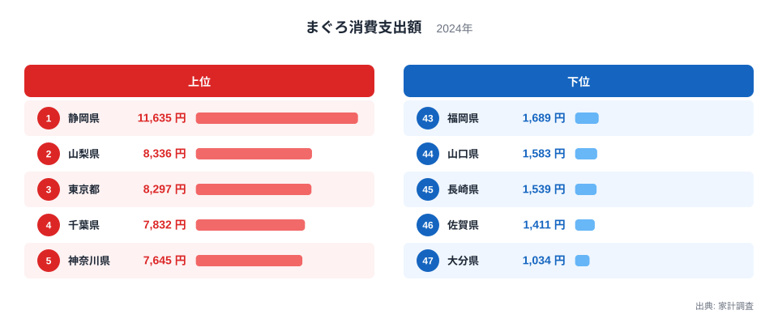
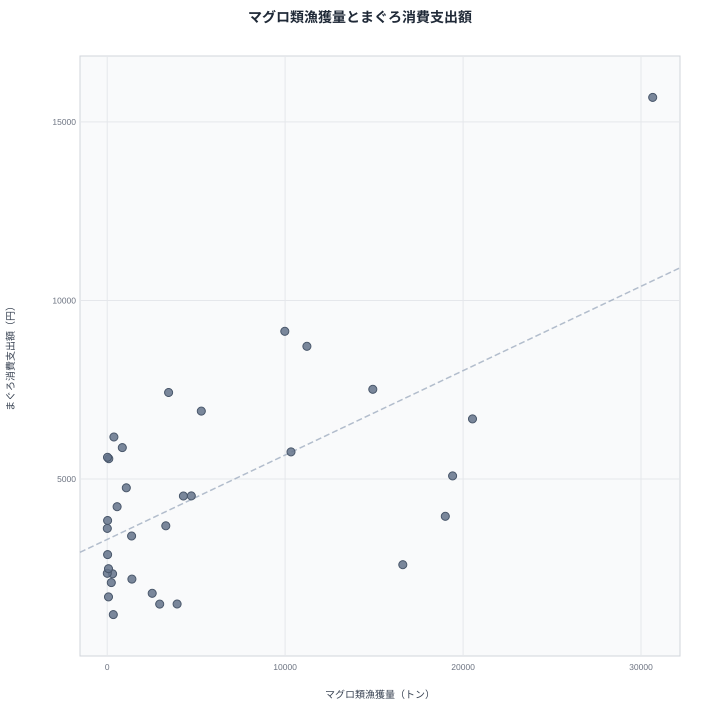
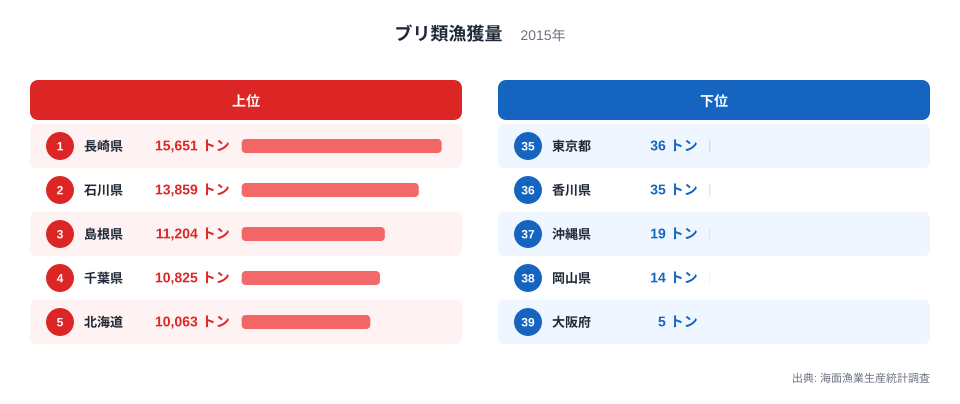
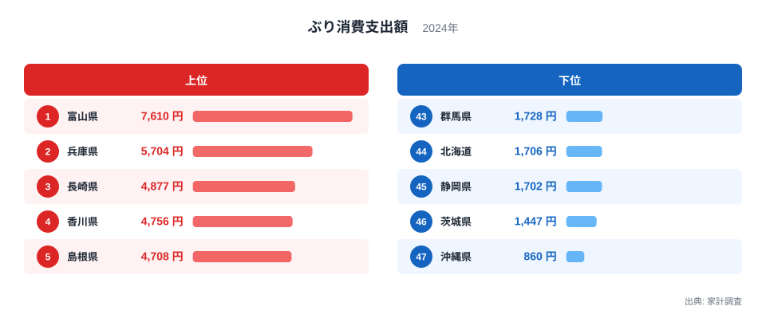
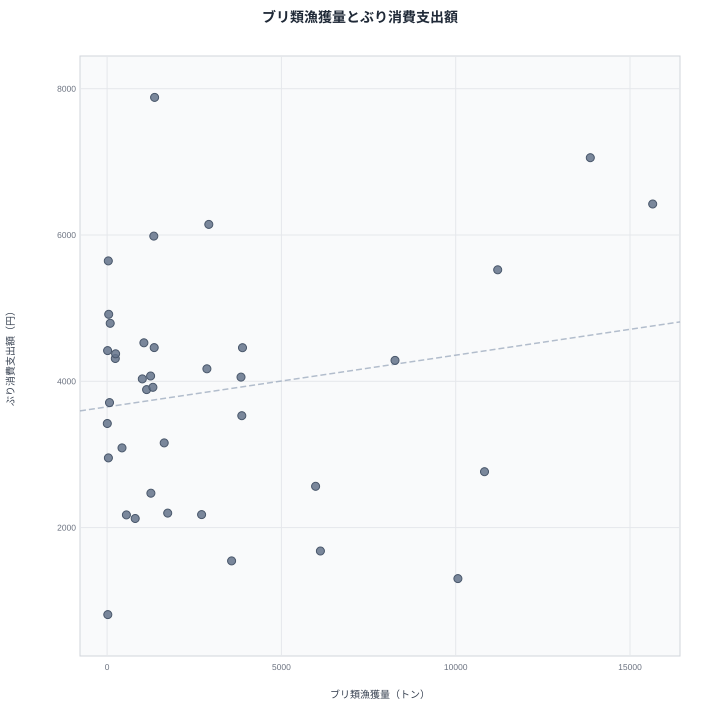

魚を多く獲る県は、その魚をたくさん食べる県でもあるのでしょうか。直感的には「そうだろう」と思いますが、実際のデータで確かめると、魚種によって答えがまったく違います。マグロ類は獲れる県と食べる県がある程度重なるのに対し、ブリ類は漁獲量トップの県と消費支出額トップの県がほぼ無関係になります。この記事では、農林水産省「海面漁業生産統計調査」の漁獲量と総務省「家計調査」の消費支出額を2015年で突き合わせ、この違いがどこから来るのかを見ていきます。

先に結論を言うと、マグロは静岡県が漁獲量・消費支出額の両方で全国1位という「産地=消費地」に近い構図です。一方ブリは、漁獲量1位の長崎県が消費支出額では3位にとどまり、消費支出額1位の富山県は漁獲量ではベスト5にも入りません。同じ「魚」でも、流通と食文化の働き方が違うのです。

> [!NOTE]
> 漁獲量は農林水産省「海面漁業生産統計調査」による都道府県別データで、内陸8県（栃木・群馬・埼玉・山梨・長野・岐阜・滋賀・奈良）は海に面していないため対象外です。同統計の最新年は2015年で、それ以降は未整備のため、消費支出額側もこの記事の散布図では2015年に揃えています。ランキング図（棒グラフ）は消費支出額の直近年（2024年）を使っており、散布図とは年が異なる点に注意してください。消費支出額は総務省「家計調査」の都道府県庁所在市（政令指定都市を含む）の値で、県全体の平均ではない点にも注意が必要です。

## マグロ類漁獲量ランキング｜太平洋側の県が上位を占める

2015年のマグロ類漁獲量は静岡県が30,660トンで1位、2位の宮城県は20,531トンで、両県には大きな差があります。上位には宮城県・高知県・宮崎県・鹿児島県と、いずれも太平洋に面した黒潮・親潮の通り道にある県が並びます。マグロ類は外洋を回遊する魚なので、遠洋・近海のマグロ漁船が根拠地を置く港がある県に漁獲が集中する構造です。

下位は佐賀県8トン、兵庫県4トンとごくわずかで、これらの県は海に面していても遠洋マグロ漁の拠点を持ちません。さらに、内陸8県に加えて愛知県・大阪府・岡山県・広島県・香川県の5県では、2015年のマグロ類漁獲記録がありません。愛知・大阪・岡山・広島・香川はいずれも瀬戸内海や伊勢湾・大阪湾に面した県です。[仮説] 遠洋性のマグロ類を狙う漁船があまり出漁しない海域のためではないかと考えられます。検証には県別の漁船隻数・トン数区分の統計が必要です。

<source-link href="/ranking/fishery-species-catch-tuna">マグロ類漁獲量ランキングをもっと見る</source-link>

## まぐろ消費支出額ランキング｜内陸県も上位に食い込む

2024年のまぐろ消費支出額は静岡県が11,635円で1位、山梨県が8,336円で2位、東京都が8,297円で3位と続きます。ここで目を引くのが2位の山梨県です。山梨県は海に面しておらず、先ほどのマグロ類漁獲量ランキングには一切登場しません。それでも消費支出額では全国2位に入っています。マグロは冷凍・冷蔵での長距離輸送が確立している魚なので、産地から遠い内陸県でも安定して流通し、地元の食習慣次第で消費額が押し上げられることがわかります。

下位は佐賀県1,411円、大分県1,034円で、いずれも九州の県です。九州は他の魚介（ぶり・あじ・さばなど）の消費が強い地域で、相対的にまぐろへの支出配分が小さくなっている可能性があります。

<source-link href="/ranking/tuna-consumption-expenditure">まぐろ消費支出額ランキングをもっと見る</source-link>

## マグロは獲れる県と食べる県がある程度重なる

漁獲量が存在する34都道府県で、マグロ類漁獲量（横軸）とまぐろ消費支出額（縦軸、いずれも2015年）を散布図にすると、右上がりの傾向がはっきり見えます。相関係数は0.63で、中程度からやや強い正の相関です。静岡県は漁獲量30,660トン・消費支出額15,687円（2015年）で図の右上に位置し、両方でトップです。東京都・神奈川県は漁獲量でも34県中7位・9位と上位3分の1に入りますが、消費支出額は回帰直線が示す水準をさらに上回っており、人口規模の大きさが上乗せに効いていると考えられます。逆に高知県・宮崎県のように漁獲量は多いのに消費支出額では中位にとどまる県、鹿児島県のように漁獲量は多いのに消費支出額では下位に沈む県もあり、完全な一致ではありません。それでも全体としては「よく獲れる県はよく食べる」という傾向が読み取れます。

> [!WARNING]
> 散布図の右上がりの傾向は「漁獲量が多いから消費支出額が高い」という因果関係を証明するものではありません。静岡県のように水揚げ港と加工・流通の拠点が集積している県では、産地であることと消費地であることが同時に成り立ちやすいという相関にとどまります。東京都・神奈川県のように、漁獲量でも上位に入りながら人口規模の大きさで消費支出額がさらに押し上げられているケースもあります。またこの散布図は漁獲記録のある34都道府県に絞っており、山梨県のように漁獲量がゼロでも消費支出額が全国上位（2015年9,313円・全国2位）の県は対象から外れています。漁獲ゼロで消費支出額が高い県が除かれている分、実際の相関はこの数値よりやや弱い可能性があります。

## ブリ類漁獲量ランキング｜日本海側の県が上位

ブリ類の漁獲量は長崎県が15,651トンで1位、石川県が13,859トンで2位、島根県が11,204トンで3位と続きます。マグロとは対照的に、上位には日本海に面した県が目立ちます。ブリは冬に日本海を南下する回遊ルートを持つ魚で、石川県・島根県・鳥取県のように定置網漁が盛んな日本海側の県で漁獲量が伸びやすい構造です。長崎県は東シナ海に面し、養殖ブリの生産でも全国有数の県として知られています。

下位は岡山県14トン、大阪府5トンと、いずれも瀬戸内海・大阪湾に面する県です。内陸8県に加えてこの2県も漁獲記録がほとんどありません。

<source-link href="/ranking/fishery-species-catch-yellowtail">ブリ類漁獲量ランキングをもっと見る</source-link>

## ぶり消費支出額ランキング｜漁獲上位県とは別の顔ぶれ

2024年のぶり消費支出額は富山県が7,610円で1位、兵庫県が5,704円で2位、長崎県が4,877円で3位と続きます。長崎県は漁獲量・消費支出額の両方で上位に入る数少ない県ですが、1位の富山県はブリ類漁獲量ランキングではベスト5に入っていません。富山県は「ぶり起こし」と呼ばれる冬の雷とともに脂の乗ったブリが揚がる地域として知られ、正月に大きなブリを縁起物として食べる文化が根強く残っています。[仮説] 地元での漁獲量そのものよりも、この食文化が消費支出額を押し上げているのではないかと考えられます。検証には年末年始に消費が集中しているかどうかの月別データが必要です。

下位は茨城県1,447円、沖縄県860円です。

<source-link href="/ranking/yellowtail-consumption-expenditure">ぶり消費支出額ランキングをもっと見る</source-link>

## ブリは獲れる県と食べる県がほとんど重ならない

漁獲量が存在する39都道府県でブリ類漁獲量（横軸）とぶり消費支出額（縦軸、いずれも2015年）を並べると、マグロの散布図とは違って点がほぼ横に散らばり、右上がりの傾向がほとんど見えません。相関係数は0.18で、ほぼ無相関です。長崎県・石川県・島根県は漁獲量・消費支出額の両方で上位に来る一方、富山県は漁獲量1,362トンとごく少ないのに消費支出額は7,881円で全国上位、逆に千葉県・北海道は漁獲量が1万トンを超えるのに消費支出額は3,000円未満にとどまります。

[仮説] この違いは、ブリが正月の縁起物として食べる地域的な食習慣に強く結びついているためではないかと考えられます。富山県のように地元漁獲量が少なくても他地域からの流通でブリを確保し、行事食として消費する文化がある地域では、漁獲量と消費支出額が切り離される傾向があるのかもしれません。検証には各県の年末年始の消費支出額推移など追加データが必要です。

> [!TIP]
> 2つの散布図を見比べると、「漁獲量と消費支出額の相関の強さ」自体が魚種によって大きく異なることがわかります。マグロのように相関がある魚種は産地の状況が消費地の需要を映しやすく、ブリのように相関が弱い魚種は地域の食文化や行事の影響を強く受けます。他の魚介でこの相関の強弱を比べてみるのも面白い切り口です。

## まとめ

- マグロ類漁獲量（2015年）は静岡県が30,660トンで1位、消費支出額（2015年）も静岡県が15,687円で1位。両者はある程度正の相関を示す
- マグロ類漁獲量の下位は佐賀県8トン・兵庫県4トン。内陸8県に加え愛知・大阪・岡山・広島・香川の5県は漁獲記録がない
- ブリ類漁獲量（2015年）は長崎県が15,651トンで1位だが、消費支出額（2015年）1位は富山県で、漁獲量と消費支出額はほとんど相関しない
- 富山県はブリ漁獲量が少ない一方で「ぶり起こし」の食文化により消費支出額が全国上位に入る
- 同じ「産地と消費地のズレ」でも、マグロとブリでは相関の強さがまったく違う

## データ出典

- 農林水産省「海面漁業生産統計調査」（内陸8県は対象外、最新年2015年）
- 総務省「家計調査」（2人以上世帯、都道府県庁所在市別）
- いずれも e-Stat 経由でデータを整備しています

関連: [かつお太平洋・かき日本海｜魚食の東西地図](/blog/bonito-vs-oyster-fish-map) / [特産魚種は地理が決める](/blog/fishery-species-prefecture-specialty) / [経済カテゴリ一覧](/category/economy) / [静岡県のデータブック](/areas/22000)
