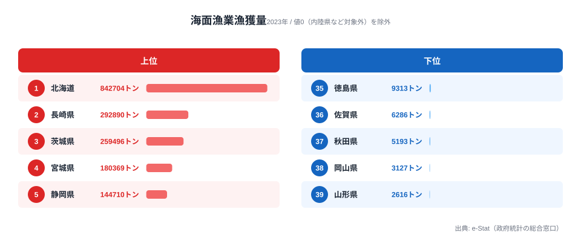
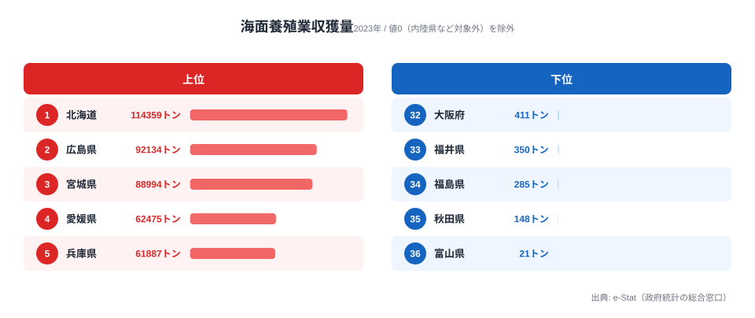
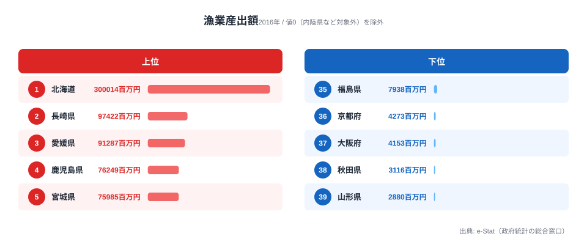
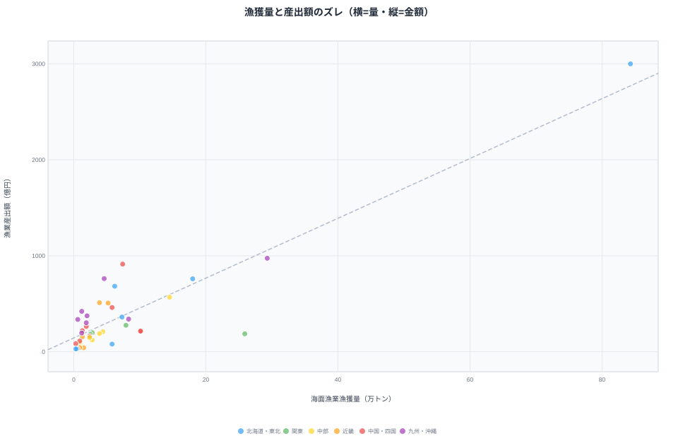
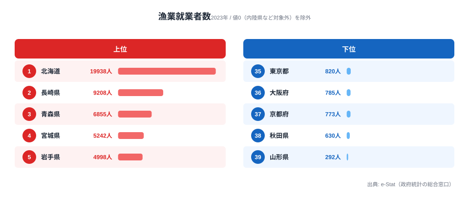

「たくさん獲る県」と「いちばん稼ぐ県」は、同じではありません。海面漁業の漁獲量で見ると北海道が約84.3万トンで全国の頂点に立ちますが、漁業産出額(金額)で見ると、漁獲量わずか10位の愛媛県が全国3位に躍り出ます。獲った魚の重さではなく、何を育ててどんな単価で売るか——それが水産業の稼ぎを左右する時代に変わりつつあります。この記事では「量のランキング」と「金額のランキング」がなぜズレるのかを、4つの指標から読み解きます。

## 漁獲量1位は北海道84.3万トン、長崎・茨城が続く

まず「どれだけ獲るか」の海面漁業漁獲量(2023年度)を見てみましょう。

1位は北海道で約84.3万トン。2位の長崎県(約29.3万トン)の2.9倍、全国合計のおよそ3割を1道で占めます。スケトウダラ・ホタテ・サケなど寒流系の大量漁獲が効いており、漁獲量という「量」の指標では他県を大きく引き離します。3位の茨城県(約26.0万トン)はサバ・イワシなどの多獲性魚、4位の宮城県、5位の静岡県と、太平洋に面した大規模漁港を持つ県が上位に並びます。

下位を見ると、徳島県・佐賀県・秋田県・岡山県・山形県といった、海に面していても外洋の好漁場に乏しい県が並びます。漁獲量の差は、漁場の規模と魚種の性質でほぼ決まると言えます。

> [!NOTE]
> 海面漁業漁獲量は「海で獲った魚介類の重量」で、養殖の収獲量は含みません。内陸の8県(山梨・長野・岐阜・滋賀・奈良など)は海面漁業の対象外でデータ上0となるため、本記事の上位5・下位5は値が1以上の沿岸県のみで比較しています。

<source-link href="/ranking/marine-fishery-catch">47都道府県の海面漁業漁獲量ランキングをもっと見る</source-link>

## 養殖収獲量は北海道・広島・宮城、そして愛媛

次に「どれだけ育てるか」の海面養殖業収獲量(2023年度)です。漁獲量とは顔ぶれが入れ替わります。

養殖でも北海道が約11.4万トンで1位ですが、2位には広島県(約9.2万トン)が入ります。広島県は漁獲量では26位にとどまる一方、カキ養殖を中心に養殖では全国2位という、典型的な「養殖型」の県です。3位の宮城県(約8.9万トン)はカキ・ノリ・ワカメ、4位の愛媛県(約6.2万トン)はマダイ・ブリ類の養殖が主力です。

ここで注目したいのが愛媛県です。漁獲量では10位(約7.4万トン)ですが、養殖収獲量では4位に上がります。広島県も漁獲26位→養殖2位と、養殖を軸にすると順位が大きく動きます。同じ「水産県」でも、外洋で獲る県と内海で育てる県では産業の中身がまったく違うことが見えてきます。

<source-link href="/ranking/marine-aquaculture-harvest">47都道府県の海面養殖業収獲量ランキングをもっと見る</source-link>

<ad-slot></ad-slot>

## 金額で見ると景色が変わる──漁獲10位の愛媛が産出額3位

ここからが本題です。「量」ではなく「金額」、つまり漁業産出額(2016年度)で並べ替えると、ランキングの景色が大きく変わります。

1位は北海道で約3,000億円(300,014百万円)。これは漁獲量1位と一致します。しかし2位以下が動きます。2位は長崎県(約974億円)、そして3位に愛媛県(約913億円)が入ります。愛媛県は漁獲量では10位でしたから、量の順位を7つ繰り上げて産出額3位に到達したことになります。4位の鹿児島県(約762億円)も漁獲量では16位で、こちらも順位を大きく上げています。

なぜこのズレが起きるのでしょうか。愛媛県は漁獲量(獲る漁業)だけ見れば全国10位の中堅にすぎませんが、漁業産出額の総額では3位に立ちます。これは、マダイをはじめとする高単価の養殖が金額を押し上げているからです。鹿児島県のブリ・カンパチ養殖、長崎県の多様な養殖も同じ構図です。漁獲量が「重さ」を測るのに対し、産出額は「重さ×単価」を測ります。安い多獲性魚を大量に揚げるより、単価の高い魚を計画的に育てるほうが、同じ金額に届く——これが量と金額のランキングがズレる正体です。

このズレを横軸=漁獲量・縦軸=産出額の散布図にすると、一目で見えてきます。

右上の北海道(漁獲84.3万トン・産出額3,000億円)は両方が突出しており、「量も金額も日本一」の例外です。注目したいのは対角の傾向から外れる県です。茨城県は漁獲25.9万トンで横軸では右寄り(全国3位)なのに、縦軸の産出額は187億円どまり(同26位)と、低い位置にとどまります。これはサバ・イワシなど安い多獲性魚を大量に揚げる「量で稼ぐ」型だからです。逆に愛媛県(漁獲7.4万トン・産出額913億円)や鹿児島県(漁獲4.6万トン・産出額762億円)は、横軸では左寄り(=漁獲が少ない)なのに縦軸では大きく上に持ち上がっています。漁獲量という横軸の位置と産出額という縦軸の位置がこれほど食い違うのは、高単価の養殖が金額だけを押し上げているからにほかなりません。獲った魚の重さと稼いだ金額は、必ずしも比例しないのです。

> [!TIP]
> 「漁獲量が多い=儲かる」とは限りません。重量あたりの単価が10倍違えば、漁獲量10分の1でも産出額は並びます。水産業の地域比較は、漁獲量だけでなく必ず産出額(金額)とセットで見ると構造が立体的に見えてきます。

<source-link href="/ranking/fishery-output-value">47都道府県の漁業産出額ランキングをもっと見る</source-link>

> [!WARNING]
> 漁業産出額は2016年度、漁獲量・養殖収獲量・就業者数は2023年度のデータで、年次が異なります。上の散布図も横軸(漁獲量)が2023年・縦軸(産出額)が2016年で、軸ごとに年次が混在しています。年次の差により細かな位置・順位は変動しうるため、本記事は「量と金額の順位がズレる構造」を大づかみに読むことを目的とし、両年を直接の同一断面としては扱っていません。また産出額の総額には漁獲分と養殖分の両方が含まれ、本記事のデータからは両者の内訳比までは切り分けられません。

## 漁業就業者は北海道2.0万人を筆頭に減少と高齢化が進む

最後に、この構造変化を支える人の数を見ます。漁業就業者数(2023年度)です。

1位は北海道で約2.0万人(19,938人)。2位の長崎県(約9,208人)の2倍以上です。3位の青森県、4位の宮城県、5位の岩手県と、漁獲・養殖の盛んな北日本・西日本の県が並びます。下位は東京都・大阪府・京都府など、海に面していても大都市で他産業の比重が大きい府県です。

漁業就業者は全国的に減少と高齢化が同時に進んでいます。担い手が細るなかで、天候や漁場に左右されにくく計画生産しやすい養殖は、省力化・安定収入の面から合理的な選択肢になります。漁獲量という「量」が頭打ちでも、単価の高い魚種に資源を集中する養殖シフトには、人口動態の側からの後押しもあると言えるでしょう。

<source-link href="/ranking/fishery-workers">47都道府県の漁業就業者数ランキングをもっと見る</source-link>

## まとめ──「量」より「単価」が水産業の稼ぎを決める

海面漁業漁獲量・海面養殖業収獲量・漁業産出額・漁業就業者数の4つの軸から、日本の水産業の地域構造を整理しました。

- 漁獲量は北海道が約84.3万トンで全国の約3割を占め、長崎・茨城・宮城・静岡が続く
- 養殖収獲量では広島が全国2位(漁獲は26位)など、外洋で獲る県と内海で育てる県で顔ぶれが入れ替わる
- 金額(漁業産出額)で見ると、漁獲量10位の愛媛が全国3位(約913億円)、漁獲16位の鹿児島が4位に浮上する
- ズレの正体はマダイ・ブリなど高単価養殖の寄与で、「量」より「単価」が稼ぎを左右する
- 漁業就業者は北海道約2.0万人を筆頭に減少・高齢化が進み、省力化しやすい養殖シフトを後押しする

水産業は農業と同じく、面積や収穫量だけでは強さが測れません。地域ごとの稼ぎ方の違いは、ほかの一次産業のデータと並べて見ると一層はっきりします。あわせて[北海道の農業がなぜ圧倒的なのか](/blog/agriculture-hokkaido-dominance)や[「作って売る」農家が稼ぐ時代](/blog/sixth-industry-direct-sales)も読むと、「量から単価へ」という共通の構造変化が見えてきます。各指標の全47都道府県の順位は[農林水産カテゴリ](/category/agriculture)から一覧できます。

## データ出典

- 農林水産省「漁業・養殖業生産統計」(海面漁業漁獲量・海面養殖業収獲量・漁業就業者数: 2023年度 / 漁業産出額: 2016年度)
- e-Stat 統計表 ID: 0000010103(社会・人口統計体系)
