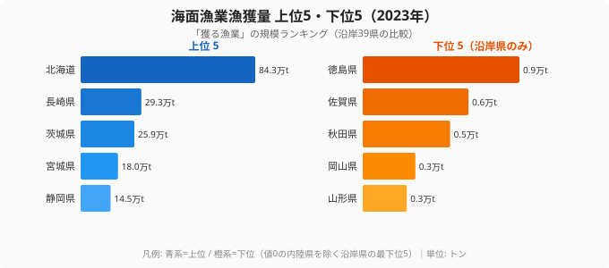
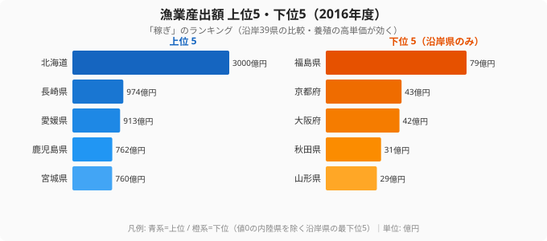
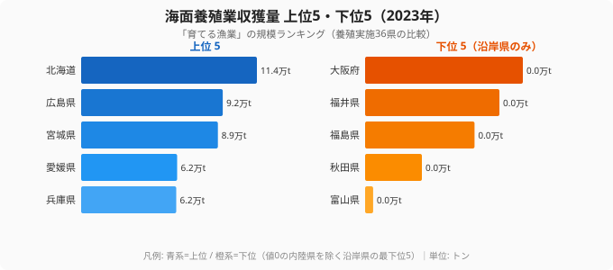
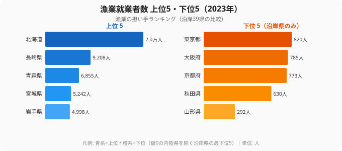

「たくさん獲る県」と「たくさん稼ぐ県」は、同じ県でしょうか。海面漁業漁獲量で見れば、答えは北海道一択です。2023年の漁獲量は北海道が84万トンで、2位の長崎県（29万トン）の3倍近くを占めます。ところが、漁業でいくら稼いだか（産出額）に物差しを変えると、景色が一変します。北海道は依然1位ですが、漁獲量では中位に沈む愛媛県が産出額3位、鹿児島県が4位へと一気に浮上するのです。

その差を生むのが「育てる漁業」、つまり養殖です。マダイやブリといった高単価の魚を計画的に育てる県は、獲る量が少なくても稼ぎでは上位に食い込みます。この記事では漁獲量・養殖収獲量・産出額・就業者数の4つの軸を並べ、日本の水産業が「量を獲る」から「単価を育てる」へと移っていく構造変化を、都道府県データで読み解いていきます。

## 漁獲量ランキング──「獲る漁業」は北海道と東北・九州の沿岸県が上位

まず「どれだけ獲るか」を見てみましょう。海面漁業漁獲量は北海道が84.3万トンで断トツの1位、長崎県29.3万トン、茨城県25.9万トン、宮城県18.0万トン、静岡県14.5万トンと続きます。寒流と暖流がぶつかる潮目を持つ太平洋側、そして対馬暖流が流れる日本海・東シナ海側の県が上位に並びます。

上位がこれらの県に集中するのは、漁場の自然条件が大きいです。北海道はサケ・スケトウダラ・ホタテなど寒海性の資源が豊富で、漁場面積そのものが桁違いに広いのが効いています。長崎・茨城・宮城は沖合・遠洋漁業の基地を持ち、大量に水揚げできる港湾インフラが整っています。一方で下位5県（値0の内陸県を除く）は徳島・佐賀・秋田・岡山・山形で、いずれも漁獲量は1万トンを下回ります。これらの県は外洋に開けた大規模漁場を持たない、あるいは内海・湾内が中心で、漁獲という「量の勝負」では構造的に不利な立地です。

> [!NOTE]
> 海面漁業漁獲量は「海で獲った天然魚」の量で、養殖で育てた分は含みません。また山梨・長野・岐阜・滋賀・奈良など海に面しない内陸県は値が0になり、ランキング下位に固まります。この記事の下位5県は、こうした「対象外の0」を除いた沿岸県の最下位を示しています。

<source-link href="/ranking/marine-fishery-catch">47都道府県の海面漁業漁獲量ランキングをもっと見る</source-link>

<ad-slot></ad-slot>

## 産出額ランキング──同じ県が並ぶのか、それとも入れ替わるのか

ここで「どれだけ稼いだか」に物差しを変えます。漁獲量で上位だった県が、そのまま稼ぎでも上位に来るのでしょうか。漁業産出額（2016年度）を見ると、北海道が3000億円で1位なのは変わりませんが、2位以下の顔ぶれが漁獲量ランキングと食い違ってきます。

産出額の上位は北海道3000億円、長崎県974億円、愛媛県913億円、鹿児島県762億円、宮城県760億円です。ここで注目したいのが愛媛県と鹿児島県の浮上です。愛媛県は漁獲量では中位の県ですが、産出額では3位に入ります。鹿児島県も同様に、漁獲量の順位より産出額の順位がはっきり高くなります。獲る量が中位でも稼ぎで上位に立てるのは、単価の高い魚を売っているからです。逆に下位5県は福島・京都・大阪・秋田・山形で、産出額はいずれも100億円に届きません。獲る量が少ないうえ、高単価品目への特化も進んでいないため、稼ぎでも下位にとどまります。

> [!WARNING]
> 漁業産出額は2016年度、漁獲量・養殖収獲量は2023年のデータで、調査年が異なります。したがって「漁獲量◯位の県が産出額△位」という順位の比較は、厳密には別年次どうしの対照です。年次が違っても「漁獲量より産出額の順位が上がる/下がる」という相対的な傾向は読み取れますが、ある県の絶対順位を年をまたいで結びつけて断定しないよう注意してください。

<source-link href="/ranking/fishery-output-value">47都道府県の漁業産出額ランキングをもっと見る</source-link>

## 養殖収獲量ランキング──愛媛・鹿児島の浮上の正体は「育てる漁業」

漁獲量と産出額の順位がずれる理由を、養殖収獲量から確かめてみましょう。「見かけ上は漁獲量が中位なのに稼ぎが上位」という県は、養殖でその差を埋めているという仮説が立ちます。海面養殖業収獲量（2023年）を見ると、その答えがはっきり出ます。

養殖収獲量の上位は北海道11.4万トン、広島県9.2万トン、宮城県8.9万トン、愛媛県6.2万トン、兵庫県6.2万トンです。産出額3位の愛媛県は、漁獲量では中位でも養殖収獲量では4位に入っています。愛媛のマダイ、鹿児島のブリ・カンパチ、広島のカキ、宮城のカキ・ノリといった高単価の養殖品目が、稼ぎを押し上げているわけです。広島県は漁獲量こそ下位寄りですが、カキ養殖を軸に養殖収獲量で2位に立ちます。「漁獲量が少ない=水産業が弱い」ではなく、「育てる漁業」に特化した県は産出額で十分に戦えることが、この3枚のチャートを並べると見えてきます。

> [!TIP]
> 漁獲量・養殖収獲量・産出額を1県ずつ縦に並べて読むと、その県の「稼ぎ方の型」が見えます。愛媛のように〈漁獲量=中位／養殖収獲量=上位／産出額=上位〉という県は、量ではなく単価で稼ぐ養殖特化型です。逆に北海道のようにどの軸でも上位の県は、量と単価の両方を押さえた総合型といえます。

なお、産出額ベースでは養殖の稼ぎが漁獲の稼ぎを上回る県が複数生まれており、もはや「育てる漁業」が一部の例外的な県の話ではなくなっている点も見逃せません。マダイやブリのような高単価魚は、計画的に出荷時期と量をコントロールできるため、天候や資源変動に左右されやすい漁獲漁業に比べて経営が安定しやすいという利点があります。

<source-link href="/ranking/marine-aquaculture-harvest">47都道府県の海面養殖業収獲量ランキングをもっと見る</source-link>

<ad-slot></ad-slot>

## 漁業就業者数ランキング──担い手の減少が「養殖シフト」を後押しする

最後に「誰が水産業を支えているか」を見ます。養殖へのシフトは趣味の問題ではなく、担い手の事情とも深く結びついています。漁業就業者数（2023年）は北海道が約2.0万人で1位、長崎県9208人、青森県6855人、宮城県5242人、岩手県4998人と続きます。

就業者の上位は、漁獲量の上位県とおおむね重なります。北海道・長崎・宮城は漁獲・就業者ともに上位で、大規模な漁業基盤を多くの人手で支えている県です。一方で就業者数の下位5県（沿岸県）は東京・大阪・京都・秋田・山形で、いずれも1000人前後かそれ以下です。都市部の府県は沿岸はあっても漁業従事者の絶対数が少なく、水産業の存在感は小さくなります。

> [!WARNING]
> 漁業の担い手は全国的に減少と高齢化が進んでいます。就業者数が上位の県でも、その内訳では高齢層の比率が高い傾向があります。担い手が減る局面では、海に出る天候依存の漁獲漁業より、陸上作業の比率が高く計画的に人を配置できる養殖業のほうが続けやすい面があり、これも産出額で養殖県が伸びる背景になっています。

<source-link href="/ranking/fishery-workers">47都道府県の漁業就業者数ランキングをもっと見る</source-link>

## まとめ──「量」より「単価」で水産業の地図を読み直す

海面漁獲量・養殖収獲量・産出額・就業者数の4軸を並べると、日本の水産業の地域構造が立体的に見えてきます。

- 漁獲量では北海道が84.3万トンで圧倒し、長崎・茨城・宮城・静岡が続きます
- 産出額に物差しを変えると、漁獲量では中位の愛媛県が3位、鹿児島県が4位へと浮上します
- その浮上の正体は養殖で、愛媛は養殖収獲量4位、広島はカキ養殖で養殖収獲量2位に立ちます
- 就業者の減少・高齢化が進むなか、計画生産できる養殖へのシフトは構造的に続くと考えられます
- 「たくさん獲る県」と「たくさん稼ぐ県」は一致せず、稼ぎ方の型は県ごとに異なります

水産業を「漁獲量ランキング」だけで眺めると、[北海道](/areas/01000)一強の単調な地図になります。しかし産出額と養殖の軸を重ねると、[愛媛県](/areas/38000)のように量ではなく単価で勝負する養殖特化県という、もう一つの主役が浮かび上がってくるのです。水産業を含む一次産業の地域差をさらに見るなら、[農林水産カテゴリのランキング一覧](/category/agriculture)も合わせてご覧ください。

## データ出典

- 農林水産省「漁業・養殖業生産統計」（漁獲量・養殖収獲量 2023年 / 産出額 2016年度）
- e-Stat 社会・人口統計体系（統計表 ID: 0000010103）
