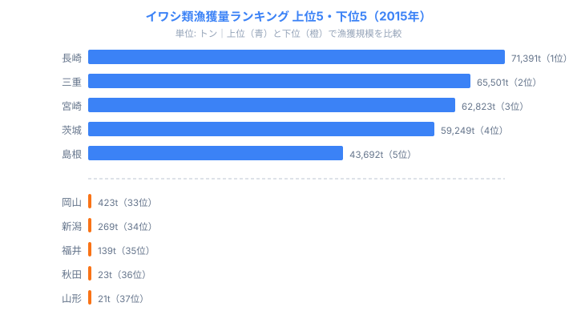

「青森のホタテ」「焼津のカツオ」「松葉ガニの兵庫」──これらの特産イメージは、半世紀のデータで確認しても揺るがないのでしょうか。それとも資源変動や政策で変わっているのでしょうか。

海面漁業生産統計調査（1956〜2015年）の都道府県別・魚種別データを分解すると、日本の「特産魚種」を決めているのが輸送インフラでも文化でもなく、**親潮・黒潮という海流と地形の組み合わせ**であることが見えてきます。そして「固定に見える特産」と「60年で激変した魚種」の分岐点も、海流の構造が説明します。

> [!NOTE]
> 本記事のデータは農林水産省「海面漁業生産統計調査」（e-Stat 統計表ID: 0003238633）に基づく。同調査は海面漁業のみを対象とし、内陸8県（栃木・群馬・埼玉・山梨・長野・岐阜・滋賀・奈良）は対象外。データ最新年は2015年。1956年との比較は同統計の長期データを使用。

## 特産魚種は海流で二分される──北方系と南方系

各都道府県で最も漁獲量が多い魚種（2015年）を地図で見ると、地理的なパターンが明確になります。

**北方系（親潮系）**: [北海道](/areas/01000)・東北の太平洋側・日本海北部。ホタテガイ・スケトウダラ・コンブ・サンマが主力です。
**南方系（黒潮系）**: 静岡・三重・高知・宮崎・鹿児島。カツオ・マグロ・ブリが中心です。
**沿岸底魚系（瀬戸内・日本海）**: 茨城のサバ類、兵庫・鳥取・福井のズワイガニです。

この南北二分は海水温と生態に直接対応しています。親潮（千島海流）は冷水で栄養塩が豊富で、北方系魚種の育ちやすい環境を作ります。黒潮（日本海流）は温水で、回遊性魚種が北上する経路になります。**現代の輸送インフラがどれだけ発達しても、魚が棲む場所は変えられません**。

北方系（親潮系）を代表する[北海道](/areas/01000)はホタテガイ23.2万tを筆頭に複数魚種で独占しています。黒潮系では静岡のカツオ（8.1万t）、沿岸系では茨城のサバ類（14.3万t）・長崎のアジ類（4.7万t）が上位を占めます。宮城（ホタテガイ3.2万t）は北方系と黒潮系が交差する三陸沖の特性を反映しています。この南北二分は半世紀のデータでほぼ変わっていません。

<source-link href="/ranking/fishery-species-catch-scallop">ホタテガイ漁獲量ランキング（都道府県別）をもっと見る</source-link>

## 「1県寡占」魚種は3つ──すべて北海道

2015年の魚種別都道府県シェアを見ると、**トップ県のシェアが90%を超える「事実上の1県独占」魚種が3つあります**。いずれも北海道です。

- **ホタテガイ**: 北海道シェア **99.2%**（漁獲量 23.2万t）
- **スケトウダラ**: 北海道シェア **92.9%**（漁獲量 16.7万t）
- **コンブ類**: 北海道シェア **90.2%**（漁獲量 6.5万t）

ホタテガイは北海道で99.2%が漁獲されます。実質的に他県は存在していません。

なぜ北海道だけに集中するのでしょうか。3魚種に共通するのは**冷水・栄養塩・浅い大陸棚**という条件です。オホーツク海から南下する流氷が溶けると海水に栄養塩が溶け込み、プランクトンが大量発生します。ホタテ・スケトウダラ・コンブはこの食物連鎖の上位に位置し、北海道の海洋条件なしには成立しません。これは「他県が努力すれば追いつける格差」ではなく、海洋環境そのものに根ざした構造的な寡占だといえます。だからこそ輸送網や流通の発達では分布が動かないのです。

> [!NOTE]
> ホタテガイの北海道シェアが99%に達したのは1990年代以降。1960年代は80%台だった。ホタテ養殖（地まき放流）技術が確立し、人工的に資源量を拡大できるようになったことが寡占強化の決定的な要因。「自然資源の寡占」と「人為的拡大による寡占強化」が重なっている点に注意して読む。

<source-link href="/ranking/fishery-species-catch-pollock">スケトウダラ漁獲量ランキング（都道府県別）をもっと見る</source-link>

<ad-slot></ad-slot>

## 60年で86%消えたイワシ──資源変動という「不可抗力」

北海道の寡占強化とは対照的に、全国規模で消えていった魚種があります。イワシ類です。

1988年のピーク時、イワシ類の全国漁獲量は**約481万トン**でした。2015年には**64万トン**。60年で86%減少しました。ホタテ・スケトウダラのように1県へ集中するのではなく、全国の漁獲量そのものが縮んだのがイワシの特徴です。

この崩壊は「獲りすぎ」だけでは説明できません。マイワシには**数十年周期の自然変動**があり、1980年代の急増と1990年代以降の急減はこのサイクルの典型だとされます。太平洋の水温・栄養塩・黒潮の流路変化が複合して、マイワシの来遊量を決定します。

縮小したとはいえ、2015年に残った64万tの分布を見ると、イワシは「1県寡占」型とは別の構造を持っていることがわかります。上位は長崎（7.1万t）・三重（6.6万t）・宮崎（6.3万t）・茨城（5.9万t）・島根（4.4万t）で、九州の東シナ海側から太平洋・日本海まで分散しています。これは黒潮・対馬暖流に乗って回遊するマイワシ・カタクチイワシが、海流に沿った複数の漁場で水揚げされるためです。一方で下位の岡山（423t）・新潟（269t）・福井（139t）・秋田（23t）・山形（21t）は、回遊経路から外れた内湾や日本海北部に位置し、もともとイワシの主漁場ではありません。上位と下位で漁獲量に大きな開きがあるのは、海流の通り道に当たるかどうかという地理的条件がそのまま反映されているからです。ホタテのように北海道一極へ集中するのではなく、海流のラインに沿って薄く広く分布する──同じ「特産魚種」でも、その地理的な現れ方は魚種ごとに大きく異なります。

<source-link href="/ranking/fishery-species-catch-sardine">イワシ類漁獲量ランキング（都道府県別）をもっと見る</source-link>

> [!WARNING]
> ピーク年は魚種ごとに異なる（イワシ類1988年・スケトウダラ1972年・サバ類1978年）。減少率を比較する際は、基準年がそろっていない点に注意する。スケトウダラの94%減には1977年の200海里経済水域確立による北洋漁場からの撤退という政策要因が含まれ、イワシの自然変動とは原因が異なる。

- **イワシ類**: 1988年ピーク 481万t → 2015年 64万t（**−86%**）
- **スケトウダラ**: 1972年ピーク 304万t → 2015年 18万t（−94%）
- **サバ類**: 1978年ピーク 163万t → 2015年 53万t（−67%）
- **ホタテガイ**: 2014年 36万t（増加）→ 2015年 23万t

スケトウダラの減少（94%）はさらに大きいですが、こちらには地政学的な理由があります。1977年の200海里経済水域確立で、日本漁船がベーリング海などの北洋漁場から排除されました。その後は北海道沿岸だけの漁獲に収束し、絶対量が激減しました。

## サンマ寡占の変動──「固定型」と「可変型」の分岐

北海道の「1県寡占」でも、強化され続ける魚種とシェアが変動する魚種があります。

ホタテガイ・スケトウダラ・コンブは1990年代以降、北海道シェアが90%超で固定・強化されています。これらは**定着性の高い魚種**で、北海道の海洋条件に強く結びついています。

サンマは違います。1958年に北海道シェアが約60%ありましたが、1980年代に急落して以後40〜50%で推移しています。岩手・宮城・福島など三陸沿岸の漁獲増加と、サンマの回遊パターン変化が重なりました。サンマは親潮に乗って南下する回遊魚であるため、来遊量や回遊コースの年変動がそのまま漁獲県の顔ぶれを揺らします。定着性魚種が「固定型」の寡占になるのに対し、回遊性魚種は「可変型」になる──この違いが、同じ北海道優位の魚種でもシェアの安定度を分けています。

> [!TIP]
> 「北海道のサンマ」を読むときは、最新年だけでなく時系列で見るのがコツ。固定型（ホタテ・スケトウダラ・コンブ）はシェアが横ばいで安定するが、可変型（サンマ）はシェアが上下に動くため、ある一年の順位だけで特産を語ると実態を見誤りやすい。

<source-link href="/ranking/fishery-species-catch-pacific-saury">サンマ漁獲量ランキング（都道府県別）をもっと見る</source-link>

> [!WARNING]
> 近年、サンマの来遊量が著しく減少している。2000年代に25〜35万トンあった全国漁獲量が2020年代には4〜5万トン台に落ち込んでいる（本データは2015年時点のため、この急減は反映されていない）。「北海道のサンマ」のイメージは、今後さらに揺らぐ可能性がある。

## ズワイガニ──「少量×高価値」の地域特産型

漁獲量は小さいですが、文化的・経済的価値が大きい魚種の代表がズワイガニです。

兵庫・鳥取・福井の日本海側3県で全国シェアの約40%を占めます。2015年の全国漁獲量はわずか4,412トン。ピーク（1968年）の6.2万トンの7%にすぎません。

**ズワイガニのブランド（松葉ガニ・越前ガニ・加能ガニ）が各県で確立されているのは、漁獲量が少なく価格が高いからです。** 量が多い魚種は価格競争になり、ブランド化が難しくなります。「少量×高単価×地域名」という特産化の条件が日本海型の底魚に揃っています。

漁獲量ランキングには現れにくい「経済的・文化的価値」がある魚種の典型例です。漁獲量の多寡と「特産としての知名度」が必ずしも一致しない、という点はデータを読むうえで重要です。

<source-link href="/ranking/fishery-species-catch-snow-crab">ズワイガニ漁獲量ランキング（都道府県別）をもっと見る</source-link>

<ad-slot></ad-slot>

## まとめ──地理が決め、時代が変える

魚種別の都道府県データから見えてくるのは、2層の構造です。

**固定層**: 親潮・黒潮などの海流と地形が決める基本分布。北方系魚種は北海道・東北、黒潮系魚種は太平洋沿岸の静岡・高知・鹿児島。この分布は半世紀で大きく変わっていません。

**変動層**: 資源の自然変動（イワシ・サンマ）、地政学的制約（スケトウダラ）、技術革新による拡大（ホタテ養殖）。これらが「地理が決めた特産」の量を拡大・縮小・消滅させます。

「青森のホタテ」「松葉ガニの兵庫」は本稿のデータでも確かめられます。ただしそれらを支えているのは、漁業技術の進化と資源管理の蓄積であり、一度失われれば地理的条件だけでは取り戻せません。イワシ類やサンマの急減はその警告でもあります。

## データ出典

- 農林水産省「海面漁業生産統計調査」（e-Stat 統計表ID: 0003238633）
- データ期間: 1956〜2015年（都道府県別は2015年時点が最新）

本記事の対象データ: [関連カテゴリ](/category/agriculture)・[北海道](/areas/01000)・[長崎県](/areas/42000)
