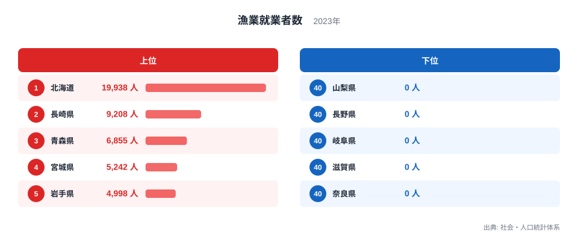
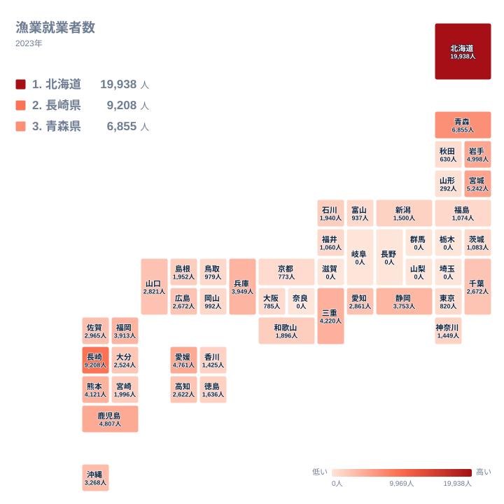

日本は都道府県ごとに気候も産業構造も大きく異なり、海と共に生きる県もあれば、海とはほとんど縁のない県もあります。2023年のデータを見ると、漁業就業者数は都道府県によって0人から19,938人まで大きな幅があり、単純な人口の多さだけでは説明できない偏りが浮かび上がります。この記事では、社会・人口統計体系による2023年の漁業就業者数のデータを使い、なぜ北海道が突出して多いのか、そしてなぜ8つの県で就業者数がゼロになるのかを、地理的な条件と産業の歴史から読み解いていきます。

> [!NOTE]
> 漁業就業者数は、満15歳以上で過去1年間に漁業の海上作業へ30日以上従事した人を数えた値です。漁船に乗って魚を獲る人だけでなく、ホタテやノリなどの養殖業で海上作業に従事する人も含まれています。

## 漁業就業者数の全国順位 - 北海道が圧倒的な理由

2023年の漁業就業者数で全国1位となったのは北海道です。19,938人という数値は、2位の長崎県の9,208人の2倍を超えており、単独の県としては突出した規模になっています。北海道は日本で最も長い海岸線を持つ都道府県のひとつで、オホーツク海、太平洋、日本海という性質の異なる3つの海に面しています。このため、サケ・マス漁、ホタテやコンブの養殖、ズワイガニ漁など、季節や海域によって異なる漁業が同時に営まれており、それぞれの漁業に従事する人の層が積み重なって全体の就業者数を押し上げていると考えられます。北海道の産業構造全体は[北海道のデータ](/areas/01000)で確認できます。

<source-link href="/ranking/fishery-workers">漁業就業者数ランキングをもっと見る</source-link>

上位10県を見渡すと、長崎県、青森県、宮城県、岩手県、鹿児島県、愛媛県、三重県、熊本県、兵庫県といった、いずれもリアス式海岸や多島海を抱える県が並んでいます。長崎県は9,208人で全国2位となっており、五島列島や壱岐・対馬など多数の離島を抱え、入り組んだ海岸線が沿岸漁業や養殖業に適した漁場を数多く生み出しています。詳しい統計は[長崎県のデータ](/areas/42000)で確認できます。青森県は6,855人で3位となっていて、太平洋側と日本海側の両方に漁港を持つ地理条件が、就業者数を押し上げる一因になっていると考えられます。

東北の太平洋沿岸に位置する宮城県は5,242人で4位、隣接する岩手県は4,998人で5位となっており、三陸沖の豊かな漁場を共有する2県が近い順位に並んでいる点も特徴的です。九州では鹿児島県が4,807人で6位、熊本県が4,121人で9位となっており、いずれも広大な内海である有明海や八代海、そして南西諸島に至る長い海岸線を持つ県です。四国からは愛媛県が4,761人で7位に入っており、瀬戸内海と太平洋の両方に漁場を持つ地理的な優位性がうかがえます。三重県は4,220人で8位、兵庫県は3,949人で10位となっており、こちらもリアス式海岸や瀬戸内海という漁業に適した地形を備えている県です。

## 内陸8県はなぜゼロになるのか

データをよく見ると、栃木県、群馬県、埼玉県、山梨県、長野県、岐阜県、滋賀県、奈良県の8県で漁業就業者数が0人となっています。この8県に共通しているのは、いずれも海に面していない内陸県だという点です。この指標が数えているのは満15歳以上で過去1年間に漁業の海上作業へ30日以上従事した人であるため、そもそも海での作業機会がない内陸県では就業者が発生しにくい構造になっています。

地図で全国を見渡すと、漁業就業者数は北海道と日本海・太平洋の沿岸部に色濃く分布し、内陸に向かうほど薄くなっていく様子がはっきりと確認できます。滋賀県は琵琶湖という日本最大の湖を抱えていますが、この指標が対象とするのはあくまで海上での作業であるため、湖での淡水漁業に従事する人はここには含まれません。同様に、埼玉県や群馬県のように大きな河川は流れていても海に面していない県では、そもそも海面漁業や海面養殖業に従事する人が発生しない構造になっています。

> [!WARNING]
> 0人という表記は、その県に漁業がまったく存在しないという意味ではありません。この指標は海上での漁業作業に従事した人を数えるものなので、内陸県で行われる河川や湖沼での淡水漁業の実態までは反映されていません。

内陸県のうち山梨県や長野県は標高が高い山岳地帯を抱える県でもあり、産業構造そのものが農業や製造業、観光業に軸足を置いています。こうした地理的な制約は、漁業以外の農林水産関連の指標でも同じ内陸8県が下位に並ぶ傾向として繰り返し現れる特徴です。関連する統計は[同じカテゴリの統計一覧](/category/agriculture)からまとめて確認できます。

## 沿岸産業の厚みが生む中位県の差

上位県と下位県の対比だけでなく、中位の県にも注目すると、沿岸部の産業構造の違いが見えてきます。静岡県は3,753人で12位、沖縄県は3,268人で13位となっており、いずれも観光業と漁業が共存する地域です。沖縄県は島しょ県という特性上、サンゴ礁沿岸でのモズク養殖など独自の漁業形態を持ち、就業者数においても一定の存在感を示しています。

一方で、大阪府は785人で36位、京都府は773人で37位と、近畿の大都市圏に位置する府県は、海に面していても漁業就業者数はそれほど多くありません。[仮説] 都市化が進んだ地域では沿岸部が港湾や工業地帯として利用されることが多く、漁業に従事する人の割合が相対的に小さくなっている可能性があります。ただし、この点は港湾利用や産業構造に関する別の統計と合わせて検証する必要があります。

> [!TIP]
> 漁業就業者数は都道府県の人口規模を調整していない実数です。人口が多い県ほど数値が大きくなりやすいため、県ごとの漁業への依存度を比べたいときは、人口10万人あたりに換算した指標と合わせて見ると、より公平な比較ができます。

## まとめ

- 1位は北海道で19,938人となっており、2位長崎県の9,208人を大きく上回っています
- 最下位グループは栃木県、群馬県、埼玉県、山梨県、長野県、岐阜県、滋賀県、奈良県の8県で、いずれも0人となっています
- 上位10県は北海道、東北、九州の沿岸部に集中しており、内陸に向かうほど数値が下がる地理的な傾向がはっきりと表れています
- 3位青森県、4位宮城県、5位岩手県のように、東北の太平洋沿岸の県が上位に連続して並んでいる点も特徴です
- 漁業就業者数は海上作業に従事した人を数える指標であり、内陸県の淡水漁業や観光業の実態は反映されていません

## データ出典

出典: 社会・人口統計体系（総務省統計局）。2023年のデータです。
