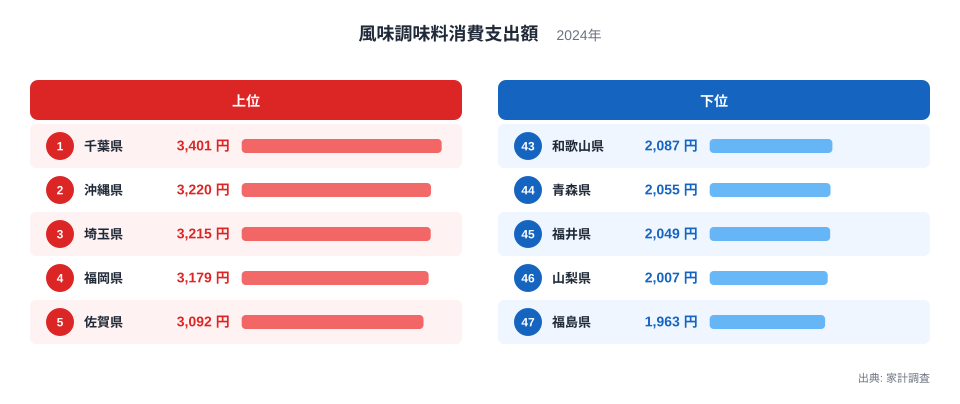
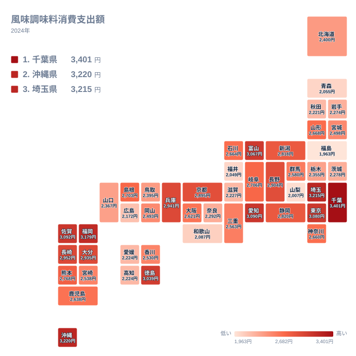

「ほんだし」や「白だし」のような風味調味料に、私たちは年間いくら使っているのでしょうか。総務省の家計調査によれば、都道府県庁所在市の2人以上世帯が風味調味料に使う金額は、地域によって大きな開きがあります。

風味調味料は、しょうゆやみそのような主要調味料とは別に集計される、だしのうま味を手軽に足せる加工調味料です。全国どこの台所でも見かける身近な商品ですが、どの地域で特によく買われているのかは、あまり知られていません。

このランキングを見ていくと、上位に九州の県がそろって並ぶという発見があります。1位と最下位だけを比べても見えてこない、地域のかたまりとしての傾向を、図とあわせて読み解いていきます。

## 風味調味料消費支出額の上位と下位

<source-link href="/ranking/flavor-seasoning-consumption-expenditure">風味調味料消費支出額ランキングをもっと見る</source-link>

上位を見ると、1位の千葉県は3401円で、2位の沖縄県は3220円、3位の埼玉県は3215円と続きます。4位には福岡県が3179円で入り、5位には佐賀県が3092円で入っています。6位の愛知県は3090円、7位の東京都は3080円、8位の富山県は3067円、9位の徳島県は3039円、10位の長崎県は2952円という結果からもわかるように、上位10県だけでも関東・九州・沖縄・中部・四国と、幅広い地方が入り混じっています。

一方の下位を見ると、47位の福島県は1963円で全国最少となっており、46位の山梨県が2007円、45位の福井県が2049円、44位の青森県が2055円、43位の和歌山県が2087円と続きます。1位の千葉県と47位の福島県を単純に比べると、3401を1963で割った約1.73倍という差が生まれています。

この上位と下位の顔ぶれを見比べると、上位グループには関東・九州・沖縄が混ざっているのに対し、下位グループは東北・北陸・近畿・甲信越にまたがっています。特定の地方だけが極端に低いのではなく、複数の地方に薄く分布していることがわかります。これは単一の要因ではなく、複数の生活習慣が積み重なって差を生んでいる可能性を示しています。

## 地理的にみる風味調味料消費の広がり

タイルマップで全国の分布を見ると、九州地方のまとまりが目を引きます。福岡県が4位、佐賀県が5位、長崎県が10位、大分県が12位、熊本県が17位、鹿児島県が23位、宮崎県が27位と、九州7県はいずれも上位から中位の範囲に収まっており、大きく下位に沈む県はありません。地方全体がそろって同じ傾向を示す指標は珍しく、九州における風味調味料の消費文化の根強さがうかがえます。

一方で下位の県は、東北の福島県や青森県、北陸の福井県、近畿の和歌山県、甲信越の山梨県というように、地図の上では飛び飛びに分布しています。同じ東北地方でも、20位の山形県は2668円と中位にあり、東北全体がそろって低いわけではありません。地理的な近さよりも、県ごとの食文化の違いのほうが強く効いていることを示す分布といえます。

## なぜ九州で消費額が高いのか

九州の郷土料理には、あごだしや豚骨、鶏がらといった、うま味の強いだしを土台にした料理が数多くあります。うどんやとんこつラーメン、雑煮のような汁物文化が根付いている地域では、家庭で手軽にうま味を足せる風味調味料の出番が多くなると考えられます。[仮説] このような食文化との結びつきは、家計調査の品目分類だけからは直接確認できないため、あくまで一つの見方として受け止めてください。

> [!NOTE]
> 風味調味料とは、家計調査の分類で「ほんだし」や「白だし」、顆粒だしなど、うま味を手軽に足せる加工調味料をまとめた区分です。しょうゆやみそなど他の調味料とは別に集計されています。数値は都道府県庁所在市に住む2人以上世帯を対象にした年間の支出額で、県全体を代表する値として扱われています。

ただし、千葉県が1位という結果は、九州の食文化だけでは説明がつきません。[仮説] 千葉県には大手食品メーカーの工場や物流拠点が集まっており、店頭での取り扱いのしやすさが支出額を押し上げている可能性があります。2位の沖縄県が独自のだし文化を持つ地域であることも、順位の一因かもしれません。いずれも、この統計だけから因果関係を断定できるものではありません。

> [!WARNING]
> この統計は家庭での購入額を集計したもので、飲食店で使われる業務用の風味調味料や、単身世帯の消費は含まれていません。また調査の対象は都道府県庁所在市に限られるため、同じ県の中でも地域によって実際の消費傾向は異なる可能性があります。

## 調味料全体の中での位置づけ

風味調味料は、しょうゆやみそ、砂糖といった基礎調味料とは異なり、それ自体でうま味を完成させる加工調味料です。基礎調味料の消費が家庭料理そのものの頻度と結びつきやすいのに対し、風味調味料の消費は、だし文化がどれだけ日常に根付いているかを映す指標だと考えられます。経済分野の[同じカテゴリの統計一覧](/category/economy)には、家計の消費支出に関するさまざまな指標が並んでおり、他の食品や調味料の支出額とあわせて確認すると、地域の食生活の全体像がより見えてきます。

> [!TIP]
> ここでの数値は消費した「量」ではなく「金額」です。高価格帯の商品を好む地域では、実際の使用量が少なくても支出額が押し上げられることがあります。量そのものを厳密に比較したい場合は、消費量に関する統計とあわせて確認するとよいでしょう。

上位県について詳しく知りたい場合は、[千葉県のデータ](/areas/12000)や[沖縄県のデータ](/areas/47000)を確認すると、それぞれの県が持つ他の食品支出の傾向もあわせてわかります。風味調味料だけでなく、県全体の食生活の特徴を知りたいときに役立ちます。

## まとめ

- 1位は千葉県で3401円、47位は福島県で1963円です。
- 1位と47位の差は約1.73倍です。
- 九州7県はいずれも上位から中位の範囲に収まっています。
- 下位は東北・北陸・近畿・甲信越に分散しており、単一の地方だけの傾向ではありません。
- 九州の食文化との結びつきは仮説であり、1位の千葉県には別の要因も考えられます。

## データ出典

- 出典: 総務省統計局 家計調査
- 対象年: 2024年
- 対象: 都道府県庁所在市の2人以上世帯
