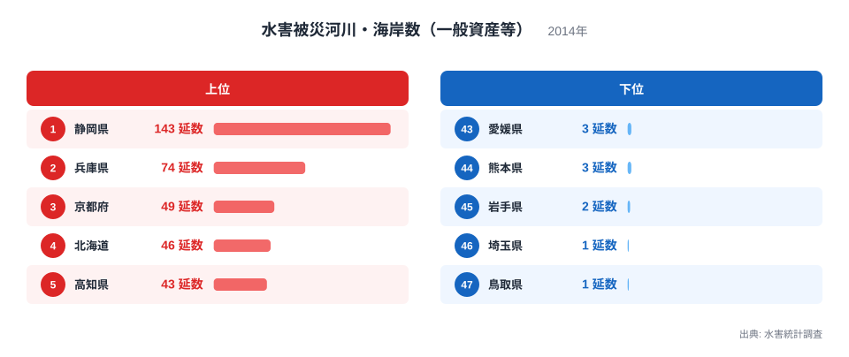
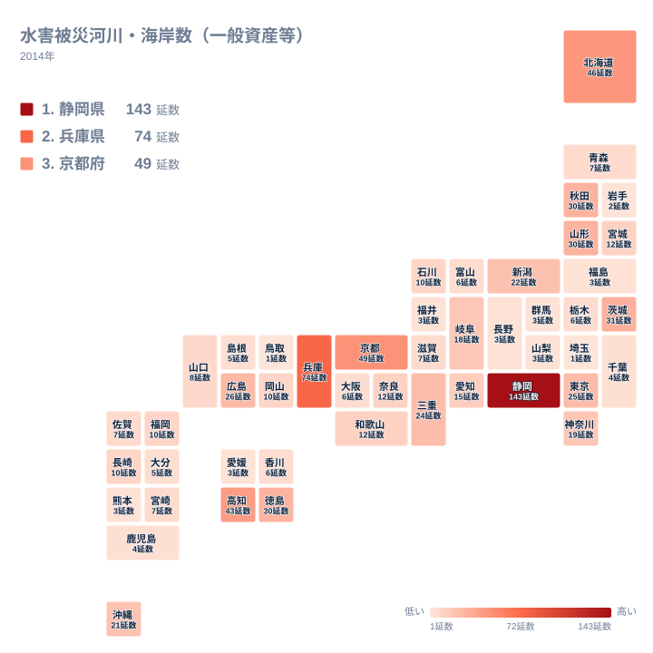

静岡県は水害被災河川・海岸数が143延数で全国1位です。一方、埼玉県と鳥取県はともに1延数で最下位となっています。同じ日本国内でも、水害の被害を受ける河川・海岸の数には140倍以上もの開きがあることになります。この記事では、都道府県別の水害被災河川・海岸数のデータをもとに、なぜこれほど大きな地域差が生まれるのかを見ていきます。

## 水害被災河川・海岸数の上位と下位

<source-link href="/ranking/flood-affected-rivers">水害被災河川・海岸数（一般資産等）ランキングをもっと見る</source-link>

水害被災河川・海岸数は静岡県が143延数で全国1位です。2位は兵庫県で74延数、3位は京都府で49延数、4位は北海道で46延数、5位は高知県で43延数となっています。上位には太平洋に面した県や、山地から海までの距離が短く急峻な河川を持つ地域が並んでいます。

下位を見ると、埼玉県と鳥取県がともに1延数で最下位です。45位は岩手県で2延数、41位から44位までは山梨県、長野県、愛媛県、熊本県がそろって3延数となっています。埼玉県は内陸県で海に面していないこと、鳥取県は日本海側に位置し台風の直撃を受けにくい地形であることが、被災数の少なさに関係していると考えられます。

静岡県が突出して多い背景には、太平洋沿岸に位置し台風の通り道になりやすいこと、急峻な地形から短く急流な河川が多いこと、そして海岸線が長く高潮や波浪の影響を受けやすいことが重なっていると考えられます。同様に兵庫県や京都府も、瀬戸内海と日本海の両方に面する複雑な地形を持ち、複数の水系が被災の対象になりやすい条件がそろっています。

## 地理分布で見る水害被災河川・海岸数

タイルマップで全国の分布を見ると、被災数の多い県が太平洋側や瀬戸内海周辺、そして北海道に散らばっていることが分かります。静岡県、高知県、徳島県といった太平洋に面した県は、台風の進路に当たりやすく、短時間に大量の雨が集中する傾向があります。北海道は面積が広く、河川の数自体が多いことも被災数に影響していると考えられます。

一方で、内陸に位置する埼玉県や、比較的降水量が安定している地域では被災数が少なくなっています。地図全体を俯瞰すると、海岸線の長さや台風の通過ルート、山地から海までの距離といった地形的な条件が、被災河川・海岸数の多寡と強く結びついていることが読み取れます。

> [!WARNING]
> このデータは2014年単年の記録であり、台風の進路や豪雨の発生地点は年によって大きく変動します。ある年に被災数が少ない県が、別の年には大きな被害を受ける可能性もあるため、この順位を「その県が水害に強い」と断定する根拠として使うことはできません。

## なぜこれほど大きな差が生まれるのか

水害被災河川・海岸数の地域差を生む要因は、大きく分けて3つ考えられます。1つ目は台風の進路です。太平洋側を北上する台風は、静岡県や高知県、徳島県といった県を直撃しやすく、短時間に集中的な降雨をもたらします。2つ目は地形です。山地が海岸に迫る急峻な地形を持つ県では、河川が短く急流になりやすく、豪雨時に急激に増水しやすい傾向があります。3つ目は海岸線の長さと形状です。複雑に入り組んだ海岸線を持つ県では、高潮や波浪の影響を受ける区間が長くなります。

これに対して、埼玉県のような内陸県は海からの高潮や波浪の影響を受けず、河川の氾濫だけが水害の要因になります。鳥取県のように台風の主要な進路から外れやすい日本海側の県も、被災数が少なくなる傾向があります。

> [!TIP]
> 水害の地域差を読み解くときは、被災数だけでなく被災した際の資産規模や人口密度もあわせて確認すると、より実態に近い理解につながります。被災河川・海岸数が少ない県でも、一度の水害で大きな被害が出るケースもあるため、数の多寡だけで安全性を判断しないことが大切です。

## まとめ

水害被災河川・海岸数は都道府県によって最大143倍もの差がある指標です。静岡県が143延数で全国1位、兵庫県が74延数で2位、京都府が49延数で3位となる一方、埼玉県と鳥取県はともに1延数で最下位となっています。

> [!NOTE]
> このデータの単位は「延数」で、1つの河川や海岸で複数回被災した場合はその回数分が積み上げられて集計されています。単純な被災箇所数とは異なる点に注意が必要です。

太平洋に面し台風の進路に当たりやすい県、急峻な地形を持つ県、海岸線が長い県ほど被災数が多くなる傾向があり、逆に内陸県や台風の主要進路から外れる県では少なくなる傾向が見られます。地形と気象条件という2つの要因が、この大きな地域差を生み出していると言えます。

さらに詳しいデータを確認したい場合は、[同じカテゴリの統計一覧](/category/safetyenvironment)もあわせてご覧ください。上位にランクインした[静岡県のデータ](/areas/22000)や[兵庫県のデータ](/areas/28000)では、他の統計との関係もさらに詳しく見ることができます。

## データ出典

水害被災河川・海岸数（一般資産等）は水害統計調査の2014年データを使用しています。
