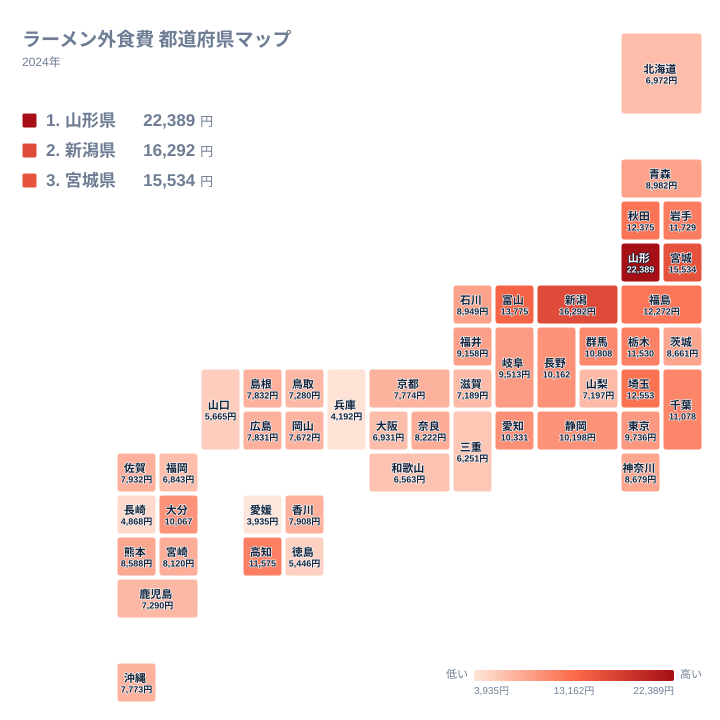
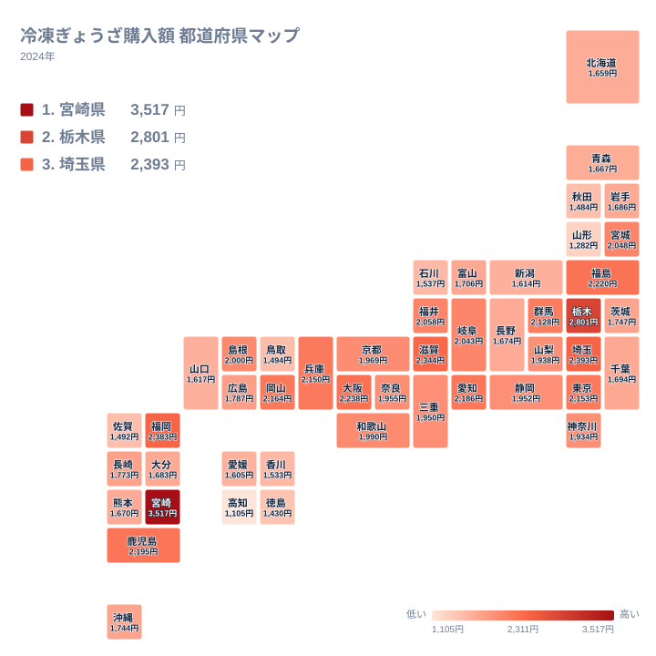
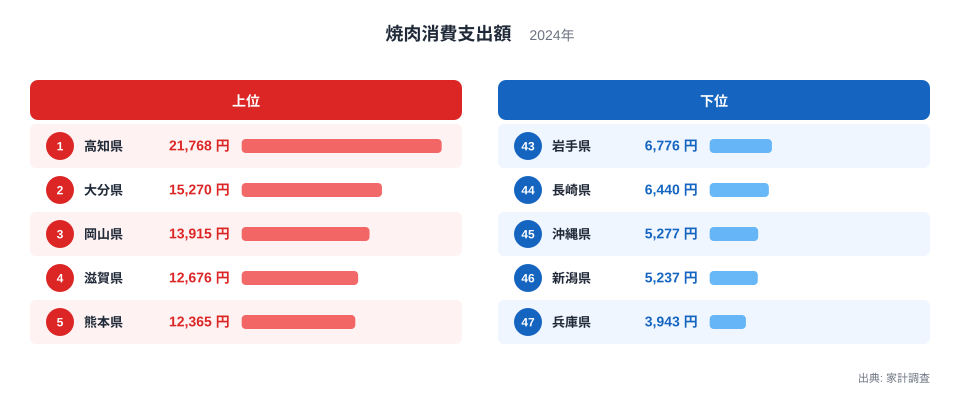
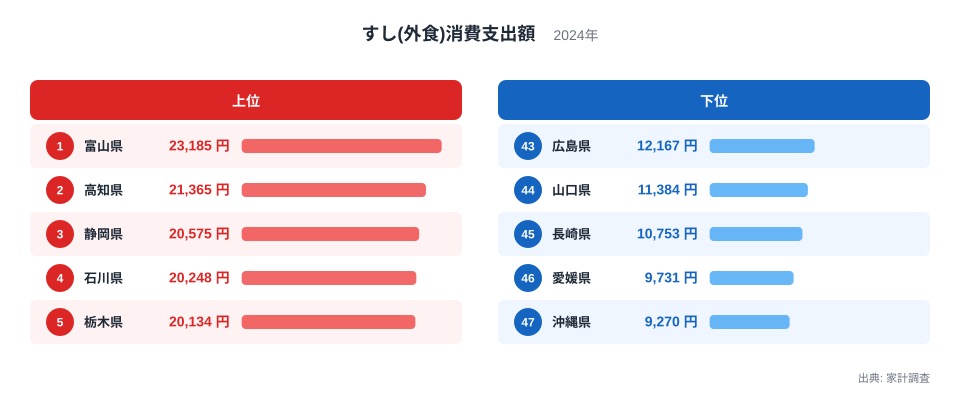
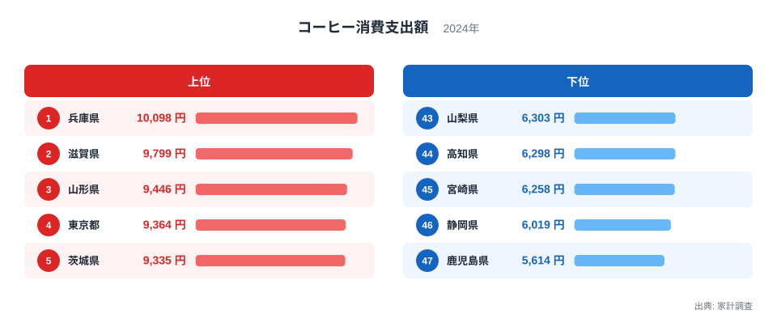
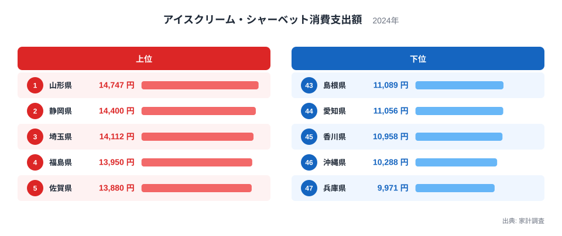
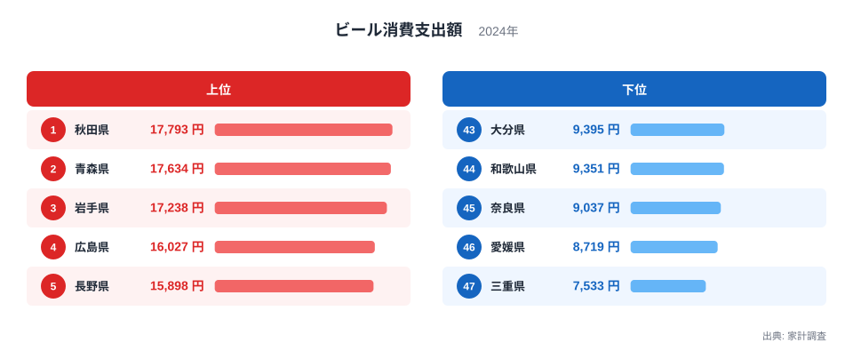
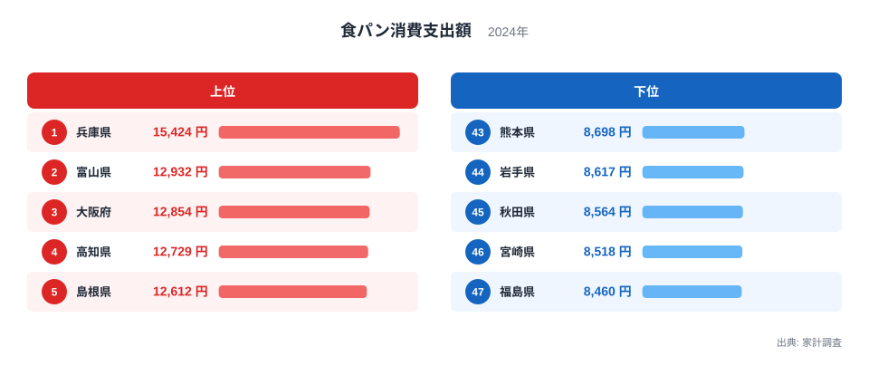
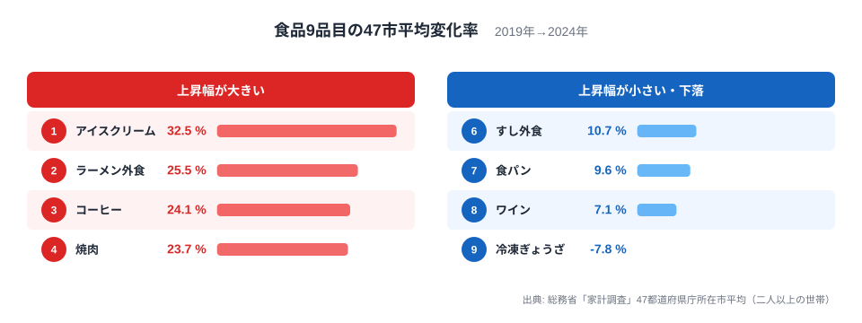

「ラーメンといえば山形」「ぎょうざといえば宇都宮」──食べものの話題になると、必ず出てくるのが都道府県ごとの"食の個性"です。

総務省「家計調査」の2024年データを使い、ラーメン外食・冷凍ぎょうざ・焼肉・すし外食・コーヒー・アイスクリーム・ビール・ワイン・食パンの**9品目**について、都道府県庁所在市の支出額ランキングを徹底比較しました。ただし「消費量日本一」という言葉が指す中身は、品目によって集計のルールがまったく違います。まずはそこから確認しましょう。

> [!WARNING]
> 家計調査の都道府県別データは、実は「県全体」ではなく**県庁所在市（例: 宮崎の場合は宮崎市）に住む二人以上世帯**だけを対象にした調査です。さらに品目ごとに集計範囲が異なります。冷凍ぎょうざは**持ち帰り（冷凍・調理済み）で購入した金額のみ**が対象で、店内で食べた分は「外食」に別区分されこの値には含まれません。逆にラーメン・すし・焼肉は最初から**外食としての支出額**を集計しています。「ぎょうざの街」を名乗る都市同士を比べるときも、内食（持ち帰り）と外食のどちらの数字かを混同すると順位の意味を取り違えます。

## ラーメン vs ぎょうざ（都道府県タイルマップ対決）

2つのタイルマップを並べると、ラーメン（統計上は「中華そば消費支出額」として集計）とぎょうざ（同「ぎょうざ消費支出額」）の**地域分布が正反対**であることが見えてきます。

### ラーメン外食（中華そば消費支出額）──東北・北陸が上位を占める

<source-link href="/ranking/ramen-dining-consumption-expenditure">ラーメン外食費ランキングをもっと見る</source-link>

**山形県が年間22,389円**で断トツの1位です。2位の新潟は16,292円で、山形との差は6,000円以上あります。47都道府県庁所在市の単純平均（以下「47市平均」）は9,205円なので、山形は**2.4倍**を支出している計算です。3位は宮城、4位は富山、5位は埼玉と続き、寒冷地での温かい外食需要に加え、各地に根づいたご当地ラーメン文化の影響が大きいと考えられます。

一方、最下位は47位の愛媛県で3,935円です。46位の兵庫県は4,192円、45位の長崎県は4,868円と続き、**西日本は軒並み低い傾向**です。うどんや長崎ちゃんぽんなど、ラーメン以外の麺文化が強い地域と重なります。

地図で見ると、東北5県（山形・宮城・秋田・福島・岩手）と北陸の新潟・富山、さらに関東北部の埼玉・栃木・群馬までが濃い色でひとつながりになっており、寒冷地から関東平野にかけて外食ラーメン文化が地続きに広がっていることがわかります。この帯から外れる例外は高知で、東北・北陸勢ではないのに上位10県入りしています。逆に西日本は山口・徳島・長崎・兵庫・愛媛が下位5県としてまとまって固まっています。東京は17位、隣接する埼玉は5位とは対照的に中位にとどまっており、単純な都市規模だけでは順位を説明できません。

### 冷凍ぎょうざ（ぎょうざ消費支出額）──宮崎が4年連続で首位を堅守

<source-link href="/ranking/gyoza-frozen-consumption-expenditure">冷凍ぎょうざ購入額ランキングをもっと見る</source-link>

冷凍ぎょうざの購入額は**宮崎県が3,517円**で、2021年から4年連続の1位です。2位の栃木は2,801円で、大きく引き離しています。

ぎょうざの地図はラーメンとは対照的に、上位県が特定の地方にかたまっていません。1位宮崎（九州）、2位栃木（北関東）、3位埼玉（南関東）、4位福岡（九州）、5位滋賀（近畿）と、九州・関東・近畿にまたがって点在しており、地理的な連続性よりも都市ごとの購入習慣の違いが表れているとみられます。逆に下位は徳島・秋田・佐賀・鳥取など地方が目立ちますが、これも東西や気候で明確に分かれているわけではありません。

注目は**山形県が冷凍ぎょうざでは46位**で、購入額は1,282円にとどまるという点です。ラーメン外食1位の県がぎょうざではほとんど買わない──まさに「食の個性」の鮮やかな対比です。宮崎市は近年「ぎょうざ消費量日本一」の座をめぐって宇都宮市・浜松市としのぎを削っており、その勢いは冷凍食品にも波及しているといえるでしょう。

> [!TIP]
> 「餃子の街」として有名な栃木県（宇都宮）は冷凍ぎょうざで2位、ラーメン外食でも10位と、両方で上位に入る珍しい県です。ただし同じ北関東でも群馬はラーメン12位・ぎょうざ13位とやや控えめで、茨城はラーメン23位・ぎょうざ27位とどちらも中位以下にとどまり、北関東全体を『食いしん坊エリア』と呼ぶのは栃木単独の結果を一般化しすぎです。

## 焼肉・すし外食・コーヒー・アイスクリーム対決

ここまでのラーメン・ぎょうざに続き、4品目のランキングを見ていくと、それぞれ顔ぶれがまったく異なることがわかります。ただしすべてが安定した1位というわけではありません。焼肉の高知は直近5年連続で首位を守る安定した強さがある一方、すし外食の富山とコーヒーの兵庫は2024年になって初めて首位へ躍り出た品目です。

> [!NOTE]
> 家計調査の都道府県庁所在市データは対象世帯数が限られるため、年によって順位が大きく変わることがあります。単年の首位だけを見て「その県ならではの食文化」と決めつけず、複数年の傾向とあわせて読むことをおすすめします。

### 焼肉──高知が驚きの1位

<source-link href="/ranking/yakiniku-consumption-expenditure">焼肉消費支出額ランキングをもっと見る</source-link>

焼肉の支出額1位は**高知県で21,768円**です。2020年から5年連続で首位を守っており、単年だけの結果ではありません。47市平均は9,277円なので2.3倍にあたり、2位の大分は15,270円で6,000円以上の大差をつけています。高知は「返杯文化」で知られる宴会好きの県として有名ですが、焼肉外食でもその豪快さが数字に表れています。3位岡山・4位滋賀・5位熊本と、上位5県はすべて西日本で、**焼肉は西高東低**の傾向が鮮明です。最下位47位の兵庫は3,943円でした。

### すし外食（すし(外食)消費支出額）──富山が初の首位

<source-link href="/ranking/sushi-dining-consumption-expenditure">すし外食消費支出額ランキングをもっと見る</source-link>

すし外食では**富山県が23,185円**で2024年の1位です。ただし富山が首位に立ったのは今回が初めてで、毎年の常連というわけではありません。富山湾のブリ・白エビ・ホタルイカなど新鮮な海の幸に恵まれ、回転寿司のレベルが高いことでも知られる土地柄ではありますが、単年の記録だけで「すし処」と決めつけるのは早計です。2位の高知は21,365円で僅差に迫り、焼肉に続きすしでも上位に入るなど、外食全体への支出の高さがうかがえます。3位静岡・4位石川・5位栃木と続きます。

### コーヒー──兵庫が初めての1位

<source-link href="/ranking/coffee-consumption-expenditure">コーヒー消費支出額ランキングをもっと見る</source-link>

コーヒー購入額1位は**兵庫県で10,098円**です。ただし兵庫が首位に立ったのは2024年が初めてで、神戸のコーヒー文化だけで説明できる安定した結果ではありません。2位の滋賀は9,799円、3位の山形は9,446円と続き、4位は東京、5位は茨城でした。山形もコーヒーでは順位の変動が大きく、今回の3位も含め毎年の定位置というわけではありません。近畿勢と首都圏勢がそろって上位に入っている点は興味深いものの、単年の結果として読むのが適切です。

### アイスクリーム──山形が僅差でトップ

<source-link href="/ranking/icecream-consumption-expenditure">アイスクリーム消費支出額ランキングをもっと見る</source-link>

アイスクリーム（統計上は「アイスクリーム・シャーベット消費支出額」）1位も**山形県で14,747円**でした。2位の静岡は14,400円、3位の埼玉は14,112円で、いずれも夏の猛暑で知られる県ですが、山形との差は2.4%・4%以内と小さく、突出した強さとまでは言えません。山形は過去にも1位になったことがある一方で中位まで順位を落とした年もあり、毎年安定して首位というわけではないため、「ラーメンに続く2冠」と言い切るには注意が必要です。夏の暑さが厳しい内陸盆地の気候はアイス消費を後押しする一因と考えられますが、これも複数年のデータで裏づける必要があります。

<ad-slot></ad-slot>

## ビール・ワイン・食パン対決

残る3品目も見てみましょう。お酒とパンという毛色の違うジャンルですが、地域性のくっきりした対比が見えてきます。

### ビール──東北勢がそろって上位に

<source-link href="/ranking/beer-consumption-expenditure">ビール消費支出額ランキングをもっと見る</source-link>

ビールの支出額1位は**秋田県で17,793円**でした。2位青森17,634円、3位岩手17,238円と、東北勢が上位3県を占めています。秋田が1位になったのは2024年が初めてで（2021年20位・2022年19位）、青森・岩手も含め年によって順位の変動は大きいのですが、2024年は3県そろって上位に入りました。長い冬に家庭で晩酌する文化が根強いことに加え、夏場の消費も大きいとみられます。4位は広島16,027円、5位は長野15,898円と続きます。最下位47位は三重県で7,533円、46位愛媛8,719円、45位奈良9,037円でした。

### ワイン──首都圏vs地方の対照

<source-link href="/ranking/wine-consumption-expenditure">ワイン消費支出額ランキングをもっと見る</source-link>

ワインは**東京都が8,116円**で1位、2位埼玉7,143円、3位千葉6,057円と、ビールとは対照的に首都圏勢が上位を占めます。東京は過去10年以上にわたって1位か2位を維持しており、ワインでは安定した強さを見せています。4位熊本5,857円、5位福岡5,570円と、地方にも高消費県が点在しており、食文化の都市集中だけでは説明しきれない広がりがあります。最下位47位は徳島県で1,205円でした。

### 食パン──兵庫が長年の定位置

<source-link href="/ranking/white-bread-consumption-expenditure">食パン消費支出額ランキングをもっと見る</source-link>

食パンは**兵庫県が15,424円**で1位です。2位富山12,932円との差は2,500円以上あり、突出した強さです。兵庫は食パンで2011年以降の14年中11回1位となっており、今回初めて首位に立ったコーヒーとは対照的な、長年の定位置です。神戸のパン食文化が背景にあるとみられます。3位大阪12,854円、4位高知12,729円、5位島根12,612円と続き、最下位47位は福島県で8,460円でした。

## 物価高の影響：2019年と2024年の比較

<data-source url="https://www.e-stat.go.jp/stat-search/files?page=1&toukei=00200561" label="総務省「家計調査」" year="2019年・2024年"></data-source>

2019年から2024年の5年間で、9品目中8品目の47市平均支出額が**増加**しました。物価上昇と外食単価の値上がりが背景にあります。図には上昇幅が大きい4品目と、上昇幅が小さい（または下落した）4品目を並べています。中間にあたるビール（+18.0%、10,788円→12,730円）はどちらの枠にも入りませんが、他の品目と同じく明確な増加傾向です。

### アイスクリーム：5年で32.5%増

最大の伸びは**アイスクリーム（+32.5%）**です。9,471円から12,549円へ、3,000円以上の増加です。猛暑の常態化に加え、高価格帯アイスの定着が支出額を押し上げました。

### ラーメン・コーヒー・焼肉：外食費の上昇幅が大きい

ラーメン外食（+25.5%）、コーヒー（+24.1%）、焼肉（+23.7%）も大きく伸びています。原材料費・人件費の上昇が外食メニューの値上がりに直結しており、「1杯1,000円超」が珍しくなくなったラーメンの価格帯の変化が数字に表れています。

### 唯一のマイナス：冷凍ぎょうざ

**冷凍ぎょうざだけが-7.8%**と減少しました（2,063円→1,902円）。冷凍食品全体の値上げが進む中、ぎょうざは競争が激しく単価が抑えられている一方で、購入個数の減少も影響しているとみられます。手作りぎょうざブームやチルド惣菜ぎょうざへのシフトも一因かもしれません。

> [!NOTE]
> 家計調査の支出額は「価格 × 数量」の結果です。支出額の増加は、価格上昇だけでなく消費量の増加を含む場合があります。特にアイスクリームは猛暑による消費量増と高価格帯シフトの両方が寄与しています。

## 地理と食文化からみる「食の県民性」

家計調査の食品データを都道府県ごとに読んでいくと、「1位はどこか」だけでなく、食の好みが日本列島の中でどう分かれるかという構造も見えてきます。たとえば魚介類の消費支出では、太平洋側・東日本ではまぐろやさけ、日本海側・西日本ではぶりやさばといったように、地理的な線に沿って好みが分かれることが知られています。

今回のラーメンと焼肉の分布にも似た構図があります。寒冷な東北・北陸でラーメン外食が伸び、温暖な高知・大分・岡山で焼肉が伸びるのは、気候だけでなく「その土地でどう食べられてきたか」という消費地側の歴史が積み重なった結果と考えられます。**産地に近いからその食品を多く消費するとは限らず**、むしろ消費地としての文化が定着した地域ほど支出が伸びるという見方もできるでしょう。冷凍ぎょうざの1位が「餃子の街」宇都宮ではなく宮崎である点も、産地・発祥地と現在の消費地が一致するとは限らないことを示す一例です。

## 意外な「食の1位」

ここまでのデータから浮かび上がった「食の1位」には、**定番の結果**（山形のラーメン・高知の焼肉・宮崎の冷凍ぎょうざ・兵庫の食パン）と**単年の結果を含む意外な結果**（富山のすし・兵庫のコーヒー・山形のアイスクリーム）が混在しています。冷凍ぎょうざの首位県が宇都宮・浜松ではなく宮崎である点も、定番の中ではやや意外な組み合わせです。

**山形県はラーメンで安定した強さを持ちながら、アイスクリーム・コーヒーでも上位に食い込んでおり**、「食にお金をかける県」としての存在感が際立ちます。ただしアイスクリームとコーヒーは2024年に順位を大きく上げた結果である点には注意が必要です。一方、**高知県は焼肉・すし外食（2位）**で上位に顔を出し、外食全体に積極的な県民性がうかがえます。焼肉は5年連続の首位である一方、すしは2020年に1位、2023年は21位と年による振れが大きい品目です。

ビール・ワイン・食パンの結果は前セクションで見た通りで、ビールは東北勢、ワインは首都圏勢と地域の傾向がくっきり分かれる一方、食パンは兵庫が長年の定位置という安定した結果でした。

## まとめ

2024年の家計調査から、食品9品目の「県民性」を比較しました。

- **ラーメン外食は山形が1位**。47市平均の2.4倍を支出し、2位に6,000円差をつける圧勝。西日本は消費が少ない
- **冷凍ぎょうざは宮崎が4年連続で首位**を堅守。ラーメン1位の山形はぎょうざ46位という対照的な構図
- **焼肉は高知が47市平均の2.3倍で5年連続の1位**。西日本が上位を占める
- **すし外食・コーヒーは2024年に初めて首位が入れ替わった品目**（富山・兵庫）。年による変動が大きく、単年の結果として読む必要がある
- **アイスクリームは5年で32.5%増**と最大の伸び。猛暑と高級路線が要因
- **冷凍ぎょうざだけが唯一のマイナス**（-7.8%）

「何を食べるか」は、気候・地理・歴史的な食文化が複雑に絡み合って決まります。ただし単年のランキングだけでは県民性を語りきれない品目もあるため、複数年のデータとあわせて読むことをおすすめします。あなたの出身地は、どの品目で上位に入っていたでしょうか。

## データ出典

本記事のデータは総務省「家計調査」（都道府県庁所在市、二人以上の世帯）をe-Stat（政府統計の総合窓口）経由で取得し、加工・作成しています。

食の地域性の詳細は、ラーメン1位の[山形県](/areas/06000)や焼肉1位の[高知県](/areas/39000)のエリアプロフィールで確認できます。すし外食1位の[富山県](/areas/16000)も参照ください。
