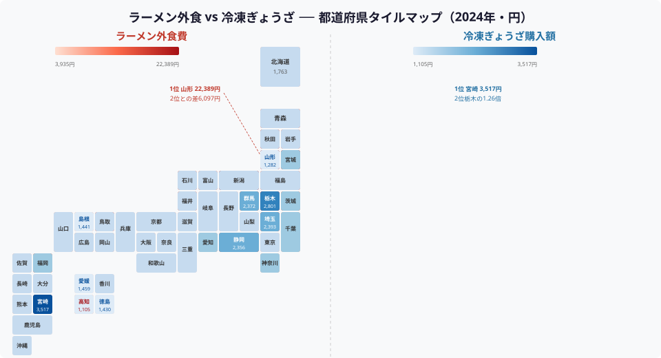
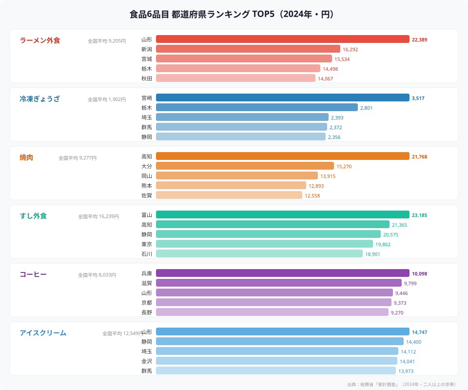
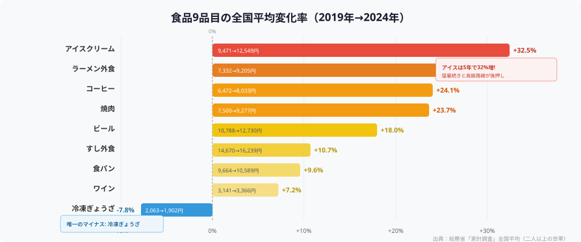

「ラーメンといえば山形」「ぎょうざといえば宇都宮」──食べものの話題になると、必ず出てくるのが都道府県ごとの"食の個性"です。

総務省「家計調査」の2024年データを使い、ラーメン外食・冷凍ぎょうざ・焼肉・すし外食・コーヒー・アイスクリーム・ビール・ワイン・食パンの**9品目**について、47都道府県の支出額ランキングを徹底比較しました。タイルマップやランキングチャートで「食の県民性」を可視化します。

## ラーメン vs ぎょうざ（タイルマップ対決）

<data-source url="https://www.e-stat.go.jp/stat-search/files?page=1&toukei=00200561" label="総務省「家計調査」" year="2024年"></data-source>

2つのタイルマップを並べると、ラーメンとぎょうざの**地域分布が正反対**であることが見えてきます。

### ラーメン外食──東北が圧倒的

**山形県が年間22,389円**で断トツの1位。2位・新潟（16,292円）との差は6,000円以上で、全国平均（9,205円）の**2.4倍**を支出しています。上位5県のうち4県を東北・北関東が占めるのは、寒冷地での温かい外食需要に加え、各地に根づいたご当地ラーメン文化の影響が大きいでしょう。

一方、最下位は愛媛県（3,935円）。兵庫県（4,192円）、長崎県（4,868円）と続き、**西日本は軒並み低い傾向**です。うどんや長崎ちゃんぽんなど、ラーメン以外の麺文化が強い地域と重なります。

### 冷凍ぎょうざ──宮崎が1位を堅守

冷凍ぎょうざの購入額は**宮崎県が3,517円**で堂々の1位。2位・栃木（2,801円）を大きく引き離しています。宮崎市は近年「ぎょうざ消費量日本一」の座をめぐって宇都宮市・浜松市としのぎを削っており、その勢いは冷凍食品にも波及しています。

注目は**山形県が冷凍ぎょうざではワースト2位**（1,282円）という点。ラーメン外食1位の県がぎょうざではほとんど買わない──まさに「食の個性」の鮮やかな対比です。

> [!TIP]
> 「餃子の街」として有名な栃木県（宇都宮）は冷凍ぎょうざ2位ですが、ラーメン外食でも4位にランクイン。北関東は外食・内食ともに消費が旺盛な「食いしん坊エリア」です。

## 食品6品目のランキング TOP5

<data-source url="https://www.e-stat.go.jp/stat-search/files?page=1&toukei=00200561" label="総務省「家計調査」" year="2024年"></data-source>

6品目のTOP5を並べてみると、各品目で顔ぶれがまったく異なることがわかります。

### 焼肉──高知が驚きの1位

焼肉の支出額1位は**高知県（21,768円）**。全国平均（9,277円）の2.3倍で、2位・大分（15,270円）にも6,000円以上の大差をつけています。高知は「返杯文化」で知られる宴会好きの県として有名ですが、焼肉外食でもその豪快さが数字に表れています。上位5県中4県が西日本で、**焼肉は西高東低**の傾向が鮮明です。

### すし外食──富山がトップ

すし外食では**富山県（23,185円）**が1位。富山湾のブリ・白エビ・ホタルイカなど新鮮な海の幸に恵まれ、回転寿司のレベルが高いことでも知られます。2位の高知（21,365円）は焼肉に続きすしでも上位に入り、「食にお金を惜しまない県」としての存在感を示しています。

### コーヒー──兵庫が1位の理由

コーヒー購入額1位は**兵庫県（10,098円）**。神戸は日本のコーヒー輸入発祥の地のひとつであり、老舗喫茶店が多く残る喫茶文化の街です。2位の滋賀（9,799円）、4位の京都（9,373円）と関西勢が上位に並ぶのも、喫茶文化圏の広がりを反映しています。

### アイスクリーム──山形はラーメンだけじゃない

アイスクリーム1位も**山形県（14,747円）**。ラーメンに続く2冠達成です。夏の暑さが厳しい内陸盆地の気候がアイス消費を後押ししているとみられます。3位の埼玉（14,112円）、5位の群馬（13,973円）も夏の猛暑で知られる県です。

<ad-slot></ad-slot>

## 物価高の影響：2019年と2024年の比較

<data-source url="https://www.e-stat.go.jp/stat-search/files?page=1&toukei=00200561" label="総務省「家計調査」" year="2019年・2024年"></data-source>

2019年から2024年の5年間で、9品目中8品目の全国平均支出額が**増加**しました。物価上昇と外食単価の値上がりが背景にあります。

### アイスクリーム：5年で32%増

最大の伸びは**アイスクリーム（+32.5%）**。9,471円から12,549円へ、3,000円以上の増加です。猛暑の常態化に加え、ハーゲンダッツをはじめとする高価格帯アイスの定着が支出額を押し上げました。

### ラーメン・焼肉：外食費の上昇幅が大きい

ラーメン外食（+25.5%）、焼肉（+23.7%）も大きく伸びています。原材料費・人件費の上昇が外食メニューの値上がりに直結しており、「1杯1,000円超」が珍しくなくなったラーメンの価格帯の変化が数字に表れています。

### 唯一のマイナス：冷凍ぎょうざ

**冷凍ぎょうざだけが-7.8%**と減少しました（2,063円→1,902円）。冷凍食品全体の値上げが進む中、ぎょうざは競争が激しく単価が抑えられている一方で、購入個数の減少も影響しているとみられます。手作りぎょうざブームやチルド惣菜ぎょうざへのシフトも一因かもしれません。

> [!NOTE]
> 家計調査の支出額は「価格 × 数量」の結果です。支出額の増加は、価格上昇だけでなく消費量の増加を含む場合があります。特にアイスクリームは猛暑による消費量増と高価格帯シフトの両方が寄与しています。

## 意外な「食の1位」

ここまでのデータから浮かび上がった「食の1位」には、**定番の結果**（山形のラーメン・富山のすし・秋田のビール）と**意外な結果**（高知の焼肉・山形のアイスクリーム・兵庫のコーヒーと食パン）が混在しています。宮崎の冷凍ぎょうざ首位も、宇都宮・浜松ではなく宮崎という点でやや意外です。

**山形県はラーメン・アイスクリーム・コーヒー（3位）と複数品目で上位**に入り、「食にお金をかける県」としてのポジションが際立ちます。一方、**高知県は焼肉・すし（2位）・ビール（5位）**で上位に顔を出し、外食全般に積極的な県民性がうかがえます。

ビールの上位は秋田・青森・岩手・山形と**東北勢が4県独占**。長い冬に家庭で晩酌する文化が根強いことに加え、夏場の消費も大きいとみられます。対照的に**ワインは東京・埼玉・千葉・神奈川と首都圏が上位4県を独占**──食文化の都市集中が顕著です。

<ad-slot></ad-slot>

## まとめ

2024年の家計調査から、食品9品目の「県民性」を比較しました。

- **ラーメン外食は山形が2位に6,000円差の圧勝**、西日本は消費が少ない
- **冷凍ぎょうざは宮崎が首位**を堅守。ラーメン1位の山形はぎょうざワースト2位という対照的な構図
- **焼肉は高知が全国平均の2.3倍**で1位。西日本が上位を占める
- **アイスクリームは5年で32%増**と最大の伸び。猛暑と高級路線が要因
- **冷凍ぎょうざだけが唯一のマイナス**（-7.8%）

「何を食べるか」は、気候・地理・歴史的な食文化が複雑に絡み合って決まります。あなたの出身地は、どの品目で上位に入っていたでしょうか。

## データ出典

本記事のデータはe-Stat（政府統計の総合窓口）を基に作成しています。

本記事の対象データ: [関連カテゴリ](/category/economy)

食の地域性の詳細は、ラーメン1位の[山形県](/areas/06000)や焼肉1位の[高知県](/areas/39000)のエリアプロフィールで確認できます。すし消費1位の[富山県](/areas/16000)も参照ください。
