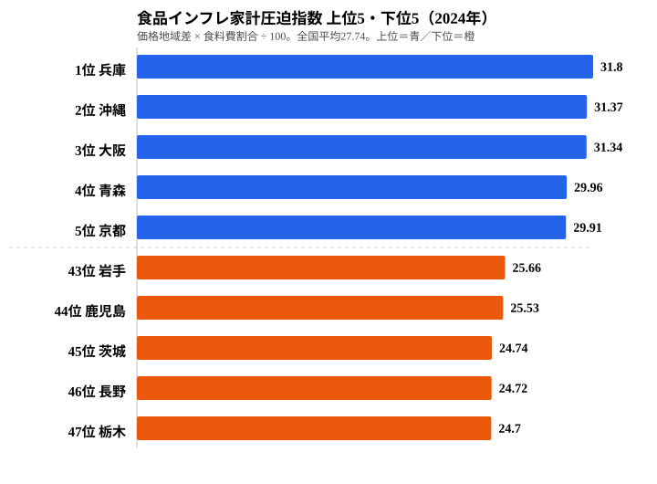

2024年の食品値上げは全国に広がりましたが、**「家計の何割を食料が奪うか」は県によって大きく違います**。総務省「小売物価統計調査」の食料価格地域差指数では、最も高い沖縄106.7と最も安い長野95.8で約11ポイントの差があります。ところが、価格が高いことと家計が苦しいことは必ずしも一致しません。そこで価格に家計調査の食料費割合（広義のエンゲル係数）を掛け合わせると、**兵庫・沖縄・大阪が「食品インフレで家計が最も圧迫される県」**として浮かび上がってきます。

この記事では、**価格の地域差と支出比率を組み合わせた「食品インフレ家計圧迫指数」**を独自に計算し、47都道府県のうち誰が一番打撃を受けているのか、そして圧迫の原因が「価格」なのか「比率」なのかを切り分けて可視化していきます。結論を先に言えば、上位の兵庫と沖縄では圧迫の正体がまったく違います。

> [!NOTE]
> 食品インフレ家計圧迫指数 ＝ 食料価格地域差指数 × 食料費割合 ÷ 100。価格が高く、かつ食料費が家計に占める割合が大きい県ほど食品インフレの影響を強く受ける、という考え方に基づく独自指標です。全国平均は27.74。両指標とも2024年の公式統計から計算しているため再現できます。

## 食料価格地域差――沖縄が突出する約11ポイント差

<ad-slot></ad-slot>

まず食料品の物価水準だけで見たランキングです。**最も高いのは沖縄県の106.7**で、離島輸送コストと観光地需要が価格を押し上げています。意外なのは、2位の東京都103.0に続いて、島根県と福井県（同率3位102.5）が割って入る構造でしょう。日本海側の冬季物流コストが効いているとみられます。

最も食料が安いのは**長野県95.8**です。県内農産物の流通比率が高く、消費者物価全体（96.7）よりさらに食料が安い県になっています。群馬96.0、茨城97.4と関東北部から続く「**首都圏供給帯**」が低価格帯を形成しています。価格水準の全県分布は[食料価格地域差指数の都道府県ランキング](/ranking/consumer-price-difference-index-food)で見られます。

ただし、価格だけを見ても家計への打撃は測れません。重要なのは「**支出のうち食料がどれだけを占めるか**」という比率です。

## 食料費割合――兵庫の31.8%という構造的な重さ

家計調査（二人以上世帯）の食料費割合、いわゆる広義のエンゲル係数を見ると、**最も高いのは兵庫県の31.8%**です。手取り収入のうち約3分の1が食費に消える計算になります。2位大阪31.5%、3位青森30.7%と続き、最も低いのは栃木の25.2%で、最上位との差は6.6ポイントにのぼります。

ここで重要なのは、**兵庫の食料価格地域差は100.0（ほぼ全国平均）**だという点です。価格が突出しているわけではなく、**家計構造そのものが食費に重い県**ということになります。神戸の食文化（パン消費が日本一）や、近畿圏の外食・中食の習慣が背景にあると考えられます。県別の食料費割合の全体像は[食料費割合の都道府県ランキング](/ranking/food-expenditure-ratio-multi-person-households)で確認できます。

<source-link href="/ranking/food-expenditure-ratio-multi-person-households">食料費割合の全国ランキングをもっと見る</source-link>

> [!WARNING]
> ここでの食料費割合は、家計調査の「食料費 ÷ 消費支出」をもとにしています。総務省統計局が発表する狭義のエンゲル係数とは集計範囲が若干異なるため、報道で見かける数値と微妙にずれる場合があります。順位の傾向を読むための目安として捉えてください。

## 食品インフレ家計圧迫指数――兵庫と沖縄の二強

価格と比率を組み合わせた**食品インフレ家計圧迫指数**で47都道府県をランキングすると、構造がさらに鮮明になります。

<source-link href="/ranking/consumer-price-difference-index-food">食料価格地域差指数の全国ランキングをもっと見る</source-link>

**上位は兵庫31.80・沖縄31.37・大阪31.34**で、全国平均27.74を大きく上回ります。下位は栃木24.70・長野24.72・茨城24.74で、上位との差は約7ポイントにひらきます。仮に食品インフレが10%進んだ場合、兵庫の世帯は栃木の世帯より1人当たり年間で数万円規模の追加負担を背負う構造になります。

兵庫と沖縄では「圧迫の原因」がまったく違います。

- **兵庫型（価格平均・比率高）**: 食料価格は全国平均並みですが、家計に占める食料費が突出して高いタイプです。外食・中食文化や手取り収入の伸び悩みが背景にあります
- **沖縄型（価格高・比率高）**: 食料価格は地域差1位で、食料費割合も7位と高めです。離島輸送コスト、観光需要、所得水準が組み合わさっています

逆に栃木・長野・茨城は「価格安・比率低」の二重の恩恵を受けています。首都圏から近く食料が安く流通し、かつ住居費など他の項目が大きいため、食料の家計シェアが相対的に小さくなる県です。なお、青森29.96（4位）に対して隣の岩手は25.66（43位）と、隣接する県でも圧迫構造がここまで違う点は見落とせません。

> [!TIP]
> 圧迫指数の上位に並ぶ県を「物価が高い県」と読み違えないでください。兵庫・大阪は食料価格そのものは全国平均並みで、家計に占める食費の比率が高いことが効いています。価格の地図と比率の地図は別物なので、必ず2枚を重ねて読むのがコツです。

## 地理パターン――近畿〜九州南部〜沖縄に圧迫の帯

47都道府県を地図に重ねると、**圧迫指数の高い県が近畿から九州南部、そして沖縄にかけて帯状に広がる**ことが分かります。

- **近畿圏（兵庫・大阪・京都・和歌山）**: 圧迫上位の中核です。京都29.91（5位）、和歌山28.88（12位）と高い水準に集まります
- **九州南部・沖縄（長崎・宮崎・沖縄）**: 長崎29.51（6位）、宮崎28.86（13位）、沖縄31.37（2位）と濃い帯を作ります
- **東北の落差**: 青森29.96（4位）と岩手25.66（43位）のように、隣接県でも構造が大きく違います

一方、**関東北部から中部にかけては圧迫指数の低い県が連なります**。栃木24.70（47位）、茨城24.74（45位）、長野24.72（46位）、群馬26.50、山梨26.46はいずれも低位です。首都圏に近く食料流通が効率的で、かつ住居費の比率が高めという構造が共通しています。価格主導の沖縄・東京とは対照的に、これらの県は価格・比率の両面で恵まれている格好です。

## 4象限で読む――「最圧迫」と「最緩和」の正体

価格を横軸、食料費割合を縦軸にとって47都道府県を並べると、圧迫の原因の違いがはっきりします。

**右上の「最圧迫」象限（価格高・比率高）には沖縄・東京・京都**が入ります。東京は意外な顔ぶれかもしれませんが、食料価格は2位（103.0）で食料費割合は15位（28.5%）と、**価格主導の圧迫**になっています。沖縄は価格・比率がともに高く、最圧迫象限のなかでも独立して飛び出している点が特徴です。

兵庫・大阪は中央からやや左の「価格平均・比率高」エリアに位置し、**比率主導の圧迫**型です。価格そのものは平均並みなのに、家計の食費比率の高さだけで圧迫上位に押し上げられています。

左下の「最緩和」象限には**栃木・長野・茨城・群馬**が固まり、食品インフレに対するレジリエンスが高い県群を形成しています。価格が安く、家計に占める食料費の比率も低いため、値上げの波が相対的に届きにくい構造です。

## 政策含意――一律補助では地域差を埋めにくい

2024〜2025年に検討された食料品価格の負担軽減策（電気・ガス補助金に準ずる枠組みなど）は、このデータから見ると、**全国一律の制度設計では地域差を埋めにくい**ことが示唆されます。

- **価格主導の圧迫県（沖縄・東京・島根）**: 流通コスト補助や離島輸送支援が効果的です
- **比率主導の圧迫県（兵庫・大阪・青森）**: 食料品単独の補助よりも、住居費・教育費など他項目の負担軽減が間接的に効く可能性があります

「県別の圧迫構造を踏まえた重点配分」を制度設計に組み込む余地は、この地域差データから十分に正当化できそうです。少なくとも、圧迫の原因が県によって価格にも比率にもありうる以上、対策のメニューも一律ではないほうが筋が通ります。

## まとめ

- 食料価格地域差は沖縄106.7と長野95.8で約11ポイントの差があります
- 食料費割合は兵庫31.8%と栃木25.2%で6.6ポイントの差があります
- 両者の積で算出した食品インフレ家計圧迫指数は兵庫31.80が最上位、栃木24.70が最下位で、約7ポイントの構造差になります
- 圧迫の濃い帯が近畿〜九州南部〜沖縄に広がり、緩和の帯が関東北部〜中部に連なります
- 4象限分析では、沖縄が「価格高×比率高」の最圧迫、兵庫・大阪は「比率主導」、東京は「価格主導」と、圧迫の原因が県ごとに分かれます

価格と比率のどちらが効いているかは県によって異なります。価格側の全県比較は[食料価格地域差指数のランキング](/ranking/consumer-price-difference-index-food)、比率側は[食料費割合のランキング](/ranking/food-expenditure-ratio-multi-person-households)から、それぞれ自分の住む県の位置を確かめてみてください。

## よくある質問

**Q: エンゲル係数と食料費割合は同じものですか？**

A: 厳密には少し違います。エンゲル係数は通常「食料費 ÷ 消費支出」で算出されますが、本記事の食料費割合は家計調査の品目別ベースをもとにしています。報道で用いられる狭義の値とは若干の差が出る場合があります。

**Q: なぜ沖縄の食料価格が全国で最も高いのですか？**

A: 主な要因は3つあります。(1) 離島輸送コストで本土から運ぶ食料の流通費が高いこと、(2) 観光地としての需要が小売価格を底上げしていること、(3) 県内農業生産が限定的で輸入・本土依存度が高いこと。これらが重なって106.7という地域差になっています。

**Q: 食品インフレ家計圧迫指数は公式統計ですか？**

A: いいえ、本記事のオリジナル指標です。総務省が公開している食料価格地域差指数（消費者物価地域差指数の食料項目）と食料費割合（家計調査）を組み合わせて算出しています。両指標とも公式統計のため、計算式は再現できます。

## データ出典

- 総務省統計局「小売物価統計調査（構造編）」食料価格地域差指数 2024年（e-Stat 社会・人口統計体系 経由で整備）
- 総務省統計局「家計調査」食料費割合（二人以上世帯）2024年
- 食品インフレ家計圧迫指数は上記2指標を掛け合わせた本記事の独自指標です
