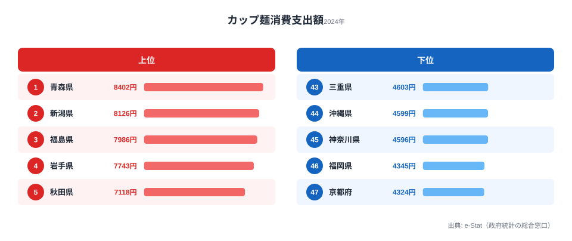
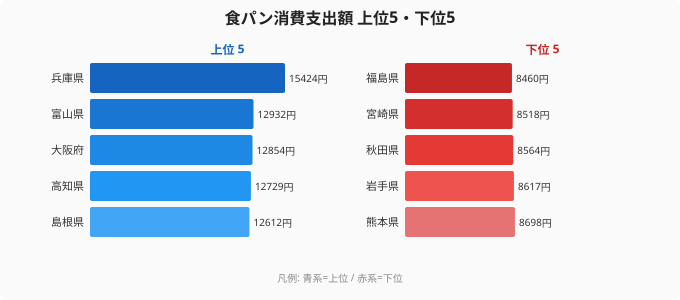
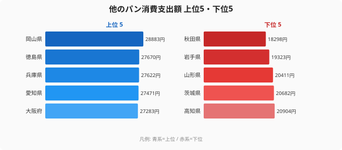
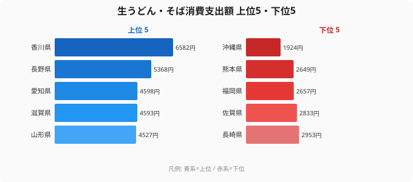

「餃子日本一」を巡る宇都宮と浜松の戦いは有名ですが、食の地域差は餃子だけではありません。総務省「家計調査」には品目別の食料支出データがあり、**カップ麺・食パン・パン・うどんそば**それぞれの年間消費支出額を都道府県別に比べられます。

結論から言えば、台所の風景は県ごとにくっきり分かれます。カップ麺は雪国の東北で多く、食パンは関西で多く、うどんそばは香川と沖縄で3.4倍もの開きがあります。食卓から見える47通りの食文化を、データで読み解いていきます。

> [!NOTE]
> 本記事の数値は総務省「家計調査」の二人以上世帯・都道府県庁所在市別の品目別消費支出額（2024年）です。あくまで「支出金額」であり消費「量」とは異なります。物価が高い地域は同じ量を買っても支出額が大きく出る点に注意して読んでください。

## カップ麺消費が多いのはどこか──東北が席巻する理由

カップ麺の消費支出額が最も多いのは[青森県](/areas/02000)（8,402円）です。新潟県（8,126円）、福島県（7,986円）、岩手県（7,743円）、秋田県（7,118円）と続き、上位5県はすべて東北・北陸が占めます。さらに上位10県まで広げると、東北6県・北陸2県の合わせて8県がランクインし、寒冷地でカップ麺の消費が多い傾向が鮮明に表れています。

なぜ雪国でカップ麺なのでしょうか。積雪で外出が億劫になる冬場は、買い物の頻度そのものが下がります。青森や新潟のように年間降雪量が多い地域では、保存がきき調理いらずで温まれる即席食品の出番が増えます。長い冬に温かいものを手軽に食べたいという生活の都合が、家計の支出にそのまま現れていると考えられます。気候・ライフスタイル・食文化が一本の線でつながる、わかりやすい例です。

一方、最も少ないのは京都府（4,324円）でした。福岡県（4,345円）、神奈川県（4,596円）、沖縄県（4,599円）、三重県（4,603円）と、近畿・首都圏の都市部が下位に並びます。これらの地域は外食や惣菜などの中食の選択肢が豊富で、カップ麺に頼らずとも温かい食事にありつける環境が整っています。トップの青森と最下位の京都では消費支出額がおよそ2倍。カップ麺ひとつとっても、暮らしの違いが如実に表れます。

<source-link href="/ranking/cup-noodles-consumption-expenditure">47都道府県のカップ麺消費支出額ランキングをもっと見る</source-link>

> [!TIP]
> カップ麺の上位は「雪国」とほぼ重なりますが、8位に大阪府、9位に高知県が入る点は例外です。気候要因だけでは説明しきれない、都市部・四国の独自の事情も混じっている可能性があります。安易に「雪＝カップ麺」と一般化しすぎないのが読み解きのコツです。

<ad-slot></ad-slot>

## 食パンは関西が強い──東北とは正反対の並び

食パンに目を転じると、カップ麺とは正反対の地図が現れます。1位は[兵庫県](/areas/28000)（15,424円）で、富山県（12,932円）、大阪府（12,854円）、高知県（12,729円）、島根県（12,612円）が続きます。近畿の食パン好きは際立っており、兵庫県は2位の富山県を大きく引き離す断トツの数字です。

兵庫・大阪を擁する近畿圏は、古くからパン食文化が根づいた地域として知られます。神戸の街にパン屋が多いことはよく語られますが、家計データもそれを裏づけています。朝食にご飯ではなく食パンを選ぶ世帯が多いほど、年間の支出額は積み上がっていきます。

注目すべきは下位です。食パンが最も少ないのは福島県（8,460円）で、宮崎県（8,518円）、秋田県（8,564円）、岩手県（8,617円）、熊本県（8,698円）が並びます。先ほどカップ麺の上位に並んだ東北各県が、食パンでは軒並み下位に沈んでいるのです。兵庫と福島では食パンの支出額に1.8倍の差があり、「東北はカップ麺、関西は食パン」という対比が、二つのランキングを重ねると浮かび上がります。同じ主食まわりの支出でも、地域でこれほど向きが違います。

<source-link href="/ranking/white-bread-consumption-expenditure">47都道府県の食パン消費支出額ランキングをもっと見る</source-link>

> [!WARNING]
> 「食パンが少ない＝パンを食べない」とは限りません。食パンと総菜パン・菓子パンなどの「他のパン」は別々に集計されており、地域によって主役が食パンか他のパンかが入れ替わります。次のセクションで見るように、食パン下位の県が他のパンでは上位に来ることもあるため、片方だけで「パン離れ」と判断しないよう注意が必要です。

## 「他のパン」は西日本に集中──食パンとは違う序列

食パン以外のパン、つまり総菜パンや菓子パン、ロールパンなどをまとめた「他のパン」では、序列がまた組み替わります。1位は岡山県（28,883円）で、徳島県（27,670円）、兵庫県（27,622円）、愛知県（27,471円）、大阪府（27,283円）と、中四国・近畿・東海の西日本勢が上位を占めます。食パンで1位だった兵庫県はここでも3位につけており、近畿のパン好きは食パンに限らないことがわかります。

一方、岡山や徳島のように食パンでは中位だった県が「他のパン」でトップに立つ点が面白いところです。総菜パンや菓子パンは間食・軽食としての性格が強く、食パンとは消費の動機が異なります。同じ「パン」という括りでも、朝食用の食パンと、おやつ・昼食を兼ねる他のパンとでは、地域の好みが別の地図を描くのです。

下位を見ると、秋田県（18,298円）が最も少なく、岩手県（19,323円）、山形県（20,411円）、茨城県（20,682円）、高知県（20,904円）が続きます。ここでも東北各県が下位に並んでおり、食パンに続いて他のパンでも東北のパン支出は控えめです。東北は米文化が強いと言われますが、パン全般の家計支出が少ないという傾向は、食パン・他のパンの両ランキングで一貫しています。

<source-link href="/ranking/other-bread-consumption-expenditure">47都道府県の他のパン消費支出額ランキングをもっと見る</source-link>

<ad-slot></ad-slot>

## うどんそばは香川が圧勝──最下位の沖縄とは3.4倍差

麺類に話を移すと、ここでも強烈な地域差が現れます。生うどん・そばの消費支出額1位は、やはり[香川県](/areas/37000)（6,582円）です。「うどん県」の名は伊達ではなく、2位の長野県（5,368円）に1,200円以上の差をつけての圧勝でした。3位は愛知県（4,598円）、4位は滋賀県（4,593円）、5位は山形県（4,527円）と続き、長野の「信州そば」、山形の「板そば」など、麺文化が根づく地域が顔をそろえます。

香川が突出する背景は語るまでもなく、讃岐うどんという日常食の存在です。外食としてのうどんだけでなく、生麺を買って家庭でも頻繁に食べる習慣が、家計の支出額に直結しています。スーパーの棚に占める生うどんの面積も、おそらく他県とは比べものにならないでしょう。

下位を見ると、最も少ないのは沖縄県（1,924円）で、熊本県（2,649円）、福岡県（2,657円）、佐賀県（2,833円）、長崎県（2,953円）と九州勢が並びます。沖縄には「沖縄そば」という独自の麺文化がありますが、これは小麦麺で「生うどん・そば」の品目区分には入りにくく、家庭での生うどん・そばの消費が少ない結果になっていると考えられます。トップの香川と最下位の沖縄では、うどんそばの支出額に3.4倍もの開きがあります。同じ麺でも、これほど食卓での位置づけが違うのです。

<source-link href="/ranking/fresh-udon-soba-consumption-expenditure">47都道府県の生うどん・そば消費支出額ランキングをもっと見る</source-link>

## まとめ

食の地域差は「餃子」だけではありませんでした。カップ麺・食パン・他のパン・うどんそばという身近な品目で、それぞれ別の地図が描かれます。

- カップ麺は青森を筆頭に東北・北陸が独占し、上位10県のうち8県が東北・北陸でした。雪国の暮らしが家計に表れています。
- 食パンは兵庫を筆頭に近畿が強く、カップ麺上位の東北各県は軒並み下位という正反対の並びになりました。
- 他のパンは岡山・徳島など西日本に集中し、食パンとは違う序列を見せます。東北はパン全般で支出が控えめでした。
- うどんそばは香川が圧勝し、最下位の沖縄とは3.4倍の差がつきました。

データが裏づける食文化の多様性は、47都道府県の暮らしの違いそのものです。ただし本記事の数値は消費「額」であり、物価や所得の影響を受ける点には引き続き注意してください。気になった品目は、各セクションのランキングから全県の並びを確かめてみてください。

## データ出典

- 総務省統計局「家計調査」（二人以上世帯・都道府県庁所在市別・品目別消費支出額、2024年）
- e-Stat（政府統計の総合窓口）を経由して整備
- 関連カテゴリ: [経済・消費のランキング一覧](/category/economy)
