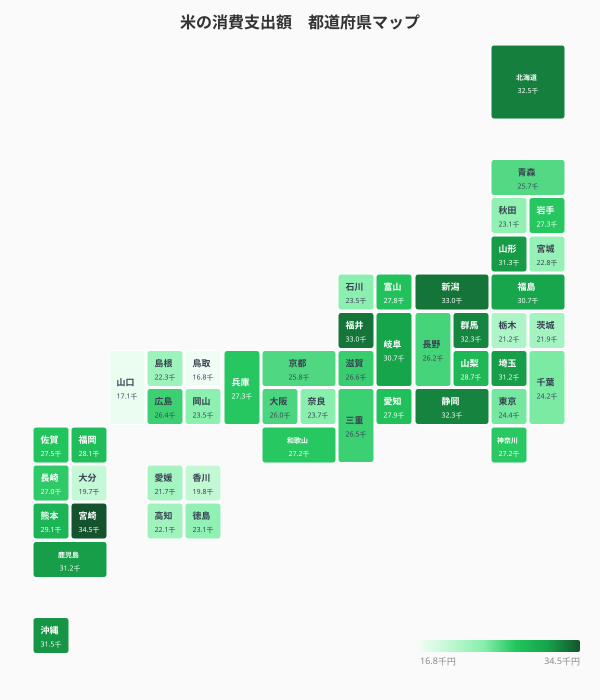
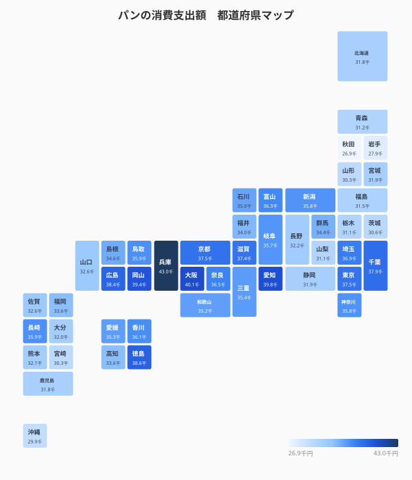
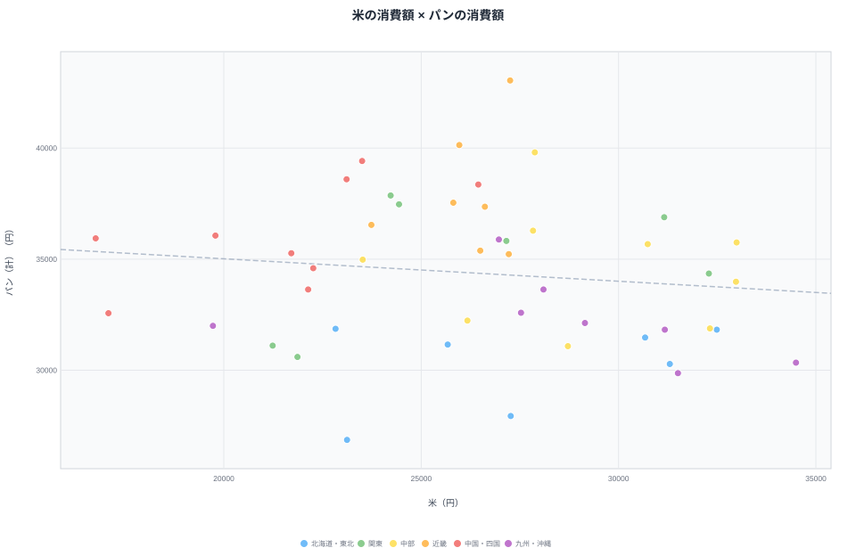
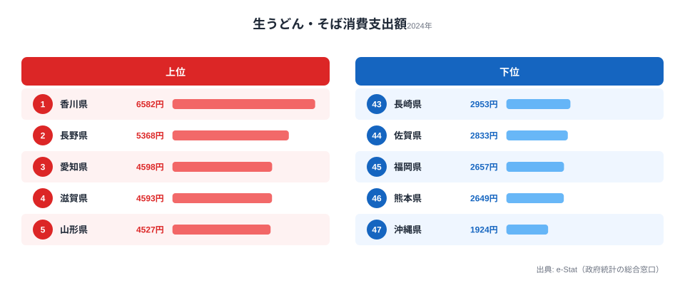
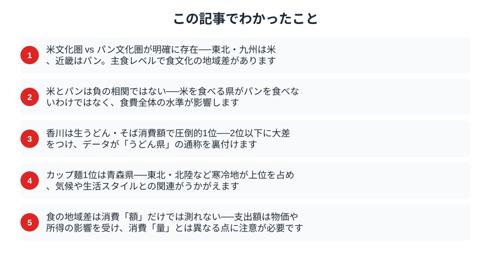

「餃子日本一」を巡る宇都宮 vs 浜松の戦いは有名ですが、食の地域差は餃子だけではありません。総務省「家計調査」には品目別の食料支出データがあり、**米・パン・麺類**それぞれの消費額を都道府県別に比較できます。そして、その差は驚くほど大きいのです。パン代だけ見ても、最も多い兵庫県（年43,047円）と最も少ない秋田県（年26,862円）では1万6千円以上の開きがあります。米に至っては1位と最下位で約2倍。同じ日本に暮らしていても、食卓に並ぶ主食は県ごとにこれほど違います。

この記事では、米・パン・麺という主食レベルの支出データから、47都道府県の食文化がどんな「型」に分かれるのかを読み解きます。結論を先に言えば、見えてくるのは「米文化圏 vs パン文化圏」という対立だけではありません。**米もパンも両方たくさん買う県**が存在し、その背景に世帯の食費水準そのものが効いている、という構造が浮かび上がります。

> [!NOTE]
> 本記事のデータは総務省「家計調査」の二人以上世帯・都道府県庁所在市別の品目別支出額（2024年）です。あくまで「支出金額」であり、消費「量」とは異なる点にご注意ください。物価が高い地域は同じ量でも支出額が大きくなります。

## 米 vs パン──主食の地域差マップ

<data-source url="https://www.e-stat.go.jp/dbview?sid=0003348239" label="e-Stat 家計調査"></data-source>

**米の消費額1位は[宮崎県](/areas/45000)の約3.4万円（34,497円）**。新潟県（32,991円）、福井県（32,977円）と米どころが続きます。全体を眺めると**九州・東北・北陸が濃い色**で、米文化圏がくっきり浮かび上がります。これらの地域は古くからの稲作地帯であり、家庭での炊飯を中心とした食習慣が今も色濃く残っていることが、支出額の高さに表れていると考えられます。とくに宮崎・鹿児島・新潟・福井といった上位県は、いずれも全国有数の米産地と重なります。地元で良質な米が手に入る環境では、外食やパン食に流れずに「ご飯を炊いて食べる」という選択が日常になりやすいのでしょう。

一方、最も少ないのは鳥取県の約1.7万円（16,752円）で、山口県（17,075円）、大分県（19,724円）が続きます。宮崎と鳥取では**約2倍の差**があり、同じ日本でも主食の消費パターンにこれほどの違いがあるのです。下位に並ぶ県は、米産地でないというより、主食をパンや麺に分散させていたり、世帯人数や年齢構成の違いで一世帯あたりの米購入額が抑えられていたりする可能性があります。米の支出は「産地かどうか」だけでなく、その土地の食事スタイル全体を映す鏡だと言えます。

<data-source url="https://www.e-stat.go.jp/dbview?sid=0003348239" label="e-Stat 家計調査"></data-source>

パン（食パン＋他のパン合計）に目を転じると、**1位は[兵庫県](/areas/28000)の約4.3万円（43,047円）**。大阪府（40,137円）、愛知県（39,810円）と近畿・東海が上位を独占します。食パンだけで見ても兵庫県が断トツの1位です。神戸を擁する兵庫はベーカリー文化が根付いた土地として知られ、街角のパン屋の多さがそのまま家計の支出に反映されているとみられます。近畿一帯は喫茶店のモーニング文化（トースト＋コーヒー）も盛んで、朝食にパンを選ぶ習慣が世帯支出を押し上げている可能性があります。

最も少ないのは秋田県の約2.7万円（26,862円）で、岩手県（27,940円）と**東北の米どころ**が下位に並びます。米の支出では上位だった東北勢が、パンでは一転して下位に沈むのは象徴的です。マップを2枚並べると「東北・九州は緑が濃く（米が多い）、近畿は青が濃い（パンが多い）」という**主食の地域差**が一目で読み取れます。米とパンが地理的にきれいに住み分けているように見える、というのが第一印象でしょう。

<source-link href="/ranking/white-bread-consumption-expenditure">47都道府県の食パン消費額ランキングをもっと見る</source-link>

## 米 × パンの散布図──あなたの県は「米派」？「パン派」？

<data-source url="https://www.e-stat.go.jp/dbview?sid=0003348239" label="e-Stat 家計調査"></data-source>

「米を食べる県はパンを食べない」と思いきや、散布図を見るとそう単純ではありません。もし米とパンが完全に「奪い合い」の関係なら、点は右下がりの一直線に並ぶはずです。ところが実際の散らばり方は、そこまでくっきりした負の相関にはなっていません。

注目すべきは**右上**（米もパンも多い）に位置する県があることです。新潟県は米が全国2位（32,991円）と高水準でありながら、パンも全国18位（35,754円）と平均以上。富山県もパンが全国13位（36,284円）と上位で、米も平均をやや上回る17位（27,833円）に位置します。米とパンを「奪い合い」だけで捉えると、こうした両方多い県は説明できません。背景にあるのは、食費全体の水準が高い、つまり食にしっかりお金をかける世帯が多い、という事情だと考えられます。北陸は共働き率が全国上位であることでも知られ、世帯収入が厚い分だけ食に充てる予算が大きい──だから米もパンもどちらも買える、という構図が見えてきます。

> [!TIP]
> 散布図で「右上に寄る県」「左下に寄る県」を探すと、主食の好みよりも**食費全体の厚み**が読み取れます。両方多い県は食にお金をかける余裕がある世帯が多く、両方少ない県は主食以外（魚介・肉・芋など）に支出が回っている、という見方ができます。米とパンの「対立軸」だけで読まないのがコツです。

一方、**左下**（米もパンも少ない）に位置するのは秋田県・茨城県・栃木県です。秋田は米が23,122円（全国36位）と平均以下、パンに至っては26,862円で全国最下位。茨城・栃木も米・パンともに下位に沈み、主食全体への支出が薄いグループを形成します。これらの県では主食以外（魚介・肉・野菜など）に家計が回っている可能性があり、「米かパンか」の対立軸の外側にいると言えます。

対照的に、沖縄県は散布図の**右下**に位置します。米は31,505円で全国7位と意外にも上位なのに対し、パンは29,869円で全国45位とほぼ最下位。米はしっかり買うがパンはほとんど買わない、という偏った主食構成です。独自の食文化（芋・豆腐・肉中心）を背景に、主食のなかでもパンへの支出が極端に少ない点は[沖縄の家計消費](/areas/47000)の特徴で、本土の「ご飯かパンか」という枠組みがそのまま当てはまりにくい食卓だと言えます。

注目すべきは**兵庫県・大阪府**です。パンは全国トップクラスですが米は中位にとどまり、近畿の「パン文化圏」ぶりが際立ちます。逆に**宮崎県・新潟県・福井県**は米が突出して多く（それぞれ米1位・2位・3位）、パンは控えめな「米文化圏」の代表です。同じ主食でも、県によって予算配分の重心がはっきり違うことが、この一枚から読み取れます。食卓の主食構成は、産地・気候・所得・生活スタイルが絡み合った結果なのです。

<ad-slot></ad-slot>

## 麺類の地域差──うどん県だけじゃない

<data-source url="https://www.e-stat.go.jp/dbview?sid=0003348239" label="e-Stat 家計調査"></data-source>

**生うどん・そばの消費額1位は、やはり[香川県](/areas/37000)（6,582円）**。「うどん県」の名は伊達ではなく、2位の長野県（5,368円）に1,200円以上の差をつけての圧勝です。讃岐うどんの製麺所が日常の食事として根付いている香川では、家庭で生めんを買って茹でる習慣が支出額にそのまま表れています。2位の長野県は「信州そば」の文化が消費額を押し上げており、上位には麺どころの名前が並びます。

下位を見ると**沖縄県が最も少なく**（1,924円）、福岡県（2,657円）、熊本県（2,649円）と九州勢が続きます。九州は米文化が強い一方、うどん・そばの家庭消費は少ない傾向があります。これは、九州にうどん・そば文化がないという意味ではなく、外食でうどんを楽しむ機会が多かったり、ラーメン（中華麺）など別の麺類に支出が流れていたりする可能性を示唆します。麺類全体（うどん・そば＋中華麺＋即席麺＋カップ麺など合計）で見ると山形・岩手・青森といった東北勢が上位に来るため、「家庭で生めんを買うか」という切り口と「麺をどれだけ食べるか」は別の話だと分かります。生うどん消費「量」のランキングでも香川が沖縄の3.8倍で頂点に立っており、額と量の両面で「うどん県」の地位が裏付けられます（[生うどん消費量の格差を見る](/blog/fresh-udon-soba-consumption-prefecture-gap)）。

<source-link href="/ranking/fresh-udon-soba-consumption-expenditure">47都道府県の生うどん・そば消費額ランキングをもっと見る</source-link>

## 意外なランキング──カップ麺消費1位はどこ？

<data-source url="https://www.e-stat.go.jp/dbview?sid=0003348239" label="e-Stat 家計調査"></data-source>

**カップ麺の消費額1位は青森県**（8,402円）。新潟県（8,126円）、福島県（7,986円）と東北・北陸勢が上位を席巻します。上位を占めるのは東北・北陸の県ばかりで、**寒冷地でカップ麺の消費が多い**傾向が鮮明です。

なぜ寒い地域でカップ麺なのでしょうか。積雪で外出が億劫になる冬場の手軽な食事として、また長い冬に温かい食べ物への需要が高いことが背景にあると考えられます。青森は年間降雪量が多く、特に冬は買い物の頻度が下がります。まとめ買いした保存食・即席食品でしのぐ場面が増えることが、カップ麺の需要を押し上げる構造的な要因の一つと見られます。雪国にとってカップ麺は「手軽なジャンクフード」というより、悪天候時の現実的な備えに近い存在なのかもしれません。

一方、**最も少ないのは京都府**（4,324円）。福岡県（4,345円）、神奈川県（4,596円）、沖縄県（4,599円）が続きます。近畿・首都圏は外食や中食（惣菜など）の選択肢が豊富で、コンビニやスーパーでできたての弁当・惣菜が手に入りやすい環境です。わざわざカップ麺に頼らなくても済む食生活が可能なことが一因でしょう。都市部ほど「手軽な一食」の代替手段が多く、それがカップ麺の支出を下げている、という読み方ができます。

トップの青森と最下位の京都では**2倍近い差**（約1.9倍）。カップ麺ひとつとっても、気候・ライフスタイル・食文化の違いが如実に表れます。同じ即席麺でも、雪国では生活の必需品に近く、都市部では数ある選択肢の一つにすぎない──そんな立ち位置の差が、倍近い支出額の開きを生んでいるのです。

<source-link href="/ranking/cup-noodles-consumption-expenditure">47都道府県のカップ麺消費額ランキングをもっと見る</source-link>

> [!WARNING]
> 家計調査の品目別支出は「都道府県庁所在市」の二人以上世帯のデータです。県全体の傾向を代表していない可能性がある点にご留意ください。また「支出額」は物価と所得の影響を受けるため、額が多い＝量も多い、とは限りません。安いスーパーが多い地域では、たくさん買っても支出額が抑えられることもあります。

## まとめ

食の地域差は「餃子」だけではありませんでした。米・パン・麺類という主食レベルで、明確な地域パターンが存在します。

- **米の消費額1位は宮崎（34,497円）、最下位は鳥取（16,752円）で約2倍差**。九州・東北・北陸の米文化圏が濃く出る
- **パンの消費額1位は兵庫（43,047円）、最下位は秋田（26,862円）**。近畿・東海のパン文化圏が上位を独占
- **米とパンは単純な負の相関ではない**。富山・新潟のように両方多い県があり、食費全体の水準が効いている
- **生うどん・そばは香川が圧勝**。カップ麺は青森が1位で、寒冷地ほど即席麺の支出が多い
- 主食の支出は産地・気候・所得・生活スタイルが絡んだ結果であり、消費「額」は物価・所得の影響を受ける点に注意

東北・北陸・九州の「米文化圏」と近畿の「パン文化圏」、香川のうどん、東北のカップ麺──データが裏付ける食文化の多様性は、47都道府県の暮らしの違いそのものです。牛肉や鶏肉でも同様に県民性がくっきり出ることが知られており（[牛肉消費の地域差](/blog/beef-consumption-prefecture-gap)）、主食以外の品目にも目を向けると、食卓の地図はさらに立体的に見えてきます。

## データ出典

本記事のデータは総務省「家計調査」（e-Stat 政府統計の総合窓口、statsDataId 0003348239、2024年）を基に作成しています。
