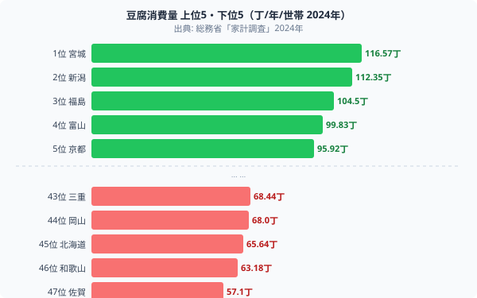
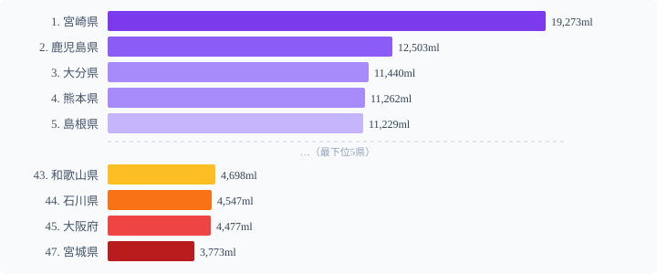
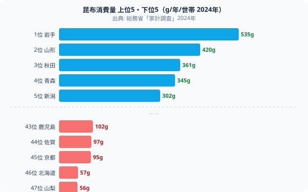

「豆腐は東北で多く食べる」「焼酎は九州」「昆布は出汁文化の関西」── こうした食文化のイメージは、実際の消費量データとどれほど一致するのか。

47都道府県の家計調査データ（2024年・1世帯あたり年間消費量）を3食材で見ると、**[宮城県](/areas/04000)は豆腐1位（116丁）なのに焼酎47位、[宮崎県](/areas/45000)は焼酎1位（19,273ml）なのに豆腐は下位**という対極の構造が浮かび上がります。そして最も意外な事実は、**昆布産地の[北海道](/areas/01000)が消費46位**という現実です。

この「食の南北断層」を読み解きます。

## 豆腐の消費マップ──東北・北陸が圧倒

**1位は宮城県**（116.57丁/年/世帯）。2位新潟県（112.35）、3位福島県（104.5）、4位富山県（99.83）、5位[京都府](/areas/26000)（95.92）と続き、**東北・北陸ブロックが上位5位中4県を占有**します。

最下位は**佐賀県**（57.1丁）、46位和歌山県（63.18）、45位北海道（65.64）と続きます。1位と47位で約2倍の差です。

豆腐の地域差には明確な気候・食文化的背景があります。東北・北陸は**寒冷地での保存食文化**として豆腐が根付き、凍り豆腐・煮豆腐など日常的なタンパク源として位置づけられてきました。佐賀・和歌山・九州南部では豆腐より豚肉・魚介が食卓の中心を占め、豆腐の消費量が相対的に少ない構造があります。

> [!NOTE]
> 数値は総務省統計局「家計調査」(2024年) の二人以上世帯における1世帯あたり年間消費量。県庁所在市・政令指定都市の数値を都道府県値として代用しており、北海道（札幌市）など主要都市の動向が地域全体を代表するとは限りません。

<source-link href="/ranking/tofu-consumption-quantity">豆腐消費量ランキング全47県</source-link>

## 焼酎の消費マップ──宮崎が2位鹿児島の1.5倍

**1位は宮崎県**（19,273ml）。2位鹿児島県（12,503ml）と比べて**50%以上多い圧倒的トップ**です。上位5位中4県を九州勢が占め、九州の焼酎文化の根深さを示しています。

最下位は**宮城県**（3,773ml）。豆腐1位と焼酎47位が同じ宮城県というのが、南北断層の象徴です。46位の京都府（4,416ml）、45位の大阪府（4,477ml）と関西圏も焼酎に縁が薄い。**3食材中で焼酎は地域差が最大**（1位と47位で5倍以上）です。

宮崎の焼酎消費が突出する理由は、本格焼酎の生産地としての文化的定着と、高齢者層を中心とした飲酒習慣にあります。関西圏は日本酒・ビール志向が強く、焼酎の存在感は限定的です。

<source-link href="/ranking/shochu-consumption-quantity">焼酎消費量ランキング全47県</source-link>

## 昆布の消費マップ──産地・北海道が消費46位の逆説

**1位は岩手県**（535g/年/世帯）。2位山形県（420）、3位秋田県（361）、4位青森県（345）、5位新潟県（302）と、**東北ブロックが上位を独占**します。

最下位は**山梨県**（56g）、46位**北海道**（57g）、45位**京都府**（95g）と続き、ここに強烈な逆説が2つあります。

**北海道の逆説**: 日本の昆布の約9割は北海道産ですが、その大部分は道外（大阪・福井・京都の問屋経由）に流通します。地元北海道では生鮮魚介中心の食文化が定着し、昆布は「売るもの」であって「食べるもの」ではない構造があります。岩手の535g（1位）と北海道の57g（46位）では9倍の差があります。

**京都の逆説**: 京都の出汁文化は**「少量の高級昆布で濃厚な出汁を取る」質的消費**が中心です。家計調査の「量（グラム）」は、こうした質的消費を捉えきれません。「量が少ない＝文化がない」とは言えないわけです。

> [!WARNING]
> 家計調査は世帯単位の購入量であり、外食・贈答・業務用は含まれません。京都の昆布消費が「少ない」のは、高級料亭・料理店での業務用消費が家計調査に出てこないことも一因です。量の少なさをもって文化の薄さと断じるのは危険な解釈です。

<source-link href="/ranking/konbu-consumption-quantity">昆布消費量ランキング全47県</source-link>

## 3食材で見える食文化の4パターン

3食材を組み合わせると、都道府県は明確な4パターンに収束します。

**東北・北陸型**（宮城・岩手・新潟など）は豆腐と昆布の消費が高い一方、焼酎が低い。寒冷地の保存食文化として大豆製品と海藻が根付き、蒸留酒より醸造酒（日本酒）の歴史が長い地域です。

**九州型**（宮崎・鹿児島）は焼酎が圧倒的に高く、豆腐・昆布は中〜低。温暖で保存食への依存が低く、芋・麦を原料とする蒸留酒の産地として独自の飲酒文化を形成しました。

**関西型**（京都・大阪）は豆腐が中程度、焼酎・昆布が量的には低い。日本酒・ビール志向が強く、出汁は「量より質」。家計調査の購入量だけでは文化の深さを測れない典型例です。

**北海道型**は豆腐・焼酎・昆布の3つすべてが中〜低。生鮮魚介中心の食文化が他の指標を押しのけ、昆布は産地でありながら「輸出品」として消費されます。

**最も対照的な2県**は宮城（豆腐1位・焼酎47位）と宮崎（焼酎1位・豆腐下位）。「みやぎ」「みやざき」と名前も似ているのに、食文化は日本列島の南北で完全に逆転しています。

> [!TIP]
> 「自分の県の食文化は平均的か、特異か」を調べるには、複数の食材消費量を合わせて確認するのが有効です。豆腐・焼酎・昆布の組み合わせで初めて見えてくる地域性があります。[食料・飲料の都道府県別消費量はこちら](/category/socialsecurity)でも確認できます。

## 「豆腐1位の宮城が焼酎47位」の地理的必然

この南北断層は偶然ではありません。

宮城・岩手・秋田などの東北は、**長い冬と保存の必要性**から大豆製品（豆腐・味噌）を日常的に使う食文化が形成されました。また、寒冷地では蒸留酒より醸造酒（日本酒・どぶろく）の歴史が長く、焼酎は食文化の中心ではありませんでした。

宮崎・鹿児島の九州南部は、逆に温暖で保存食の必要性が低く、芋・麦を原料とする蒸留酒（焼酎）の産地として発展しました。焼酎は地元産業であり、日常の飲み物として定着しています。

気候・産業・歴史が組み合わさって、宮城と宮崎という「同じ『みやざき』という読みに近い2県」が食文化の南北の対極に位置する──これが3食材の数字が語る構造です。

## データ出典

- 総務省統計局「家計調査」(2024年) 二人以上の世帯
- 対象：県庁所在市または政令指定都市の二人以上世帯
