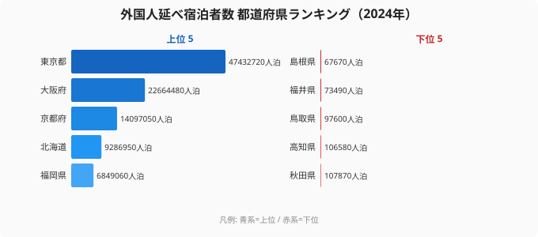

2024年3月に北陸新幹線が金沢〜敦賀間に延伸された。観光業界では「福井がインバウンドの新たな目的地になる」という期待があった。ところが、2024年の外国人延べ宿泊者数を見ると、福井県は47都道府県中**46位（7.3万人泊）**にとどまっている。同じ北陸の石川県は10位（178万人泊）で、その差は約24倍だ。

首位の[東京都](/areas/13000)（4,743万人泊）と最下位の[島根県](/areas/32000)（6.7万人泊）の差は約700倍。コロナ後のインバウンド回復は、ゴールデンルート（東京・大阪・京都）と「ブランド資源型」の北海道・沖縄に集中し、それ以外の地方は依然として取り残されている構造が明確だ。

この格差を生む要因は「空港ハブへのアクセス」「代替不可能なブランド資源」「新幹線開業の効果範囲」の3つに整理できる。

> [!NOTE]
> 観光庁「宿泊旅行統計調査」2024年確定値をもとに集計。外国人延べ宿泊者数は施設に宿泊した外国人ゲストの「人数×泊数」の合計。旅行者数（何人が来たか）とは異なり、1人が3泊すれば3人泊としてカウントされる。

## 上位と下位 ── ゴールデンルートと地方2強

上位は東京都4,743万人泊、大阪府2,266万人泊、京都府1,410万人泊、北海道929万人泊、福岡県685万人泊と続く。6位沖縄県438万人泊、7位千葉県435万人泊、8位神奈川県384万人泊、9位愛知県353万人泊、10位石川県178万人泊。

<source-link href="/ranking/total-overnight-guests-foreign">外国人延べ宿泊者数ランキングをもっと見る</source-link>

東京・大阪・京都の上位3都府県で全国の外国人宿泊の大部分を吸収する「ゴールデンルート集中」は2024年も変わらない。4位の北海道（928万人泊）と6位の沖縄（438万人泊）は国際空港から離れているにもかかわらず上位に入る「ブランド資源型」の例外モデルだ。

7〜9位（千葉・神奈川・愛知）は首都圏・中部の「周辺受益型」。成田空港・東京ディズニーリゾート・中部国際空港などの集客装置が隣接している。

## 3要因で格差を読む

### 要因1: 空港ハブへのアクセスが基本条件

上位8都府県のうち7つが、国際線の主要ハブ空港（羽田・成田・関西・新千歳・那覇・博多）から鉄道2時間圏内に立地する。外国人旅行者にとって「飛行機を降りてから宿泊地まで」の動線の短さが、訪問先の第一選択を決めやすい。

山陰（島根・鳥取）と北東北（秋田）が最下位グループにいる共通点は、いずれも国際線就航のある拠点空港から遠く、公共交通でのアクセスに時間がかかることだ。

### 要因2: 北海道と沖縄が「ブランド資源」で例外になれた理由

この2つは空港距離という制約を超えて上位に入る。「雪」「リゾート・ダイビング」という代替不可能な観光資源が、旅程を組む段階から目的地として設定されやすい。訪日旅行者が「日本 = 東京・大阪・京都」を超えて訪れるには、こうした「そこにしかない体験」が必要条件になる。

### 要因3: 新幹線開業効果は「中位への底上げ」に留まる

石川県の10位入りは北陸新幹線の効果を反映している。しかし同じ北陸新幹線延伸の恩恵を受けるはずの福井県は46位だ。新幹線開業は国内旅行の誘客には効果的だが、外国人インバウンドには「空港アクセス改善」と「海外での認知獲得」という別の課題が必要で、鉄道単体では補えない。

## 最下位グループ ── 山陰・北東北の共通構造

最下位グループは43位秋田県107,870人泊、44位高知県106,580人泊、45位鳥取県97,600人泊、46位福井県73,490人泊、47位島根県67,670人泊。下位5県はいずれも10万人泊前後かそれ未満。TOP3との比較では「桁が3つ違う」水準にとどまる。共通項は、(a) 国際線就航のある拠点空港から遠い、(b) 新幹線ネットワークの末端または非接続、(c) 海外メディアでの認知度が相対的に低い、という3点だ。

> [!WARNING]
> インバウンド宿泊者数が少ない県が「観光力が低い」わけではない。国内宿泊者数では島根（出雲大社・石見銀山）や秋田（角館・田沢湖）は一定の集客力を持つ。外国人向けの「発見可能性（discoverability）」の課題があるという点で、国内旅行とインバウンドは別の課題を持つ。

## まとめ

インバウンド宿泊者数の格差は「観光資源の有無」より「構造的なアクセス条件」が先に働く。

- **2024年の格差**: 首位東京4,743万人泊・最下位島根6.7万人泊
- **ゴールデンルート集中**: 東京・大阪・京都3都府県が全国需要の大部分を占める構造は2024年も変わらない
- **ブランド資源型の例外**: 北海道・沖縄は空港距離を超えて集客できる数少ない例
- **新幹線効果の限界**: 石川10位に対し福井46位。新幹線が外国人インバウンドを直接増やすわけではない
- **構造的不利グループ**: 山陰・北東北・高知は空港遠隔・認知不足の二重課題を抱える

地方インバウンドの拡大には、空港路線の拡充・多言語対応・海外プロモーションという別次元の投資が必要だ。データはその課題を明確に示している。

## データ出典

- 観光庁「宿泊旅行統計調査」2024年確定値（e-Stat 経由）
- 集計単位：人泊（延べ宿泊者数、外国人）
- 取得時点：2026-05-17

本記事の対象データ: [関連カテゴリ](/category/tourism)
