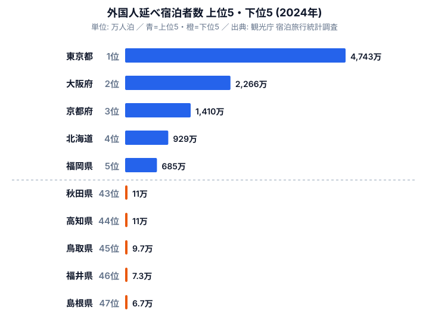

2024年3月、北陸新幹線が金沢〜敦賀間に延伸しました。観光業界では「福井がインバウンドの新たな目的地になる」という期待が高まりました。ところが2024年の外国人延べ宿泊者数を見ると、福井県は47都道府県中46位（7.3万人泊）にとどまっています。同じ北陸の石川県は10位（178万人泊）で、その差は約24倍です。新幹線という同じ動脈につながったはずの隣県が、外国人宿泊では桁違いに開いているのです。

首位の[東京都](/areas/13000)（4,743万人泊）と最下位の[島根県](/areas/32000)（6.7万人泊）の差は約700倍に達します。コロナ後のインバウンド回復は、ゴールデンルート（東京・大阪・京都）と「ブランド資源型」の北海道・沖縄に集中し、それ以外の地方は依然として取り残されている構造が明確になっています。

なぜ新幹線が通っても回復が届かない県があるのでしょうか。本記事では、この格差を生む要因を「空港ハブへのアクセス」「代替不可能なブランド資源」「新幹線開業の効果範囲」の3つに整理して読み解きます。

> [!NOTE]
> 観光庁「宿泊旅行統計調査」2024年確定値（e-Stat 経由）をもとに集計しています。外国人延べ宿泊者数は、施設に宿泊した外国人ゲストの「人数×泊数」の合計です。旅行者数（何人が来たか）とは異なり、1人が3泊すれば3人泊としてカウントされます。長期滞在の多い県ほど人数以上に数字が膨らむ点に注意してください。

## 上位と下位 ── ゴールデンルートと地方2強

上位は東京都4,743万人泊、大阪府2,266万人泊、京都府1,410万人泊、北海道929万人泊、福岡県685万人泊と続きます。その後は6位沖縄県438万人泊、7位千葉県435万人泊、8位神奈川県384万人泊、9位愛知県353万人泊、10位石川県178万人泊という並びです。一方で下位は43位秋田県11万人泊、44位高知県11万人泊、45位鳥取県9.7万人泊、46位福井県7.3万人泊、47位島根県6.7万人泊と、上位とは桁が3つ違う水準に沈んでいます。

<source-link href="/ranking/total-overnight-guests-foreign">外国人延べ宿泊者数ランキングをもっと見る</source-link>

なぜ上位がここまで偏るのでしょうか。最大の理由は、外国人旅行者の大半が「東京・大阪・京都」を結ぶゴールデンルートを軸に旅程を組むからです。この3都府県だけで全国の外国人宿泊の大きな部分を吸収する構造は、2024年も変わっていません。国際線の発着が集中する羽田・成田・関西の3空港にいずれも近く、降りてすぐ宿泊地にたどり着ける動線の短さが、訪問先の第一選択になりやすいのです。

4位の北海道（929万人泊）と6位の沖縄（438万人泊）は、国際空港の本数では首都圏に及ばないにもかかわらず上位に入っています。これは後述する「ブランド資源型」の例外モデルです。7〜9位の千葉・神奈川・愛知は、首都圏・中部の「周辺受益型」と言えます。成田空港・東京ディズニーリゾート・中部国際空港といった巨大な集客装置が隣接し、その溢れ出した需要を受け止めているからです。逆に下位の県には、こうした空港・ブランド・集客装置のいずれもが乏しいという共通点があります。

## 3要因で格差を読む

### 要因1: 空港ハブへのアクセスが基本条件

上位の都府県は、国際線の主要ハブ空港（羽田・成田・関西・新千歳・那覇・博多）から鉄道でおおむね2時間圏内に立地しています。外国人旅行者にとって「飛行機を降りてから宿泊地まで」の移動が短いことは、滞在先を決めるうえで大きな引力になります。限られた日程で複数都市を回る訪日旅行では、移動時間そのものがコストだからです。

これに対し、山陰（島根・鳥取）と北東北（秋田）が下位グループに並ぶ共通点は、いずれも国際線就航のある拠点空港から遠く、公共交通でのアクセスに時間がかかることです。空港から遠いという立地条件は、観光資源の魅力以前に「候補に入りにくい」という不利を生みます。アクセスの不利は、努力で短期に覆せない構造的な制約なのです。

### 要因2: 北海道と沖縄が「ブランド資源」で例外になれた理由

[北海道](/areas/01000)と[沖縄県](/areas/47000)は、空港距離という制約を超えて上位に入っています。「雪・パウダースノー」「リゾート・ダイビング」という代替不可能な観光資源が、旅程を組む段階から目的地として設定されやすいからです。訪日旅行者が「日本＝東京・大阪・京都」という王道を超えて足を延ばすには、こうした「そこにしか無い体験」が必要条件になります。

逆に言えば、ブランド資源を持たない地方が外国人を呼び込むのは容易ではありません。国内旅行者には知られた名所であっても、海外で「わざわざ訪れる理由」として認知されていなければ、宿泊数には結びつかないのです。空港から遠い県が上位に食い込むには、距離の不利を打ち消すほど強い固有の体験価値が要ると言えます。

### 要因3: 新幹線開業効果は「中位への底上げ」にとどまる

石川県の10位入りは、北陸新幹線の効果を一定程度反映しています。しかし同じ北陸新幹線延伸の恩恵を受けるはずの福井県は46位のままです。この差は、新幹線開業が国内旅行の誘客には効果的でも、外国人インバウンドには別の課題が立ちはだかることを示しています。

外国人を増やすには「空港からのアクセス改善」と「海外での認知獲得」という2つの条件が要りますが、鉄道整備だけではこのどちらも単独では満たせません。新幹線は国内客の利便性を上げ、すでに一定の知名度を持つ金沢のような都市を中位へ底上げする効果はありますが、海外でほとんど認知されていない県を一足飛びに引き上げる力は持たないのです。

> [!TIP]
> 同じ新幹線沿線でも、すでに海外で名の通った都市（金沢など）とそうでない都市では効果がまったく異なります。「新幹線が通ったか」ではなく「海外でその地名が観光地として認知されているか」を合わせて見ると、インバウンドの伸びしろを見誤りにくくなります。

## 最下位グループ ── 山陰・北東北の共通構造

下位グループは43位秋田県107,870人泊、44位高知県106,580人泊、45位鳥取県97,600人泊、46位福井県73,490人泊、47位島根県67,670人泊です。下位5県はいずれも10万人泊前後かそれ未満で、首位東京の4,743万人泊とは桁が3つ違う水準にとどまっています。

これらの県に共通するのは、(a) 国際線就航のある拠点空港から遠い、(b) 新幹線ネットワークの末端または非接続、(c) 海外メディアでの認知度が相対的に低い、という3点です。要因1〜3で見た不利が重なって現れているのが、この下位グループだと言えます。たとえば島根・鳥取は山陰本線沿いで空港アクセスに時間がかかり、新幹線網からも外れています。高知も四国の南端に位置し、本州からの動線が長いという立地の不利を抱えています。1つの不利なら他の強みで補えても、3つが重なると挽回の糸口がつかみにくくなるのです。

> [!WARNING]
> インバウンド宿泊者数が少ない県が「観光力が低い」わけではありません。国内宿泊者数で見れば、島根（出雲大社・石見銀山）や秋田（角館・田沢湖）は確かな集客力を持っています。あくまで外国人向けの「発見可能性（discoverability）」に課題があるという話で、国内旅行とインバウンドはまったく別の指標として読む必要があります。この記事の下位＝魅力が低い、と短絡しないでください。

## まとめ

インバウンド宿泊者数の格差は、「観光資源の有無」よりも「構造的なアクセス条件」が先に働いています。

- **2024年の格差**: 首位は東京で4,743万人泊、最下位は島根で6.7万人泊、その差は約700倍にのぼります
- **ゴールデンルート集中**: 東京・大阪・京都の3都府県が全国需要の大きな部分を占める構造は2024年も変わっていません
- **ブランド資源型の例外**: 北海道・沖縄は空港距離を超えて集客できる数少ない例です
- **新幹線効果の限界**: 石川は10位まで伸びた一方で福井は46位のままで、新幹線が外国人インバウンドを直接増やすわけではありません
- **構造的不利グループ**: 山陰・北東北・高知は空港遠隔・認知不足の二重の課題を抱えています

地方インバウンドの拡大には、空港路線の拡充・多言語対応・海外プロモーションという別次元の投資が必要です。データはその課題をはっきりと示しています。観光地としての魅力ではなく、世界からの「たどり着きやすさ」と「見つけてもらいやすさ」が、いま地方に問われているのです。

## データ出典

- 観光庁「宿泊旅行統計調査」2024年確定値（e-Stat 経由）
- 集計単位：人泊（延べ宿泊者数、外国人）
- 取得時点：2026-05-17
