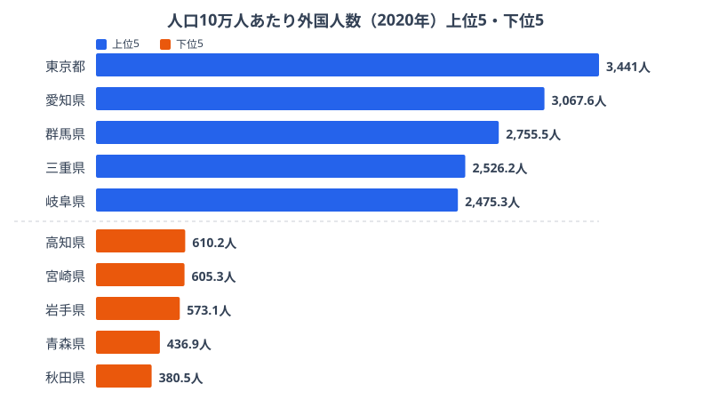
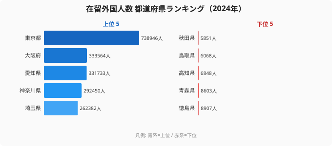

「外国人が増えている」というニュースは毎年のように流れますが、自分の住む県でその実感があるかどうかは、人によって大きく分かれるのではないでしょうか。在留外国人数は2024年に約377万人を記録し、過去最高を更新し続けています。しかし、増加の波は全国で一律に広がっているわけではありません。

人口10万人あたりの外国人数で並べ替えると、上位には東京だけでなく愛知・群馬・三重・岐阜といった製造業の盛んな県が食い込んできます。「国際化が進んでいる県」と聞いて多くの人が大都市を思い浮かべますが、実際にはものづくりの労働需要が地図を塗り替えているのです。本記事では、比率と絶対数という2つのものさしで、地方の国際化がどこまで進んでいるのかを読み解いていきます。

## 人口10万人あたり外国人数ランキング──東京を製造業県が追い上げる

2020年の国勢調査に基づく人口10万人あたり外国人数を見ると、1位は[東京都](/areas/13000)で3,441人。続く2位は愛知県（3,067.6人）、3位は群馬県（2,755.5人）、4位は三重県（2,526.2人）、5位は岐阜県（2,475.3人）と並びます。東京こそ首位を守っていますが、2位以下にものづくりの拠点が連なっているのが大きな特徴です。これらの県では自動車・電機・食品加工などの工場が集積し、現場を支える労働力として外国人が定着してきました。東京が商業・サービス業の集積で外国人を引き寄せているのに対し、上位の県は「工場のある場所」に人が集まる構造になっているのです。

一方、下位には東北の県が並びます。最も少ないのは[秋田県](/areas/05000)で380.5人、次いで青森県（436.9人）、岩手県（573.1人）と続きます。人口減少が進む地域では、そもそも雇用の受け皿となる大規模な事業所が限られ、外国人が定着しにくい状況が見て取れます。1位の東京と最下位の秋田を比べると、人口比でおよそ9倍の開きがあります。同じ「日本に住む」でも、身近に外国人がいる確率は県によって桁が違うのです。

> [!NOTE]
> この順位は「人口10万人あたりの外国人数」、つまり人口規模で割った密度です。県の人口が少ないほど分母が小さくなるため、絶対数が中規模でも比率では上位に来ることがあります。群馬がその典型で、人口規模は大きくないものの工場需要で外国人が多く、比率では3位に押し上げられています。

<source-link href="/ranking/foreign-resident-count-per-100k">47都道府県の人口10万人あたり外国人数ランキングをもっと見る</source-link>

## 絶対数ランキング──東京74万人が突出する集積構造

人口比とは別に、在留外国人の絶対数（2024年）で並べると、構造がさらに鮮明になります。1位の[東京都](/areas/13000)は738,946人で、2位の大阪府（333,564人）の2倍を超えています。3位は愛知県（331,733人）、4位は神奈川県（292,450人）、5位は埼玉県（262,382人）と、首都圏と愛知を軸にした集積が際立ちます。国際空港・大企業の本社・大規模工場が重なるこれらの地域に、留学・就労・定住のいずれの目的でも人が集まりやすいことがわかります。

最下位は[秋田県](/areas/05000)で5,851人。東京のおよそ126分の1にとどまります。鳥取県（6,068人）、高知県（6,848人）、青森県（8,603人）、徳島県（8,907人）など、東北・四国・山陰の県では在留外国人が1万人を切る県が複数あります。雇用機会の少なさと人口減少が重なり、外国人の流入も限られているのが実情です。

ここで面白いのは、比率ランキングと絶対数ランキングで顔ぶれが入れ替わる点です。人口比で3位だった群馬は、絶対数では83,430人で12位にとどまります。人口規模が小さいため、密度では目立っても総数では中位に沈むのです。逆に、千葉や埼玉のように人口の大きい県は、比率では上位〜中位でも絶対数では上位に入ります。「どちらのものさしで見るか」で国際化の地図はまったく違う表情を見せます。

> [!TIP]
> 自分の県の国際化を測るときは、比率と絶対数の両方を見るのがコツです。比率は「身近に外国人がいる確率」を、絶対数は「行政が対応すべき人数の規模」を表します。比率は高いが絶対数は中位という群馬のような県と、絶対数は大きいが比率は中位という千葉のような県とでは、求められる多文化共生施策の重点が変わってきます。

<source-link href="/ranking/resident-foreigner-population">47都道府県の在留外国人数（絶対数）ランキングをもっと見る</source-link>

## 在留外国人数は12年間で1.85倍に──加速する地方流入

全国の在留外国人数の推移を見ると、2012年の約203万人から2024年には約377万人へと、12年間でおよそ1.85倍に増えました。2020年のコロナ禍で入国制限により一時的に減少しましたが、2022年以降は急回復し、過去最高を更新し続けています。この伸びを支えてきたのが、技能実習や特定技能といった就労を目的とした在留資格の拡大です。

2027年には、技能実習制度の後継として育成就労制度が始まります。人材育成と確保を正面から目的に掲げる新制度のもとでは、これまで以上に地方の工場や農業・介護の現場へ外国人が流入する可能性があります。比率ランキングで上位に来ていた愛知・群馬・三重・岐阜のような製造業県は、今後さらに国際化が進むことが見込まれます。逆に、現在は下位にとどまる東北の県も、人手不足の深刻化を背景に受け入れが広がれば、順位が動く余地は十分にあります。

> [!WARNING]
> 比率と絶対数のデータは年次と出典が異なります。人口10万人あたりの比率は2020年の国勢調査、在留外国人の総数推移と絶対数は出入国在留管理庁の統計（2024年時点）に基づきます。年次のずれがあるため、両者を直接掛け合わせて精緻な計算をするのには向きません。あくまで「比率」と「絶対数」という別々のものさしとして読んでください。

## 県民所得が高い県ほど外国人は多いのか

国際化の背景には経済力があると考えがちですが、所得の高さだけで外国人の多さは説明できません。たしかに東京や愛知のように、所得が高く外国人比率も高い県はあります。しかし、群馬や三重のように所得水準が中程度でも外国人比率が高い県があり、これは製造業の労働需要が外国人集積の主役であることを示しています。工場が必要とする人手は、必ずしも県民所得の高さとは一致しないのです。

> [!NOTE]
> 「所得が高い県ほど外国人が多い」という見方は、相関と因果を混同しやすい典型例です。所得と外国人比率にゆるやかな関係が見られても、それは「工場が多い県は所得も比率も同時に押し上げられる」という共通要因の可能性があり、所得そのものが外国人を呼び込んでいるとは限りません。地方の国際化を読むときは、所得よりも産業構造（とくに製造業の集積）に注目するのが筋の良い読み方です。

## まとめ

外国人人口の「変化の速度」と「地域差」から見えてきたポイントを整理します。

- 人口10万人あたりでは1位東京（3,441人）に対し、2位愛知・3位群馬・4位三重・5位岐阜と製造業県が肉薄します。
- 比率が最も低いのは秋田（380.5人）で、東京とはおよそ9倍の開きがあります。
- 絶対数では東京（738,946人）が突出し、最下位の秋田（5,851人）の126倍に達します。
- 群馬は比率3位でも絶対数では12位と、ものさしを変えると順位が大きく入れ替わります。
- 在留外国人は12年で約1.85倍に増え、2027年の育成就労制度開始で地方流入がさらに加速する可能性があります。

「外国人が増えている」という全国レベルの話だけでなく、「自分の県ではどのくらいのペースで国際化が進んでいるのか」を知ることが、多文化共生を考える第一歩になります。育成就労制度の開始を控え、各自治体がデータに基づいた受け入れ態勢を整えられるかどうかが、これから問われていくでしょう。

## データ出典

- 社会・人口統計体系 都道府県データ（e-Stat、2020年・2024年）
- 国勢調査（2020年）
- 在留外国人統計（出入国在留管理庁）
- 対象カテゴリ: [国際](/category/international)
