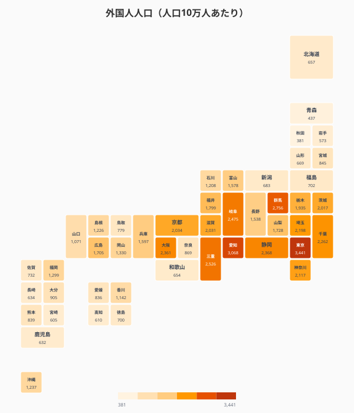
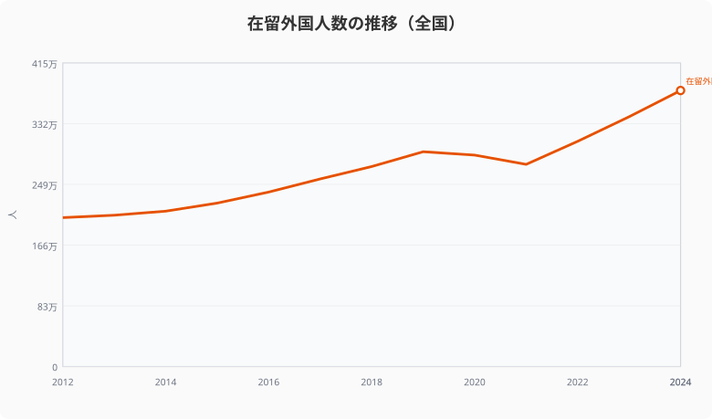
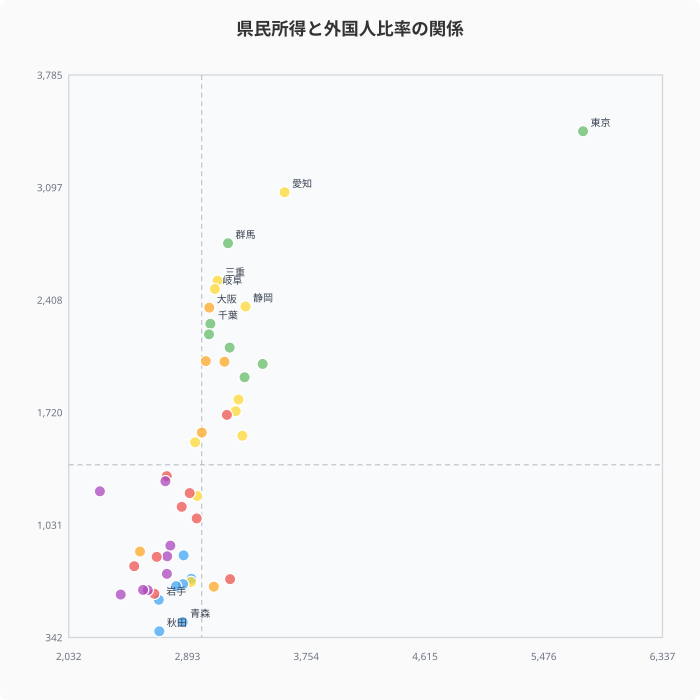

在留外国人数は2024年に約377万人を記録し、過去最高を更新し続けている。しかし増加の波は全国一律ではない。人口10万人あたりの外国人数で見ると、東京に次いで愛知・群馬など製造業県が上位に食い込み、「国際化」の進み方に大きな地域差があることが見えてくる。

## 人口10万人あたり外国人数ランキング──東京が1位だが追い上げる製造業県

2020年の国勢調査に基づく人口10万人あたり外国人数を見ると、1位は[東京都](/areas/13000)（3,441人）で、2位の愛知県（3,068人）、3位の群馬県（2,756人）と続く。愛知・群馬・三重・岐阜といった製造業が盛んな県が上位に入っているのが特徴だ。

一方、下位は[秋田県](/areas/05000)（381人）、青森県（437人）、岩手県（573人）など東北地方が目立つ。1位の東京と最下位の秋田では約9倍の差がある。

<source-link href="/ranking/foreign-resident-count-per-100k">47都道府県の外国人人口（10万人あたり）ランキングをもっと見る</source-link>

## 全47都道府県の「国際化度」マップ

タイルグリッドマップで全国を俯瞰すると、太平洋ベルト地帯（東京から愛知、大阪にかけて）と北関東（群馬・栃木・茨城）に外国人が集中している構造が明確に見える。日本海側や東北は総じて低い水準にとどまっている。

<ad-slot></ad-slot>

## 在留外国人数は12年間で1.85倍に

全国の在留外国人数の推移を見ると、2012年の約203万人から2024年には約377万人へと12年間で約1.85倍に増加した。2020年のコロナ禍で一時的に減少したものの、2022年以降は急回復し、過去最高を更新し続けている。

2027年に開始される育成就労制度（技能実習制度の後継）により、今後さらに地方への外国人流入が加速する可能性がある。

<source-link href="/ranking/resident-foreigner-population">47都道府県の在留外国人数ランキングをもっと見る</source-link>

## 絶対数ランキング──東京74万人が突出する構造

人口比率とは別に、在留外国人の絶対数（2024年）を見ると構造がより鮮明になる。1位の[東京都](/areas/13000)は738,946人で、2位の大阪府（333,564人）の2倍超。3位の愛知県（331,733人）、4位の神奈川県（292,450人）、5位の埼玉県（262,382人）と、首都圏と愛知を中心とする集積が顕著だ。

一方、最下位の[秋田県](/areas/05000)は5,851人で、東京の126分の1にすぎない。東北・四国・山陰の県では在留外国人が1万人未満にとどまる県が複数ある。

絶対数の偏在は製造業拠点・国際空港・大都市の集積を反映しているが、人口比率ランキングとは顔ぶれが変わる点が興味深い。群馬（人口比率3位）は製造業需要で比率が高いが、人口規模が小さいため絶対数では上位20位前後にとどまる。

<source-link href="/ranking/resident-foreigner-population">47都道府県の在留外国人数（絶対数）ランキングをもっと見る</source-link>

## 県民所得が高い県ほど外国人は多いのか？

1人当たり県民所得と外国人人口比率の関係を散布図で見ると、緩やかな正の相関が確認できる。東京・愛知のように高所得かつ高外国人比率の県がある一方、群馬・三重は所得水準が中程度ながら外国人比率が高い。これは製造業の労働需要が外国人集積の大きな要因であることを示唆している。

逆に、所得が高くても外国人比率が低い県（滋賀など）もあり、所得だけで国際化の程度は決まらない。

> [!NOTE]
> 県民所得は2021年度、外国人人口比率は2020年国勢調査のデータ。年次が異なるため傾向の参考値として読むこと。

<ad-slot></ad-slot>

> [!NOTE]
> 外国人人口の比率（人口10万人あたり）のデータは2020年国勢調査に基づく。在留外国人の総数推移（2012年〜2024年）は出入国在留管理庁の統計による。両データソースの年次が異なる点に留意が必要。

## まとめ

外国人人口の「変化の速度」と「地域差」から見えてくるポイントを整理する。

「外国人が増えている」という全国レベルの話だけでなく、「自分の県ではどのくらいのペースで国際化が進んでいるのか」を知ることが、多文化共生の第一歩になる。2027年の育成就労制度開始に向けて、各自治体がデータに基づいた受け入れ態勢の整備を進められるかどうかが問われている。

**データ出典:**
- [社会・人口統計体系 都道府県データ（e-Stat）](https://www.e-stat.go.jp/regional-statistics/ssdsview)（2020年・2024年）
- 国勢調査（2020年）

## データ出典

本記事のデータはe-Stat（政府統計の総合窓口）を基に作成しています。

本記事の対象データ: [関連カテゴリ](/category/international)
