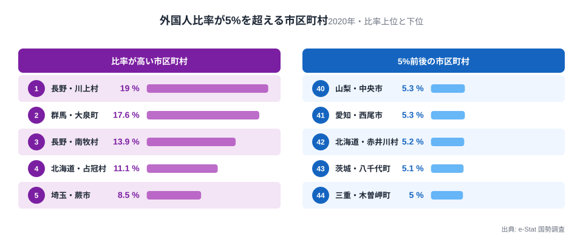
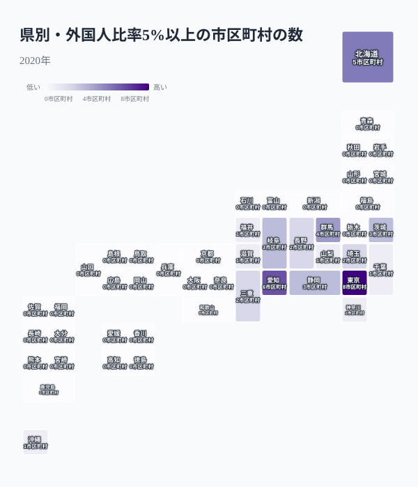
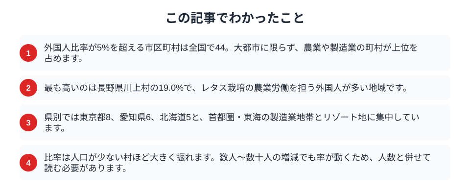

「外国人が多い街」と聞くと、多くの人は東京や大阪といった大都市を思い浮かべます。ところが国勢調査で市区町村ごとの外国人比率を見ると、その直感は上位で裏切られます。住民の5%以上、つまり20人に1人以上が外国人という市区町村は全国で44。そのトップに並ぶのは、高原野菜の産地や自動車部品の工場町、スキーリゾートを抱える町村でした。都市の中心ではなく、特定の産業が人手を必要とする場所に、外国人は集まっています。

## 上位は農村と工業の町

まず、外国人比率が5%を超える市区町村を高い順に並べてみます。

<data-source label="e-Stat 国勢調査" note="人口10万人あたり外国人数（2020年）を比率に換算して集計"></data-source>

最も高いのは長野県川上村で、住民の19.0%が外国人です。次いで群馬県大泉町が17.6%、長野県南牧村が13.9%、北海道占冠村が11.1%と続きます。川上村と南牧村は全国有数のレタス産地で、収穫期の農作業を担う外国人労働者が多いことで知られます。大泉町は自動車関連の製造業とともに古くからブラジル人コミュニティが根づいた町です。占冠村は大型リゾートを抱え、観光業の従事者が比率を押し上げています。上位に共通するのは、規模の大きな都市ではなく、農業・製造業・観光という特定産業が地域経済の柱になっている点です。都市の代表格である東京都豊島区も8.5%と高いものの、村の上位とは水準が異なります。中位に目を移すと、埼玉県蕨市が8.5%、岐阜県美濃加茂市が8.2%、茨城県常総市が7.8%と、いずれも製造業や食品加工の集積地が並びます。都市の規模順に外国人が多いのではなく、産業の種類が比率を決めているのが、この一覧の特徴です。

<source-link href="/ranking/foreign-resident-count">都道府県別の外国人住民数ランキングを見る</source-link>

## 県別に見ると関東・東海に集中する

次に、5%を超える市区町村が各県にいくつあるかを地図で見ます。

<data-source label="e-Stat 国勢調査" note="人口10万人あたり外国人数（2020年）を比率に換算して集計"></data-source>

最も多いのは東京都の8市区町村で、愛知県6、北海道5、群馬県4と続きます。首都圏と東海の製造業地帯、そして北海道のリゾート地に固まっているのがわかります。一方で、5%を超える市区町村が1つもない県は31にのぼりました。つまり外国人比率が高い市区町村は、全国にまんべんなく散らばっているのではなく、産業構造がはっきりした一部の地域に偏在しています。

同じ「外国人が多い」でも、東京都の8市区町村は都心のオフィスや飲食・サービス業を背景にした集住であるのに対し、愛知や群馬・岐阜の市町は自動車部品や食品加工といった製造業の現場を背景にしています。地図の色が濃い場所を追うと、その地域がどんな産業で人手を必要としているかが浮かび上がります。[外国人比率トップは東京、次点以下は製造業県](/blog/foreign-population-growth-rate)という県単位の傾向は、市区町村まで細かく見ると、さらにくっきりと産業と結びついて現れます。

<source-link href="/ranking/foreign-population-per-100k">都道府県別の外国人比率ランキングを見る</source-link>

## なぜ特定の産業に集まるのか

外国人労働者は、人手不足が慢性化している産業に吸い寄せられます。

> [!NOTE]
> 高原野菜の収穫、自動車部品の組み立て、観光地の宿泊業は、いずれも季節や時間帯に労働需要が集中し、地元の働き手だけでは回りにくい仕事です。技能実習や特定技能といった在留制度を通じて、こうした現場を外国人が支えている構造が、比率の高さに反映されています。

同じ産業が集まる地域では、先に来た人が家族や同郷者を呼び寄せることで、コミュニティが形成されていきます。[トヨタの街に日系ブラジル人が集まった](/blog/brazilian-resident-population-prefecture-gap)ように、いったん定着した集住地は世代を超えて維持されます。都市の求心力とは別の論理で、外国人の分布地図は描かれているのです。

こうした集中は、地域にとって支えでもあり課題でもあります。人口が減り続ける農村や地方の工業町では、外国人労働者が地域の産業を成り立たせる不可欠な存在になっています。同時に、日本語教育や子どもの就学、多言語での行政対応など、比率が高い自治体ほど独自の取り組みが求められます。比率の高さは、その地域が全国に先んじて多文化のなかで暮らす経験を積んでいることの表れでもあります。

## 数字を読むときの注意

比率の高さだけを見て「外国人が押し寄せている」と受け取るのは早計です。

> [!WARNING]
> 人口が数百人規模の村では、外国人が数十人増えるだけで比率が大きく跳ね上がります。上位の村の高い比率は、母数の小ささも反映しています。比率と実人数は必ずセットで読む必要があります。

> [!TIP]
> ここでの外国人数は国勢調査に基づく数値で、在留外国人統計とは調査時点や対象がやや異なります。行政サービスの検討など具体的な用途では、どの統計に基づく数字かを確認することが大切です。

比率が示すのは「その街の産業がどれだけ外国人の労働に支えられているか」であって、治安や生活のしやすさとは別の指標です。数字を地域の性格づけに直結させないことが、統計を正しく読む姿勢につながります。

## まとめ

この記事でわかったことを整理します。

外国人比率が5%を超える市区町村は、大都市ではなく特定産業を抱えた農村・工業町・リゾート地に偏っていました。県別に見ても関東・東海・北海道に集中し、31県ではゼロです。外国人の分布は、都市の大小ではなく「どの産業がどこで人手を必要としているか」を映しています。都道府県単位の全体像は[外国人が最も多い県、少ない県](/blog/foreign-residents-diversity-map)や[外国人住民のテーマページ](/themes/foreign-residents)からも確認できます。

## データ出典

- e-Stat（政府統計の総合窓口）国勢調査「市区町村別 人口10万人あたり外国人数」（2020年）
- 外国人比率は10万人あたり外国人数を換算して算出。市区町村（県名を除いた市・町・村・特別区）単位で集計し、政令指定都市の行政区は市に含めています。
