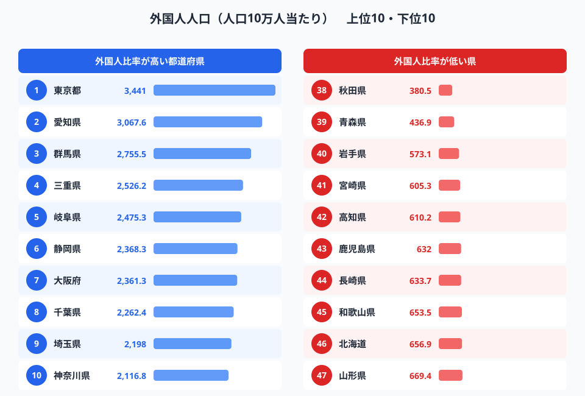
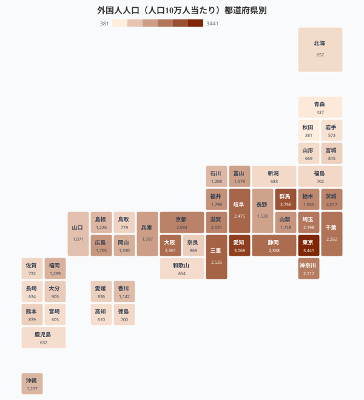
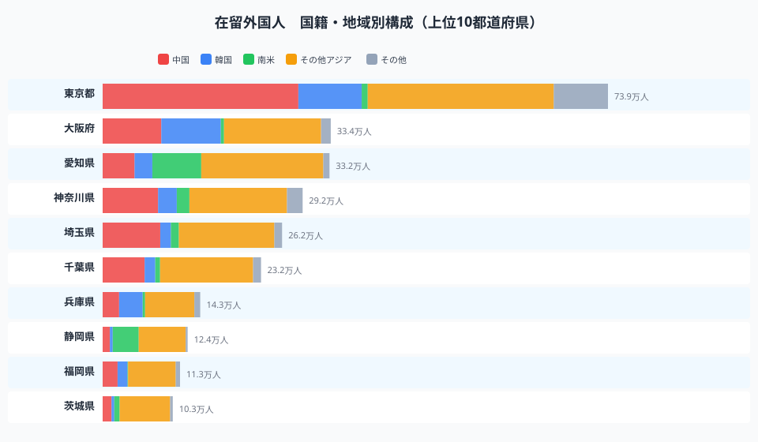
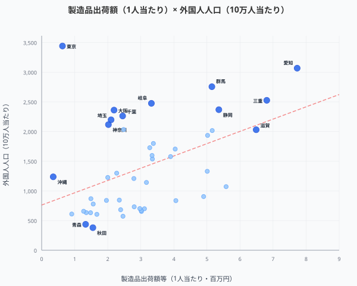
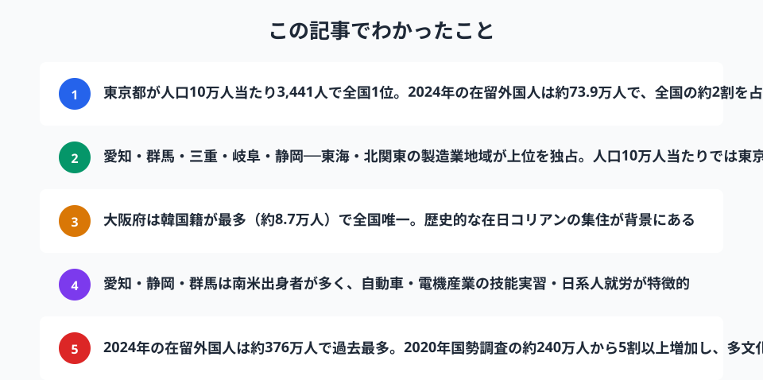

日本に暮らす外国人は2024年末時点で**約376万人**。過去最多を更新し続けています。しかし、その分布は全国一律ではありません。人口に対する外国人比率が3%を超える都道府県がある一方、1%に満たない県もあります。

本記事では、国勢調査の**人口10万人当たり外国人人口**で都道府県をランキングし、さらに2024年の在留外国人統計から**国籍・地域別の構成**を可視化します。「なぜその県に外国人が多いのか」を、産業構造や歴史的背景とともに読み解きましょう。

> [!NOTE]
> 人口10万人当たり外国人人口は、総務省「国勢調査」（2020年）の外国人人口を総人口で割った値。在留外国人数は法務省「在留外国人統計」（2024年末）による。両者は調査方法が異なるため、数値に差があります。

## 外国人人口ランキング（人口10万人当たり）

<data-source url="https://www.e-stat.go.jp/dbview?sid=0000010201" label="e-Stat 社会・人口統計体系（人口10万人当たり）"></data-source>

**1位は[東京都](/areas/13000)の3,441人**（人口10万人当たり）。約3.4%の住民が外国人という計算です。2024年の在留外国人数では約73.9万人に達し、全国の約2割が東京に集中しています。

注目すべきは**2位以下の顔ぶれ**です。愛知県（3,068人）、群馬県（2,756人）、三重県（2,526人）、岐阜県（2,475人）、静岡県（2,368人）と、**東海・北関東の製造業県が上位を占めます**。自動車・電機産業の工場が集積するこれらの地域では、技能実習生や日系ブラジル人・ペルー人の就労者が多く、外国人比率を押し上げています。

一方、**最も外国人が少ないのは[秋田県](/areas/05000)の381人**（10万人当たり）。青森県（437人）、岩手県（573人）と東北地方が下位に集中します。1位の東京と47位の秋田では**約9倍の差**があり、「多文化共生」の実感には大きな地域差があるのが現実です。

### 全国マップ

<data-source url="https://www.e-stat.go.jp/dbview?sid=0000010201" label="e-Stat 社会・人口統計体系（人口10万人当たり）"></data-source>

マップで見ると、**東京を中心とした首都圏と東海地方が濃い赤色**に染まります。大阪府（2,361人）も7位と高水準です。

対照的に、**東北6県と四国の多くが薄い色**のままです。鹿児島県（693人）、北海道（657人）も全国平均を大きく下回ります。沖縄県（1,008人）は観光・米軍基地の影響で南九州よりはやや高めですが、上位には入りません。

<source-link href="/ranking/foreign-resident-count-per-100k">47都道府県の外国人人口ランキングをもっと見る</source-link>

## 国籍・地域別に見る──「どこの国の人が、どの県に多いか」

外国人の数だけでなく、**出身国の構成**を見ると、各県の産業構造や歴史が浮かび上がります。2024年の在留外国人統計から、上位10都道府県の国籍・地域別構成を可視化しました。

<data-source url="https://www.e-stat.go.jp/dbview?sid=0000010101" label="e-Stat 社会・人口統計体系（在留外国人）"></data-source>

### 東京都──中国籍が最多、多国籍化も進行

東京都の在留外国人約73.9万人のうち、**中国籍が約28.6万人（38.7%）で最多**。韓国籍9.3万人（12.5%）を大きく引き離しています。IT・金融・飲食・留学と幅広い分野で中国出身者が増加しています。「その他アジア」にはベトナム・ネパール・ミャンマーなどが含まれ、近年特にベトナム籍の増加が顕著です。

### 大阪府──全国唯一「韓国籍が最多」の都道府県

大阪府は**韓国籍が約8.7万人で中国籍（8.6万人）をわずかに上回る、全国で唯一の都道府県**です。大阪市生野区をはじめとする在日コリアンの歴史的な集住地域が背景にあります。中国籍の増加で近年その差は縮まりつつありますが、なお韓国籍が最多を維持しています。

### 愛知県・静岡県・群馬県──南米出身者が際立つ製造業地域

愛知県の南米出身者は**約7.2万人**で全国最多。静岡県（約3.8万人）、群馬県（約2.0万人）と合わせ、東海・北関東の製造業地域に集中しています。1990年の入管法改正で日系人の就労が容易になったことがきっかけで、トヨタ・スズキ・SUBARUなどの自動車産業を中心にブラジル・ペルー出身の日系人が定住しました。

### 兵庫県──韓国籍が3.4万人、神戸の多文化都市

兵庫県は韓国籍が約3.4万人で全体の約24%。大阪に次いで韓国籍比率が高い県です。神戸市長田区を中心とした在日コリアンコミュニティに加え、神戸港を通じた国際交流の歴史が影響しています。

> [!TIP]
> 「その他アジア」にはベトナム・フィリピン・インドネシア・ネパール・ミャンマーなど多くの国籍が含まれます。近年はベトナム籍が急増しており、技能実習生・特定技能での来日が中心です。

<ad-slot></ad-slot>

## なぜ「製造業県」に外国人が多いのか

ランキングの上位を見ると、東京・大阪のような大都市だけでなく、群馬・三重・岐阜・静岡といった**人口規模では中位の県**が並んでいます。これらに共通するのは**製造業の集積**です。

<data-source url="https://www.e-stat.go.jp/dbview?sid=0000010201" label="e-Stat 社会・人口統計体系"></data-source>

散布図を見ると、1人当たり製造品出荷額と外国人比率には**正の相関（r=0.45）**があります。**愛知・三重・滋賀・静岡**が右上に位置し、製造業が盛んな県ほど外国人が多い傾向が明確です。

一方、**東京都は最大の外れ値**です。製造品出荷額は全国平均以下ですが、外国人比率は断トツの1位。東京の外国人はIT・金融・飲食・留学など**第三次産業が中心**で、製造業とは異なるルートで集まっています。大阪・埼玉・千葉・神奈川も同様に、製造業以外の要因（都市機能・サービス業・留学）が外国人を引きつけるグループです。

1990年の入管法改正で「定住者」の在留資格が整備され、日系ブラジル人・ペルー人が製造業の現場で働けるようになりました。愛知県の豊田市・豊橋市、群馬県の太田市・大泉町、静岡県の浜松市などでは、地域社会に日系南米人のコミュニティが根づいています。

群馬県大泉町は**町人口の約19%が外国人**という全国トップクラスの比率で知られ、ポルトガル語の看板やブラジル料理店が並ぶ独特の風景が広がっています。

近年はさらに技能実習制度・特定技能制度を通じて、**ベトナム・インドネシア・ミャンマー**からの来日者が急増。製造業に加え、農業・介護・建設の現場でも外国人材の存在感が高まっています。

## 2020年→2024年で在留外国人は5割増

国勢調査（2020年）の外国人人口は約240万人でしたが、2024年末の在留外国人数は**約376万人**。わずか4年で**約56%増加**しています（調査方法の違いによる差を含む）。

この急増の背景には、コロナ禍の入国制限解除後の反動増、技能実習・特定技能による受け入れ拡大、円安でも続く来日需要の強さがあります。2024年には技能実習に代わる「育成就労」制度の法案も成立し、外国人材の受け入れは今後さらに拡大する見通しです。

<ad-slot></ad-slot>

## まとめ

外国人が多い県と少ない県では、人口当たり比率に**約9倍**の開きがあります。多文化共生は一部の地域だけの話ではなく、制度・教育・コミュニティの各レベルで全国的に取り組むべきテーマです。自分の住む都道府県がどのような状況にあるのか、ランキングとマップで確認してみてください。

## データ出典

本記事のデータはe-Stat（政府統計の総合窓口）を基に作成しています。

本記事の対象データ: [関連カテゴリ](/category/population)
