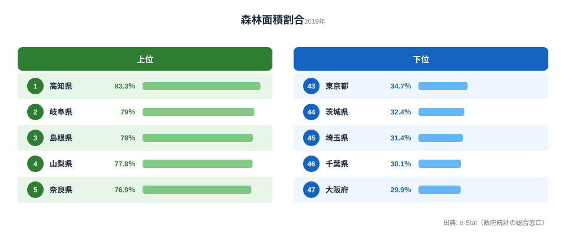
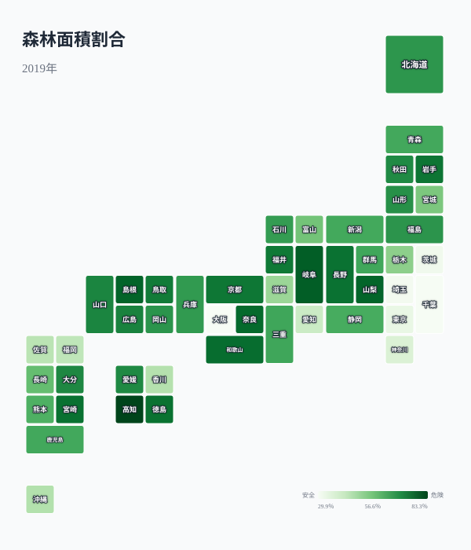
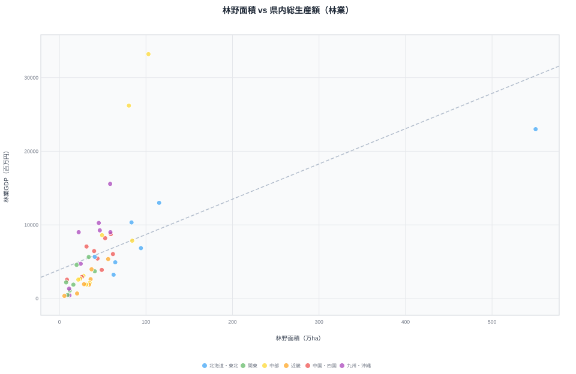
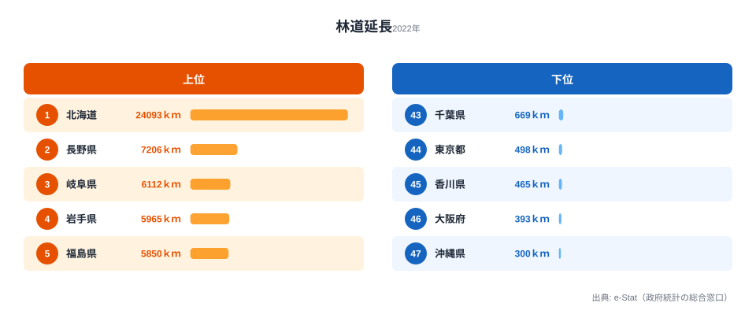
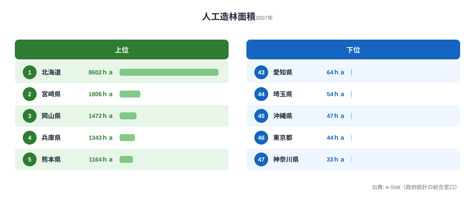
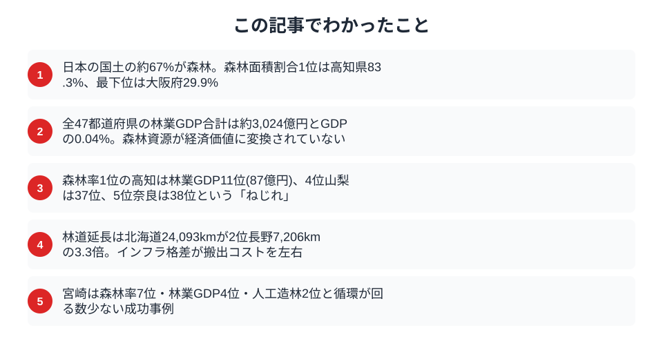

日本の国土の約67%は森林に覆われています。これはフィンランド、スウェーデンに次ぐ先進国トップクラスの森林率です。ところが、林業が生み出す付加価値は全47都道府県の合計でわずか約3,024億円。日本のGDPの0.04%程度に過ぎません。

「森林大国」でありながら「林業後進国」という矛盾は、どこから生まれているのでしょうか。先に結論を言えば、森林の「広さ」と林業の「稼ぎ」はまったく比例していません。森林率1位の高知県は林業GDPでは11位、森林率4位の山梨県にいたっては37位まで落ち込みます。この記事では、都道府県別の統計データから、森林資源と林業経済のあいだに横たわる「ねじれ」の正体を、林道インフラ・再造林・産業集積という3つの視点で検証していきます。

## 森林面積割合ランキング──1位は高知県の83.3%

まず、都道府県別の森林面積割合（県土面積に占める森林の比率）を見てみましょう。

<source-link href="/ranking/forest-area-ratio">47都道府県の森林面積割合ランキングをもっと見る</source-link>

1位は **[高知県](/areas/39000)の83.3%** で、県土の8割以上が森林です。2位の岐阜県（79%）、3位の島根県（78%）、4位の山梨県（77.8%）、5位の奈良県（76.9%）と続き、上位の県はすべて70%台後半に集中しています。これらに共通するのは、平野が乏しく、急峻な山地が県土の大半を占める地形です。高知は四国山地、岐阜は飛騨高地、奈良・山梨は紀伊山地と関東山地という具合に、人が住める平地が限られるからこそ、相対的に森林の割合が高くなります。実際、[住める土地の割合](/blog/habitable-area-land-use)を見ると高知は16%しかなく、森林率の高さは可住地の狭さと表裏一体です。

一方、下位を見ると大阪府（29.9%）、千葉県（30.1%）、埼玉県（31.4%）、茨城県（32.4%）、東京都（34.7%）と続きます。いずれも太平洋ベルトや関東平野に位置し、市街地・農地・住宅地に土地が転用された都府県です。森林率が低いのは「森林が消えた」結果というより、もともと開発に向く平地が広く、人口と産業がそこに集積したことの裏返しと言えます。47都道府県の平均は約61.6%で、半数以上の県が60%以上の森林率を保っています。

### タイルマップで見る森林面積割合

地理的な分布を見ると、森林率の高い県には明確なベルト構造があります。

紀伊半島から四国、中国山地にかけての西日本山地ベルトと、東北から中部にかけての脊梁山脈沿いに、濃く色づいた高森林率の県が連なっているのが見て取れます。逆に淡い色で示されるのは、大阪・埼玉・千葉といった太平洋ベルト沿いの都市県と、関東平野の茨城です。

> [!TIP]
> 森林率は「県土に占める割合」なので、面積が小さく山がちな県ほど高く出ます。後で見る林野面積（実面積）とは別物で、たとえば森林率22位の北海道は割合では平凡でも、実面積では全国の他県を圧倒します。「割合の地図」と「実面積の散布図」を分けて読むのが、この指標を取り違えないコツです。

## 林業GDP の現実──散布図で見る断絶

森林面積が広ければ林業が盛んかというと、そう単純ではありません。林野面積（ha）と県内総生産額・林業（百万円）の関係を散布図で確認します。

<source-link href="/ranking/forest-area">47都道府県の林野面積ランキングをもっと見る</source-link>

> [!NOTE]
> 林野面積は2019年度、県内総生産額（林業）は2020年度のデータを使用しています。年度が異なる点にご留意ください。林業GDPは「県民経済計算」上の林業部門の付加価値で、木材生産だけでなく素材生産・育林・特用林産物（きのこ等）を含みます。

散布図を見ると、点が右肩上がりの一直線には乗らず、大きく散らばっているのがわかります。仮に「森林が広いほど林業が稼げる」なら点は対角線上に並ぶはずですが、現実はそうなっていません。

その断絶を象徴するのが北海道です。林野面積は約550万haと2位以下を引き離して圧倒的に広いのに、林業GDPは約230億円で全国3位。面積の大きさが、そのまま稼ぎの大きさには結びついていません。逆に長野県は林野面積約103万haと北海道の5分の1ほどですが、林業GDPは約332億円で堂々の1位です。さらに新潟県は林野面積約80万haで林業GDP2位（約262億円）と、面積の割に高い付加価値を生んでいます。

つまり林業の稼ぎを決めているのは「森林の広さ」ではなく、その森林をどれだけ「木材として搬出し、加工・流通させられるか」という産業の厚みです。全47都道府県の林業GDPの合計は約3,024億円。1位の長野県でさえ約332億円にとどまり、産業全体としての規模の小ささが浮かび上がります。

### 森林率と林業GDPの「ねじれ」

森林面積割合の上位県と林業GDPの順位を並べると、両者のミスマッチが鮮明になります。森林率の高い順に、各県の林業GDP順位を追ってみましょう。

- **高知県**（森林率1位・83.3%）── 林業GDPは11位の約87億円
- **岐阜県**（森林率2位・79.0%）── 林業GDPは14位の約79億円
- **山梨県**（森林率4位・77.8%）── 林業GDPは37位の約21億円
- **奈良県**（森林率5位・76.9%）── 林業GDPは38位の約20億円
- **宮崎県**（森林率7位・75.5%）── 林業GDPは4位の約156億円
- **長野県**（森林率9位・75.3%）── 林業GDPは1位の約332億円

森林率トップ5に入る山梨県と奈良県の林業GDPが、それぞれ37位・38位とほぼ最下位グループに沈んでいるのは象徴的です。山梨は林野面積約35万ha、奈良は約28万haと、森林の「実面積」では中位以下にとどまり、加えて急峻な紀伊・関東山地のため搬出コストが高く、木材産地としての産業集積も乏しいまま観光・別荘地としての森林利用に傾いてきました。森林という資産は持っていても、それを経済活動に変換する回路が細いのです。

対照的に、宮崎と長野は森林率でも上位に入りながら、林業GDPでも4位・1位と高い水準を実現しています。両県は後で見る林道整備や人工造林でも上位に位置しており、「森林を持つ」だけでなく「森林を回す」仕組みが備わっている数少ない例です。

<ad-slot></ad-slot>

## 林道インフラの格差──北海道が圧倒的1位

林業の活性化を阻む構造的な要因として、林道整備の格差があります。伐採した木材を山から運び出すには林道が不可欠ですが、その整備状況には大きな地域差があります。

<source-link href="/ranking/forest-road-length">47都道府県の林道延長ランキングをもっと見る</source-link>

北海道が24,093kmと、2位の長野県（7,206km）の約3.3倍という圧倒的な延長を誇ります。3位の岐阜県（6,112km）、4位の岩手県（5,965km）、5位の福島県（5,850km）が続き、上位には森林率・林業GDPともに高い県が顔をそろえています。北海道の林業GDP（3位・約230億円）が広大な林野面積に比して相対的に低いのは、24,000kmの林道をもってしてもなお、550万haという面積に対する林道密度が追いついていない可能性を示唆します。

下位を見ると、沖縄県（300km）、大阪府（393km）、香川県（465km）、東京都（498km）、千葉県（669km）と、もともと森林面積が少ない県が並びます。これは当然の帰結ですが、注目すべきは林道延長の上位と林業GDPの上位がかなり重なる点です。長野・岩手・福島・岐阜といった林道上位県は、いずれも林業GDPでも上位グループに位置しています。木材を運び出す「動脈」が太い県ほど、森林を稼ぎに変えられているという関係が読み取れます。

> [!WARNING]
> 林道延長と林業GDPには一定の相関が見られますが、これは「林道を伸ばせば必ず稼げる」という因果を意味するわけではありません。林業が盛んな県だからこそ林道整備が進んだ、という逆の因果も同時に働きます。新たに林道へ投資する際は、搬出される木材量や加工拠点の有無とあわせて費用対効果を見極める必要があります。

## 人工造林面積──再造林の現状

伐採した後にどれだけ植え直すか（人工造林）は、森林を「使い切り」にせず持続的な資源として回せるかを左右する重要な指標です。

<source-link href="/ranking/artificial-forest-area">47都道府県の人工造林面積ランキングをもっと見る</source-link>

> [!NOTE]
> 人工造林面積は2007年度のデータです。近年の動向とは異なる可能性があり、最新の再造林率を示すものではありません。

北海道が8,602haで1位、2位の宮崎県（1,806ha）の約4.8倍です。ここでも宮崎県の存在が光ります。宮崎は森林率7位（75.5%）、林業GDP4位（約156億円）、そして人工造林2位と、「広く・稼ぎ・植え直す」の3拍子がそろった、本記事で唯一とも言える好循環の県です。スギを主体とした集約的な林業経営と、伐採後すぐに植林へ回す再造林の体制が、産業としての林業を成り立たせています。3位の岡山県（1,472ha）、4位の兵庫県（1,343ha）、5位の熊本県（1,164ha）と、西日本の木材産地が続きます。

一方、下位を見ると神奈川県（33ha）、東京都（44ha）、沖縄県（47ha）、埼玉県（54ha）、愛知県（64ha）と、大都市圏や亜熱帯の県が並びます。これらの県では、伐採そのものが少ないために再造林の規模も小さく、森林は木材生産より水源涵養や景観・レクリエーションといった「公益的機能」を担う場として位置づけられています。

<ad-slot></ad-slot>

## まとめ

日本の森林資源と林業経済の関係を5つのポイントに整理します。

日本の森林は面積だけ見れば世界有数の資源ですが、その経済価値への変換率は極めて低いのが実情です。山梨・奈良のように森林率75%超でも林業GDPが20億円台の県がある一方、宮崎のように森林率と林業GDPの両方で上位に入る県もあります。

その差を生んでいるのは、林道インフラの整備、人工造林による資源の循環、そして木材加工・流通の産業集積です。森林を「持っている」ことと、森林で「稼げる」ことのあいだには、これらの回路があるかどうかという深い溝が横たわっています。

近年はカーボンクレジット取引の拡大、CLT（直交集成板）による木造ビルの建設ラッシュ、木質バイオマス発電の普及など、森林の価値を「木材」以外の形で引き出す動きが加速しています。森林面積割合の高い県にとって、これらは林業GDPを押し上げる新たな成長エンジンになりえます。地域の森林政策を考えるうえでは、自県の[農業や土地利用](/category/agriculture)の構造とあわせて、森林資源の活かし方を捉え直すことが出発点になるでしょう。

「宝の持ち腐れ」と言われてきた日本の森林資源が、データが示すポテンシャルどおりに活かされる日が来るかどうか。その答えは、インフラ投資と新技術の社会実装の速度にかかっています。

## データ出典

- 森林面積割合・人工造林面積・林道延長：総務省統計局「社会・人口統計体系」（e-Stat 政府統計の総合窓口経由で整備）
- 県内総生産額（林業）：内閣府「県民経済計算」（同上）
- 森林面積割合は2019年度、林野面積は2019年度、県内総生産額（林業）は2020年度、林道延長は2022年度、人工造林面積は2007年度の値を使用しています。
