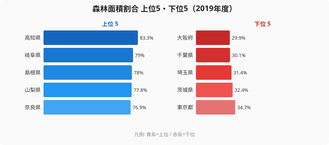
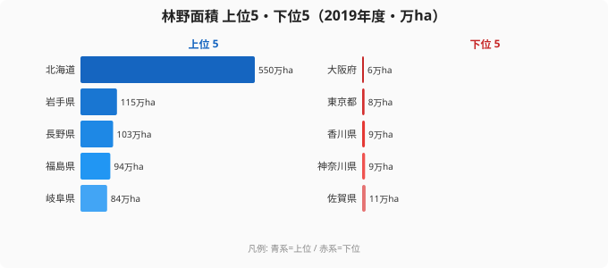
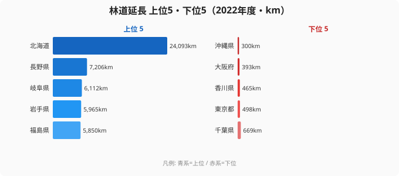
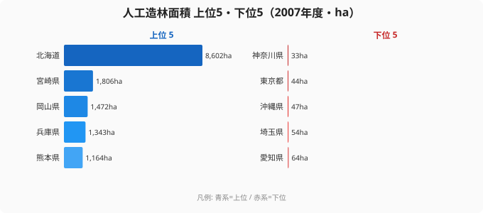

日本の国土の約67%は森林に覆われています。これはフィンランド、スウェーデンに次ぐ先進国トップクラスの森林率です。ところが、林業が生み出す付加価値は全47都道府県を合計してもわずか約3,024億円で、日本のGDPの0.04%程度にとどまっています。

「森林大国」でありながら「林業後進国」という、このねじれはどこから生まれているのでしょうか。森林面積割合・林野面積・林道延長・人工造林面積という4つの都道府県データを並べてみると、森林資源そのものの量と、それを経済に変換する力とがまったく別物であることが見えてきます。森林の「広さ」を持つ県と、森林を「活かせている」県は、必ずしも一致しないのです。

## 森林率が高いのはどこか──高知の83.3%と大阪の29.9%

まず、県土面積に占める森林の比率である森林面積割合を見てみましょう。上位5県と下位5県を並べたのが次のグラフです。

トップは高知県の83.3%で、県土の8割以上が森林に覆われています。続く岐阜県（79.0%）、島根県（78.0%）、山梨県（77.8%）、奈良県（76.9%）も7割を大きく超えており、[森林面積割合ランキング](/ranking/forest-area-ratio)の上位10県はいずれも70%以上を占めています。紀伊半島から四国、中国山地、そして東北・中部の山岳地帯へと連なる「背骨」のような地形が、これらの県の高い森林率を支えています。急峻な山地は農地にも宅地にも転用しづらく、結果として森林がそのまま残されてきたのです。

一方、下位には大阪府（29.9%）、千葉県（30.1%）、埼玉県（31.4%）、茨城県（32.4%）、東京都（34.7%）が並びます。いずれも太平洋ベルトに沿った平野部の都府県で、人口と産業が集中する関東平野・大阪平野では、平地が森林ではなく市街地や農地として使われてきました。最上位の高知と最下位の大阪では森林率に2.79倍の開きがあり、これは「地形が土地利用を決める」という、日本列島の地理がそのまま映し出された格差だと言えます。なお、47都道府県の平均は約61.6%で、60%以上の森林率を持つ県は31と、半数を大きく超えています。日本がいかに森林に恵まれた国かが、この数字からもわかります。

> [!NOTE]
> 森林面積割合は「県土面積に占める森林の割合」であり、森林の絶対量（面積）とは別の指標です。森林率が高くても県土自体が小さければ、林業の事業規模としては小さくなります。次のセクションで見る林野面積と混同しないようにご注意ください。

<source-link href="/ranking/forest-area-ratio">森林面積割合ランキングをもっと見る</source-link>

## 森林の「広さ」では北海道が圧倒する

森林率（割合）が高くても、県が小さければ森林の絶対量は限られます。そこで、森林の実面積である林野面積を見てみましょう。

[林野面積ランキング](/ranking/forest-area)では北海道が約550万haで断トツの1位となり、2位の岩手県（約115万ha）、3位の長野県（約103万ha）、4位の福島県（約94万ha）、5位の岐阜県（約84万ha）を大きく引き離しています。北海道は森林率こそ全国トップではありませんが、広大な道土そのものが森林の絶対量を生み出しているのです。一方、下位には大阪府（約5.7万ha）、東京都（約7.7万ha）、香川県（約8.7万ha）、神奈川県（約9.4万ha）、佐賀県（約11万ha）が並びます。最大の北海道と最小の大阪では、林野面積に約96倍もの開きがあります。

ここで重要なのは、森林率と林野面積で「主役」が入れ替わる点です。森林率トップの高知県は、県土が小さいため林野面積では上位5に入りません。逆に北海道は森林率では全国トップではないものの、面積では他を圧倒します。つまり「森林に覆われている割合」と「森林を実際にどれだけ持っているか」は、まったく別の話なのです。そして林業の生産力に直結するのは、割合ではなく後者の絶対量です。にもかかわらず、林業が生む付加価値は全国合計で約3,024億円にすぎず、最大の長野県でさえ約332億円にとどまります。森林の量がそのまま経済価値に変換されているわけではない――この断絶こそが、日本の林業が抱える根本的なねじれです。

> [!WARNING]
> 森林面積が広い県が必ずしも林業で稼げているわけではありません。北海道は林野面積で圧倒的1位ですが、林業GDPは長野県や宮崎県に及びません。山梨県や奈良県のように森林率75%超でも林業の付加価値が20億円台にとどまる県もあり、「森林がある」ことと「林業が成り立つ」ことは分けて考える必要があります。

<source-link href="/ranking/forest-area">林野面積ランキングをもっと見る</source-link>

<ad-slot></ad-slot>

## 林道インフラの格差が搬出コストを左右する

森林の量を経済価値に変えるには、木材を山から運び出す道、すなわち林道が欠かせません。林道が整っていなければ、せっかくの木材も伐採・搬出のコストが見合わず、立木のまま放置されてしまいます。林道延長を見てみましょう。

[林道延長ランキング](/ranking/forest-road-length)でも北海道が24,093kmで圧倒的なトップに立ち、2位の長野県（7,206km）の約3.3倍という延長を誇ります。続く岐阜県（6,112km）、岩手県（5,965km）、福島県（5,850km）も、いずれも林野面積の上位県と顔ぶれが重なります。森林の量が多い県ほど林道整備も進んでおり、資源量とインフラがある程度連動していることがわかります。

下位を見ると、沖縄県（300km）、大阪府（393km）、香川県（465km）、東京都（498km）、千葉県（669km）と、もともと森林面積が少ない県が並びます。森林が少なければ林道も短いのは当然の結果です。注目すべきは北海道で、林野面積でも林道延長でも全国トップでありながら、林業の付加価値では長野県や宮崎県に及びません。これは、広大な面積に対して林道の「密度」がまだ足りておらず、点在する森林をすみずみまでカバーしきれていない可能性を示しています。インフラの総延長だけでなく、面積あたりでどれだけ密に整備されているかが、搬出効率を左右するのです。

> [!TIP]
> 林道延長と林業の付加価値には一定の関係が見られます。長野・岩手・福島といった林道上位県は、森林資源を経済に結びつけている県と重なります。森林率（割合）ではなく、林野面積と林道延長という「量とインフラ」のセットで見ると、どの県が林業で稼げるかの輪郭が見えてきます。

<source-link href="/ranking/forest-road-length">林道延長ランキングをもっと見る</source-link>

## 人工造林が示す「資源の循環」

伐採したあとに植え直す人工造林は、森林を一度限りの資源で終わらせず、次の世代へ循環させる持続可能性の指標です。再造林が進まなければ、いま伐っている森林は数十年後には枯渇してしまいます。

人工造林面積でも北海道が8,602haで1位となり、2位の宮崎県（1,806ha）の約4.8倍にのぼります。注目したいのは宮崎県です。宮崎県は森林率で全国7位（75.5%）に入り、林業の付加価値でも全国上位に位置する数少ない「森林を経済に変えている県」ですが、その背景には活発な人工造林による資源の循環があります。続く岡山県（1,472ha）、兵庫県（1,343ha）、熊本県（1,164ha）も、西日本でスギ・ヒノキの再造林に力を入れてきた地域です。森林を「使いながら育てる」サイクルが、これらの県の林業を支えています。

一方、下位には神奈川県（33ha）、東京都（44ha）、沖縄県（47ha）、埼玉県（54ha）、愛知県（64ha）が並びます。都市部の県は森林そのものが少ないうえ、残った森林も水源涵養や景観保全といった「使わない森林」として位置づけられることが多く、再造林の規模も小さくなります。亜熱帯の沖縄はスギ・ヒノキ林業の対象外という事情もあります。森林率の高い県が必ずしも人工造林の上位に来るわけではなく、山梨県や奈良県のように森林率75%超でも林業の付加価値が伸びない県は、この「資源を循環させる仕組み」が十分に回っていないと考えられます。

> [!NOTE]
> 人工造林面積は2007年度のデータで、ほかの3指標（2019・2022年度）とは年度が異なります。近年の動向とは差がある可能性があるため、トレンドではなく「県ごとの再造林の規模感の比較」として読むのが適切です。

<source-link href="/ranking/artificial-forest-area">人工造林面積ランキングをもっと見る</source-link>

<ad-slot></ad-slot>

## なぜ森林大国は林業で稼げないのか

ここまでの4つのデータを重ねると、日本の森林資源と林業経済のねじれが見えてきます。森林率の高い県（高知・岐阜・島根）、森林の量が多い県（北海道・岩手・長野）、林道が整う県（北海道・長野・岐阜）、再造林が活発な県（北海道・宮崎・岡山）は、それぞれ顔ぶれが少しずつ食い違っています。そして林業の付加価値で上位に立つのは、量・インフラ・循環の3つがそろった長野や宮崎のような県です。森林率トップの高知や、森林率75%を超える山梨・奈良が林業で稼げないのは、面積はあっても、それを運び出す林道と、使いながら育てる再造林という「経済化の装置」が十分でないからだと整理できます。

日本の森林は、面積だけ見れば世界有数の資源です。しかしその経済価値への変換率は極めて低いのが現実です。差を生んでいるのは、林道インフラの密度、人工造林による資源の循環、そして木材加工・流通の産業集積です。森林という素材を持っているだけでは付加価値は生まれず、それを運び・育て・加工する仕組みがそろって初めて、林業は産業として成り立ちます。

近年は、森林の炭素吸収を取引するカーボンクレジット、CLT（直交集成板）による木造ビルの建設、木質バイオマス発電の普及など、森林の価値を「木材」以外の形で引き出す動きが加速しています。森林率や林野面積で上位に立つ県にとって、これらは林業の付加価値を押し上げる新しい成長エンジンになりえます。「宝の持ち腐れ」と言われてきた日本の森林資源が、データの示すポテンシャルどおりに活かされるかどうかは、インフラ投資と新技術の社会実装をどれだけ速く進められるかにかかっています。

## データ出典

- e-Stat 社会・人口統計体系（総務省）
- 森林面積割合・林野面積・林道延長・人工造林面積は e-Stat を経由して整備したデータを使用
