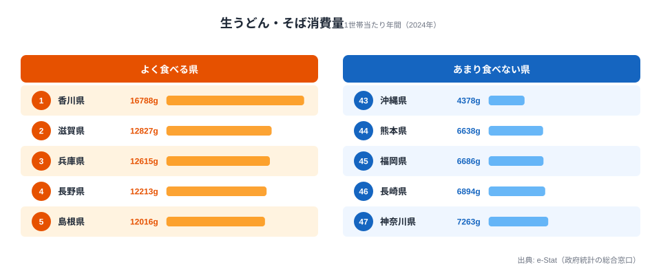

「うどん県」を自称する香川県は、本当に他県より多く生うどん・そばを食べているのでしょうか。総務省「家計調査」2024年の1世帯当たり年間消費量を47都道府県で比べると、1位の香川県は **16,788g** で、2位の滋賀県（12,827g）を4,000g近く突き放しています。最下位の沖縄県（4,378g）との差は **3.83倍**。西日本が上位を占め、九州・沖縄が下位に沈むという、東西・南北の食文化格差がはっきりと浮かび上がります。

この記事では、香川の突出ぶりと「西高東低」が起きる理由を、家計データに即して読み解きます。

> [!NOTE]
> ここでいう「生うどん・そば」は、家計調査の品目分類で**生（なま）の麺**を指します。乾麺（乾うどん・そば）やカップ麺、外食で食べるうどん・そばは別カテゴリで集計されるため、この数字には含まれません。あくまで「家庭で生麺を買って調理する量」を表す指標です。

## 上位と下位 — 香川が突出、西日本が席巻

まず、生うどん・そばをよく食べる県とあまり食べない県を、上位5県・下位5県で見比べてみます。

香川県は16,788gで、全国平均（約9,918g）の1.7倍に達します。「うどん県」のキャッチコピーが、家計データでもはっきり裏付けられた格好です。注目すべきは2位以下の顔ぶれで、滋賀・兵庫・島根・高知・岡山・徳島と **西日本勢が上位を埋めています**。長野県（4位）は信州そば文化、群馬県（9位）は水沢うどん・館林うどんといった在来麺文化が、消費量を押し上げる要因になっていると考えられます。一方で、東京・神奈川・千葉といった関東の大消費圏は上位に入っていません。

<source-link href="/ranking/fresh-udon-soba-consumption-quantity">生うどん・そば消費量ランキング（全47都道府県）をもっと見る</source-link>

下位グループに目を移すと、最下位5県のうち4県を九州・沖縄が占めています。沖縄県の4,378gは1位香川県のわずか26%で、3.83倍もの開きがあります。福岡（45位）・熊本（46位）・長崎（44位）は米食とラーメン文化が強く、家庭で生のうどん・そばを調理する頻度が低いと推測されます。神奈川県（43位）は外食依存度の高さが、家庭内での購入量を押し下げている可能性があります。

ここで見落としたくないのは、上位と下位の差が「東西」だけでなく「太平洋ベルトの大都市圏かどうか」とも重なる点です。神奈川（43位）のように人口が多く外食産業が発達した県では、麺を「外で食べる」選択肢が増え、家庭での生麺購入が相対的に減ります。逆に香川・島根・徳島のような県では、家庭で生麺を茹でて食べる習慣が日常に深く根づいています。同じ「うどん・そばを食べる」行為でも、それが家計簿のどこに計上されるか（食料品費か外食費か）は県によって大きく異なり、この指標はその「家庭での調理」の側面だけを切り取っているのです。

> [!WARNING]
> 沖縄が最下位である点は、食文化の単純な「少なさ」とは限りません。沖縄では小麦麺の「沖縄そば」が日常食ですが、これは家計調査の「生うどん・そば」とは別カテゴリで計上されます。つまり沖縄の麺食習慣の多くが、この指標の外側にこぼれ落ちている可能性があるのです。順位だけで「沖縄は麺を食べない県」と読むのは早計です。

## なぜ「西高東低」が起きるのか

上位と下位の地理的な偏りは、いくつかの構造で説明できます。それぞれ仮説として整理します。

- **[仮説A] 小麦在来麺文化の有無**：讃岐うどん（香川）・出雲そば（島根）・信州そば（長野）・水沢うどん（群馬）など、地元に根付く生麺文化を持つ県が上位に集中しています。生麺の地産流通網と家庭調理の習慣が、消費量を底上げしている可能性があります。検証には、各県の製麺所密度や生麺の地場流通量との相関を確かめる必要があります。
- **[仮説B] 米食・他麺文化との競合**：九州・沖縄では米・ラーメン・沖縄そばが主食の中心を占め、生うどん・そばが家庭の麺料理の選択肢から外れやすいと考えられます。米消費量との反相関が想定されますが、これは別データとの突き合わせが必要です。
- **[仮説C] 家計内消費と家計外消費の差**：本データは家庭での購入量がベースで、観光客が食べる讃岐うどん（外食）は含まれません。それでもなお香川が突出している事実は、県民自身の家庭消費が極めて高いことを示しています。香川では「家でも外でもうどんを食べる」二重構造が成立しているとみられ、観光向けの外食消費を加えれば、実際の県全体のうどん消費はこの順位以上に他県を引き離している可能性があります。

3つの仮説に共通するのは、生うどん・そばの消費量が「単なる嗜好」ではなく、その土地に在来麺の生産・流通・調理文化が根づいているかどうかという、地理的・歴史的な厚みを反映している点です。讃岐うどん（香川）や出雲そば（島根）が観光資源として全国区になっているのも、もとをたどれば各家庭の日常食として消費の裾野が広いことの裏返しだと読み取れます。

> [!TIP]
> この指標は「家庭で買う生麺」に限られるため、観光や外食で有名な県の実力を見落としがちです。香川の食文化を立体的に捉えるには、家庭消費だけでなく外食ベースの[日本そば・うどん外食消費支出ランキング](/ranking/soba-udon-dining-consumption-expenditure)や、乾麺タイプの[乾うどん・そば消費量ランキング](/ranking/dried-udon-soba-consumption-quantity)と併せて読むと、生麺・乾麺・外食の三層で県ごとの「麺の食べ方」が見えてきます。

## まとめ

- 香川県は16,788gで全国1位、全国平均（約9,918g）の1.7倍を消費する圧倒的な「うどん県」です。
- 1位香川と47位沖縄の格差は **3.83倍**。上位は香川・滋賀・兵庫・長野・島根が並び、四国・近畿・山陰・甲信の西日本〜中部勢が席巻しています。
- 沖縄・九州（熊本・福岡・長崎）が下位に集中し、米食・ラーメン・沖縄そば文化との競合が背景にある可能性があります。
- 長野（信州そば）・群馬（水沢うどん）・島根（出雲そば）など、在来麺文化を持つ県が上位に入っています。
- 本データは家計内の購入量ベースで、観光地での外食消費（讃岐うどん観光など）は含まない点に注意が必要です。麺食文化を含む消費・経済データのさらに広い地理は[経済カテゴリ](/category/economy)の各ランキングからたどれます。

## データ出典

- 総務省統計局「家計調査」2024年（二人以上の世帯・品目分類「生うどん・そば」）
- e-Stat: 政府統計の総合窓口（https://www.e-stat.go.jp/）
- データ取得: 2026-05-17 時点の公表値、1世帯当たり年間消費量（g）
