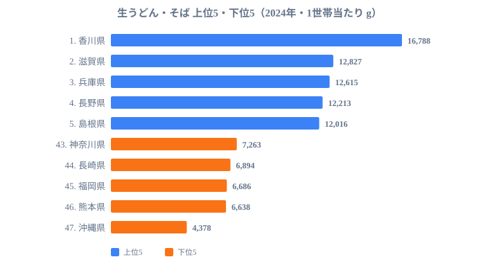

「うどん県」を自称する香川県は、家計データでも本当に他県より多く生うどん・そばを食べているのでしょうか。総務省「家計調査」2024年の1世帯当たり年間消費量を47都道府県で比べると、香川県は **16,788g** で堂々の首位に立ち、2位の滋賀県（12,827g）を4,000g近く突き放しています。最も少ない沖縄県（4,378g）との差は **約3.8倍** にのぼります。

この記事の核心は、単に香川が多いという事実ではありません。上位を西日本がほぼ独占し、九州・沖縄が下位に沈むという、はっきりした地域の偏りが見えることです。なぜ「西高東低」が起きるのか、その背景を家計データから読み解いていきます。

> [!NOTE]
> ここで言う「生うどん・そば」は、家計調査の品目分類で生麺（ゆで麺・半生を含む）を指します。乾麺は「乾うどん・そば」、店で食べる外食分は「うどん・そば（外食）」として別の品目に計上されます。本データは家庭で購入した生麺の量だけを表すため、観光地で食べる讃岐うどん（外食）は含まれていません。

## 上位を西日本が独占、香川が突出

最新の2024年データで、上位5県と下位5県を1枚の図にまとめました。上位（青）と下位（橙）の開きが、そのまま生うどん・そば消費の地域差を表しています。

<source-link href="/ranking/fresh-udon-soba-consumption-quantity">生うどん・そば消費量ランキングをもっと見る</source-link>

香川県の16,788gは、全国平均（約9,918g）の約1.7倍に達します。「うどん県」のキャッチコピーが、家計データでもしっかり裏付けられた格好です。注目したいのは2位以下の顔ぶれで、滋賀・兵庫・島根・高知・岡山・徳島と、西日本勢が上位に厚く並びます。本文で挙げた西日本の6県だけでなく、近畿の奈良県も10位に入っており、近畿・中国・四国の食文化圏が上位を厚く占めていることが分かります。

関東からはわずかに群馬県（9位）が顔を出すのみで、東京・神奈川・千葉といった大消費圏は上位に入っていません。上位10県の内訳を地方別に整理すると、四国が3県（香川・高知・徳島）、近畿が3県（滋賀・兵庫・奈良）、中国が2県（島根・岡山）、これに甲信の長野と関東の群馬が1県ずつ加わって10県になります。麺の消費量は人口の多さではなく、その土地に根付いた麺文化の濃さで決まることが見て取れます。

長野県（4位）は信州そばの文化が、群馬県（9位）は水沢うどん・館林うどんといった在来の小麦麺文化が、それぞれ消費量を押し上げている要因だと考えられます。これらの県は、生麺を地元で日常的に買って食べる習慣が家計に表れているのでしょう。

## 下位は九州・沖縄に集中する

上の図で橙色の帯が短く伸びているのが、消費量の少ない下位5県です。43位の神奈川県（7,263g）から始まり、44位長崎県（6,894g）、45位福岡県（6,686g）、46位熊本県（6,638g）、そして47位の沖縄県（4,378g）と続きます。下位5県のうち4県を九州・沖縄が占めているのが大きな特徴です。

最下位の沖縄県の4,378gは、首位の香川県のわずか26%にすぎません。沖縄では沖縄そば（小麦麺ではありますが、家計調査の「生うどん・そば」とは別カテゴリーに分類されます）が日常食の中心にあり、家計調査上の「生うどん・そば」項目には計上されにくい食文化の背景があります。

福岡・熊本・長崎の九州勢は、米食とラーメン文化が強い地域です。家庭での麺料理がラーメンや米中心に寄ることで、生うどん・そばを家で調理する頻度が相対的に低くなっていると推測されます。神奈川県（43位）は事情がやや異なり、外食への依存度が高いことが、家庭内での生麺消費を押し下げている可能性があります。

> [!WARNING]
> 下位だからといって「うどん・そばを食べない県」とは限りません。沖縄の沖縄そばのように、別品目に計上される麺文化が盛んな県もあります。本ランキングはあくまで家計調査の「生うどん・そば」品目に限った家庭購入量であり、外食や乾麺、別カテゴリーの麺は含まれない点に注意してください。

## なぜ「西高東低」が起きるのか

上位に西日本、下位に九州・沖縄という構図の背景には、いくつかの要因が重なっていると考えられます。仮説として整理し、それぞれ検証の余地があることを明記しておきます。

- **[仮説A] 小麦在来麺文化の有無**：讃岐うどん（香川）・出雲そば（島根）・信州そば（長野）・水沢うどん（群馬）など、地元に深く根付いた生麺文化を持つ県が上位に集中しています。生麺の地産流通網と家庭での調理習慣が、消費量を底上げしている可能性があります。検証には各県の麺製造業者数や流通量データとの突き合わせが必要です。
- **[仮説B] 米食・他麺文化との競合**：九州・沖縄では米・ラーメン・沖縄そばが食卓の中心を占め、生うどん・そばが家庭の麺料理の選択肢から外れやすいと考えられます。米の消費量や生ラーメンの消費量との反相関が想定されますが、確認には別指標との比較が要ります。麺の原料である小麦そのものの消費地理は、[小麦粉消費量ランキング](https://stats47.jp/ranking/wheat-flour-consumption-quantity)で確認でき、生うどん・そばの上位県との重なりを見る手がかりになります。
- **[仮説C] 家計内消費と家計外消費の差**：本データは家庭での購入量ベースであり、観光客が消費する讃岐うどん（外食）は含まれません。それでもなお香川が突出している事実は、県民自身の家庭での消費が極めて高いことを示しています。

> [!TIP]
> 同じ「麺」でも、家庭で買う生麺・乾麺と、店で食べる外食では順位の出方が変わります。生うどん・そば（家庭の生麺）で香川が突出する一方、外食ベースや乾麺ベースで見ると地域の顔ぶれが入れ替わることがあります。複数の品目を合わせて見ると、その県の「麺の食べ方」の全体像がつかめます。

外食ベースで見るとどうなるかは、日本そば・うどんの[外食消費支出ランキング](https://stats47.jp/ranking/soba-udon-dining-consumption-expenditure)で確認できます。家庭の生麺と外食では、消費が多い県の顔ぶれが変わる点が興味深いところです。乾麺タイプとの違いを見たい場合は、[乾うどん・そば消費量ランキング](https://stats47.jp/ranking/dried-udon-soba-consumption-quantity)も参考になります。

## まとめ

- 香川県は16,788gで全国1位、全国平均（約9,918g）の約1.7倍を消費する圧倒的な「うどん県」です。
- 首位の香川と最下位の沖縄（4,378g）の差は約3.8倍にのぼり、沖縄の消費量は香川の26%にとどまります。
- 上位10県は、四国3県（香川・高知・徳島）・近畿3県（滋賀・兵庫・奈良）・中国2県（島根・岡山）に、甲信の長野と関東の群馬が加わる構成で、西日本の食文化圏が厚く占めています。
- 下位は神奈川を除くと九州・沖縄に集中し、米食・ラーメン・沖縄そば文化との競合が背景にあると考えられます。
- 長野（信州そば）・群馬（水沢うどん）・島根（出雲そば）など、在来の麺文化を持つ県が上位に入っています。
- 本データは家庭での購入量ベースであり、観光地での外食消費（讃岐うどん観光など）は含まれない点に注意が必要です。

## データ出典

- 総務省統計局「家計調査」2024年（二人以上の世帯・品目分類「生うどん・そば」）
- e-Stat: 政府統計の総合窓口（https://www.e-stat.go.jp/）
- データ取得: 2026-05-17 時点の公表値、1世帯当たり年間消費量（g）
