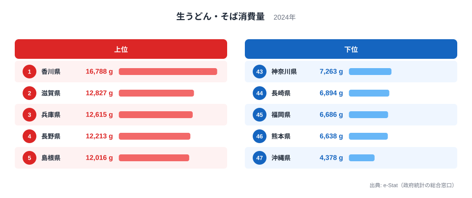

「うどん県」を自称する香川県は、本当に他県より多く生うどん・そばを買っているのでしょうか。総務省「家計調査」2024年の1世帯当たり年間消費量を47都道府県で比べると、1位の香川県は **16,788g** で、2位の滋賀県は12,827gと4,000g近く離されています。最下位の沖縄県は4,378gで、香川県との差は **3.83倍**。西日本が上位を占める一方、下位5県のうち4県は九州・沖縄で、ただし九州の中でも順位は大きく分かれます。

この記事では、香川の突出ぶりと「西高東低」が起きる理由を、家計データに即して読み解きます。

> [!NOTE]
> ここでいう「生うどん・そば」は、家計調査の品目分類で**生（なま）の麺**を指します。乾麺（乾うどん・そば）やカップ麺、外食で食べるうどん・そばは別カテゴリで集計されるため、この数字には含まれません。あくまで「家庭で生麺を買って調理する量」を表す指標です。また、集計の対象は都道府県庁所在市の二人以上世帯で、県全体の平均ではありません。

## 上位と下位 — 香川が突出、近畿以西が上位に多い

まず、生うどん・そばをよく買う県と、あまり買わない県を上位5県・下位5県で見比べます。

香川県は16,788gで、47都道府県の単純平均（約9,918g）の1.7倍に達します。「うどん県」のキャッチコピーが、家計データでも裏付けられた格好です。2位以下は滋賀・兵庫・長野・島根・高知・岡山・徳島・群馬・奈良の順で、上位10県のうち長野県と群馬県を除く8県が近畿以西です。長野県は4位で、信州そばの文化が購入量を押し上げている可能性があります。群馬県は9位で、水沢うどんや館林うどんといった在来の麺文化が背景にあるのかもしれません。

東日本の大消費地は上位に入りません。東京都は41位、神奈川県は43位です。ただし大都市圏が一様に低いわけではなく、大阪府は18位、愛知県は14位、兵庫県は3位と、上位半分に入る都市圏も多くあります。

<source-link href="/ranking/fresh-udon-soba-consumption-quantity">生うどん・そば消費量ランキング（全47都道府県）をもっと見る</source-link>

反対側の最下位は沖縄県で、4,378gは1位香川県のわずか26%です。下位5県の顔ぶれと背景は、次の節で掘り下げます。

## 下位5県の構造 — 福岡だけは家庭と外食の順位が逆転する

下位5県は、47位の沖縄県、46位の熊本県、45位の福岡県、44位の長崎県、43位の神奈川県の順に並びます。このうち4県が九州・沖縄ですが、九州7県の順位を並べると、宮崎県は28位、大分県は33位、鹿児島県は35位、佐賀県は40位で、九州全体が一様に少ないわけではありません。1位香川県と47位沖縄県の差は12,410gにのぼります。

とくに意外なのが、博多うどんの名で知られる福岡県の45位です。家計調査の「生うどん・そば」には外食が入らないため、同じ家計調査の外食の「日本そば・うどん」の支出を見ると、福岡県は12位で、1世帯当たり年間8,967円です。福岡市の世帯は、家で生麺を買って茹でる量は少ない一方で、うどん・そばを外で食べる支出は上位に入っています。

ただし、これは福岡県に当てはまる話で、47都道府県に通じる一般則ではありません。生麺の購入量と外食支出を全県で並べると、一方が多い県で他方が少ないという代替の関係はなく、むしろ同じ県で高くなる傾向があります。47都道府県の2024年の値から計算すると、相関係数は+0.46です（香川県を除くと+0.26と弱まりますが、負にはなりません）。香川県は生麺も外食も1位で、山形県は生麺11位に対して外食は2位、岡山県は生麺7位に対して外食は8位です。下位5県のうち、外食でも下位に沈むのは長崎県の46位と沖縄県の47位で、神奈川県は外食21位、熊本県は29位と中位でした。人口が多く外食産業が発達した県ほど家庭の生麺購入が減る、という説明は、神奈川県のデータからは裏付けられません。福岡県のように家庭が少なく外食が上位という組み合わせは、東京都など一部の県に限られます。東京都は生麺41位に対して外食は15位です。

逆向きの例もあります。滋賀県は生麺2位に対して外食27位、兵庫県は生麺3位に対して外食39位と、家庭で強く外食で弱い県が上位にもあります。福岡県を「外食に流れた県」と読むより、家庭と外食の順位が県ごとにばらつく中で、福岡県が目立つ逆転例だと読むのが、データに沿った解釈です。同じ2指標を散布図で並べて福岡県の位置を確かめた記事は、[「うどん本場」福岡が下位に沈む謎](/blog/udon-soba-food-culture-prefecture-map)にあります。

別の麺に置き換わっているのではないか、という見方も確かめてみました。家計調査では、沖縄そばは中華麺（品目 133）に入ります。[中華麺消費量ランキング](/ranking/chinese-noodles-consumption-quantity)では沖縄県は6位で、うどん・そばの少なさは別の麺に分類されていることで説明できます。一方で、長崎県は中華麺が41位、外食の中華そば（ラーメン・皿うどんなど、品目 391）も45位、福岡県は中華麺が44位、外食の中華そばも40位で、ラーメンやちゃんぽんに置き換わっているとは言えません。長崎県が生麺でも外食でも低い理由は、このデータだけでは分かりません。

> [!WARNING]
> 沖縄が最下位である点は、食文化の単純な「少なさ」とは限りません。沖縄では小麦麺の「沖縄そば」が日常食ですが、家計調査では「生うどん・そば」ではなく「中華麺」に計上されます。実際、中華麺の購入量では沖縄県は6位です。順位だけで「沖縄は麺を食べない県」と読むのは早計です。

## 上位の顔ぶれは、うどん圏とそば圏が混ざっている

この指標は生うどんと生そばの合算なので、うどんで押し上げられた県とそばで押し上げられた県が、同じ順位表に並びます。どちらの麺が各県の順位を支えているかは、この指標だけでは分けられません。そこで、他の指標での順位を傍証として並べます。

香川県は生麺1位、外食1位で、乾うどん・そばでも5位です。うどんの本場という印象は、家庭でも外食でも裏付けられています。長野県は生麺4位で、乾うどん・そばは2位です。山形県は生麺11位ですが、乾うどん・そばは3位、外食の日本そば・うどんは2位で、そばの産地とされる県は別の指標でも上位に出ます。ただし、乾うどん・そばの品目にはそうめんや冷麦も含まれるため、乾麺の上位がそばの強さをそのまま表すわけではありません。

一方で、判断がつかない県もあります。島根県は生麺5位ですが乾うどん・そばは22位で、出雲そばの強さは乾麺の側からは確認できません。群馬県は生麺9位、乾うどん・そば9位、外食14位で、水沢うどんの印象があっても、うどんとそばのどちらが効いているかは言えません。[仮説] 近畿の滋賀・兵庫・奈良が上位に並ぶ背景には、関西の出汁文化のもとで家庭で生うどんを茹でる習慣があるのかもしれません。外食は滋賀県が27位、兵庫県が39位と中位以下なので、近畿の上位県は家で食べる側に寄っているようにも見えます。ただし、うどんとそばを分けた集計がないため、検証にはそれぞれを別に集計した統計が必要です。

「うどんの指標」として読むと香川県が圧倒的ですが、「そばの指標」として読み直すと長野県や山形県が浮かびます。合算した指標は、他の指標と並べて、どちらの麺が寄与していそうかを推定しながら読むと、解釈が深まります。

## 上位が西に厚い理由 — 確かめられたことと仮説

ここまでの内容を、データで確かめられたことと、まだ仮説の段階のことに分けて整理します。

確かめられたこと:

- 香川県は家庭の生麺も、地元世帯の外食支出（日本そば・うどん）も全国1位です。
- 福岡県は生麺45位に対して外食12位と、家庭と外食の順位が逆転しています。ただし47都道府県全体では、家庭と外食は代替の関係ではありません。
- 沖縄県の少なさは、沖縄そばが中華麺に分類されていることと整合します。

仮説の段階のこと:

- **[仮説A] 在来麺文化の有無**：讃岐うどん（香川）、信州そば（長野）、水沢うどん（群馬）など、地元に根づく麺文化を持つ県が上位に集中している可能性があります。検証には、各県の製麺所の密度や生麺の地場流通量との関係を調べる必要があります。島根県のように乾麺側で確認できない県もあり、一律には当てはまりません。
- **[仮説B] 家庭で茹でる習慣の差**：近畿の上位県は、外食より家庭で生麺を茹でる比重が高い可能性があります。検証には、外食と家庭の購入量を県ごとに並べた、より細かい分析が必要です。

観光客が食べる讃岐うどんは、家計調査には入りません。調べているのは県庁所在市の世帯の支出だけなので、観光地としての知名度と、この順位は別の話です。香川県の順位が高いのは、地元の世帯が家庭でも外食でも実際に多く使っていることの表れです。

> [!TIP]
> 生麺・乾麺・外食を並べると、県ごとの顔ぶれが入れ替わります。秋田県は乾うどん・そばが全国1位（6,004g）ですが、生麺は42位です。香川県は生麺も外食も1位、福岡県は生麺45位・外食12位です。[日本そば・うどん外食消費支出ランキング](/ranking/soba-udon-dining-consumption-expenditure)や、乾麺の[乾うどん・そば消費量ランキング](/ranking/dried-udon-soba-consumption-quantity)と併せて読むと、1つの指標では見えない県ごとの麺の食べ方が見えてきます。

## まとめ

- 香川県は16,788gで全国1位、47都道府県の単純平均（約9,918g）の1.7倍を買う「うどん県」です。
- 1位香川と47位沖縄の差は **3.83倍** で、上位10県のうち8県が近畿以西、東日本から入るのは長野県と群馬県です。
- 下位5県のうち4県は九州・沖縄ですが、宮崎県は28位で、九州全体が少ないわけではありません。沖縄県の少なさは、沖縄そばが中華麺に分類されることと整合します。
- 福岡県は生麺45位・外食12位と逆転する例外で、47都道府県では家庭と外食の購入は正の関係（相関係数+0.46）です。「外食に流れるから家庭で買わない」とは言えません。
- この指標は生うどんと生そばの合算で、家庭の購入量に限られます。乾麺・外食・観光客の消費は入らないため、他の指標と並べて読むのが確実です。麺食文化を含む消費・経済データの広がりは[経済カテゴリ](/category/economy)の各ランキングからたどれます。
