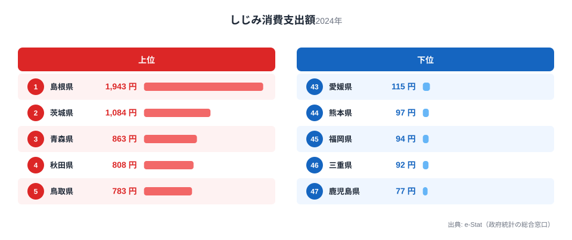
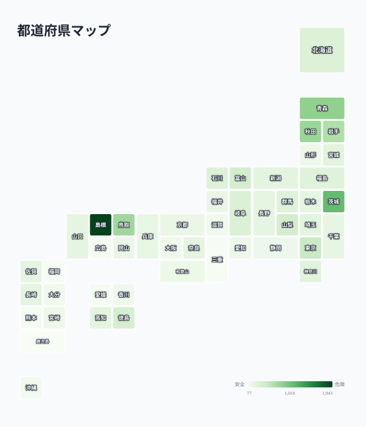

しじみは「二日酔いの朝はしじみ汁」というイメージが定着した食材ですが、実は消費量に大きな地域差があります。総務省家計調査によると、2024年の都道府県庁所在市（二人以上世帯）のしじみ消費支出額は、1位の島根県が1,943円で、最下位の鹿児島県（77円）の実に25.2倍にのぼります。

この記事では、しじみ消費支出額の47都道府県ランキングを見ながら、なぜ島根が突出して1位なのか、そしてしじみの消費が地理的にどう分布しているのかを掘り下げます。結論から言うと、上位県には共通点があります。ヤマトシジミが育つ「汽水湖」を抱えているかどうかです。

> [!NOTE]
> 本データは総務省「家計調査（品目別）」に基づく、都道府県庁所在市および政令指定都市の二人以上世帯における年間しじみ消費支出額（2024年）です。実際の購入量ではなく金額ベースの調査であり、地域の物価差も反映されます。

## 上位と下位

しじみ消費支出額の上位5県・下位5県を見ると、地理的な偏りがはっきり表れます。

<source-link href="/ranking/freshwater-clam-consumption-expenditure">しじみ消費支出額ランキングをもっと見る</source-link>

1位は島根県で1,943円。2位の茨城県（1,084円）を大きく引き離しており、単独首位というより「圧勝」に近い水準です。3位以下も青森県（863円）、秋田県（808円）、鳥取県（783円）と、東北・山陰勢が続きます。

島根1位の背景には、宍道湖の存在があります。宍道湖はヤマトシジミの漁獲量で全国トップクラスの産地であり、県庁所在地である松江市はまさにその湖畔に位置します。地元でしじみが日常的に流通し、食卓に上る頻度が他県とは根本的に異なると考えられます。3位の青森県も、十三湖という汽水湖を抱える産地県で、同様の構造が見て取れます。[島根県の統計データ](/areas/32000)を見ても、水産業が地域経済の重要な位置を占めていることがわかります。

一方、上位に茨城県（2位）が入っているのは一見意外に映るかもしれません。しかし茨城県には涸沼という汽水湖があり、ここもヤマトシジミの主要産地の一つです。つまり上位5県のうち島根・青森・茨城の3県は、いずれも「シジミが獲れる汽水湖を県内に持つ」という共通点で説明できます。

## 最下位グループ

下位5県は、福岡県（94円）、三重県（92円）、沖縄県（136円、41位）を含む九州・沖縄・近畿・四国に集中しています。最下位の鹿児島県は77円で、1位島根の25分の1という水準にとどまります。

> [!WARNING]
> 本調査は都道府県庁所在市（政令指定都市含む）のみの調査であり、県内全域の消費実態を代表するものではありません。産地に近い地方都市ほど消費が多い可能性があり、県庁所在地のデータだけでは県全体の傾向を過小・過大評価するリスクがあります。

下位グループに共通するのは、県内にヤマトシジミの著名な産地となる汽水湖を持たない地域が多いという点です。九州・沖縄・四国は温暖な気候で他の魚介類（かつお、貝類など）の消費文化が発達している一方、しじみのような冷涼な水域を好む貝は地元産の供給が乏しく、食文化として定着しにくかったと考えられます。近畿圏（大阪府189円、滋賀県173円）も、著名なシジミの産地が少なく、消費が伸び悩んでいます。

## 発見：なぜ「二日酔いにしじみ」が全国区にならないのか

<source-link href="/ranking/freshwater-clam-consumption-expenditure">しじみ消費支出額の全47都道府県を見る</source-link>

地図にすると、しじみ消費が「点在する産地」に強く結びついていることが分かります。突出して濃い島根（宍道湖）を筆頭に、青森（十三湖）・茨城（涸沼）・秋田・鳥取といった汽水湖を持つ県がまだらに濃く浮かび上がり、九州・近畿・四国はほぼ一様に薄い状態です。さばやみかんのような「西高東低」といった連続した帯ではなく、汽水湖という特定の地形資源の有無で色が決まる点が、しじみ消費地図の最大の特徴です。

しじみは「オルニチンが豊富で肝臓に良い」として全国的な健康効果イメージが広く知られている食材です。にもかかわらず、消費支出額には25倍という大きな地域差が存在します。これは、健康イメージだけでは消費行動を均一化できず、**地元での入手しやすさ（産地との近さ）が消費量を決定づける最大の要因**であることを示しています。

[仮説] 産地県（島根・青森・茨城）では、しじみが「特別な健康食品」ではなく「日常の食材」として定着しているため、価格が手頃で購入頻度が高い可能性があります。一方、非産地県では輸送コストや流通の関係で割高になりやすく、健康効果を意識した「たまの購入」にとどまりやすいと考えられます。この点は今回のデータだけでは検証できず、価格差データとの突合が必要です。

もう一つの発見は、東北勢（青森・秋田・岩手）が上位10県のうち3県を占めている点です。東北は宍道湖ほど有名な単一の産地こそありませんが、十三湖（青森）をはじめ日本海側・汽水域の多い地形が、地域全体としてしじみを身近な食材にしていると考えられます。

> [!TIP]
> 魚介類の消費は「産地に近いほど多い」という傾向が、しじみ以外の水産物でも見られます。かつおや牡蠣の消費地図を比較すると、それぞれの産地が異なる県に集中していることがわかります。詳しくは[かつお・牡蠣の消費量マップ](/blog/bonito-vs-oyster-fish-map)で解説しています。

しじみのような家計調査の品目別データは、他の食材でも都道府県ごとに大きな差が出ることが多く、[経済カテゴリのランキング一覧](/category/economy)では家計消費に関する統計を横断的に確認できます。

## まとめ

- **1位は島根県（1,943円）**。宍道湖という全国屈指のヤマトシジミ産地を抱え、2位に大差をつけて独走
- **最下位は鹿児島県（77円）**。1位との差は25.2倍
- **上位は産地県に集中**：島根・青森・茨城はいずれも県内に著名な汽水湖（宍道湖・十三湖・涸沼）を持つ
- **下位は九州・近畿・四国に多い**：温暖な地域や著名な汽水湖を持たない地域で消費が伸び悩む
- **健康イメージだけでは均一化しない**：「二日酔いにしじみ」という全国共通の認知があっても、地元での入手しやすさが消費量を左右する

## データ出典

総務省「家計調査（品目別）」（都道府県庁所在市および政令指定都市、二人以上世帯、2024年）をもとに、e-Stat（政府統計の総合窓口）経由で整備したデータを使用しています。
