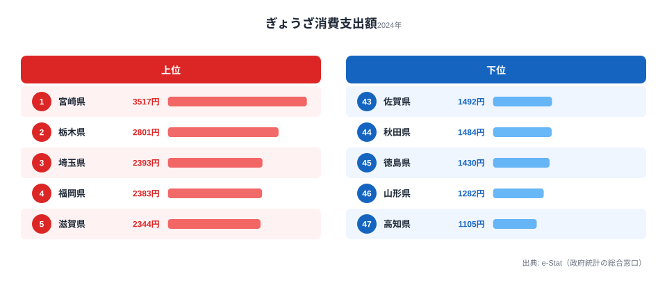
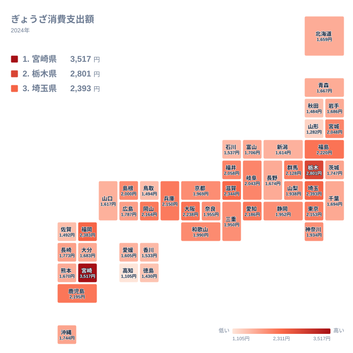

「餃子といえば宇都宮、それに浜松」──餃子購入額の街対決はニュースの定番です。だが家計調査の**ぎょうざ消費支出額**(都道府県庁所在市・二人以上世帯の年間支出)で47都道府県を並べると、王者は宇都宮(栃木県)でも浜松(静岡県)でもありません。

2024年に最もぎょうざに金を使ったのは[宮崎県](https://stats47.jp/areas/45000)です。その額は1世帯あたり**3,517円**にのぼります。続く[栃木県](https://stats47.jp/areas/09000)は2,801円。餃子の街として知られる浜松を抱える静岡県にいたっては1,952円と、全国のちょうど真ん中あたりまで沈んでいます。最下位は[高知県](https://stats47.jp/areas/39000)の1,105円で、王者宮崎県とは**3.18倍**の開きがあります。

> [!NOTE]
> この指標は家計調査の「ぎょうざ」支出額で、各都道府県の**県庁所在市の二人以上世帯**の年間平均値です。県全体ではなく県庁所在市の家計を映す点に注意してください。家計調査の品目分類では「ぎょうざ」は調理食品(持ち帰り・冷凍・チルド)の枠に入っており、**スーパーやコンビニで買う冷凍餃子・持ち帰り(テイクアウト)の支出だけ**を数えます。レストランや専門店で店内飲食した餃子代は「外食」の統計に別枠で計上されるため、この数字には表れません(出典: 総務省 家計調査、2024年)。

この記事では、なぜ「餃子の街」が支出額1位にならないのか、そして九州勢が上位に食い込む構造を、47都道府県のデータから読み解きます。

## ぎょうざ消費支出額 上位5県・下位5県

以下のチャートは2024年の上位5県と下位5県の支出額を示しています。

<source-link href="/ranking/gyoza-frozen-consumption-expenditure">ぎょうざ消費支出額ランキングをもっと見る</source-link>

目を引くのは首位の独走ぶりです。トップの3,517円に対し、2位の栃木県は2,801円。その差は716円にもなります。3位以下は埼玉2,393円から岡山2,164円(10位)まで230円ほどの範囲に密集しており、2位以下から716円離れた宮崎だけが突出しています。**上位に九州勢が複数入る**のも特徴で、1位の宮崎県、4位の福岡県、8位の鹿児島県と、トップ10に3県が顔を出しています。

なぜ宮崎県がこれほど高いのでしょうか。[仮説] 宮崎市は九州南部の中心都市のひとつで、餃子の持ち帰りや冷凍餃子を日常的に食卓に乗せる食文化が根付いている可能性があります。全国展開の餃子チェーンが多数出店していることも家庭内での餃子消費を押し上げる一因と考えられますが、これは家計調査の支出額から見えるパターンにすぎず、店舗数や購入頻度を裏付ける一次データによる検証はまだできていません。4位の福岡県は2,383円、8位の鹿児島県は2,195円と、これらも含め九州南部から福岡にかけての帯で支出が高い傾向が見られます。

5位の滋賀県は2,344円、6位の大阪府は2,238円と、関西圏も上位に食い込んでいます。[仮説] 関西は中華料理や点心文化の普及が比較的早く、家庭での餃子消費が根付いている可能性がありますが、これも支出額から推測される傾向であり、断定はできません。

> [!TIP]
> 「餃子の街」として有名な宇都宮市は栃木県の県庁所在市なので栃木県の値に反映されます。一方、浜松市は静岡県の県庁所在市ではなく(県庁所在市は静岡市)、**浜松市の餃子文化が静岡県の家計調査値には直接乗らない**という仕組みです。加えて、報道でよく見る宇都宮市・浜松市の「餃子購入額日本一」争いも、そもそもテイクアウト・冷凍餃子の**持ち帰り支出**に基づく指標で、飲食店で座って食べた分は含みません。これが「餃子の街イメージ」と支出額ランキングのズレを生む一因となっています。

## 最下位グループの地理的偏り

上の全国マップで色の濃淡を追うと、支出額の高い県(濃い色のタイル)は特定の地域にまとまって現れていることがわかります。九州南部の宮崎県・鹿児島県・福岡県は軒並み濃い色になっており、近畿6府県(滋賀・大阪・兵庫・和歌山・京都・奈良)もそろって全国20位以内に入るなど、地域ぐるみで高めの水準を保っています。逆に薄い色のタイル(支出額が低い県)は、四国4県(高知・徳島・愛媛・香川)と東北の日本海側(山形・秋田)にまとまっており、隣り合う県どうしで似た水準を示しています。ただし同じ九州の中でも佐賀県は43位で薄い色になっており、地域だけで支出額の高低が決まるわけではないことも地図から読み取れます。

下位5県を見ると、地域に際立った偏りが見えます。43位の佐賀県は1,492円、44位の秋田県は1,484円、45位の徳島県は1,430円、46位の山形県は1,282円、そして最下位の高知県は1,105円です。

下位には**四国(高知県は47位、徳島県は45位)と東北(山形県は46位、秋田県は44位)**が並んでいます。最下位の[高知県](https://stats47.jp/areas/39000)は1,105円で、1位の宮崎県が記録した3,517円の約3分の1にとどまります。

[仮説] 高知県・徳島県など四国の下位圏は、餃子より土着の魚介料理や鍋文化が家庭食の中心であるためではないかと考えられます。また山形県・秋田県など東北の下位圏も、伝統的な郷土食の比重が高く、冷凍餃子を購入する習慣が他地域ほど浸透していない可能性があります。ただしこれは家計調査の支出額のみから読み取れる仮説であり、断言は慎むべきです。食文化そのものを検証するには、食生活・食育に関する意識調査など別の一次資料との突き合わせが必要です。

興味深いのは佐賀県の位置づけです。同じ九州でも佐賀県は43位・1,492円と下位圏に沈んでおり、**九州=餃子高支出という単純な括りは成り立ちません**。宮崎県・福岡県・鹿児島県といった特定の県に偏って支出が高く、同じ九州でも熊本県は34位・1,670円、大分県は32位・1,683円と中下位にとどまっています。九州内でも餃子への家計配分には温度差があることがわかります。

> [!WARNING]
> 家計調査は標本調査であり、県庁所在市の二人以上世帯という限られた母集団を対象とします。年によって順位は入れ替わりやすく、単年の数値だけで「この県は餃子を食べない」と断定するのは危険です。傾向として読む程度にとどめてください。

## なぜ「餃子の街」が1位ではないのか

ニュースで毎年話題になる宇都宮市・浜松市の「餃子購入額日本一」争いは、総務省 家計調査の**市区町村別ランキング(政令市・県庁所在市)**を指すことが多いです。一方で本記事の指標は**都道府県別(県庁所在市の値を都道府県に割り当てたもの)**です。しかもどちらの集計も、対象は**スーパーや専門店での持ち帰り・冷凍餃子の購入額**であり、餃子専門店の店内で座って食べた分は家計調査の「外食」に分類されて別枠で計上されます。「餃子日本一」の看板は、あくまで家に持ち帰る餃子の消費量を映した数字だという点を押さえておく必要があります。

ここに「餃子の街なのに県では1位でない」というズレが生まれます。

- **[栃木県](https://stats47.jp/areas/09000)は2位で2,801円**: 県庁所在市・宇都宮市の値がそのまま反映されていますが、首位の宮崎県には届きませんでした。
- **静岡県は21位で1,952円**。

つまり、**「餃子の街」の名声は市区町村のデータで語られ、都道府県ランキングでは別の県が王者になる**という構図です。[経済・家計カテゴリ](https://stats47.jp/category/economy)では、同様の食品消費支出の地域差を他の品目でも確認できます。

> [!NOTE]
> この記事の数字は「支出額」であって「消費量(個数や重さ)」ではありません。支出額が高い=餃子を食べる量が多い、とは限らない点に注意してください。単価の高い専門店やこだわりの冷凍餃子を持ち帰る世帯が多い地域は、実際の消費量が同程度でも支出額は高く出ます。逆に激安の冷凍餃子をまとめ買いする地域は、たくさん食べていても支出額には表れにくくなります。

## まとめ

- 2024年のぎょうざ消費支出額は**1位が宮崎県の3,517円**、最下位は高知県の1,105円で**3.18倍**の差。
- 餃子の街・宇都宮を抱える**栃木県は2位・2,801円**で王者には届かず。
- 浜松を抱える**静岡県は21位・1,952円**。浜松市が静岡県の県庁所在市でないことがズレの一因。
- 上位は**九州勢が強く**、1位の宮崎県、4位の福岡県、8位の鹿児島県がトップ10入り。ただし佐賀県は43位で「九州一括り」は成立しない。
- 下位は**四国(高知県は47位、徳島県は45位)と東北(山形県は46位、秋田県は44位)**に偏る。
- 家計調査の「ぎょうざ」は**持ち帰り・冷凍の購入額のみ**を数える指標で、飲食店での外食分は含まれない。

## データ出典

総務省統計局「家計調査」(品目別都道府県庁所在市及び政令指定都市ランキング、2024年)。e-Stat 経由で整備したデータをもとに、都道府県庁所在市の二人以上世帯の年間ぎょうざ消費支出額を集計しました。
