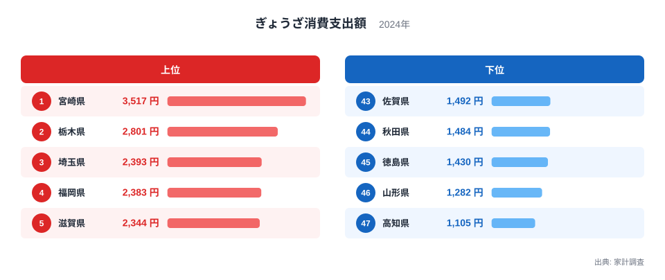
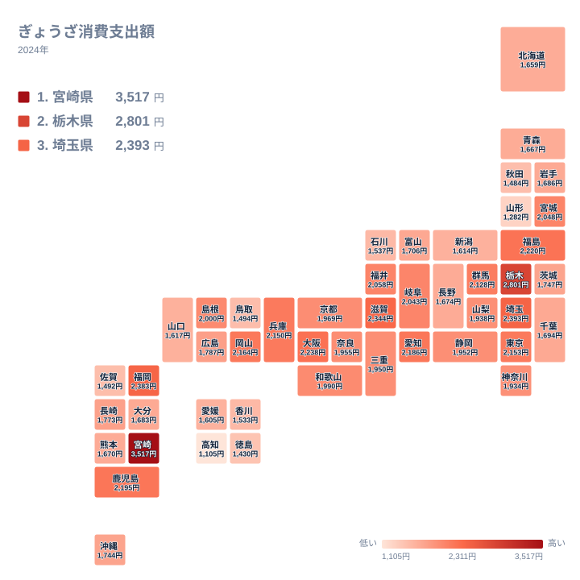

「餃子といえば宇都宮、それに浜松」──餃子購入額の街対決はニュースの定番です。ですが家計調査の**ぎょうざ消費支出額**(都道府県庁所在市・二人以上世帯の年間支出)で47都道府県を並べると、王者は宇都宮(栃木県)でも浜松(静岡県)でもありません。

2024年に最もぎょうざに金を使ったのは[宮崎県](https://stats47.jp/areas/45000)です。その額は1世帯あたり**3,517円**にのぼります。続く[栃木県](https://stats47.jp/areas/09000)は2,801円。餃子の街として知られる浜松を抱える静岡県にいたっては1,952円と、全国のちょうど真ん中あたりまで沈んでいます。最下位は[高知県](https://stats47.jp/areas/39000)の1,105円で、王者宮崎県とは**3.18倍**の開きがあります。栃木県の値は宇都宮市そのもので、同じ指標では宮崎市が宇都宮市を上回りました。

> [!NOTE]
> この指標は家計調査の「ぎょうざ」支出額で、各都道府県の**県庁所在市の二人以上世帯**の年間平均値です。県全体ではなく県庁所在市の家計を映す点に注意してください。総務省の収支項目分類(2020年改定)では、品目「ぎょうざ」(371)は「他の調理食品」の一品目で、定義は「生も含む」です。ぎょうざの冷凍品は別の品目「冷凍調理食品」(370)に分けられ、外食のぎょうざは「中華食」(39A)の品目に入るため、この数字には含まれません(出典: 総務省統計局「家計調査 収支項目分類及びその内容例示」2020年改定。数値は2024年の家計調査)。

この記事では、なぜ「餃子の街」が支出額1位にならないのか、そして九州と北関東から南東北が上位に並ぶ構造を、47都道府県のデータから読み解きます。

## ぎょうざ消費支出額 上位5県・下位5県

以下のチャートは2024年の上位5県と下位5県の支出額を示しています。

<source-link href="/ranking/gyoza-frozen-consumption-expenditure">ぎょうざ消費支出額ランキングをもっと見る</source-link>

目を引くのは首位の独走ぶりです。トップの3,517円に対し、2位の栃木県は2,801円で、その差は716円にもなります。栃木県も3位の埼玉県とは408円離れています。一方、3位から10位までは2,393円から2,164円の範囲に収まっています。宮崎県が飛び抜け、栃木県が続き、その後ろに密集した集団が並ぶ三層の構図です。**上位に九州勢が複数入る**のも特徴で、1位の宮崎県、4位の福岡県、8位の鹿児島県と、トップ10に3県が顔を出しています。

なぜ宮崎県がこれほど高いのでしょうか。確かなのは、この数字が「生を含み、冷凍品と外食を除くぎょうざ」への支出だという点です。そこで同じ家計調査で、ぎょうざを含む外食の品目「中華食」の支出額と並べてみます。宮崎県は中華食が45位で2,295円、鹿児島県も44位で2,379円と、外食の中華は下位にあります。ぎょうざが1位と8位の県が、外食の中華では下位に沈んでいる形です。[仮説] 宮崎県や鹿児島県では、中華料理を店で食べる代わりに、生餃子や惣菜の餃子を買って家で食べる比重が高い可能性があります。ただし「中華食」はぎょうざ以外の中華料理も含む広い品目で、ここで見えるのは順位の並びだけです。店舗数や購入先、購入頻度を裏付ける一次データはまだ確認できておらず、因果は言えません。4位の福岡県は2,383円、8位の鹿児島県は2,195円と、九州南部から福岡にかけての帯で支出が高い傾向は確かです。あわせて見る: [中華食消費支出額ランキング](/ranking/chinese-food-dining-consumption-expenditure)

九州だけが高いわけではありません。栃木県の2位2,801円、埼玉県の3位2,393円、福島県の7位2,220円、群馬県の13位2,128円と、北関東から南東北にかけても上位の帯が続きます。福島県の2,220円は九州の鹿児島県の2,195円を上回ります。ただしこの帯は一様ではありません。北関東でも茨城県は27位で1,747円にとどまり、南東北でも宮城県は15位で2,048円、山形県は46位で1,282円と大きく割れます。外食の中華食との関係も揃わず、中華食は栃木県が11位、埼玉県が15位、群馬県が19位、福島県が40位と散らばっています。つまり「外食の分を家のぎょうざで補う」という宮崎県のような読みは、この帯には当てはまりません。この帯が生まれる理由を、家計調査の支出額だけから特定することはできません。購入先別の支出や店舗の分布など、別の統計との突き合わせが必要です。

5位の滋賀県は2,344円、6位の大阪府は2,238円と、関西圏も上位に食い込んでいます。[仮説] 関西は中華料理や点心文化の普及が比較的早く、家庭での餃子消費が根付いている可能性がありますが、これも支出額から推測される傾向であり、断定はできません。

## 最下位グループの地理的偏り

上の全国マップで色の濃淡を追うと、支出額の高い県(濃い色のタイル)は特定の地域にまとまって現れていることがわかります。九州南部の宮崎県・鹿児島県・福岡県は軒並み濃い色になっており、北関東から南東北の栃木県・埼玉県・福島県・群馬県も濃い側に入ります。近畿6府県(滋賀・大阪・兵庫・和歌山・京都・奈良)はそろって全国20位以内に入っています。同じ近畿でも三重県だけは22位で、わずかに外れます。逆に薄い色のタイル(支出額が低い県)は、四国4県(高知・徳島・愛媛・香川)と東北の日本海側(山形・秋田)にまとまっており、隣り合う県どうしで似た水準を示しています。ただし同じ九州の中でも佐賀県は43位で薄い色になっており、地域だけで支出額の高低が決まるわけではないことも地図から読み取れます。

下位5県を見ると、地域に際立った偏りが見えます。43位の佐賀県は1,492円、44位の秋田県は1,484円、45位の徳島県は1,430円、46位の山形県は1,282円、そして最下位の高知県は1,105円です。

下位には**四国(高知県は47位、徳島県は45位)と東北(山形県は46位、秋田県は44位)**が並んでいます。最下位の[高知県](https://stats47.jp/areas/39000)は1,105円で、1位の宮崎県が記録した3,517円の約3分の1にとどまります。

[仮説] 高知県・徳島県など四国の下位圏は、餃子より土着の魚介料理や鍋文化が家庭食の中心であるためではないかと考えられます。また山形県・秋田県など東北の下位圏も、伝統的な郷土食の比重が高く、家で食べる餃子を買う習慣が他地域ほど浸透していない可能性があります。ただしこれは家計調査の支出額のみから読み取れる仮説であり、断言は慎むべきです。食文化そのものを検証するには、食生活・食育に関する意識調査など別の一次資料との突き合わせが必要です。

興味深いのは佐賀県の位置づけです。同じ九州でも佐賀県は43位・1,492円と下位圏に沈んでおり、**九州=餃子高支出という単純な括りは成り立ちません**。宮崎県・福岡県・鹿児島県といった特定の県に偏って支出が高く、同じ九州でも熊本県は34位・1,670円、大分県は32位・1,683円と中下位にとどまっています。九州内でも餃子への家計配分には温度差があることがわかります。

> [!WARNING]
> 家計調査は標本調査であり、県庁所在市の二人以上世帯という限られた母集団を対象とします。年によって順位は入れ替わりやすく、単年の数値だけで「この県は餃子を食べない」と断定するのは危険です。傾向として読む程度にとどめてください。

## なぜ「餃子の街」が1位ではないのか

結論を先に言うと、宇都宮が1位でないのは集計単位の違いのせいではありません。同じ指標で、宮崎市のほうが宇都宮市より多かっただけです。栃木県の値は県庁所在市の宇都宮市そのもので、宮崎県の値も宮崎市そのものです。県の値に直す際の割り当てで順位が入れ替わったわけではなく、市どうしで比べても2024年は宮崎市が上回ります。

この点は、[静岡県企画部統計活用課「家計調査から見る、静岡県の食の特徴」](https://toukei.pref.shizuoka.jp/toukeikikakuhan/documents/tokushu202504.pdf)の表で確認できました。この表は、県庁所在市と政令指定都市を並べた市別のぎょうざ年間支出金額を示しています。2024年は、浜松市の4,066円、宮崎市の3,517円、宇都宮市の2,801円の順でした。宮崎市と宇都宮市の金額は本記事の宮崎県と栃木県の値に一致するため、同じ品目・同じ年のデータだと言えます。同じ表で2020年から2024年を見ると、1位は浜松市が3回、宮崎市が2回で、宇都宮市が首位に立った年はありません。令和4〜6年の3年平均でも、浜松市3,847円、宮崎市3,689円、宇都宮市3,254円の順で、宮崎市が宇都宮市の前です。なお、報道で語られる「日本一」がどの年次の値を使っているかは、個々の記事までは確認できていません。浜松市の金額は静岡県の資料からの転記で、総務省の公表表そのものでは確認していない点も付記します。

集計単位の違いが効くのは、浜松だけです。

- **浜松市は静岡県の県庁所在市ではありません**: 静岡県の値は静岡市の家計を映す1,952円で、全国21位です。市別の表で首位になる浜松市の家計は、都道府県別の指標には直接乗りません。
- **宇都宮市は栃木県の県庁所在市**: だからこそ栃木県は2位に入ります。ただし市別の表でも宮崎市と浜松市の後ろで、首位の浜松市には届きません。

つまり「餃子の街」の名声と支出額ランキングのズレは、浜松では集計単位の違い、宇都宮では純粋に順位の差から生まれています。[経済・家計カテゴリ](https://stats47.jp/category/economy)では、同様の食品消費支出の地域差を他の品目でも確認できます。

> [!NOTE]
> この記事の数字は「支出額」であって「消費量(個数や重さ)」ではありません。支出額が高い=餃子を食べる量が多い、とは限りません。単価の高い商品を買う世帯が多い地域は、実際の消費量が同程度でも支出額は高く出ます。逆に、安価な商品をまとめ買いする地域は、たくさん食べていても支出額には表れにくくなります。

## まとめ

- 2024年のぎょうざ消費支出額は**1位が宮崎県の3,517円**、最下位は高知県の1,105円で**3.18倍**の差。
- 餃子の街・宇都宮を抱える**栃木県は2位・2,801円**。この値は宇都宮市そのもので、同じ指標で宮崎市が上回った。
- 浜松を抱える**静岡県は21位・1,952円**。浜松市が静岡県の県庁所在市でないことが、県の順位と街のイメージがずれる理由。
- 上位は**九州勢**(宮崎県1位、福岡県4位、鹿児島県8位)に加え、**北関東から南東北**(栃木県2位、埼玉県3位、福島県7位、群馬県13位)にも帯が続く。ただし佐賀県は43位、茨城県は27位で、地域のくくりは成立しない。
- 下位は**四国(高知県は47位、徳島県は45位)と東北(山形県は46位、秋田県は44位)**に偏る。
- 家計調査の「ぎょうざ」は**生も含み、冷凍品(冷凍調理食品)と外食(中華食)を含まない**品目の支出額。

## データについて

総務省統計局「家計調査」(品目別都道府県庁所在市及び政令指定都市ランキング、2024年)。e-Stat 経由で整備したデータをもとに、都道府県庁所在市の二人以上世帯の年間ぎょうざ消費支出額を集計しました。外食の「中華食」の順位と金額も同じ家計調査の2024年の値です。品目「ぎょうざ」の範囲は、総務省統計局「家計調査 収支項目分類及びその内容例示」(2020年改定)に従っています。この指標の内部キー名には「frozen」が付いていますが、対象は冷凍品ではありません。市別の順位と3年平均の金額は、静岡県企画部統計活用課の上記資料から転記しました。
