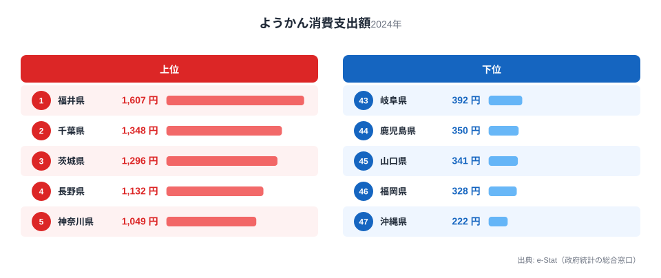
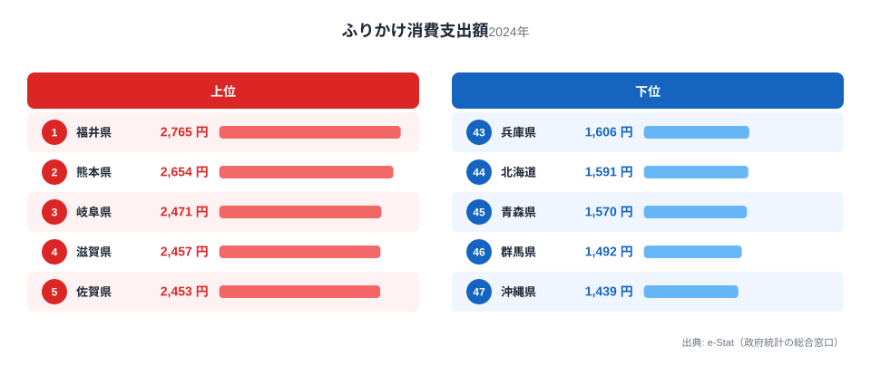
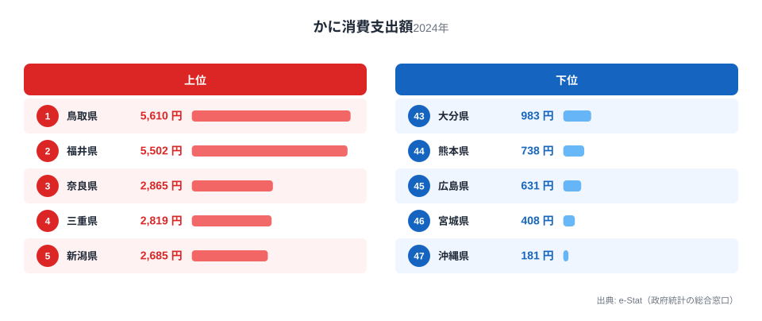
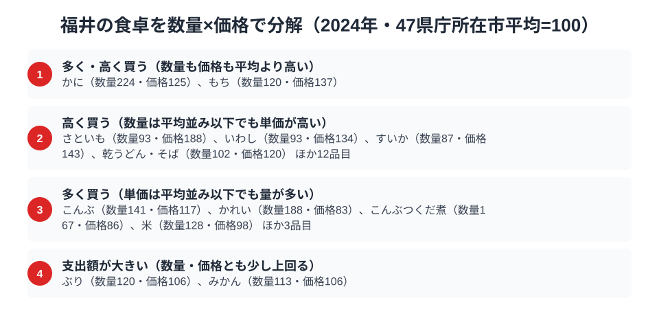

福井県の食卓には、ちょっと意外な全国1位が並びます。総務省の家計調査（品目別）で福井市の二人以上世帯を見ると、ようかんの消費支出額は1,607円で全国1位、ふりかけも2,765円で全国1位。甘味の羊羹と、ごはんのお供のふりかけという、まったく性格の異なる2品目でともに日本一なのです。

さらに、冬の味覚の王様「越前がに」で知られるかにも全国2位。この記事では、ようかん・ふりかけ・かにという3つの品目を横断しながら、「ごはんと甘味」を大切にする福井県民の食卓を読み解きます。

> [!NOTE]
> 家計調査の都道府県データは、県庁所在市（福井県は福井市）の二人以上世帯を対象にした年間支出額です。県全体ではなく福井市在住世帯の家計簿から見た傾向であり、支出「金額」であって消費「量」そのものではない点にご注意ください。

## ようかん — 全国1位1,607円、冬の水羊羹文化

<source-link href="/ranking/yokan-consumption-expenditure">ようかん消費支出額ランキングをもっと見る</source-link>

福井県のようかん消費支出額は1,607円で全国1位です。2位の千葉県1,348円を上回り、最下位の沖縄県222円と比べると7倍以上の開きがあります。福井には独特の「水羊羹」文化があり、多くの地域が夏に食べる水羊羹を、福井では冬にこたつで食べる習慣が根づいています。

冬の水羊羹は福井の冬の風物詩で、地元の和菓子店が競って作り、家庭でも箱で買い求めます。全国的には夏の菓子である水羊羹を冬の定番にしているという食文化の独自性が、ようかん全体の支出額を全国一に押し上げていると考えられます。地域独自の食習慣が家計の数字にはっきり表れる好例です。

## ふりかけ — 全国1位2,765円、ごはんを大切にする県

<source-link href="/ranking/furikake-consumption-expenditure">ふりかけ消費支出額ランキングをもっと見る</source-link>

ふりかけの消費支出額も福井県が2,765円で全国1位です。2位の熊本県2,654円を上回ります。福井は米どころとして知られ、ごはんを大切にする食文化が根づいています。ふりかけはごはんのお供の代表格であり、米の消費が多い土地ほどふりかけの需要も高まる傾向があります。

福井は共働き世帯の割合が高く、手早く食事を整えられるふりかけが重宝される事情も考えられます。ようかんという甘味とふりかけというごはんのお供、その両方で全国一という点に、「ごはんと甘いもの」を大切にする福井の家庭の食卓が映し出されています。福井のふりかけ1位は[ふりかけ消費支出の記事](/blog/furikake-expenditure-ranking)でも北陸の強さとして取り上げています。

## かに — 全国2位5,502円、越前がにの冬

<source-link href="/ranking/crab-consumption-expenditure">かに消費支出額ランキングをもっと見る</source-link>

冬の味覚でも福井は全国トップクラスです。かにの消費支出額は5,502円で全国2位。首位は鳥取県で、支出額は5,610円と福井にわずかに及ばず、福井はそれに肉薄する2位につけています。福井を代表する「越前がに」は、皇室にも献上される高級ブランドガニで、冬になると県内は越前がに一色になります。

日本海側の産地県が上位を占めるのはかに消費の典型的な構図で、福井もその一角です。年末年始のハレの食材としてかにを家庭で楽しむ習慣が、全国2位という高い支出額を支えています。

> [!WARNING]
> 家計調査は支出金額の調査であり、消費量そのものではありません。物価や単価の違いも金額に影響します。特にかにや越前がにのように単価の高い食材は、購入頻度が少なくても支出額が大きく出やすい点にご注意ください。

## 福井の食卓を貫くもの

福井県民の食卓を貫くのは、「ごはんと甘味を大切にする、堅実で豊かな食文化」です。米どころゆえのふりかけ、冬に水羊羹を食べる独自の甘味文化、そして越前がにという冬のハレの味覚。派手さはないものの、日常の食（ごはん・ふりかけ）とハレの食（かに）、そして甘味（羊羹）がバランスよく充実しているのが福井の食卓です。

富山の「富山湾の多冠型」、宮崎の「南九州の飲みもの文化」と並べると、福井は「米どころの堅実＋冬の味覚型」。北陸の隣り合う富山・福井でも、富山は海の幸、福井はごはんと甘味と、食卓の個性が異なるのが興味深い点です。

> [!TIP]
> 「水羊羹を冬に食べる」福井のように、全国とは季節感が逆転した食習慣を持つ地域があります。家計調査で意外な品目が全国1位のとき、その背後に地域独自の季節文化が隠れていることがあり、順位の理由を掘ると土地の暮らしが見えてきます。

## 数量×価格で分解する福井市の食卓

<source-link href="/ranking/crab-consumption-quantity">かに消費量ランキングをもっと見る</source-link>

支出額の順位だけを見ていると、「たくさん食べている」のか「高いものを買っている」のかは区別がつきません。家計調査の品目には支出額（金額）と消費量（数量）の両方が公表されているものがあり、47都道府県庁所在市の平均を100とした指数に直すと、福井の食卓を「量の文化」と「単価の高さ」に分けて読むことができます。かに消費量の指数は224で、47市平均の2倍以上を購入していることになり、単価も平均より125と高めです。量も単価も平均を上回るため支出額指数は280近くまで押し上がり、支出額ランキングで全国2位となる大きな要因になっています。かれい・こんぶ・米も購入量指数が平均を上回っており、日本海側の魚介と米どころとしての食生活が「たくさん食べる」量の面に表れている品目です。

一方で、さといも・いわし・すいかは購入量自体が平均並みかやや下回るのに、価格指数はいずれも130〜190の間に達しています。もちも同様に価格指数137と高く、購入量指数120と合わせて支出額指数は165前後まで伸びています。これらは購入量の多さではなく、地元で好まれる品種を選ぶ傾向や季節はずれの時期にも買い求める習慣、地域の物価水準の違いなどが単価を押し上げていると考えられる品目です。「多く買う」品目と「高く買う」品目を分けて見ることで、支出額ランキングの1位・2位という結果の裏側にある理由が違って見えてきます。

> [!TIP]
> 支出額の順位だけでは、地域独自の食文化（たくさん食べる）が働いているのか、単価の高さ（高いものを買う）が働いているのかを見分けられません。かにのように購入量も単価も平均を上回る品目もあれば、さといものように購入量は平均並みでも単価の高さだけで支出額を押し上げている品目もあります。数量指数と価格指数を見比べると、順位の裏にある理由が見えてきます。

> [!NOTE]
> ここでの指数は家計調査の全国値ではなく、47都道府県庁所在市（福井県は福井市）の単純平均を100とした相対値です。価格指数は支出額÷数量から算出した相対的な単価であり、購入している品種やブランドの違いも含むため、純粋な物価水準そのものではありません。対象は二人以上世帯の年間支出額（2024年）です。

## まとめ

- ようかん消費支出額は福井県が全国1位（1,607円）、冬に水羊羹を食べる独自文化
- ふりかけも全国1位（2,765円）、米どころゆえのごはん食文化
- かには全国2位（5,502円）、越前がにに代表される冬のハレの味覚
- ごはん・甘味・冬の味覚がバランスよく充実した、堅実で豊かな福井の食卓

福井県の他の統計は[福井県の地域プロフィール](/areas/18000)、食品・家計消費の地域差は[経済カテゴリ一覧](/category/economy)からご覧いただけます。

## データ出典

総務省統計局「家計調査（品目別）」（2024年、都道府県庁所在市 二人以上世帯）をもとに、e-Stat（政府統計の総合窓口）経由で整備したデータを使用しています。
