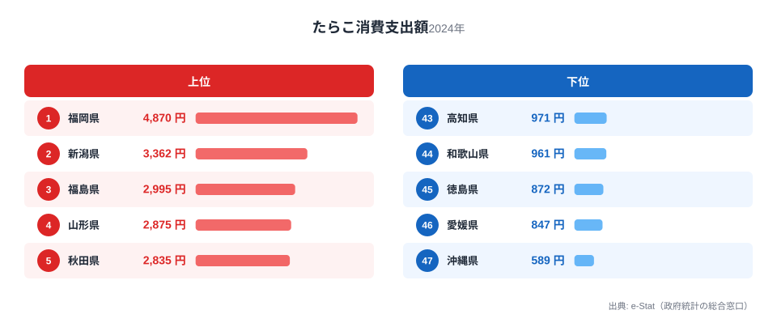
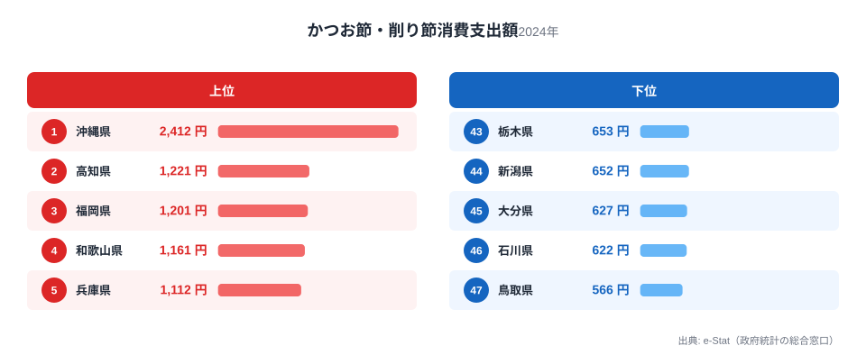
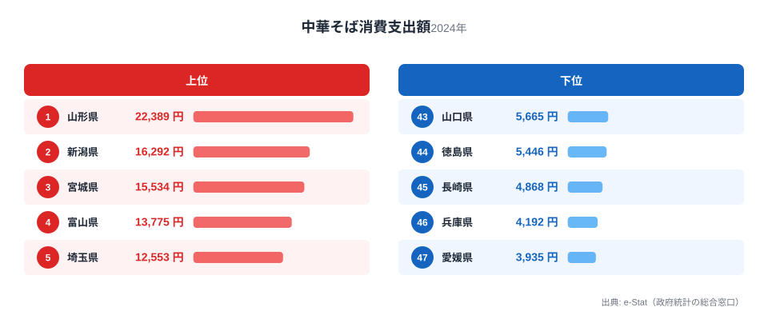
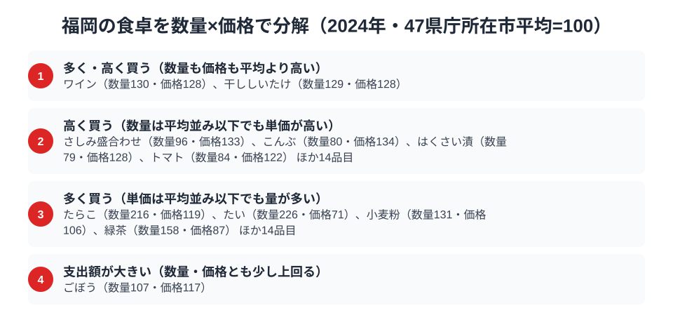

福岡県といえば「豚骨ラーメンの本場」というイメージを持つ人が多いはずです。ところが総務省の家計調査（品目別）で福岡市の二人以上世帯を見ると、外食の中華そば（ラーメン店等での飲食）にかける支出額は6,843円で全国40位。全国1位の山形県22,389円の3分の1にも届きません。ラーメン王国のはずの福岡が、なぜ外食ラーメン支出では下位に沈んでいるのでしょうか。

一方で福岡が文句なしの全国1位を誇る品目があります。たらこ（明太子の主原料）の消費支出額は4,870円で、2位の新潟県3,362円を大きく引き離す堂々の日本一です。さらにかつお節・削り節も1,201円で全国3位。この記事では、たらこ・かつお節・中華そばという3つの品目を横断しながら、「家で仕込む味」に強く、「外食のラーメン」には意外と淡白な福岡県民の食卓を読み解きます。

> [!NOTE]
> 家計調査の都道府県データは、県庁所在市（福岡県は福岡市）の二人以上世帯を対象にした年間支出額です。県全体ではなく福岡市在住世帯の家計簿から見た傾向であり、支出「金額」であって消費「量」そのものではない点にご注意ください。

## たらこ（明太子） — 全国1位4,870円、家庭で仕込む味

<source-link href="/ranking/cod-roe-consumption-expenditure">たらこ消費支出額ランキングをもっと見る</source-link>

福岡県のたらこ消費支出額は4,870円で全国1位です。2位の新潟県3,362円、3位の福島県2,995円を大きく上回り、最下位の沖縄県589円と比べると8.3倍もの開きがあります。福岡はご存じの通り辛子明太子の本場で、たらこはその主原料にあたります。福岡の食卓では、明太子や辛子めんたいこを家庭の食卓に常備し、ごはんのお供や料理のアクセントとして日常的に使う習慣が根づいています。

福岡市には明太子の専門店・製造元が集積し、贈答用だけでなく家庭用の切れ子（訳あり品）が手頃な価格で手に入りやすい土地柄です。「家で食べる明太子」が生活に溶け込んでいることが、たらこ消費支出額を全国トップに押し上げていると考えられます。よそいきの手土産ではなく、日常のおかずとして明太子が定着している点が福岡らしさです。

## かつお節・削り節 — 全国3位1,201円、だし文化を支える名脇役

<source-link href="/ranking/katsuobushi-consumption-expenditure">かつお節・削り節消費支出額ランキングをもっと見る</source-link>

かつお節・削り節の消費支出額も福岡県は1,201円で全国3位につけています。首位は沖縄県で2,412円、2位は高知県で1,221円と、福岡はこの2県にわずかに届かない僅差の3位です。福岡の郷土料理には「あごだし」（トビウオでとる出汁）が有名ですが、かつお節も日々の味噌汁やうどん出汁に欠かせない存在として、家庭の常備品になっています。

九州は水炊きやもつ鍋などの鍋料理文化が盛んで、出汁を丁寧にとる料理習慣が根強く残っています。市販の顆粒だしだけでなく、かつお節を削って使う家庭が一定数存在することが、支出額を押し上げる一因と考えられます。明太子と同じく、かつお節も「よそいきではなく日常使い」の食材として福岡の食卓に組み込まれています。

> [!WARNING]
> 家計調査は支出金額の調査であり、消費量そのものではありません。物価や単価の違いも金額に影響します。また「あごだし」のように、かつお節とは別品目として個別集計されていない郷土の出汁文化がある点にもご注意ください。

## 中華そば（ラーメン外食） — 全国40位6,843円、豚骨王国の意外な下位

<source-link href="/ranking/ramen-dining-consumption-expenditure">中華そば消費支出額ランキングをもっと見る</source-link>

福岡といえば豚骨ラーメンの聖地というイメージが強いにもかかわらず、外食の中華そば消費支出額は6,843円で全国40位という結果です。首位の山形県は22,389円、2位の新潟県は16,292円です。福岡は40位の6,843円で首位山形の3割強にとどまり、最下位に近い47位の愛媛県3,935円との差は思いのほか小さいのが実情です。

この逆説には理由があります。福岡の豚骨ラーメンは庶民的な価格帯で提供する店が多く、屋台や立ち食いに近いスタイルで「サッと食べてサッと出る」文化が根づいています。1回あたりの単価が低いため、同じ回数食べても支出額は積み上がりにくいのです。一方、山形や新潟など東北・北陸勢が上位を占める背景には、ラーメンを「ちょっとしたごちそう」として家族で外食する頻度の高さや、地域ごとの独自ラーメン文化（酒田ラーメン・燕三条系等）の存在があると考えられます。つまり福岡のラーメン支出の低さは「ラーメンを食べていない」のではなく、「安く食べられる店が多いため単価当たりの支出が伸びにくい」という価格構造の逆説と読むのが妥当です。[仮説として、実際の外食回数（消費量）は別の調査でしか確認できず、本データからは支出額の低さのみが読み取れます。]

## 福岡の食卓を貫くもの

福岡県民の食卓を貫くのは、「家で仕込む味には手を抜かず、外食は安くて速いものを好む」という二層構造です。明太子もかつお節も、贈答品ではなく日常の食卓に組み込まれた「家庭で使う調味・惣菜」として全国トップクラスの支出を記録しています。一方で豚骨ラーメンという外食の看板メニューは、庶民価格ゆえに支出額としては目立たない下位に沈んでいます。

福井の「米どころの堅実＋冬の味覚型」、宮崎の「南九州の飲みもの文化」と並べると、福岡は「家庭内の名産品消費＋外食の低価格文化型」と言えます。同じ九州でも、福岡は外食の単価が安く回転が速い都市型の食文化を持っており、隣県の熊本・鹿児島とはまた違った顔を見せています。

> [!TIP]
> 支出額ランキングで下位に見える品目でも、それが「消費されていない」とは限りません。単価が安い・回転が速い・家庭内消費が多い、といった価格構造や購買スタイルの違いが支出額の低さにつながることがあります。福岡の中華そばのように、イメージと逆の順位が出たときこそ、価格の背景を疑ってみる価値があります。

## 数量×価格で分解する福岡市の食卓

<source-link href="/ranking/cod-roe-consumption-quantity">たらこ消費量ランキングをもっと見る</source-link>

福岡市の支出額が高い理由は「単価が高い」からなのか、それとも「たくさん買う」からなのかを分解してみます。家計調査には支出額だけでなく数量のデータもあり、47都道府県庁所在市の平均を100とした指数に置き換えると、たらこ消費量は1,145gで数量指数は216、価格指数は119です。消費量は47都市平均の2倍を超える一方、価格指数は120に届かず、単価が突出して高いわけではありません。たらこの支出額が全国1位になっている主因は、単価の高さよりも購入量の多さにあると読み取れます。支出指数257.1は、数量指数216と価格指数119を掛け合わせた水準にほぼ一致しており、量の多さが支出を押し上げる主因であることが数値の構造からも裏づけられます。

かつお節・削り節も同じ構図です。数量指数は128.5で、47都市の中での消費量順位は11位にとどまりますが、価格指数は103.9とほぼ平均並みで、支出額は全国3位まで押し上げられています。[仮説] たらこと同様、割高でも少量に絞るのではなく、相場並みの単価で日常的にまとめ買いする傾向が支出額を押し上げている可能性がありますが、購入頻度や1回あたりの購入量までは本データからは確認できません。支出指数133.5も、数量指数128.5と価格指数103.9を掛け合わせた水準にほぼ一致しており、たらこと同じく量の多さが支出額を押し上げる構図になっています。

> [!NOTE]
> ここでの指数は47都道府県庁所在市（二人以上世帯）の年間データを単純平均し、100とした相対値です。総務省が公表する全国平均そのものではなく、価格指数も「支出額÷数量」から算出した単価の相対値のため、品種やブランドの違いによる価格差を含んでいます。

> [!TIP]
> たらこやかつお節のように「数量指数は高いが価格指数は平均並み」という品目は、単価の高さではなく購入頻度・購入量の多さが支出額を押し上げているサインです。逆に価格指数だけが平均を上回る品目（さしみ盛合わせやこんぶなど）は、こだわり品を少量買う消費スタイルの表れと読み解けます。

## まとめ

- たらこ（明太子の原料）消費支出額は福岡県が全国1位（4,870円）、家庭で日常的に食べる明太子文化
- かつお節・削り節も全国3位（1,201円）、だし文化を支える家庭の常備品
- 中華そば（ラーメン外食）支出額は意外にも全国40位（6,843円）、庶民価格の豚骨ラーメン文化ゆえの逆説
- 「家庭内の名産品消費に強く、外食は安価志向」という福岡ならではの食卓構造が浮かび上がる

福岡県の他の統計は[福岡県の地域プロフィール](/areas/40000)、食品・家計消費の地域差は[経済カテゴリ一覧](/category/economy)から、隣県の食文化は[福井の食卓](/blog/fukui-food-culture)からもご覧いただけます。

## データ出典

総務省統計局「家計調査（品目別）」2024年、都道府県庁所在市 二人以上世帯のデータを使用。e-Stat（政府統計の総合窓口）経由で取得・集計しています。
