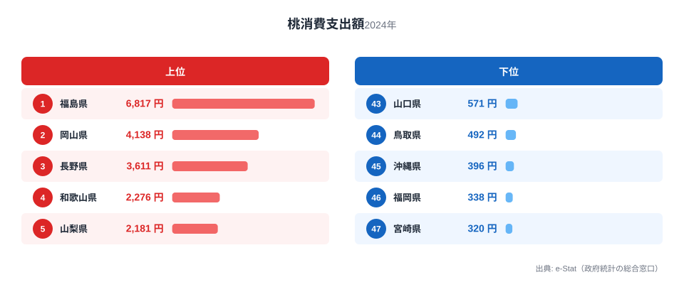
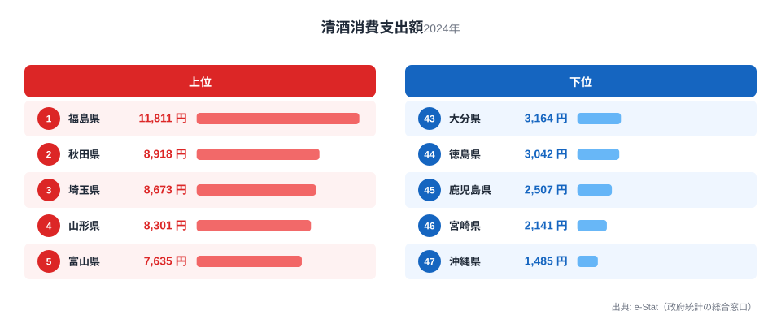
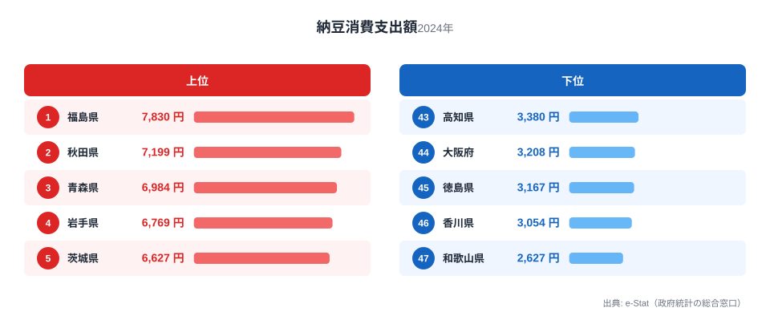
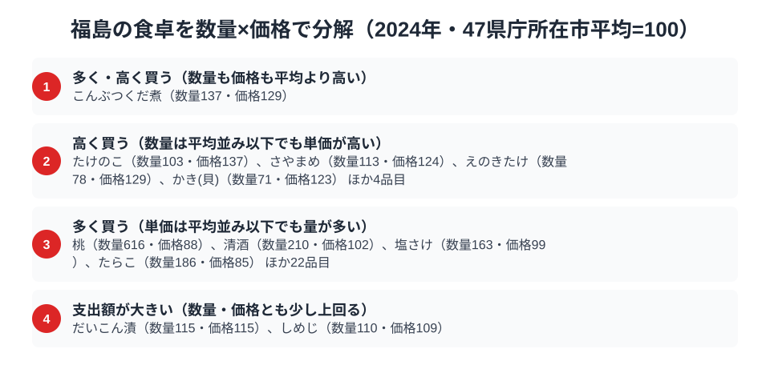

福島県は、果樹・酒・発酵食という異なる3つの分野で全国トップに立つ、食の実力県です。総務省の家計調査（品目別）で福島市の二人以上世帯を見ると、桃・日本酒・納豆という性格の異なる3つの品目すべてで、福島が全国1位に立っています。

みずみずしい桃、全国的評価の高い日本酒、そして東北らしい納豆。果樹王国・酒どころ・発酵食文化という3つの顔を、福島は同時に持っています。この記事では、3つの全国1位品目を横断しながら、福島県民の豊かな食卓を読み解きます。

> [!NOTE]
> 家計調査の都道府県データは、県庁所在市（福島県は福島市）の二人以上世帯を対象にした年間支出額です。県全体ではなく福島市在住世帯の家計簿から見た傾向であり、支出「金額」であって消費「量」そのものではない点にご注意ください。

## 桃 — 全国1位6,817円、果樹王国のシンボル

<source-link href="/ranking/peach-consumption-expenditure">桃消費支出額ランキングをもっと見る</source-link>

福島県の桃消費支出額は6,817円で全国1位です。2位の岡山県4,138円を大きく引き離しています。福島市周辺は「フルーツライン」と呼ばれる果樹地帯で、桃をはじめ、なし・りんご・ぶどうなど多彩な果物が栽培される果樹王国です。

福島の桃は「あかつき」「川中島白桃」など品種も豊富で、夏になると直売所や果樹園に多くの人が訪れます。産地であると同時に消費地でもあるという「産地=消費地」の一致が、桃の全国一を支えています（[桃消費支出の記事](/blog/peach-expenditure-ranking)で産地と消費の関係を詳述）。地元でとれた完熟の桃を家庭で楽しむ文化が、家計の数字に表れています。

## 日本酒 — 全国1位11,811円、全国屈指の酒どころ

<source-link href="/ranking/sake-consumption-expenditure">日本酒消費支出額ランキングをもっと見る</source-link>

日本酒（清酒）の消費支出額も福島県が11,811円で全国1位です。2位の秋田県8,918円を上回ります。福島は全国新酒鑑評会で金賞受賞数が全国トップクラスを誇る「酒どころ」で、会津をはじめ県内各地に多くの酒蔵があります。

良質な米と清らかな水に恵まれた福島は、日本酒造りに理想的な環境です。地元の蔵元が造る多彩な日本酒が身近にあり、晩酌や会食で日本酒を楽しむ文化が根づいています。清酒が寒冷な米どころで強いという傾向の、まさに代表格が福島です。

## 納豆 — 全国1位7,830円、東北の発酵食文化

<source-link href="/ranking/natto-consumption-expenditure">納豆消費支出額ランキングをもっと見る</source-link>

発酵食でも福島は全国トップです。納豆の消費支出額も福島県が7,830円で全国1位。2位の秋田県7,199円を上回ります。納豆は東北・北関東で消費が多い食品で、福島はその頂点に立ちます。

ごはんのお供として毎朝納豆を食べる習慣が根づき、良質な大豆と発酵食文化が福島の食卓を支えています。桃という果物、日本酒という嗜好品、納豆という日常食。この3つが同時に全国一という点に、福島の食卓の幅広さが表れています。

> [!WARNING]
> 家計調査は支出金額の調査であり、消費量そのものではありません。物価や単価の違いも金額に影響します。また福島名産の喜多方ラーメンや会津の郷土料理の一部は、家計調査の主要品目として個別に集計されないため、順位だけでは福島の食文化の全体像は測れない点にご注意ください。

## 福島の食卓を貫くもの

福島県民の食卓を貫くのは、「果樹・酒・発酵食という3つの豊かさ」です。フルーツラインの桃、会津をはじめとする酒どころの日本酒、東北の納豆文化。果物・嗜好品・日常食という異なる分野それぞれで全国一という、バランスの取れた食の実力が福島の特徴です。

山形（こんにゃく・ヨーグルト・たけのこ）と並べると、同じ東北でも福島は「果樹＋酒＋発酵食型」、山形は「内陸の大地・山・乳製品型」と、食卓の個性が異なります。隣り合う県でも、それぞれの気候・産業・歴史が食文化の違いを生んでいます。

> [!TIP]
> 福島のように「果物・酒・発酵食」と異なる分野で全国一が並ぶ県は、農業の多様性と食文化の厚みを併せ持っています。特定ジャンルに偏らず幅広く全国上位に入る県は、総合的に「食の豊かな県」と読むことができます。

## 数量×価格で分解する福島市の食卓

<source-link href="/ranking/konbu-tsukudani-consumption-quantity">こんぶつくだ煮消費量ランキングをもっと見る</source-link>

ここまで見てきた桃・日本酒・納豆は、いずれも支出額で全国一の品目です。しかし支出額の大きさだけでは、「たくさん買っているのか」「単価の高いものを買っているのか」を区別できません。家計調査には数量と支出額の両方が公表されている品目があり、支出額を数量で割ると単価が見えてきます。品目ごとに47都道府県庁所在市の平均を100とした指数に直すと、桃は数量指数が616に達する一方、価格指数は88にとどまります。桃の支出額の大きさは、単価の高さではなく圧倒的な購入量の多さから生まれていることがわかります。清酒も数量指数は210と高いのに、価格指数は102とほぼ平均並みです。福島市の家庭は、平均的な価格帯の日本酒をたくさん飲んでいる、と読めます。

一方で、量と単価の両方が平均を上回る品目もあります。こんぶつくだ煮消費量は数量指数が137、価格指数も129と、どちらも平均より高い水準です。福島市の家庭は他の県庁所在市よりも多くのこんぶつくだ煮を買い、しかも単価の高いものを選んでいることになります。[仮説] 納豆と同じように、ご飯のお供として日常的に食卓へのぼる佃煮・発酵系の食品への支出が厚い可能性がありますが、購入頻度や品種までは家計調査の集計単位からはわからないため、追加のデータ確認が必要な仮説にとどめておきます。

逆に、量はほぼ平均並みなのに単価だけが高い品目もあります。たけのこは数量指数が103とほぼ平均並みですが、価格指数は137まで上がります。福島市の家庭は他の地域と同じくらいの量のたけのこを買いながら、単価の高いものを選んでいる可能性があります。[仮説] 地元産の朝掘りたけのこなど、鮮度や品種にこだわった購入が背景にあるかもしれませんが、家計調査だけでは購入先や品種までは特定できません。

> [!TIP]
> 支出額ランキングの1位を見たとき、「数量が多いのか、単価が高いのか」を分けて考えると読み方が変わります。桃や清酒のように数量が突出しているタイプは「量の文化」、こんぶつくだ煮のように数量も単価も高いタイプは「量と質の両方にこだわる文化」と整理できます。

> [!NOTE]
> この指数は家計調査の全国値ではなく、47都道府県庁所在市（東京都区部を含む）の単純平均を100とした相対値です。価格指数は支出額を数量で割った単価を比較したものなので、購入している品種やブランドの違いも含んでおり、純粋な物価水準ではありません。対象は二人以上世帯の年間値で、納豆のように支出額しか公表されておらず数量データが無い品目は、この分解の対象には含まれていません。

## まとめ

- 桃消費支出額は福島県が全国1位（6,817円）、フルーツラインの果樹王国
- 日本酒も全国1位（11,811円）、金賞受賞数トップクラスの酒どころ
- 納豆も全国1位（7,830円）、東北の発酵食文化
- 果樹・酒・発酵食という3つの分野すべてで全国一の、バランスの取れた福島の食卓

福島県の他の統計は[福島県の地域プロフィール](/areas/07000)、食品・家計消費の地域差は[経済カテゴリ一覧](/category/economy)からご覧いただけます。

## データ出典

総務省統計局「家計調査（品目別）」（2024年、都道府県庁所在市 二人以上世帯）をもとに、e-Stat（政府統計の総合窓口）経由で整備したデータを使用しています。
