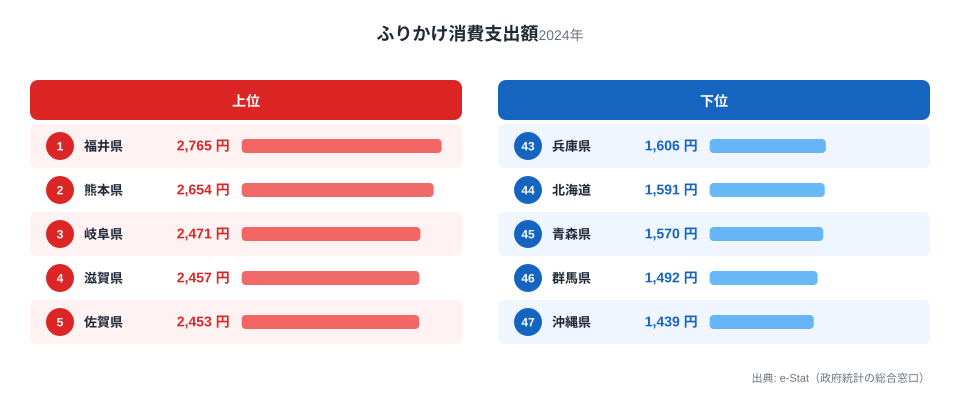
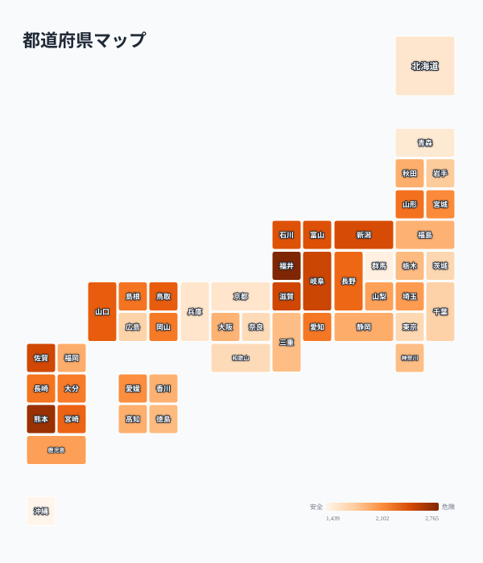

ごはんのお供として食卓に並ぶふりかけ。実は1世帯あたりの年間支出額には、都道府県で最大1.9倍もの差があります。総務省「家計調査」の2024年データによると、支出額1位は福井県の2,765円。最下位の沖縄県1,439円と比べると1,326円もの開きがあります。

なぜ北陸勢がこれほど強いのか。そして2位の熊本県には、ふりかけそのものの発祥に関わる企業があります。47都道府県のデータから、ふりかけ支出の地域差とその背景を見ていきます。

> [!NOTE]
> この記事の数値は総務省「家計調査」の1世帯あたり年間支出額（2024年、二人以上の世帯）です。実際に食べる量とは別に、贈答用の購入や世帯人数の違いも支出額に影響する点にご注意ください。

## 上位と下位

<source-link href="/ranking/furikake-consumption-expenditure">ふりかけ消費支出額ランキングをもっと見る</source-link>

上位は福井県2,765円、熊本県2,654円、岐阜県2,471円、滋賀県2,457円、佐賀県2,453円と続きます。上位10県を見ると、福井・新潟・富山・石川という北陸4県のうち3県が入っており、北陸地方の存在感が際立ちます。北陸は米どころとして知られ、コシヒカリをはじめとする良食味米の産地です。おいしいごはんを食べる機会が多い地域では、そのごはんを引き立てる調味料としてふりかけへの支出も伸びやすいと考えられます。

2位の[熊本県](/areas/43000)も見逃せません。熊本県はふりかけの元祖とされる「御飯の友」を製造するフタバ株式会社の本拠地です。1913年に発売されたこの商品は、当時カルシウム不足を補う目的で開発された歴史を持ち、地元での認知度と愛着が今も購買行動に表れている可能性があります。3位の岐阜県、4位の滋賀県も、ごはん食文化が根強い内陸県という共通点があります。

九州勢では熊本に加え佐賀県が5位、宮崎県が11位、長崎県が14位と上位に複数県が入っています。九州は醤油や味噌など発酵調味料の消費が多い地域でもあり、ふりかけを含む「ごはんのお供」全般への支出が高い傾向があると考えられます。

## なぜ沖縄や北海道は低いのか

沖縄県は1,439円で全国最下位です。北海道も1,591円で44位と低い水準にとどまります。この2地域に共通するのは、主食としての米の消費構造や食文化が本州とは異なる点です。沖縄は豚肉や野菜炒めなど独自の食文化を持ち、北海道は海鮮や乳製品の消費が多い地域です。ごはんに添える調味料としてのふりかけが、他地域ほど食卓の定番になっていない可能性があります。

> [!WARNING]
> 家計調査は都道府県庁所在市および政令指定都市の世帯を対象としたサンプル調査です。県内の地域差や、単身世帯の消費行動までは反映されていない点に留意してください。

46位の群馬県、45位の青森県、43位の兵庫県も下位に位置しています。これらの地域に北陸・九州のような明確な地理的共通点は見出しにくく、消費習慣の違いが個別に働いていると考えられます。

## 発見: 北陸4県のうち3県がトップ10入り

<source-link href="/ranking/furikake-consumption-expenditure">ふりかけ消費支出額の全47都道府県を見る</source-link>

47都道府県マップで色の濃淡を見ると、北陸から山陰にかけての日本海側と、九州北部に濃い色（支出額が高い）が集まっていることが分かります。1位の福井県に加え、新潟県が6位、富山県が7位、石川県が8位と北陸4県すべてが上位10位以内に入っています。鳥取県も9位で、日本海側の米どころが軒並み高水準です。日本海側は良質な米の産地が多く、ごはん中心の食生活とふりかけ消費の結びつきを示唆する分布と言えるでしょう。

一方で関東・近畿の大都市圏（東京都39位、大阪府30位、兵庫県43位）は軒並み中位から下位に沈んでいます。都市部では外食やパン食の比率が高く、家庭でごはんにふりかけをかける機会自体が地方より少ない可能性があります。[仮説] 都市化とふりかけ消費の関係については、外食率や朝食の主食構成など別の家計調査項目と突き合わせる検証が必要です。

> [!TIP]
> ふりかけと似た「ごはんのお供」系の品目、たとえば[しょう油消費支出額ランキング](/ranking/soy-sauce-consumption-expenditure)と比較すると、地域の食文化がより立体的に見えてきます。1位の[福井県のページ](/areas/18000)では、ふりかけ以外の統計指標もあわせて確認できます。

## まとめ

- ふりかけ消費支出額1位は福井県2,765円、最下位は沖縄県1,439円で1.9倍の差
- 2位は熊本県2,654円。ふりかけ発祥企業フタバ「御飯の友」の本拠地
- 上位10県に北陸4県のうち3県（福井・新潟・富山・石川）が入り、日本海側の米どころで支出が高い傾向
- 下位は沖縄県・北海道など、米食文化がやや異なる地域が目立つ
- 都市部（東京・大阪・兵庫）は軒並み中位から下位、地方の食習慣との違いがうかがえる

家計消費に関する他の指標は[家計・消費カテゴリ](/category/economy)でまとめて確認できます。

## データ出典

総務省統計局「家計調査」（2024年、二人以上の世帯）を基に作成。e-Stat（政府統計の総合窓口）経由で取得したデータを集計しています。
