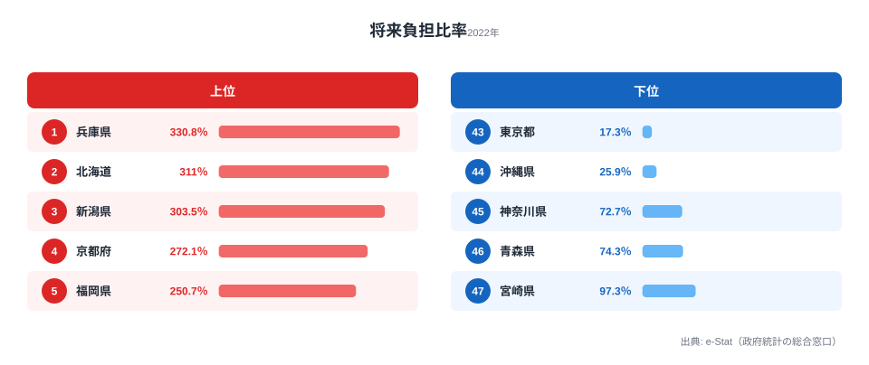
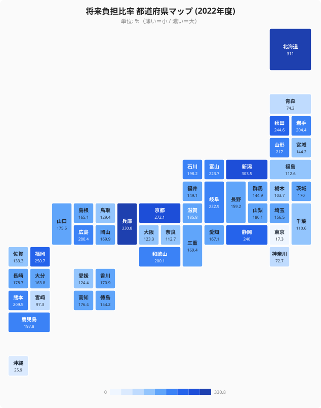

「同じ日本の自治体なのに、なぜここまで差がつくのか」──総務省「地方財政状況調査」(2022年度) の将来負担比率を都道府県別に並べると、1位の**兵庫県 (330.8%)** と最下位の**東京都 (17.3%)** で **19倍** もの開きが現れます。健康寿命の県間差は約1.05倍、中学生の平均身長でも約1.02倍にとどまるなかで、自治体財政だけが桁違いの格差を抱えているのです。

将来負担比率は、地方公共団体財政健全化法に基づく**公式の財政指標**です。自治体が将来支払う負担見込額が、標準財政規模 (毎年度経常的に使える一般財源のおおよその規模) の何倍にあたるかを示します。100%を超えれば、標準財政規模の1年分以上の負担を将来世代に先送りしている計算になります。本記事は独自スコアではなく、この**公式指標そのもの**の格差構造に焦点を当てます。そして上位に「大都市圏」と「過去の大型インフラ投資を抱えた地方圏」という性格の異なる2系統が混在している、という点が読みどころです。

> [!NOTE]
> 将来負担比率は「将来負担額 ÷ 標準財政規模」で算出され、地方債の現在高だけでなく、債務負担行為に基づく支出予定額や退職手当の支給予定額なども分子に含みます。単年度の返済額の重さを測る実質公債費比率とは別物で、こちらは「将来世代に残す負担の総量」を測る指標だと理解すると読み違えを防げます。

## 上位5と下位5 — 19倍の開きはどこから来るのか

まず2022年度の上位5県と下位5県を1枚に並べます。上位 (青) は標準財政規模の2.5〜3.3年分の将来負担を抱える県、下位 (赤) は1年分にも満たない県です。

1位の**兵庫県 (330.8%)** は、標準財政規模の約3.3年分にあたる将来負担を抱えています。背景には、阪神・淡路大震災 (1995年) の復興事業で発行した県債の償還が長期化していることがあります。震災から長い年月を経てもなお、復興起債が財政運営の重しとして残り続けているのです。2位の**北海道 (311.0%)** と3位の**新潟県 (303.5%)** は、いずれも県土が広く、過去の道路・港湾・治水といったインフラ投資の県債残高が累積しています。4位の**京都府 (272.1%)** と5位の**福岡県 (250.7%)** は大都市圏の中核府県で、都市基盤の整備と高齢化への対応という二重の負担が数字に表れています。

下位を見ると、最下位の**東京都 (17.3%)** は標準財政規模の約6分の1にしか将来負担がありません。法人事業税や固定資産税の集積によって都税収入が圧倒的に厚く、起債に頼らずに歳出を賄える構造が、将来負担そのものを小さく抑えています。46位の**沖縄県 (25.9%)** も低く、こちらは税収の厚さというより、沖縄振興特別措置法に基づく高補助率の国費補填によって県単独の起債を抑えられている事情が効いています。

この上位と下位を見比べると、19倍の開きが「県の優劣」という単純な話ではないことが見えてきます。上位には大都市圏 (兵庫・京都・福岡) と地方圏 (北海道・新潟) が混在し、下位には超大都市 (東京) と国費補填の手厚い県 (沖縄) が並びます。つまり**税収が厚いから低い**東京と、**起債が少ないから低い**沖縄は、低さの理由がまったく異なります。同じように、上位の兵庫と北海道も、震災復興とインフラ累積という別々の事情で高くなっています。

<source-link href="/ranking/future-burden-ratio">将来負担比率ランキング (全47都道府県) をもっと見る</source-link>

> [!WARNING]
> 将来負担比率はその年度の標準財政規模を分母に取るため、地方交付税の算定変更などで分母が動くと、地方債残高がそれほど変わらなくても比率が上下します。年度をまたいだ単純比較では「負担が増えた／減った」と即断せず、分子 (将来負担額) と分母 (標準財政規模) のどちらが動いたかを切り分けて読む必要があります。

## 都道府県マップで見る地理の偏り

次に47都道府県を地図に配置し、将来負担比率の高低を濃淡で示します。濃い青ほど将来負担比率が高い県です。

地図にすると、上位5県の解説だけでは見えにくい偏りが浮かびます。比率が高い濃い青は、北海道・東北 (秋田244.6%、山形217.0%) から北陸 (富山223.7%)、近畿の兵庫・京都、そして九州の福岡へと、必ずしも一塊にはなっていません。一方で関東の南側、とりわけ神奈川 (72.7%)・東京 (17.3%) は明確に薄く、首都圏の税収基盤の厚みが地図上でもくっきりと現れます。中間に位置する愛知 (167.1%、26位) や大阪 (123.3%、38位) のような大都市圏でも、必ずしも上位には来ていない点は重要です。大都市だから将来負担が大きい、地方だから小さい、という単純な対応関係は成り立っていません。

つまり地理的に見ると、将来負担比率を押し上げる要因は「どの地域か」ではなく、「過去にどれだけ起債を伴う事業を行い、その償還がいつまで続くか」という**県ごとの財政履歴**にあると考えられます。震災復興 (兵庫)、広域インフラ (北海道・新潟)、都市基盤と高齢化 (京都・福岡) という別々の経路をたどった県が、結果として同じ「高比率グループ」に集まっているのです。

> [!TIP]
> 将来負担比率は「今後の負担の総量」を見る指標なので、単年度の返済の重さを示す実質公債費比率と合わせて読むと立体的になります。将来負担が大きくても、返済を長期に平準化できていれば実質公債費比率は落ち着く、という県もあります。両方を見比べると、その県の財政運営の巧拙まで見えてきます。

## 下位グループ — なぜ低いのか、低さの理由は3通り

下位の県は一見すると「財政が健全」とまとめられがちですが、低さの理由は実は一様ではありません。

45位の**神奈川県 (72.7%)** は、東京に次ぐ税収基盤を持ち、自主財源の厚みが起債の必要性そのものを抑えています。44位の**青森県 (74.3%)** や43位の**宮崎県 (97.3%)** は、神奈川のような大規模な税収はありませんが、近年の大型起債事業が相対的に少なく、将来負担が積み上がっていません。そして46位の**沖縄県 (25.9%)** と47位の**東京都 (17.3%)** は、前述のとおり国費補填と都税収入というまったく別の理由で突出して低い水準にあります。

このように下位グループは、(1) 税収が厚く起債が不要な県、(2) 大型起債事業が少なく将来負担が積み上がっていない県、(3) 国費補填で県単独の起債を抑えられている県、という3通りの経路に分かれます。「将来負担が小さい=財政に余力がある」とは限らず、その低さがどの経路によるものかを見極めることが大切です。

> [!NOTE]
> 将来負担比率の早期健全化基準は400% (都道府県・政令市) です。2022年度は1位の兵庫 (330.8%) を含め全47都道府県が基準内に収まっています。ただし兵庫は基準の8割を超えており、将来世代に残す負担の重さは数字上も無視できない水準にあります。

## 発見 — 上位を分ける「2系統 + 兵庫の特殊性」

上位を整理すると、性格の異なる2系統と、それに収まらない兵庫の特殊事情が浮かび上がります。実データに即して仮説の形で整理します。

- **[仮説A] 大都市圏グループ** — 京都 (272.1%)・福岡 (250.7%) は、人口集中による都市基盤整備 (地下鉄・上下水道・大学関連など) の継続投資が将来負担を押し上げている可能性があります。ただし同じ大都市圏でも愛知 (167.1%、26位)・大阪 (123.3%、38位) は上位に来ておらず、「大都市だから高い」とは一概に言えません。
- **[仮説B] 過去インフラ投資負担グループ** — 北海道 (311.0%)・新潟 (303.5%)・秋田 (244.6%)・静岡 (240.0%)・富山 (223.7%)・岐阜 (222.9%) は、人口減少局面に入ってもなお、過去に発行した広域インフラ向け県債の償還が継続していると考えられます。
- **[仮説C] 兵庫の特殊性** — 1位の兵庫 (330.8%) は、阪神・淡路大震災 (1995年) の復興県債が依然として残っている影響が大きい可能性があります。震災から長期間が経過しても完全には消化しきれない、長期償還の典型例といえます。

これらの仮説を検証するには、各県の県債発行年度別残高と償還スケジュールの精査、震災・災害復興起債と通常起債の内訳比較が必要です。本記事の数値だけで因果を断定することはできませんが、少なくとも「上位が単一の理由で説明できない」ことは、上位5県と地図の両方からはっきりと読み取れます。

## まとめ

- 2022年度の将来負担比率は、1位**兵庫 (330.8%)** と47位**東京 (17.3%)** で約**19倍**の開きがあります。
- これは健康寿命 (約1.05倍)・平均身長 (約1.02倍) と比べて桁違いに大きく、自治体財政は47都道府県データのなかでも最も格差の大きい領域の1つです。
- 上位は「大都市圏 (兵庫・京都・福岡)」と「過去のインフラ投資負担 (北海道・新潟・秋田・静岡)」という性格の異なる2系統が混在しています。大都市の愛知・大阪が上位に来ない点が、その混在を裏づけます。
- 下位の県 (神奈川・青森・宮崎・沖縄・東京) は、税収の厚さ・起債の少なさ・国費補填という3通りの異なる理由で低くなっており、「低い=余力がある」とは限りません。
- 早期健全化基準 (400%) には全県が収まっていますが、兵庫は基準の8割超に達しており、将来世代に残す負担の重さは無視できません。

将来負担の総量だけでなく、単年度の返済の重さも合わせて見ると、各県の財政運営がより立体的に見えてきます。あわせて[実質公債費比率ランキング](https://stats47.jp/ranking/real-public-debt-service-ratio)や、同じ[行財政カテゴリの指標一覧](https://stats47.jp/category/administrativefinancial)も確認してみてください。世代間の負担構造に関心があれば、姉妹記事の[県債は誰が返す? 47都道府県](https://stats47.jp/blog/prefectural-debt-future-burden)も参考になります。

## データ出典

- 出典機関: 総務省「地方財政状況調査」(社会・人口統計体系 D 行政基盤として整備)
- 集計年: 2022年度
- 取得経路: e-Stat 政府統計の総合窓口
