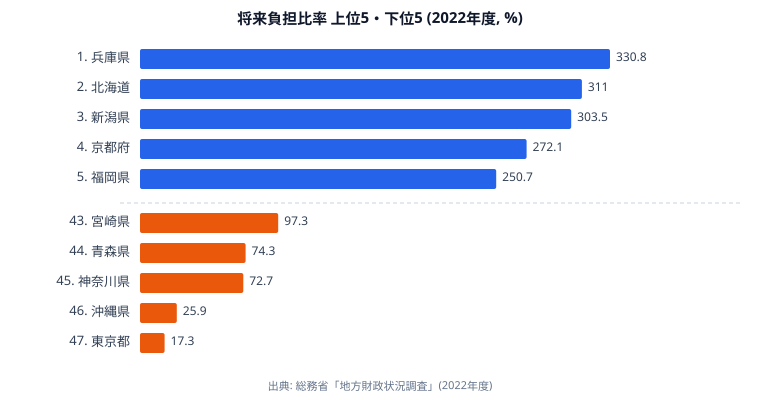

「将来負担比率」は、地方公共団体財政健全化法に基づく公式の財政指標です。自治体が**将来支払う負担見込額**が標準財政規模の何倍にあたるかを示し、100% を超えればその自治体は標準財政規模の1年分以上の負担を将来世代に残している計算になります。

総務省「地方財政状況調査」(2022 年度) の都道府県別データを見ると、首位の **兵庫県 (330.8%)** に対し最下位の **東京都 (17.3%)** で、その差は **19.12 倍** に達します。これは stats47 が扱う 47 都道府県の各種指標の中でも極端な部類で、**健康寿命の 1.05 倍・平均身長の 1.02 倍**という上位下位の開きと比べると、自治体財政だけが桁違いの格差構造を抱えていることが分かります。なぜ財政指標だけがここまで開くのか――この記事ではその真因を、上位県と下位県の財政事情から読み解いていきます。

> [!NOTE]
> 将来負担比率は「将来負担額 ÷ 標準財政規模」で計算する公式指標です。分母の標準財政規模は税収などの一般財源の標準的な規模を指すため、**同じ借金額でも税収基盤が厚い自治体ほど比率は低く**出ます。額面の借金の大小だけを表す指標ではない点に注意してください。

本記事は姉妹記事「[県債は誰が返す? 47都道府県](https://stats47.jp/blog/prefectural-debt-future-burden)」の補完として、独自スコアではなく **公式指標そのもの** の格差構造に焦点を当てます。

## 上位5県と下位5県 ― 330.8% から 17.3% までの落差

まず、上位5県と下位5県を1枚の図にまとめて見てみます。上位（青）はいずれも標準財政規模の2.5年分を超える将来負担を抱える一方、下位（橙）は1年分にも満たず、同じ「都道府県」という単位とは思えない落差が一目で分かります。

首位の **兵庫県 (330.8%)** は標準財政規模の **約 3.3 年分** に相当する将来負担を抱えています。阪神・淡路大震災 (1995) の復興事業で発行した県債の償還が長期化しており、いまだ財政運営の重しになっていることが背景にあります。2 位 **北海道 (311.0%)** と 3 位 **新潟県 (303.5%)** はいずれも県土が広く、過去の道路・港湾・治水インフラ投資の県債残高が累積しています。4 位 **京都府 (272.1%)** と 5 位 **福岡県 (250.7%)** は大都市圏の中核府県で、都市基盤整備と高齢化対応の二重負担が比率に現れています。全 47 都道府県の並びは[将来負担比率ランキング](/ranking/future-burden-ratio)で確認できます。

対照的に、下位の5県はいずれも100%前後かそれ以下にとどまります。最下位の **東京都 (17.3%)** に至っては標準財政規模の **約 6 分の 1** にしか将来負担がありません。45 位の **神奈川県 (72.7%)**、44 位の **青森県 (74.3%)**、43 位の **宮崎県 (97.3%)** と、下位グループは「税収基盤が厚い大都市圏」と「そもそも起債額が小さい地方圏」が混在しているのが特徴です。なぜこれほど低く抑えられるのかは、次の章で個別に見ていきます。

<source-link href="/ranking/future-burden-ratio">将来負担比率 都道府県ランキングをもっと見る</source-link>

> [!WARNING]
> 将来負担比率は「比率が高い＝財政が危険」と短絡できません。早期健全化基準は **400%**（都道府県・政令市）であり、今回の上位5県はいずれも基準内に収まっています。逆に下位県が低いのは健全経営の証とは限らず、**国費補填や税収集中という外的要因**で起債を抑えられているケースを含みます。順位の上下をそのまま「優良・危険」と読み替えないでください。

## 最下位グループ ― なぜ東京・沖縄・神奈川は低いのか

下位グループがなぜここまで低い比率にとどまるのか、上位3県（東京・沖縄・神奈川）の事情を順に見ていきます。

最下位の **東京都 (17.3%)** は、都税収入が圧倒的に厚いことが決定的です。法人事業税・固定資産税が集積し、起債に頼らずに歳出を賄える構造になっているため、分子の将来負担額が小さく、かつ分母の標準財政規模が大きくなり、比率は極端に小さく出ます。首位の兵庫との差が **19.12 倍** にまで開く最大の理由は、この「税収の厚みが分母を押し上げる」効果にあります。

46 位の **沖縄県 (25.9%)** は事情が異なります。沖縄振興特別措置法に基づく国費補填（高補助率）が手厚く、県単独の起債を抑制できる事情があるためです。地方債残高そのものが小さく、将来負担も自然と低くなります。東京が「税収で分母を大きくする」型なら、沖縄は「補助金で分子を小さく保つ」型といえます。

45 位の **神奈川県 (72.7%)** は東京に次ぐ税収基盤を持ち、自主財源比率も全国 2 位 (64.0%) と高い県です。歳入の厚みが起債の必要性を抑え、将来負担を低く保っています。下位グループに大都市圏が並ぶのは、こうした税収集中が比率の分母を押し上げているためで、地方圏とは低さの意味合いが違います。

<source-link href="/ranking/self-financing-ratio">自主財源比率 都道府県ランキングをもっと見る</source-link>

> [!TIP]
> 下位県を読むときは「税収型（東京・神奈川）」か「補填型（沖縄）」かを切り分けると構造がつかめます。前者は比率が低くても歳出規模が巨大で、後者は歳出規模そのものが小さい――同じ低比率でも財政の体質はまったく別物です。

## 「将来負担」が大きい県の共通点

上位県を眺めると、**(A) 大都市圏** と **(B) 過去の大型インフラ投資負担を抱える地方圏** という 2 系統が混在していることが分かります。仮説段階の整理として、3つの系統に分けて考えます。

- **[仮説 A] 大都市圏グループ** ― 京都 (272.1%)・福岡 (250.7%)・兵庫 (330.8%) は、人口集中による都市基盤整備（地下鉄・上下水道・大学関連等）の継続投資が将来負担を押し上げている可能性があります。
- **[仮説 B] 過去インフラ投資負担グループ** ― 北海道 (311.0%)・新潟 (303.5%)・秋田 (244.6%)・静岡 (240.0%)・富山 (223.7%)・岐阜 (222.9%) は、人口減少局面に入っても **昭和 60 年代〜平成初期に発行した県債** の償還が継続していると考えられます。
- **[仮説 C] 兵庫の特殊性** ― 首位の兵庫 (330.8%) は、阪神・淡路大震災 (1995) の復興県債が依然として残っている影響が大きい可能性があります。震災から 30 年経過しても完全には消化しきれない長期償還の典型事例といえそうです。

これらの仮説を検証するには、各県の県債発行年度別残高と償還スケジュールの精査、震災・災害復興起債と通常起債の内訳比較が必要になります。現時点ではあくまで上位県の地理的・歴史的特徴から導いた推論である点に留意してください。

姉妹記事「[地方債1位は静岡208%・東京41%の5倍](https://stats47.jp/blog/local-debt-current-ratio-prefecture-gap)」では地方債現在高比率で中堅県が上位を占めましたが、将来負担比率では **京都・福岡・兵庫といった大都市圏も上位に入る**違いが見えます。同じ財政指標でも、何を分子に取るかで都市と地方の見え方が入れ替わるわけです。財政力指数や歳入構造など関連する指標は[行政・財政カテゴリ](/category/administrativefinancial)にまとめています。

## まとめ

- 2022 年度の将来負担比率は、首位の **兵庫 (330.8%)** と最下位の **東京 (17.3%)** で **19.12 倍** の超格差になっています。
- これは健康寿命 (1.05 倍)・平均身長 (1.02 倍) と比べて **桁違いの格差**で、自治体財政は 47 都道府県データの中でも最も極端な格差を抱える領域の 1 つです。
- 上位は **「大都市圏 (兵庫・京都・福岡) + 過去インフラ投資負担 (北海道・新潟・秋田・静岡)」** の 2 系統が混在しています。
- 下位5県のうち東京・神奈川は税収基盤の厚さで、沖縄は国費補填で、それぞれ起債を抑制できる構造を持っています。
- 早期健全化基準 (400%) には全県が収まりますが、兵庫は基準の 8 割超に達しており、将来世代に残す負担の重さは無視できません。

## データ出典

- 出典機関: 総務省「地方財政状況調査」
- 集計年: 2022 年度
- 取得経路: e-Stat 政府統計の総合窓口（経由整備）
