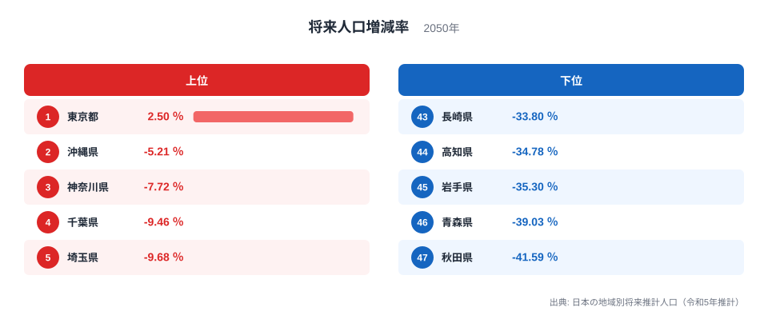
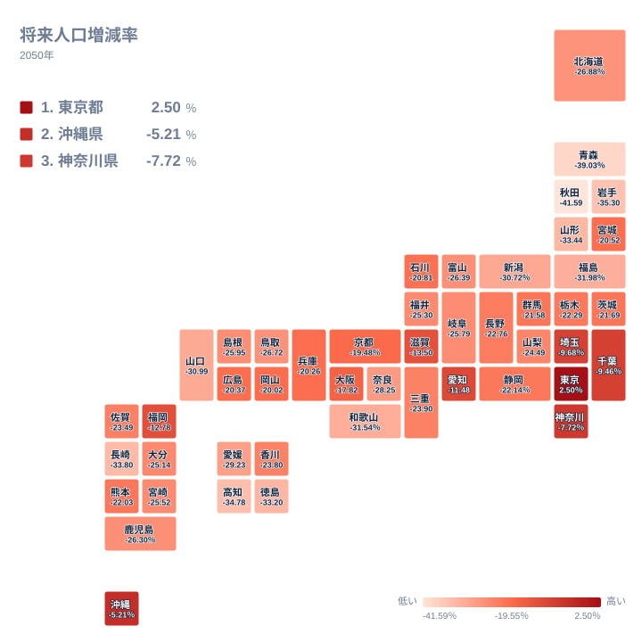

将来人口増減率とは、現在の人口を基準にして、将来のある時点で人口がどれだけ増えるか、あるいは減るかを示す指標です。国立社会保障・人口問題研究所がまとめた日本の地域別将来推計人口（令和5年推計）によると、2050年時点でこの増減率がプラスになる都道府県は、47都道府県のうち東京都だけです。東京都は2.5％の増加が見込まれている一方、秋田県は41.59％の減少が見込まれており、両者の開きは非常に大きくなっています。この記事では、上位5県と下位5県を比較しながら、なぜこれほどの地域差が生まれるのかを見ていきます。

47都道府県の順位を見ると、プラスを維持できるのは東京都のみで、2位の沖縄県はすでに5.21％の減少に転じています。3位の神奈川県は7％台、4位の千葉県と5位の埼玉県は9％台の減少にとどまっており、上位5県は首都圏の各県と沖縄県で占められています。一方、下位に目を移すと、東北地方や四国地方、九州地方の各県が並び、減少率が30％を超える県も少なくありません。この記事を読むと、どの地域で人口減少が緩やかで、どの地域で急速に進むと見込まれているのかが分かります。

> [!NOTE]
> この指標は、各都道府県の現在の人口を基準として、2050年時点の推計人口が何パーセント増減するかを示したものです。増減率がプラスになっているのは東京都だけで、残り46の道府県はすべてマイナスとなっています。マイナスの値が大きいほど、人口の減り方が大きいことを意味します。

## 上位5県と下位5県の差

<source-link href="/ranking/future-population-change-rate-2050">将来人口増減率ランキングをもっと見る</source-link>

上位5県を順に見ていきます。1位は東京都で、2050年時点で2.5％の増加が見込まれています。2位は沖縄県で5.21％の減少、3位は神奈川県で7.72％の減少、4位は千葉県で9.46％の減少、5位は埼玉県で9.68％の減少となっています。東京都を除く上位4県のうち3県は、神奈川県、千葉県、埼玉県という東京都に隣接する県です。[仮説] これらの県は通勤・通学圏として東京都への人口流入を受け止める役割を担っており、他県からの転入によって人口減少が緩やかになっている可能性があります。[仮説] 沖縄県については、他の都道府県と比べて出生数が死亡数を上回る期間が長く続いてきたことが、人口減少の緩和につながっている可能性がありますが、この点はランキングのデータだけでは検証できません。東京都の人口動向をさらに詳しく知りたい方は、[東京都のデータ](/areas/13000)もあわせてご覧ください。

下位5県を順に見ていきます。43位は長崎県で33.8％の減少、44位は高知県で34.78％の減少、45位は岩手県で35.3％の減少、46位は青森県で39.03％の減少、47位は秋田県で41.59％の減少となっています。下位5県はいずれも大都市圏から離れた地域に位置しており、東北地方と四国地方、九州地方の県で占められています。これらの県では、進学や就職を機に若い世代が都市部へ転出する社会減に加え、出生数が死亡数を下回る自然減が重なることで、減少率が特に大きくなっていると考えられます。

東京都と秋田県を見比べると、プラスとマイナスという符号そのものが逆になっており、同じ日本国内でも将来の人口動向にこれほどの違いが生まれる見込みであることが分かります。沖縄県のように東京都以外でも減少幅が小さい県がある一方で、東北や四国の県では減少幅が大きくなっており、単純な東西や都市・地方という区分だけでは説明しきれない部分もあります。沖縄県の人口動向を詳しく確認したい方は、[沖縄県のデータ](/areas/47000)から確認できます。

## 地理的な広がりで見る人口減少

タイルマップで色の濃淡を見ると、減少率が大きい県は東北地方と四国地方に集中していることが分かります。東北6県のうち、宮城県は20.52％の減少にとどまっていますが、青森県は39.03％、秋田県は41.59％、岩手県は35.3％、山形県は33.44％、福島県は31.98％と、宮城県以外の5県はいずれも30％台から40％台の大きな減少が見込まれています。[仮説] 宮城県は仙台市を中心とする都市圏を抱えており、東北地方の中では人口の受け皿としての役割を果たしている可能性があります。

四国地方も減少率が大きい地域です。徳島県は33.2％の減少、高知県は34.78％の減少が見込まれており、香川県の23.8％や愛媛県の29.23％と比べても、徳島県と高知県の減少幅は際立っています。四国4県のうち香川県を除く3県が全国順位の後半に位置しており、東北地方と並んで人口減少が急速に進むと見込まれている地域です。

一方、近畿地方と中部地方では県によって差が大きくなっています。近畿地方では、大阪府が17.82％の減少、滋賀県が13.5％の減少にとどまる一方で、和歌山県は31.54％の減少となっており、同じ近畿地方でも減少幅に大きな開きがあります。中部地方でも、愛知県は11.48％の減少で全国6位の緩やかさですが、新潟県は30.72％の減少と大きく異なります。都市圏を抱える県とそうでない県との差が、同じ地方の中でも表れていることが分かります。

## 首都圏と地方の分かれ目はどこにあるのか

上位10県を見ると、東京都、神奈川県、千葉県、埼玉県、愛知県、福岡県という三大都市圏の中心県または隣接県に加え、沖縄県、滋賀県、大阪府、京都府が入っています。滋賀県は13.5％の減少で8位となっており、[仮説] 京都府に隣接し京阪神都市圏の一角を占めていることが、減少幅の小ささにつながっている可能性があります。[仮説] このように、上位県の多くは三大都市圏または沖縄県に集中しており、都市圏からの距離が減少率の緩やかさと関係している可能性がありますが、因果関係を確かめるにはさらに詳しいデータでの検証が必要です。

下位県との比較でもう一つ気づく点があります。減少率が20％に満たない県は10県にとどまる一方で、30％を超える県は11県に上ります。全47都道府県のうち37県、およそ8割が20％以上の減少という大きな数字を示しており、多くの地域で人口減少が緩やかには進まないと見込まれていることがうかがえます。人口に関する他の指標もあわせて確認したい方は、[同じカテゴリの統計一覧](/category/population)からご覧いただけます。

> [!WARNING]
> ここで示されている数値は推計値であり、実際に観測された人口ではありません。日本の地域別将来推計人口は、出生率や死亡率、人口移動といった仮定にもとづいて算出されているため、今後の社会情勢や政策の変化によって、実際の2050年の人口はこの推計と異なる可能性があります。

> [!TIP]
> 順位が一つ違うだけでも、実際の数値には差があります。たとえば9位の大阪府は17.82％の減少、10位の京都府は19.48％の減少となっており、順位だけでなく、隣り合う県の実際の数値も合わせて確認することが、地域差を正しく読み解くコツです。

## まとめ

- 1位は東京都で、2050年時点で唯一プラスの2.5％の増加が見込まれています。
- 最下位の47位は秋田県で、41.59％の減少が見込まれています。
- 上位5県は東京都、沖縄県、神奈川県、千葉県、埼玉県で、首都圏の各県と沖縄県が占めています。
- 減少率が20％に満たない県は10県にとどまる一方、30％を超える県は11県に上ります。
- 東北地方と四国地方に減少率の大きい県が集中しており、都市圏からの距離が地域差の背景にあるという仮説が立てられます。

## データ出典

出典: 日本の地域別将来推計人口（令和5年推計）、国立社会保障・人口問題研究所。対象年は2050年です。
