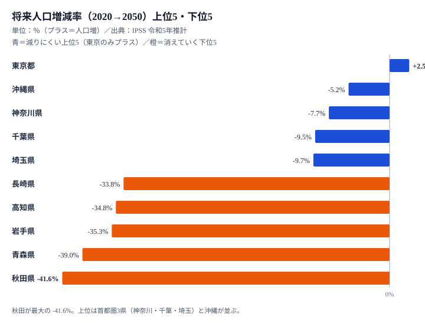

「人口減少は、いずれどこかの地方で起きること」——多くの人がそう思っているかもしれません。ですが国立社会保障・人口問題研究所（IPSS）の令和5年推計を1枚の地図に落とすと、その認識は崩れます。**2020年から2050年の30年間で人口が「増える」のは、47都道府県のうち東京都ただ1つ（+2.5%）です。** 残り46道府県はすべて減ります。

最も激しいのは秋田県の **-41.6%** です。約96万人が約56万人へ、人口の4割が消える計算になります。しかも-30%以上の「3割減」に達する県は11もあります。

本記事が問いたいのは「どこが何位か」ではありません。**なぜ同じ日本で、これほど未来が枝分かれするのでしょうか。** 減る県には、高齢化率・財政力・人の流れに共通したプロファイルがあります。それをデータで描き出していきます。

> [!NOTE]
> 数値は国立社会保障・人口問題研究所「日本の地域別将来推計人口（令和5年推計）」に基づく将来推計人口（2020年実績→2050年推計）と、その増減率。あくまで「現在の出生・死亡・移動の傾向が続いた場合」のシナリオであり、予言ではない点に注意。ただし出生はすでに起きた出生数に強く規定されるため、向こう30年の大枠は実績に近い精度で見通せる。

## 増えるのは東京だけ──2050年増減率の上位5と下位5

将来人口増減率の上位5と下位5を1枚に並べると、構図は一目瞭然です。プラスは東京都（+2.5%）のみで、2位の沖縄県でさえ-5.21%とマイナスに沈みます。下位は秋田・青森・岩手と東北が独占し、四国の高知（-34.78%）や九州の長崎（-33.8%）も食い込みます。

注目したいのは、上位5のうち東京を除く4つが「東京を取り囲む首都圏3県（神奈川-7.72%・千葉-9.46%・埼玉-9.68%）と沖縄」だという点です。沖縄は出生率が全国最高水準で自然増の余力を持つ特殊例ですが、神奈川・千葉・埼玉は出生力が高いわけではなく、東京圏への人の流れに乗って減少幅が抑えられています。つまり**減りにくい県とは「人が集まり続ける県」**であり、この増減率の並びは事実上「人の引力ランキング」の裏返しになっているのです。

一方の下位5は、秋田-41.6%を底に、青森-39.0%・岩手-35.3%と東北勢が固め、そこに高知-34.8%・長崎-33.8%が連なります。これらの県に共通するのは、若い世代がすでに薄く、出生で自然減を埋め戻せない構造です。減るスピードが最も速い秋田と、唯一増える東京の差は44ポイント分にもなり、同じ国の中で未来の傾きがこれほど開いていることが見て取れます。

<source-link href="/ranking/future-population-change-rate-2050">将来人口増減率（2020→2050）のランキングをもっと見る</source-link>

## 「3割減」は11県──東北・四国・中国地方に集中

減少率を地域で区切ると、深刻さの地理的な偏りがはっきりします。**-30%以上（3割減）に達する県は11**で、その内訳には強い偏りがあります。東北6県のうち5県（秋田・青森・岩手・山形・福島）がそろい、四国（高知・徳島）、中国・北陸（山口・新潟）、九州（長崎）、近畿（和歌山）が続きます。東北だけで「3割減」グループの半数近くを占めるという、地域的な集中が見えます。

[秋田県](/areas/05000)を絶対数で見ると重みが伝わります。2050年の推計人口は **約56万人（560,429人）** です。-41.6%という減少率から逆算すると2020年は約96万人だったので、政令市1つぶんに近い人口が、30年で県から失われる規模になります。率の大きさが「人がいなくなる」現実とどう結びつくのかは、絶対数に直して初めて実感できます。

> [!WARNING]
> 「減少率が大きい＝人口が少ない県」ではない点に注意。新潟県（-30.7%）は2020年時点で約220万人規模の中堅県であり、率では下位11番目（37位）でも、失われる「人数」はワースト県より多い。率（スピード）と量（規模）は別の物差しであり、政策の優先度を測るときは両方を見る必要がある。

<source-link href="/ranking/future-population">2050年の将来推計人口（実数）ランキングを見る</source-link>

## なぜ減るのか──高齢化・財政・人の流出が重なる「負のスパイラル」

減る県には共通したプロファイルがあります。減少率の下位県（秋田・青森・岩手・高知）と、唯一増える東京都を、高齢化率・財政力・人の移動という3つの指標で見比べると、その違いがくっきりと浮かびます。

まず高齢化です。**高齢化率（65歳以上人口割合）が全国で最も高いのは秋田（39.5%）で、高知（36.6%）、青森（35.7%）がそれに続きます。**いずれも減少率の下位県と重なる顔ぶれです。対する[東京都](/areas/13000)は22.7%で全国最低の若さを保っています。高齢者比率が高いということは、これから亡くなる世代が多く、子どもを産む若い世代が少ないことを意味します。出生で補えない自然減が、構造的にあらかじめ決まっているのです。

財政も連動します。財政力指数（自前で財源を賄える度合いで、1.0が自立の目安）を見ると、秋田は0.309で44位、青森は0.342で37位、岩手は0.354で36位、高知は0.261で46位と、いずれも低い水準にとどまります。対して東京は1.064で全国唯一の「自立」県（1位）です。人口が減れば税収が減り、行政サービスを維持しにくくなり、それがさらに転出を促します。つまり**人口減→税収減→サービス低下→転出増→さらに人口減**という負のループが、数字の並びから読み取れます。

そして人の移動です。**転入超過率がプラス（流入超過）なのは全国でわずか7都府県**で、東京（+0.56%）を筆頭に首都圏と大阪・愛知に偏ります。残り40道府県は転出超過で、高知の-0.48%は全国最大の流出にあたります。減る県は「生まれる人が少なく、出ていく人が多い」二重の流出にさらされているのです。高齢化率が高く、財政力が弱く、人が流出する——この3つが重なる県ほど深く減り、東京は3指標すべてで正反対の極にあって唯一プラス成長を続けます。

> [!TIP]
> 増える東京と減る秋田は、3指標すべてで正反対の位置にある。逆に言えば「高齢化率を下げ、財政基盤を強め、転出を止める」のどれか1つだけでは流れは変わらない。人口維持は単一施策では届かない複合問題だ、という読み筋でこのデータを見ると、施策の優先度を立てやすい。

<source-link href="/ranking/fiscal-strength-index-prefecture">財政力指数ランキング（都道府県）を見る</source-link>

## 出生率が高くても減る県がある──「健闘型の悲劇」

ここで一つ、見落とされがちな事実を補っておきます。「子どもをたくさん産めば人口は維持できる」という直感は、必ずしも正しくありません。

長崎県の合計特殊出生率は全国でも高い部類ですが、2050年の人口は **-33.8%**（43位）と大きく減る見込みです。理由は明快で、生まれた若者が進学・就職で県外へ出ていくからです。出生で人口を生み出しても、20歳前後でそれを首都圏に「輸出」してしまえば、県内には残りません。

> [!NOTE]
> 合計特殊出生率の全国分布は西高東低で、九州・沖縄が高く東京が最低（東京は1.0前後）。それでも将来人口で東京が勝ち、九州が負けるのは、出生の差を上回る規模で「人の移動」が効いているため。出生率と将来人口の順位が一致しないこの「ズレ」こそ、人口問題の核心といえる。

つまり人口維持の方程式は「出生率」単独ではなく、**出生率 × 定着率（流出させない力）** の掛け算です。出生率を上げても定着率がゼロに近ければ、人口は積み上がりません。長崎・鹿児島のような「出生は健闘しているのに減る県」の存在が、それを物語っています。

<source-link href="/ranking/total-fertility-rate">合計特殊出生率ランキングを見る</source-link>

## まとめ：30年後の地図は、すでに大枠が描かれている

- **2050年に人口が増えるのは東京都だけ（+2.5%）です。** 残り46道府県はすべて減ります。
- 最大の減少は **秋田県の-41.6%**（約96万人→約56万人）で、次いで青森-39.0%、岩手-35.3%と続きます。
- **-30%以上（3割減）は11県**で、東北5県を中心に四国・中国・九州へ広がります。
- 減る県は「**高齢化率が高い・財政力が弱い・人が流出する**」3条件が重なります。秋田は高齢化率全国1位（39.5%）・財政力44位（0.31）・転出超過と、三拍子そろっています。
- 出生率が高くても若者が流出すれば減ります（長崎-33.8%）。人口維持は **出生率 × 定着率** の掛け算であり、単一施策では止まりません。

将来推計人口は「予言」ではありませんが、向こう30年に親になる世代はすでに生まれている以上、大枠は揺らぎにくいといえます。高齢化や人口移動など関連する指標は[人口カテゴリ](/category/population)からたどれます。地図の色は、これから塗られるのではなく、もう下描きされている——その前提に立てるかどうかが、地域政策の分かれ目になります。

> [!WARNING]
> 本記事の数値は「現在のトレンドが継続した場合」のシナリオ。大規模な移住促進、出生環境の改善、外国人の受け入れ拡大などが進めば結果は変わりうる。推計を「変えられない運命」ではなく「介入の余地を測る基準線」として読むのが正しい使い方。

### データ出典

- 国立社会保障・人口問題研究所「日本の地域別将来推計人口（令和5年推計）」（将来推計人口 2020年実績→2050年推計、および増減率）
- 総務省「住民基本台帳人口移動報告」（転入超過率 2024年）
- 総務省「人口推計」（65歳以上人口割合 2024年）
- 総務省「地方財政状況調査」（財政力指数 2022年度）

いずれも政府統計の総合窓口（e-Stat）を通じて整備されたデータを集計。
