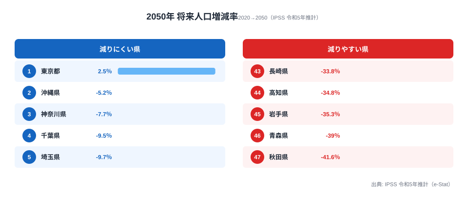

「人口減少は、いずれどこかの地方で起きること」——多くの人がそう思っているかもしれません。ですが国立社会保障・人口問題研究所（IPSS）の令和5年推計を1枚の地図に落とすと、その認識は崩れます。**2020年から2050年の30年間で人口が「増える」のは、47都道府県のうち東京都ただ1つ（+2.5%）。** 残り46道府県はすべて減ります。

最も激しいのは秋田県の **-41.6%** です。約96万人が約56万人へ、人口の4割が消える計算になります。しかも-30%以上の「3割減」に達する県は11もあります。

本記事が問いたいのは「どこが何位か」ではありません。**なぜ同じ日本で、これほど未来が枝分かれするのか。** 減る県には、高齢化率・財政力・人の流れに共通したプロファイルがあります。それをデータで描き出していきます。

> [!NOTE]
> 数値は国立社会保障・人口問題研究所「日本の地域別将来推計人口（令和5年推計）」に基づく将来推計人口（2020年実績→2050年推計）と、その増減率。あくまで「現在の出生・死亡・移動の傾向が続いた場合」のシナリオであり、予言ではない。ただし出生はすでに起きた出生数に強く規定されるため、向こう30年の大枠は実績に近い精度で見通せる。

## 増えるのは東京だけ──2050年増減率ランキング

将来人口増減率の上位・下位を並べると、構図は一目瞭然です。プラスは東京都（+2.5%）のみ。2位の沖縄県でさえ-5.21%とマイナスに沈みます。下位は秋田・青森・岩手と東北が独占し、四国の高知（-34.78%）も食い込んでいます。

東京以外で「マシ」なのは、いずれも大都市圏か沖縄です。神奈川-7.72%・千葉-9.46%・埼玉-9.68%と、東京を取り囲む首都圏3県が上位を占めています。つまり**減りにくい県とは「人が集まり続ける県」**であり、減少率ランキングは事実上「人の引力ランキング」の裏返しになっているのです。この「集まる場所」と「過疎が進む場所」の落差は、[人口密度ランキング](/blog/population-density-urbanization)で見るとさらにくっきりします。

<source-link href="/ranking/future-population-change-rate-2050">将来人口増減率（2020→2050）のランキングをもっと見る</source-link>

## 「3割減」は11県──東北・四国・中国地方に集中

減少率を地域で区切ると、深刻さの地理的な偏りがはっきりします。**-30%以上（3割減）に達する県は11**。上の図に並ぶ秋田・青森・岩手に加え、「3割減」の顔ぶれは特定の地方に固まっています。

- **東北に集中** ── 秋田（-41.6%・47位）・青森（-39.0%・46位）・岩手（-35.3%・45位）・山形（-33.4%・42位）・福島（-32.0%・40位）と、東北6県のうち5県が3割減に沈みます。
- **四国・中国・北陸へ波及** ── 高知（-34.8%・44位）と徳島（-33.2%・41位）の四国、山口（-31.0%・38位）の中国、新潟（-30.7%・37位）の北陸が続きます。
- **西日本にも飛び火** ── 長崎（-33.8%・43位）の九州、和歌山（-31.5%・39位）の近畿が3割減に入り、人口縮小がもはや「東北だけの話」ではないことを示しています。

秋田県を絶対数で見ると重みが伝わります。2050年の推計人口は **約56万人（560,429人）**。-41.6%という減少率から逆算すると2020年は約96万人だったので、政令市1つぶんに近い人口が、30年で県から失われる規模です。

> [!WARNING]
> 「減少率が大きい＝人口が少ない県」ではない点に注意。新潟県（-30.7%）は2020年時点で約220万人規模の中堅県であり、率は11位でも失われる「人数」はワースト県より多い。率（スピード）と量（規模）は別の物差しであり、政策の優先度を測るときは両方を見る必要がある。

<source-link href="/ranking/future-population">2050年の将来推計人口（実数）ランキングを見る</source-link>

## なぜ減るのか──高齢化・財政・人の流出が重なる「負のスパイラル」

減る県には共通したプロファイルがあります。減少率ワースト4県（秋田・青森・岩手・高知）と、唯一増える東京都を、高齢化率・財政力指数・転入超過率の3つの指標で並べてみましょう。減少率の深い県ほど、3指標すべてで東京と正反対の極に立っていることが見えてきます。

- **秋田県**（増減率 -41.6%）── 高齢化率 **39.5%（全国1位）** / 財政力指数 **0.309（44位）** / 転入超過率 -0.37%。高齢化と財政の弱さがそろう典型例です。
- **青森県**（-39.0%）── 高齢化率 35.7%（3位） / 財政力指数 0.342（37位） / 転入超過率 -0.45%。
- **岩手県**（-35.3%）── 高齢化率 35.4%（7位） / 財政力指数 0.354（36位） / 転入超過率 -0.43%。
- **高知県**（-34.8%）── 高齢化率 36.6%（2位） / 財政力指数 **0.261（46位・最も低い水準）** / 転入超過率 **-0.48%（全国最大の流出）**。
- **東京都**（+2.5%）── 高齢化率 **22.7%（全国最低）** / 財政力指数 **1.064（1位）** / 転入超過率 **+0.56%（全国1位）**。3指標すべてで正反対の極にあります。

3つの数字の並びは偶然ではありません。**高齢化率がもっとも高いのは秋田（39.5%）で、次いで高知（36.6%）、青森（35.7%）**と続き、いずれも減少率ワースト県と重なります。高齢者比率が高いということは、これから亡くなる世代が多く、子どもを産む若い世代が少ないことを意味します。出生で補えない自然減が、構造的に決まっているのです。

財政も連動します。財政力指数（自前で財源を賄える度合い、1.0で自立）はワースト4県すべてが0.26〜0.35と低い水準です。対して東京は1.06で全国唯一の「自立」県。人口が減れば税収が減り、行政サービスを維持しにくくなり、それがさらに転出を促します——**人口減→税収減→サービス低下→転出増→さらに人口減**という負のループが見えてきます。

そして人の移動です。**転入超過率がプラス（流入超過）なのは全国でわずか7都府県**で、東京（+0.56%）を筆頭に首都圏と大阪・愛知に偏ります。残り40道府県は転出超過で、高知の-0.48%は全国最大の流出です。減る県は「生まれる人が少なく、出ていく人が多い」二重の流出にさらされているのです。人がどこへ動いているかの全体像は、[転入超過率で見る東京一極集中](/blog/population-migration-tokyo-concentration)で詳しく追っています。

> [!TIP]
> 増える東京と減る秋田は、3指標すべてで正反対の位置にある。逆に言えば「高齢化率を下げ、財政基盤を強め、転出を止める」のどれか1つだけでは流れは変わらない。人口維持は単一施策では届かない複合問題だ、というのがこのデータの含意である。

<source-link href="/ranking/fiscal-strength-index-prefecture">財政力指数ランキング（都道府県）を見る</source-link>

## 出生率が高くても減る県がある──「健闘型の悲劇」

ここで一つ、見落とされがちな事実を補っておきます。「子どもをたくさん産めば人口は維持できる」という直感は、必ずしも正しくありません。

長崎県の合計特殊出生率は全国でも高い部類ですが、2050年の人口は **-33.8%**（43位）と大きく減る見込みです。理由は明快で、生まれた若者が進学・就職で県外へ出ていくからです。出生で人口を生み出しても、20歳前後でそれを首都圏に「輸出」してしまえば、県内には残りません。逆に出生率が全国最低水準の東京がなぜ唯一人口増になるのかは、[2050年の「東京パラドックス」](/blog/future-population-tokyo-paradox)で掘り下げています。

> [!NOTE]
> 合計特殊出生率の全国分布は西高東低で、九州・沖縄が高く東京が最低（東京は1.0前後）。それでも将来人口で東京が勝ち、九州が負けるのは、出生の差を上回る規模で「人の移動」が効いているため。出生率と将来人口の順位が一致しないこの「ズレ」こそ、人口問題の核心といえる。

つまり人口維持の方程式は「出生率」単独ではなく、**出生率 × 定着率（流出させない力）** の掛け算です。出生率を上げても定着率がゼロに近ければ、人口は積み上がりません。長崎・鹿児島のような「出生は健闘しているのに減る県」の存在が、それを物語っています。

<source-link href="/ranking/total-fertility-rate">合計特殊出生率ランキングを見る</source-link>

## まとめ：30年後の地図は、すでに大枠が描かれている

- **2050年に人口が増えるのは東京都だけ（+2.5%）です。** 残り46道府県はすべて減ります。
- 最大の減少は **秋田県の-41.6%**（約96万人→約56万人）。次いで青森-39.0%、岩手-35.3%と続きます。
- **-30%以上（3割減）は11県**で、東北5県を中心に四国・中国・九州へ広がっています。
- 減る県は「**高齢化率が高い・財政力が弱い・人が流出する**」3条件が重なります。秋田は高齢化率全国1位（39.5%）・財政力44位（0.31）・転出超過と、三拍子そろっています。
- 出生率が高くても若者が流出すれば減ります（長崎-33.8%）。人口維持は **出生率 × 定着率** の掛け算であり、単一施策では止まりません。

将来推計人口は「予言」ではありませんが、向こう30年に親になる世代はすでに生まれている以上、大枠は揺らぎにくいといえます。地図の色は、これから塗られるのではなく、もう下描きされています——その前提に立てるかどうかが、地域政策の分かれ目になります。

> [!WARNING]
> 本記事の数値は「現在のトレンドが継続した場合」のシナリオである。大規模な移住促進、出生環境の改善、外国人の受け入れ拡大などが進めば結果は変わりうる。推計を「変えられない運命」ではなく「介入の余地を測る基準線」として読むのが正しい使い方だ。

### データ出典

- 国立社会保障・人口問題研究所「日本の地域別将来推計人口（令和5年推計）」（将来推計人口 2020年実績→2050年推計、および増減率）
- 総務省「住民基本台帳人口移動報告」（転入超過率 2024年）
- 総務省「人口推計」（65歳以上人口割合 2024年）
- 総務省「地方財政状況調査」（財政力指数 2022年度）

いずれも政府統計の総合窓口（e-Stat）を通じて整備されたデータを集計。
