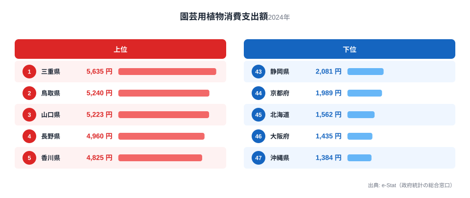
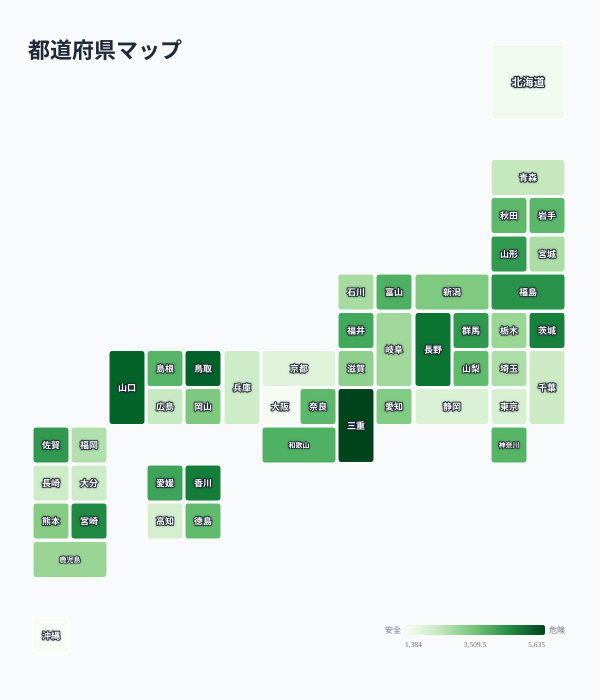

庭の手入れにお金をかける県と、ほとんどかけない県。その差は最大で4倍を超えます。総務省の家計調査によると、2024年の植木・園芸用品消費支出額は三重県が5,635円で全国1位、沖縄県が1,384円で最下位でした。

全国平均を大きく上回るのは、三重・鳥取・山口・長野・香川といった地方県です。一方で東京・大阪・京都・沖縄・北海道は軒並み下位に沈んでいます。この記事では、なぜ庭仕事にお金をかける県とかけない県がこれほどはっきり分かれるのかを、住環境と高齢化という2つの切り口から掘り下げます。

> [!NOTE]
> 「植木・園芸用品」は総務省の家計調査における品目分類で、鉢植え・苗木・肥料・園芸資材などの購入額を指します。1世帯あたり(2人以上の世帯)の年間支出額を都道府県庁所在市で集計した値です。庭そのものの有無や広さは統計に含まれず、あくまで購入金額の比較である点に注意してください。

## 上位と下位

<source-link href="/ranking/garden-plants-consumption-expenditure">植木・園芸用品ランキングをもっと見る</source-link>

1位の三重県は5,635円で、2位鳥取県(5,240円)、3位山口県(5,223円)と僅差の争いです。上位10県の顔ぶれを見ると、三重・長野・山口・鳥取・香川など、地方都市が中心の県が並びます。これらの県に共通するのは、持ち家率・戸建て率が全国平均より高い傾向にあることです。庭付き一戸建てが多いほど、植木や花壇の手入れに継続的な支出が発生しやすくなります。

さらに上位県は農業県としての性格も併せ持っています。6位茨城県(4,756円)、7位宮崎県(4,615円)、8位福島県(4,443円)、9位佐賀県(4,348円)、11位山形県(4,327円)と、上位圏には農業が盛んな県が集中しています。園芸用品店やホームセンターへのアクセスが日常的に確保されている地域という共通点も見えてきます。都市部に比べて土地に余裕があり、庭や家庭菜園に投資する文化が根付いていると考えられます。1位三重県の詳しい地域データは[三重県のページ](/areas/24000)で、農業関連の他指標は[農業カテゴリ](/category/agriculture)でも確認できます。

対照的に、下位5県は東京・京都・北海道・大阪・沖縄です。東京(2,135円)と京都(1,989円)は大都市圏で集合住宅の比率が高く、庭付き住宅そのものが少ない地域です。北海道は積雪期間が長く園芸シーズンが短いという地理的な制約が働いていると見られます。大阪と沖縄も都市化率が高く、庭のスペースを持つ世帯の割合が他県より低いことが支出額を押し下げていると考えられます。

> [!WARNING]
> この統計は「支出額」であり「世帯数」や「持ち家率そのもの」を示す指標ではありません。同じ県内でも都市部と郊外で大きな差がある可能性があり、県平均だけで住民全体の傾向を断定することはできません。あくまで県単位の集計値として読む必要があります。

## 発見: 持ち家率と高齢化が支出を押し上げる

<source-link href="/ranking/garden-plants-consumption-expenditure">植木・園芸用品の全47都道府県を見る</source-link>

地図で見ると、支出額が高い県(濃い緑)は関東北部から中部・中国・四国にかけての内陸・地方都市に集中し、支出額が低い県(薄い緑)は三大都市圏と北海道・沖縄に偏っていることがわかります。この分布は、持ち家率が高く戸建て住宅が多い地域ほど庭の手入れに投資するという仮説と整合的です。総務省の住宅・土地統計調査でも、三重・山口・長野・鳥取などは持ち家率が全国平均(61%前後)を上回る県として知られており、庭付き戸建てに住む世帯の割合が高いことが、園芸用品への支出を底上げしていると考えられます。

もう一つの要因は高齢化です。上位県の多くは高齢化率が全国平均を上回る地域と重なります。定年後に自宅の庭仕事を趣味として楽しむ高齢世帯が多いことが、植木・園芸用品への継続的な支出につながっている可能性があります。逆に東京・大阪といった大都市圏は現役世代の単身世帯・賃貸世帯の比率が高く、庭仕事に時間や資金を割く余地が構造的に小さいと言えます。

地図の中間層(3,000円台)にあたる愛知・岡山・新潟・滋賀・鹿児島なども見ておくと分布の連続性がよくわかります。これらの県は上位の農業県ほど極端ではないものの、持ち家率・戸建て率が全国平均に近い水準にあり、支出額も全国平均付近に収まっています。つまり支出額は地域ごとの明確な区分ではなく、住宅事情に応じてなだらかに変化していると考えられます。都市化が進むほど支出は下がり、地方で持ち家が多いほど支出が上がる、という緩やかな連続性が地図全体から読み取れます。

> [!TIP]
> 園芸用品への支出は、持ち家率や高齢化率が近い他の指標と合わせて見ると地域の生活スタイルがより立体的に見えてきます。[高齢化率のランキング](/category/socialsecurity)や[住宅関連の支出データ](/category/economy)と重ねて確認してみてください。

## まとめ

- 1位は三重県で5,635円、47位は沖縄県で1,384円、その差は4.1倍
- 上位は三重・鳥取・山口・長野・香川など、持ち家率が高い地方県が並ぶ
- 下位は東京・京都・北海道・大阪・沖縄など、集合住宅比率が高い都市圏や積雪地域
- 支出額の地理的な分布は、持ち家率と高齢化率の高さと重なる傾向がある
- 農業県や地方都市ほどホームセンター等へのアクセスが日常的で、園芸文化が根付いている可能性がある

## データ出典

総務省統計局「家計調査」(品目別支出額、2024年、都道府県庁所在市)をもとに、e-Stat(政府統計の総合窓口)経由で整備したデータを使用しています。
