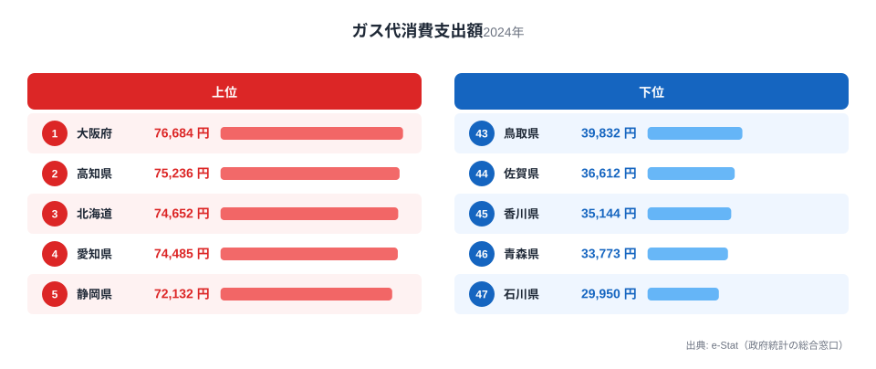
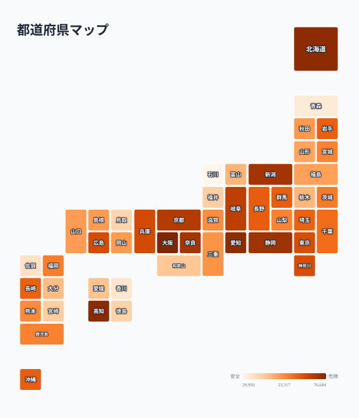

「ガス代が高いのは雪国だから」——そう思っている人は多いはずです。ところが総務省の家計調査（二人以上世帯・都道府県庁所在市）で年間ガス代消費支出額を見ると、1位は雪国ではなく大阪府でした。2024年の家計調査によると、ガス代消費支出額のトップは大阪府で76,684円。2位は高知県75,236円、3位は北海道74,652円と続きます。最下位は石川県の29,950円で、1位との差は2.6倍に達します。

興味深いのは、同じ東北地方でも順位が大きく割れていることです。岩手県は17位（60,708円）と中位につける一方、青森県は46位（33,773円）とほぼ最下位に沈んでいます。この記事では、大都市と寒冷地が入り混じる上位グループの構造と、寒い地域でも順位が分かれる理由を、ガスの供給方式という切り口から掘り下げます。

> [!NOTE]
> このガス代消費支出額は、総務省「家計調査」の都道府県庁所在市・二人以上世帯データで、**都市ガスとプロパンガス（LPG）の支出を合算した金額**です。都市ガス料金だけを集計した別指標（都市ガス消費支出額）とは異なる点に注意してください。都市ガスは導管で供給されるため比較的安く、プロパンは個別配送のコストが乗るため割高になりやすいという特性があります。

## 上位と下位

<source-link href="/ranking/gas-consumption-expenditure">ガス代ランキングをもっと見る</source-link>

上位5県は大阪（76,684円）、高知（75,236円）、北海道（74,652円）、愛知（74,485円）、静岡（72,132円）です。大阪・愛知・静岡といった大都市圏と、高知・北海道という非都市部が同じ上位グループに並んでいるのが特徴的です。

大阪や愛知が上位に来る理由は、都市部ほど世帯当たりのガス利用機会（給湯・調理・浴室乾燥など）が多く、都市ガスの料金体系自体も原料費調整の影響を受けやすいためと考えられます。一方で高知や北海道が上位に入るのは、寒冷地や積雪地では給湯・暖房でのガス使用量が増え、さらにプロパン比率が高い地域では供給コストが料金に上乗せされやすいためです。つまり上位グループは「使用量が多いから高い」都市型と、「単価が高いから高い」地方型の2種類が混在していると考えられます。

下位5県は香川（35,144円）、青森（33,773円）、佐賀（36,612円）、鳥取（39,832円）、徳島（40,518円）で、最下位は石川県の29,950円です。中国・四国・九州の一部県が下位に集中している一方、寒冷地であるはずの青森が46位と極端に低いのが目を引きます。

## 寒冷地なのに安い、その理由

<source-link href="/ranking/city-gas-supply-area-household-ratio">都市ガス供給区域内世帯比率をもっと見る</source-link>

最も興味深い発見は、同じ東北地方でも順位が大きく分かれていることです。岩手県は60,708円で17位と中位につけていますが、青森県は33,773円で46位とほぼ最下位です。両県とも冬の寒さは厳しく、暖房需要は同水準のはずですが、支出額には約1.8倍の差があります。

[仮説] この差はガスではなく暖房の主燃料の違いによるものと考えられます。青森を含む東北北部や北海道の一部では、灯油やLPガス以外に灯油ストーブ・灯油ボイラーによる暖房が広く普及しており、暖房のエネルギー源がガスに集中していない可能性があります。一方、都市ガスの供給網が発達している地域では、給湯・調理に加えて暖房もガスでまかなう世帯が多く、ガス代に費用が集約されやすいと考えられます。この点は灯油消費支出額など燃料別のデータと突き合わせた検証が必要です。

もう一つの視点は、プロパンガスの利用比率です。都市ガスの導管が届かない地方部・郊外ではプロパンガスが主流になりますが、プロパンは配送コストがかかる分、都市ガスより単価が高くなる傾向があります。都市ガス供給区域内世帯比率が低い県ほどプロパン依存度が高くなり、使用量が同じでも支出額が押し上げられやすいと考えられます。上位に入った高知や北海道の一部地域は、都市ガス網が限定的でプロパン比率が高いことが影響している可能性があります。実際に[プロパンガス消費支出額ランキング](/ranking/propane-gas-consumption-expenditure)を見ると、都市ガス普及率が低い地方県で支出額が高くなる傾向が確認できます。

> [!WARNING]
> このランキングは支出額（円）であり、ガスの使用量（立方メートル等）そのものではありません。都市ガスとプロパンでは単価体系が異なるため、支出額が高い＝使用量が多いとは必ずしも言えず、料金体系の違いが順位に影響している可能性がある点に留意してください。

> [!TIP]
> ガス代の地域差を読み解くには、電気代など他の光熱費データと合わせて見るのがおすすめです。[電気代消費支出額ランキング](/ranking/electricity-consumption-expenditure)と比較すると、寒冷地の光熱費が本当にガスに偏っているのか、電気にも同様の傾向が出ているのかを確認できます。

## 47都道府県の全体像

<source-link href="/ranking/gas-consumption-expenditure">ガス代の全47都道府県を見る</source-link>

地図で見ると、近畿・東海の大都市圏（大阪・愛知・静岡・京都・奈良）と、北海道・新潟といった積雪地帯が濃い色（高支出）でまとまっている一方、四国・九州・北陸の一部と青森が薄い色（低支出）に集中していることが分かります。単純に「都市か地方か」「寒いか暖かいか」という一軸では説明できない、都市ガス網の整備状況とプロパン依存度という**インフラの違い**が地域差を生んでいる構図が浮かび上がります。

たとえば新潟県は6位（71,390円）と上位に入りますが、これは豪雪地帯でありながら都市部（新潟市）の都市ガス普及率が比較的高く、給湯・暖房でのガス利用が定着していることが背景にあると考えられます。対照的に、佐賀・鳥取・徳島のような下位県は都市化率が低く戸建て住宅が多いため、そもそもガスより電気やその他燃料への依存度が高い可能性があります。[仮説] であり、住宅形態別の光熱費データとの照合が今後の検証課題です。都市ガスのみの支出額を見たい場合は、[都市ガス消費支出額ランキング](/ranking/city-gas-consumption-expenditure)で個別の傾向を確認できます。

## まとめ

- 1位は大阪府76,684円、最下位は石川県29,950円で2.6倍の差
- 上位には大阪・愛知・静岡の大都市圏と、高知・北海道の非都市部が混在
- 同じ東北地方でも岩手（17位）と青森（46位）で大きく順位が分かれる
- 都市ガスとプロパンの供給方式の違いが単価差を生んでいる可能性
- このランキングは都市ガス+プロパンの合算支出額であり、使用量ではない点に注意

## データ出典

総務省「家計調査」（都道府県庁所在市・二人以上世帯）を基に、e-Stat（政府統計の総合窓口）経由で整備したデータです。集計年は2024年です。
