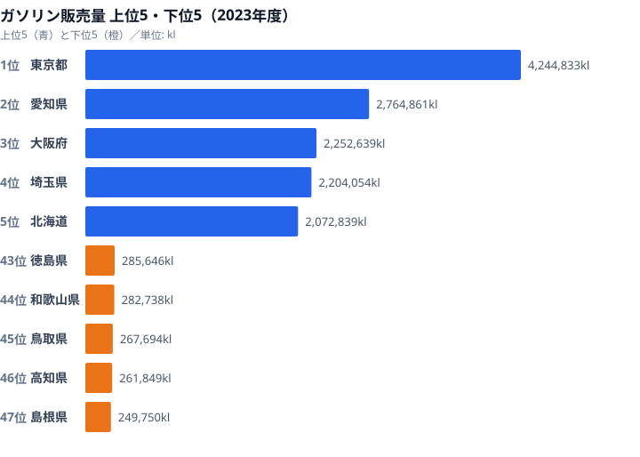
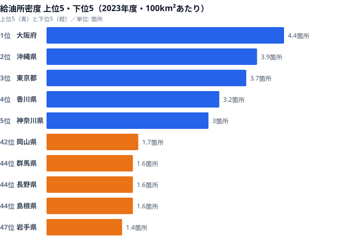
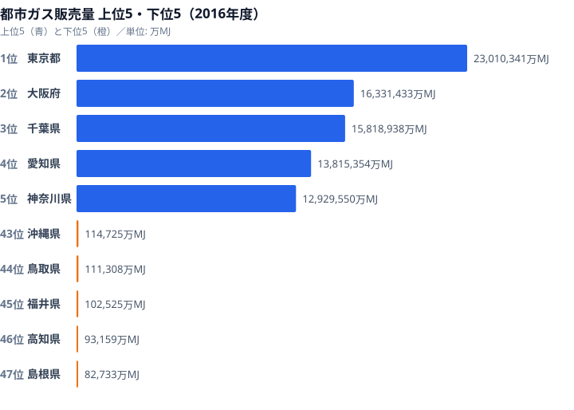

「地方ではクルマがなければ生活できない」──よく聞く話です。ですが実際に都道府県別のガソリン販売量を並べてみると、最も多いのは大都市の東京都です。販売量の多さは、そのまま車社会度を表しているのでしょうか。本記事では、ガソリン販売量・給油所の密度・都市ガス販売量という3つのエネルギー指標を重ね合わせ、「クルマに頼る県」と「都市ガスに頼る県」がどう分かれるのかを読み解いていきます。先に結論を言えば、ガソリン販売量のランキングは人口分布をほぼなぞっており、それ単独では車社会度の物差しになりません。

## ガソリン販売量が多いのは、人口が多い県でした

ガソリン販売量（2023年度）の1位は[東京都](/areas/13000)で4,244,833klです。2位の愛知県（2,764,861kl）とは約148万klの差があります。3位は大阪府（2,252,639kl）、4位は埼玉県（2,204,054kl）、5位は北海道（2,072,839kl）と続きます。下位は47位の[島根県](/areas/32000)（249,750kl）、46位の高知県（261,849kl）、45位の鳥取県（267,694kl）です。最も多い東京都は最少の島根県の約17倍にあたります。

この並びを見て気づくのは、上位がほぼ人口の多い都府県だということです。東京都・大阪府・埼玉県は人口集中地域であり、自家用車だけでなく業務用車両やタクシー、物流トラックの給油もこの数字に積み上がっています。つまりガソリン販売量の大きさは「人がたくさん住み、モノが大量に動く県」を映しているのであって、住民1人ひとりがどれだけクルマに依存しているかを直接示すものではありません。実際、1人当たりに直すと地方の県の方がガソリン消費は多くなる傾向があり、ランキングの順位は逆転します。例外的に存在感を放つのが5位の北海道です。人口規模だけなら上位に入りにくいのですが、広大な面積と都市間の長距離移動の必要性が、販売総量を押し上げています。地方の中でも北海道は「面積要因」で車社会度が総量に表れる珍しいケースだといえます。

> [!NOTE]
> ガソリン販売量は給油所での販売実績を集計した値で、自家用車だけでなくタクシー・トラック・農機具なども含みます。そのため人口と産業の集積する都府県ほど総量が大きく出ます。住民の依存度を比べたいときは、人口で割った1人当たり消費に直す必要があります。

<source-link href="/ranking/gasoline-sales-volume">47都道府県のガソリン販売量ランキングをもっと見る</source-link>

<ad-slot></ad-slot>

## 給油所が「密」なのは都市、「疎」なのは車社会の地方という逆説

面積100km²あたりの給油所数（2023年度）で見ると、密度が高いのは大阪府（4.4箇所）・沖縄県（3.9箇所）・東京都（3.7箇所）と、いずれも狭い土地に人口が集中した地域です。逆に密度が低いのは岩手県（1.4箇所）・群馬県・長野県・島根県（いずれも1.6箇所）といった、面積が広く集落が点在する県でした。最も密な大阪府は、最も疎な岩手県の約3倍の密度です。

ここに「車社会の逆説」が表れています。クルマがなければ暮らせない地方ほど、給油所が地理的にまばらにしか存在しないのです。都市部は移動距離が短く公共交通も発達しているのに給油所は密集し、移動距離が長くクルマ必須の地方ほど給油所まで遠いのです。この構造が、近年深刻化する「ガソリンスタンド過疎」の背景にあります。全国の給油所数はピーク時の1994年度に約60,421箇所ありましたが、2024年度には約27,000箇所へと半減以上の規模で減りました。採算の取れない地方の小規模給油所から先に廃業が進むため、最寄りの給油所まで15km以上という空白地帯が広がっています。給油所が生活インフラそのものになっている高齢者世帯にとって、密度の低さはそのまま日々の暮らしの不便さに直結します。

> [!WARNING]
> このランキングは面積あたりの給油所「密度」であり、給油所の絶対数の多寡とは一致しません。密度が低い県＝給油所が地理的にまばら、と読むのが正しく、「給油所が足りている／いない」を単純に判断できる指標ではない点に注意してください。密度上位の都市部でも台数あたりでは混雑し、密度下位の地方でも1軒あたりの商圏は広くなります。

<source-link href="/ranking/gas-station-count-per-100km">47都道府県の給油所数ランキングをもっと見る</source-link>

## ガソリン型か、都市ガス型か──エネルギー消費は二極化しています

エネルギーのもう一方の柱である都市ガスを見ると、景色が変わります。都市ガス販売量（2016年度）の1位は東京都で23,010,341万MJ、2位は大阪府（16,331,433万MJ）、3位は千葉県（15,818,938万MJ）、4位は愛知県（13,815,354万MJ）、5位は神奈川県（12,929,550万MJ）です。一方で下位は47位の島根県（82,733万MJ）、46位の高知県（93,159万MJ）、45位の福井県（102,525万MJ）と続きます。東京都は島根県の約278倍にのぼります。

注目したいのは、上位の顔ぶれがガソリン販売量と似ていながら、「型」が分かれている点です。東京都・大阪府・神奈川県は、高密度な都市ガス配管網が整備され、暖房・給湯の主力が都市ガスです。これらの県は「都市ガス型」で、家庭のエネルギーが配管で供給されています。3位の千葉県は人口規模以上に都市ガス販売量が多く、京葉工業地帯の大口需要が押し上げています。これに対し、ガソリン販売量で5位だった北海道は、都市ガス販売量では相対的に少なくなります。広域に分散した住居と長距離移動がガソリン消費を押し上げる一方、配管整備コストが高くプロパンガス（LPG）への依存が大きい「ガソリン型」の県です。そして島根県・鳥取県のように、ガソリンも都市ガスも両方少ない県があります。これは依存先が偏っているのではなく、人口規模が小さくエネルギー消費の総量そのものが限られているためです。

> [!TIP]
> ガソリン販売量と都市ガス販売量を一緒に眺めると、県の性格が見えてきます。両方多い東京・大阪は「人口集積型」、ガソリンは多いが都市ガスが少ない北海道は「広域分散・LPG依存型」、両方少ない島根・鳥取は「小規模型」です。1つの指標だけでなく2軸で見ると、エネルギーインフラの地域差が立体的に読めます。

<source-link href="/ranking/city-gas-sales-volume">47都道府県の都市ガス販売量ランキングをもっと見る</source-link>

<ad-slot></ad-slot>

## 都市ガスがない地方は、割高なプロパンガスに頼っています

都市ガスの普及度は、ガスメーターの取付数にも表れます。都市ガスメーター取付数を見ると、東京都が7,012,793個に対し、島根県はわずか27,626個で、その差は約254倍にのぼります。販売量だけでなく、そもそも都市ガスが引かれている世帯数の段階で大きな開きがあるのです。

都市ガス配管が敷設されていない地域では、プロパンガスが唯一のガスエネルギー源になります。プロパンガスは都市ガスより単価が高い傾向があり、地方の家庭のエネルギーコスト負担を押し上げる要因になっています。車社会ゆえの高いガソリン支出と、都市ガスが使えないことによる割高なガス代が重なり、地方のエネルギーコストは都市部より割高になりやすい構造があります。つまり「クルマがなければ暮らせない」という不便さと「都市ガスが引かれていない」という不便さは、同じ地域に重なって現れやすいのです。

## まとめ

ガソリン販売量・給油所密度・都市ガス販売量という3つの指標から読み取れたのは、次のような姿でした。

- ガソリン販売量の1位は東京都（4,244,833kl）で、最少の島根県（249,750kl）の約17倍です。ただし上位はほぼ人口の多い都府県で、販売総量は車社会度をそのまま表す物差しにはなりません。
- 給油所密度が低いのは岩手県（1.4箇所）など面積の広い県で、クルマ必須の地方ほど給油所がまばらという逆説が生じています。全国の給油所はピーク時の約60,421箇所から約27,000箇所へ半減しました。
- 都市ガス販売量の1位は東京都（23,010,341万MJ）で、島根県（82,733万MJ）の約278倍です。北海道のような「ガソリン型」と東京のような「都市ガス型」に消費が二極化しています。
- 都市ガスメーター取付数では東京都が島根県の約254倍で、地方はプロパンガスに頼る構造です。
- ガソリン補助金の縮小やEVの普及が進めば、車社会県のエネルギー地図は大きく変わる可能性があります。

ガソリン依存度が高い地方ほど、EV充電インフラの整備状況が住民の生活コストと移動の自由度に直結します。都市ガスの有無も含めた「エネルギーインフラの地域差」は、移住やビジネス立地を考えるうえで見落とせないデータです。1つの指標だけで「車社会かどうか」を決めつけず、複数のエネルギー指標を重ねて見ることが、地域の暮らしの実像に近づく近道になります。

## データ出典

- e-Stat（政府統計の総合窓口）を基に作成
- ガソリン販売量・給油所数: 2023年度
- 都市ガス販売量・都市ガスメーター取付数: 2016年度
- 関連カテゴリ: [エネルギー](/category/energy)
