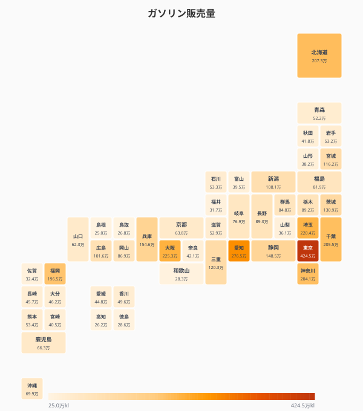
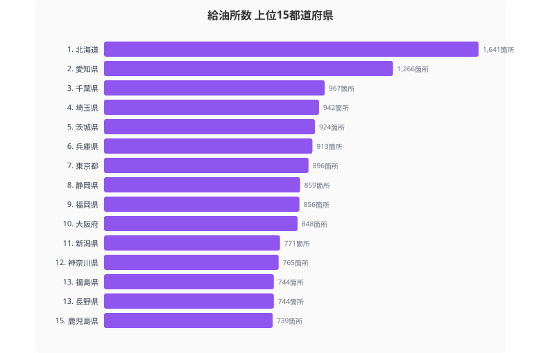

地方ではクルマがなければ生活できない──よく聞く話だが、実際にどの県がどれだけガソリンを消費しているのか。都道府県別のガソリン販売量と給油所数から、日本の「車社会度マップ」を描く。

## ガソリン販売量マップ -- 全国の車社会度を俯瞰

ガソリン販売量のタイルグリッドマップを見ると、[東京都](/areas/13000)・愛知県・大阪府を中心に大都市圏が濃い色で際立つ。一方、山陰・四国の各県は淡い色で、販売量の少なさが一目でわかる。

ただし「ガソリン販売量が多い＝車社会」とは限らない。東京都の販売量が多いのは人口と業務用車両の集中が要因であり、1人当たりで見ると地方の方がガソリン消費量は多い。

## ガソリン販売量ランキング -- 上位には大都市と工業県

ガソリン販売量の1位は東京都で4,244,833kl。2位の愛知県（2,764,861kl）とは約153万klの差がある。3位は大阪府（2,252,639kl）、4位は埼玉県（2,204,054kl）、5位は北海道（2,072,839kl）。

下位は47位の[島根県](/areas/32000)（249,750kl）、46位の高知県（261,849kl）、45位の鳥取県（267,694kl）。1位と47位の差は約17倍だ。

上位に並ぶのは人口が多い大都市圏だが、北海道（2,072,839kl、5位）のように広大な面積と長距離移動の必要性からガソリン消費が多い県も目立つ。

<source-link href="/ranking/gasoline-sales-volume">47都道府県のガソリン販売量ランキングをもっと見る</source-link>

<ad-slot></ad-slot>

## 給油所数の地域差と「ガソリンスタンド過疎」問題

給油所数が最も多いのは北海道（1,641箇所）。広大な面積をカバーするために多くの給油所が必要だ。次いで愛知県（1,266箇所）、千葉県（967箇所）が続く。

全国の給油所数はピーク時（1994年度）の約60,421箇所から2024年度の約27,000箇所へと半減以上の減少が進んでいる。特に過疎地域では「ガソリンスタンド過疎」が深刻化しており、最寄りの給油所まで15km以上という地域が増えている。

鳥取県（191箇所）、奈良県（240箇所）、福井県（248箇所）と、下位の県では給油所の絶対数が少なく、今後さらに廃業が進めば住民の移動手段に直接影響する。

> [!WARNING]
> 給油所数はピーク時（1994年度）の約60,421箇所から約27,000箇所へと半減以上が廃業した。車なしでは生活できない地域ほど給油所の絶対数が少ない逆説が生じており、最寄り給油所まで15km以上の「ガソリンスタンド空白地帯」は高齢者の生活インフラ問題に直結している。

<source-link href="/ranking/gas-stations-number">47都道府県の給油所数ランキングをもっと見る</source-link>

## ガソリン型 vs 都市ガス型 -- 散布図で見るエネルギー消費の二極化

> [!NOTE]
> ガソリン販売量は2023年、都市ガス販売量は2016年のデータです。年次が異なる点にご留意ください。

横軸にガソリン販売量、縦軸に都市ガス販売量をとると、エネルギー消費の「型」が浮かび上がる。

東京都・大阪府は都市ガス販売量が突出して多い。高密度な都市ガス配管網が整備されており、暖房・給湯の主力が都市ガスだ。一方、千葉県は都市ガス販売量も多く、工業用の大口需要が寄与している。

北海道はガソリン販売量が多いが都市ガスは相対的に少ない。広域に分散した住居と長距離移動の必要性がガソリン消費を押し上げ、都市ガス配管の整備コストが高いためプロパンガスに依存する構造だ。

島根県・鳥取県は両方とも少なく、左下に位置する。人口規模が小さく、エネルギー消費の総量自体が限られている。

<source-link href="/ranking/city-gas-sales-volume">47都道府県の都市ガス販売量ランキングをもっと見る</source-link>

<ad-slot></ad-slot>

## 都市ガス供給区域の偏り -- プロパンガスに頼る地方の実態

都市ガスメーター取付数を見ると、東京都（7,012,793個）と島根県（27,626個）の差は約254倍。都市ガスの供給区域内世帯数は東京都688万戸に対し、島根県は約7万戸にとどまる。

都市ガス配管が敷設されていない地域では、プロパンガス（LPG）が唯一のガスエネルギー源になる。プロパンガスは都市ガスより単価が高く、地方の家庭のエネルギーコスト負担を押し上げる要因になっている。車社会による高いガソリン支出と合わせ、地方のエネルギーコストは都市部より割高になりやすい構造がある。

## まとめ

ガソリン販売量・給油所数・都市ガスのデータから、車社会とエネルギーインフラの地域格差を整理する。

ガソリン補助金の縮小やEVの普及が進めば、「車社会県」のエネルギー地図は大きく変わる可能性がある。特にガソリン依存度が高い地方ほど、EV充電インフラの整備状況が住民の生活コストと移動の自由度に直結する。都市ガスの有無も含めた「エネルギーインフラの地域格差」は、移住やビジネス立地の判断において見落とせないデータだ。

## データ出典

本記事のデータはe-Stat（政府統計の総合窓口）を基に作成しています。

本記事の対象データ: [関連カテゴリ](/category/energy)
