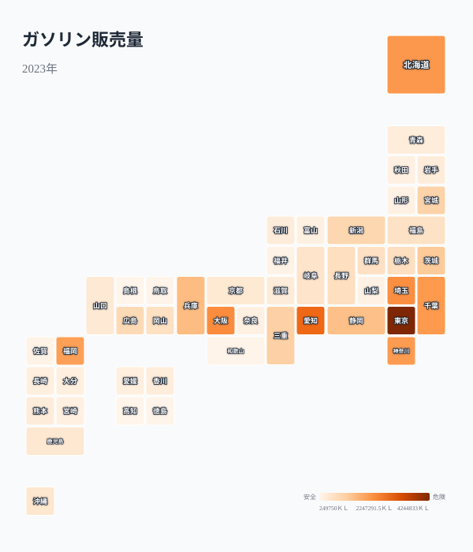
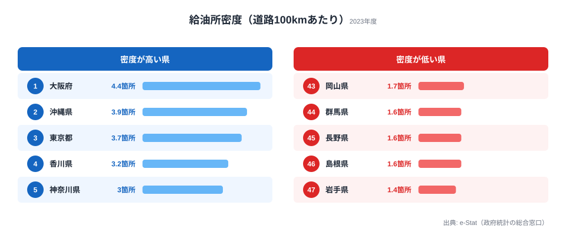
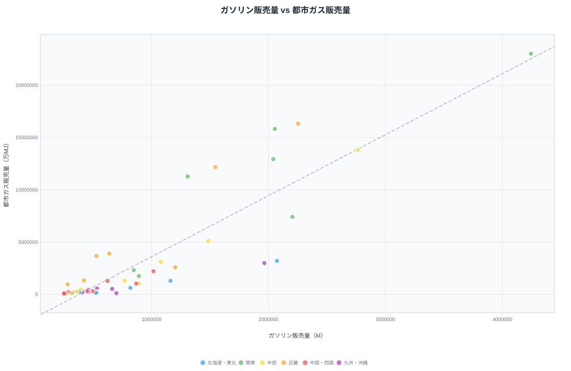
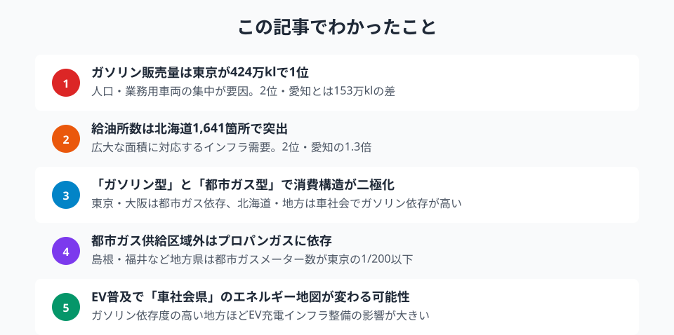

「地方ではクルマがなければ生活できない」──よく聞く話です。ところが、ガソリン販売量そのものを都道府県別に並べると、最も多いのは意外にも大都市・東京都でした。販売量が多い県と少ない県は何が違うのか。そして「クルマ依存が高い県ほど給油所が疎ら」という逆説はどこまで本当なのか。ガソリン販売量・給油所密度・都市ガスのデータを重ねて、日本の「車社会度マップ」を描きます。

先に結論を言えば、ガソリンの絶対量が多いのは人口が集中する都市圏ですが、給油所の密度が低く「クルマが必須なのにスタンドが遠い」県は地方に偏っています。さらに地方は都市ガスも届かずプロパンガスに頼るため、エネルギーコストが二重に重くなりやすい構造があります。

## ガソリン販売量マップ — 全国の車社会度を俯瞰する

ガソリン販売量のタイルグリッドマップを見ると、[東京都](/areas/13000)・愛知県・大阪府を中心とする大都市圏が濃い色で際立ちます。一方、山陰・四国の各県は淡い色で、販売量の少なさが一目でわかります。

ただし「ガソリン販売量が多い＝車社会」とは限りません。東京都の販売量が多いのは人口と業務用車両の集中が要因であり、住民1人当たりで見れば地方の方がガソリン消費は多くなる傾向があります。この記事で見る販売量はあくまで県全体の総量である点に注意してください。

> [!NOTE]
> ここでのガソリン販売量は「県全体の年間販売総量（kl）」です。人口で割った1人当たり消費量ではないため、人口の多い都市圏が上位に来ます。「住民の車依存の強さ」を測りたいときは、後半で扱う給油所密度や1人当たり指標と合わせて読むのがコツです。

## ガソリン販売量ランキング — 上位は大都市と工業県

ガソリン販売量の1位は東京都で4,244,833kl。2位の愛知県（2,764,861kl）とは約153万klの差があります。3位は大阪府（2,252,639kl）、4位は埼玉県（2,204,054kl）、5位は北海道（2,072,839kl）と続きます。

下位は47位の[島根県](/areas/32000)（249,750kl）、46位の高知県（261,849kl）、45位の鳥取県（267,694kl）です。1位と47位の差は約17倍にもなります。

上位に並ぶのは人口が多い大都市圏ですが、北海道（2,072,839kl・5位）のように、広大な面積と長距離移動の必要性からガソリン消費が押し上げられている県も目立ちます。人口規模では大都市に及ばない北海道が販売量で5位に入るのは、まさに「移動にクルマが欠かせない」車社会型の典型例といえます。

<source-link href="/ranking/gasoline-sales-volume">47都道府県のガソリン販売量ランキングをもっと見る</source-link>

<ad-slot></ad-slot>

## 給油所密度の地域差と「ガソリンスタンド過疎」問題

「車依存が高い県ほど給油所が多い」と思いがちですが、道路100kmあたりの給油所数（密度）で見ると逆の姿が浮かびます。密度が高いのは大阪府（4.4箇所）・沖縄県（3.9箇所）・東京都（3.7箇所）と、道路網が稠密で移動距離の短い都市部です。

逆に密度が低いのは岩手県（1.4箇所）・島根県（1.6箇所）・長野県（1.6箇所）・群馬県（1.6箇所）。広い面積に道路が長く伸びる県ほど、給油所が点在し1か所あたりがカバーする範囲が広くなります。クルマがなければ生活できない地域ほど、皮肉にも給油所は疎らなのです。

全国の給油所数はピーク時（1994年度）の約60,421箇所から、2024年度には約27,000箇所へと半減以上の減少が進んでいます。特に過疎地域では「ガソリンスタンド過疎」が深刻化し、最寄りの給油所まで15km以上という地域が増えています。

> [!WARNING]
> 給油所「密度」は人口や世帯数あたりではなく、道路延長100kmあたりの箇所数です。密度が低い県（岩手・島根・長野など）は、面積が広く道路が長いため1か所あたりの担当距離が長くなることを示します。スタンドの絶対数が多い北海道のような県でも、面積が広大なため密度では38位（1.9箇所）にとどまり、給油所間の距離が遠い実態が見えにくくなる点に注意してください。

<source-link href="/ranking/gas-station-count-per-100km">47都道府県の給油所密度ランキングをもっと見る</source-link>

## ガソリン型 vs 都市ガス型 — 散布図で見るエネルギー消費の二極化

> [!NOTE]
> ガソリン販売量は2023年度、都市ガス販売量は2016年度のデータで、年次が異なります。両軸とも県全体の絶対量です。年次が違うため厳密な同時点比較ではありませんが、エネルギー消費の「型」の地域差を読み取る目的では十分に傾向がわかります。

横軸にガソリン販売量、縦軸に都市ガス販売量をとると、エネルギー消費の「型」が浮かび上がります。

東京都・大阪府は都市ガス販売量が突出して多く、グラフの上方に位置します。高密度な都市ガス配管網が整備されており、暖房・給湯の主力が都市ガスだからです。千葉県も都市ガス販売量が多く、これは工業用の大口需要が寄与しています。

北海道はガソリン販売量が多い一方で、都市ガスは相対的に少なくなっています。広域に分散した住居と長距離移動の必要性がガソリン消費を押し上げる反面、都市ガス配管の整備コストが高いためプロパンガスに依存する構造です。まさに「ガソリン型」のエネルギー消費といえます。

島根県・鳥取県は両方とも少なく、グラフの左下に位置します。人口規模が小さく、エネルギー消費の総量自体が限られているためです。

<source-link href="/ranking/city-gas-sales-volume">47都道府県の都市ガス販売量ランキングをもっと見る</source-link>

<ad-slot></ad-slot>

## 都市ガス供給区域の偏り — プロパンガスに頼る地方の実態

都市ガスの供給区域内世帯数を見ると、東京都の約6,888,964戸（約688万戸）に対し、島根県は約69,725戸（約7万戸）にとどまります。都市ガスメーター取付数で比べても、東京都（7,012,793個）と島根県（27,626個）の差は約254倍にのぼります。

都市ガス配管が敷設されていない地域では、プロパンガス（LPG）が唯一のガスエネルギー源になります。プロパンガスは都市ガスより単価が高く、地方の家庭のエネルギーコスト負担を押し上げる要因です。車社会による高いガソリン支出と合わせると、地方のエネルギーコストは都市部より割高になりやすい構造があります。

> [!TIP]
> 移住や事業所の立地を検討するときは、ガソリン代だけでなく「都市ガスが来ているか／プロパンガスか」も合わせて確認すると、住んでからのランニングコストを見積もりやすくなります。都市ガス供給世帯が少ない県（島根・高知・福井など）では、ガス代がプロパン単価で計算される前提で家計を組むのが現実的です。エネルギーの[エネルギー関連ランキング](/category/energy)で県ごとの傾向を比べてみてください。

## まとめ

ガソリン販売量・給油所密度・都市ガスのデータから、車社会とエネルギーインフラの地域格差を整理します。

ガソリン補助金の縮小やEV（電気自動車）の普及が進めば、「車社会県」のエネルギー地図は大きく変わる可能性があります。特にガソリン依存度が高い地方ほど、EV充電インフラの整備状況が住民の生活コストと移動の自由度に直結します。都市ガスの有無も含めた「エネルギーインフラの地域格差」は、移住やビジネス立地を判断するうえで見落とせないデータといえるでしょう。

## データ出典

本記事のデータはe-Stat（政府統計の総合窓口）を基に作成しています。ガソリン販売量・給油所密度は2023年度、都市ガス販売量・供給世帯数は2016年度の値を用いています。
