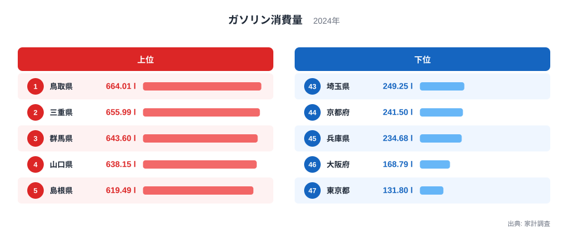
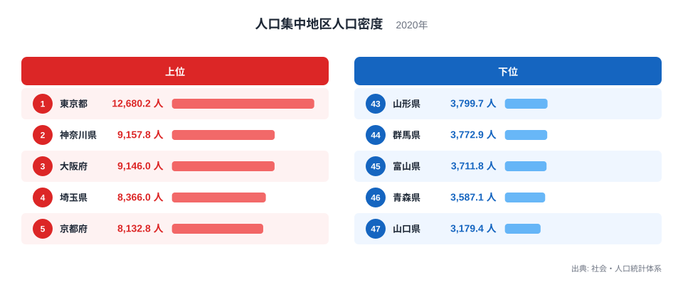
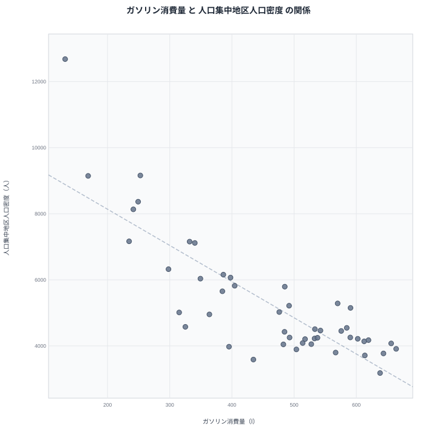

ガソリンの消費量が多い県ほど、人口が密集した市街地の密度は低くなる傾向があります。家計調査の2024年データで確認すると、消費量1位の鳥取県は人口集中地区の人口密度で下位に沈み、逆に密度1位の東京都はガソリン消費量で最下位です。この記事では2つの指標を並べ、なぜこうした逆の関係が生まれるのかを整理します。

## ガソリン消費量が多い県、少ない県

<source-link href="/ranking/gasoline-consumption-quantity">ガソリン消費量ランキングをもっと見る</source-link>

鳥取県は664.01リットルで1位です。2位は三重県で655.993リットル、3位は群馬県で643.604リットル、4位は山口県で638.148リットル、5位は島根県で619.49リットルと続きます。上位には公共交通機関の路線網が限られる地方県が並んでいます。

下位を見ると、東京都は131.797リットルで47位です。46位は大阪府で168.789リットル、45位は兵庫県で234.682リットル、44位は京都府で241.495リットル、43位は埼玉県で249.248リットルとなっています。上位県と下位県の差は5倍を超えており、日常の移動でどれだけ自動車に頼っているかという生活様式の違いが色濃く反映された結果になっています。

中位を見渡すと、6位は富山県で613.642リットル、7位は長野県で612.565リットル、8位は茨城県で602.26リットルと、北陸や中部の県が続いています。42位の神奈川県は252.713リットル、41位の福岡県は297.964リットルと、三大都市圏に含まれる県が下位側にまとまっている点も特徴的です。

> [!NOTE]
> この指標は家計調査に基づく世帯あたりのガソリン購入量です。自家用車の保有台数そのものではなく、実際に使われた燃料の量を表しているため、車を持っていても使用頻度が低い世帯が多い地域では数値が低く出ます。

## 人口集中地区人口密度が高い県、低い県

続いて、2020年の人口集中地区人口密度を見てみます。東京都は12,680.2人で1位です。2位は神奈川県で9,157.8人、3位は大阪府で9,146人、4位は埼玉県で8,366人、5位は京都府で8,132.8人と続きます。三大都市圏の中心となる都府県が上位を占めています。

下位に目を移すと、山口県は3,179.4人で47位です。46位は青森県で3,587.1人、45位は富山県で3,711.8人、44位は群馬県で3,772.9人、43位は山形県で3,799.7人となっています。人口集中地区そのものが小さく、市街地の広がりが緩やかな地方県が下位に並んでいます。

> [!WARNING]
> 人口集中地区人口密度は、市街地の混雑度を表す指標であり、県全体の人口密度とは別の概念です。県土全体では人口が少なくても、駅前など特定エリアに人口が集中していれば数値は高く出ます。

## 2つの指標の関係を散布図で見る

散布図を見ると、右下がりの傾向がはっきりと表れています。人口集中地区人口密度が低い県ほどガソリン消費量が多く、密度が高い県ほど消費量が少ないという逆相関の形です。ただし、これは相関であって因果関係ではありません。

この逆相関を生んでいるのは、移動手段の違いだと考えられます。人口集中地区の密度が高い都市部では、鉄道やバスなどの公共交通機関が発達しており、日常の移動を車に頼らずに済ませられます。一方、密度が低い地方県では、駅やバス停までの距離が遠く、通勤や買い物のたびに自家用車を使わざるを得ない世帯が多いと考えられます。つまり、人口密度がガソリン消費量を直接減らしているというより、両者はいずれも「公共交通の利便性」という共通の背景から影響を受けていると見るほうが自然です。

> [!TIP]
> 右下がりの散布図を見たときは、片方がもう片方の原因だと即断せず、両方に影響する第三の要因がないかを考えると読み違いを防げます。今回のケースでは公共交通の整備状況が、その手がかりになります。

散布図の左上には東京都・大阪府・神奈川県など人口密度が高くガソリン消費量が少ない都府県が集まり、右下には鳥取県・三重県・群馬県など密度が低く消費量が多い県が集まっています。この2つの塊がはっきり分かれていること自体が、都市部と地方部で日々の移動の前提条件がまったく異なることを物語っています。

## 都市と地方で異なる暮らし方

[人口集中地区人口密度ランキング](/ranking/densely-inhabited-district-population-density)を単独で見ると、東京都・神奈川県・大阪府といった大都市圏が上位を占め、地方県との差がより際立って見えます。[鳥取県のデータ](/areas/31000)を確認すると、県内に鉄道路線はあるものの運行本数が限られており、日常の移動では自家用車が主な手段になっている実情がうかがえます。一方で[三重県のデータ](/areas/24000)も同様に、名古屋圏への通勤圏でありながら県内移動は車が中心という、地方特有の生活パターンが読み取れます。[同じカテゴリの統計一覧](/category/economy)から関連する家計調査の指標もあわせて確認すると、地域ごとの暮らし方の違いがより具体的に見えてきます。

ガソリン消費量と人口集中地区人口密度は、一見すると無関係に思える2つの指標ですが、どちらも「その地域でどれだけ徒歩や公共交通で暮らしが成り立つか」という共通の物差しでつながっています。この視点を持つと、単なる燃料費の地域差以上に、都市と地方の生活基盤の違いが見えてきます。

家計調査は世帯単位の平均値であるため、車を複数台保有する世帯が多い地域ではガソリン消費量が押し上げられやすくなります。地方では通勤用と買い物用でそれぞれ1台ずつ車を持つ世帯も珍しくなく、こうした複数保有の実態が上位県の数値にも表れていると考えられます。都市部との単純な比較ではなく、世帯あたりの車の使われ方まで踏み込んで読むと、この指標の意味がより立体的に見えてきます。

## データ出典

出典: 家計調査（総務省統計局）、社会・人口統計体系（総務省統計局）
ガソリン消費量: 2024年
人口集中地区人口密度: 2020年
